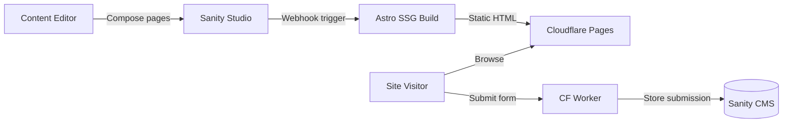
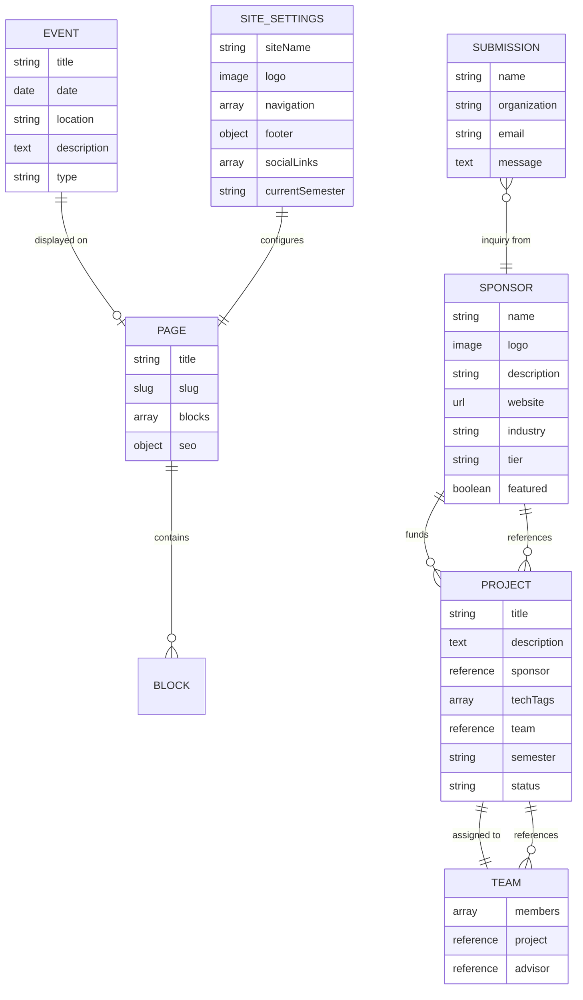

# YWCC Capstone Sponsors

A CMS-driven static website for NJIT's Ying Wu College of Computing Industry Capstone program. Content editors compose pages by stacking reusable UI blocks in Sanity Studio — zero code required.



## Table of Contents

- [Overview](#overview)
- [Tech Stack](#tech-stack)
- [Project Structure](#project-structure)
- [Prerequisites](#prerequisites)
- [Getting Started](#getting-started)
- [Development](#development)
- [Block Library](#block-library)
- [Content Model](#content-model)
- [Adding a New Block](#adding-a-new-block)
- [Deployment](#deployment)
- [Performance Targets](#performance-targets)
- [Contributing](#contributing)
- [Resources](#resources)
- [License](#license)

## Overview

The platform connects industry sponsors with capstone teams by showcasing sponsor organizations, project proposals, team rosters, and program information. It uses a **toolkit-not-website** approach — a block library maps editor-friendly names to [shadcn/ui](https://ui.shadcn.com/) component internals, making the design system invisible to non-technical users.

**Key goals:**

- Content editors build and update pages independently with no developer involvement
- Prospective sponsors discover the program and submit inquiries
- Students find team assignments, project details, and key dates in one hub
- $0/month operating cost using free tiers across all services
- Lighthouse 90+ across all categories on every page

**Reference site:** [ywcccapstone1.com](https://ywcccapstone1.com)

## Tech Stack

| Layer | Technology |
|---|---|
| Frontend | [Astro](https://astro.build/) (SSG) |
| CMS | [Sanity.io](https://www.sanity.io/) (headless) |
| Styling | [Tailwind CSS](https://tailwindcss.com/) + [shadcn/ui](https://ui.shadcn.com/) |
| Interactivity | Vanilla JS (< 2KB total) |
| Hosting | [Cloudflare Pages](https://pages.cloudflare.com/) |
| Form Proxy | [Cloudflare Worker](https://workers.cloudflare.com/) |
| Analytics | GA4 + Monsido |

The build bakes all content into static HTML — zero runtime API calls.

## Project Structure

```text
astro-shadcn-sanity/
├── astro-app/           # Astro frontend (SSG)
│   ├── src/
│   │   ├── components/  # Astro + shadcn/ui block components
│   │   ├── layouts/     # Page layouts (nav, footer, breadcrumb)
│   │   └── pages/       # Astro page routes
│   └── package.json
├── studio/              # Sanity Studio (CMS)
│   └── src/
│       └── schemaTypes/  # Sanity document and block schemas
├── package.json         # Root workspace config
└── README.md
```

This is an **npm workspaces** monorepo with two packages: `astro-app` and `studio`.

## Prerequisites

- [Node.js](https://nodejs.org/) v18 or later
- npm v9 or later
- A [Sanity.io](https://www.sanity.io/) account (free tier)
- A [Cloudflare](https://www.cloudflare.com/) account (free tier, for deployment)

## Getting Started

### 1. Clone the repository

```bash
git clone <repository-url>
cd astro-shadcn-sanity
```

### 2. Install dependencies

```bash
npm install
```

This command installs dependencies for both the Astro app and Sanity Studio.

### 3. Configure environment variables

Create a `.env` file in `astro-app/` with your Sanity project credentials:

```bash
PUBLIC_SANITY_PROJECT_ID=your_project_id
PUBLIC_SANITY_DATASET=production
```

### 4. Start development servers

```bash
npm run dev
```

This starts both servers concurrently:

- **Astro app:** <http://localhost:4321>
- **Sanity Studio:** <http://localhost:3333>

### 5. Sign in to Sanity Studio

Open <http://localhost:3333> and sign in with the same service (Google, GitHub, or email) you used when creating your Sanity project.

## Development

### Run Astro app only

```bash
npm run dev --workspace=astro-app
```

### Run Sanity Studio only

```bash
npm run dev --workspace=studio
```

### Build for production

```bash
npm run build --workspace=astro-app
```

This command performs TypeScript checking and generates static HTML.

### Preview production build

```bash
npm run preview --workspace=astro-app
```

## Block Library

Pages are composed from a flat array of reusable CMS blocks. Each block inherits a shared base schema providing background variant, spacing, and max-width options.

### P0 Blocks (MVP)

| Block | Description |
|---|---|
| Hero Banner | Heading, subheading, optional background image, CTA buttons, configurable alignment |
| Feature Grid | Icon/image + title + description cards in configurable column layouts |
| Sponsor Cards | Sponsor documents with tier badges |
| Rich Text | Portable Text with inline images and callout boxes |
| CTA Banner | Heading, description, and action buttons |
| FAQ Accordion | Expandable question/answer pairs with keyboard accessibility |
| Contact Form | Configurable fields with server-side submission via Cloudflare Worker |
| Timeline | Date-ordered milestones with current-phase highlighting |
| Logo Cloud | Sponsor logos from sponsor documents |

### P1 Blocks (Growth)

Tabbed Content, Testimonials, Stats Row, Data Table, Team Grid, CarouselWrapper

### P2 Blocks (Expansion)

Image Gallery, Video Embed, Alert/Notice

## Content Model



**7 document types:** Page, Sponsor, Project, Team, Event, Submission, Site Settings.

## Adding a New Block

Every block follows the same three-file pattern:

### 1. Create the Sanity schema

Add a schema file in `studio/src/schemaTypes/` that inherits the shared base schema:

```typescript
// studio/src/schemaTypes/yourBlock.ts
import { defineType, defineField } from 'sanity'

export default defineType({
  name: 'yourBlock',
  title: 'Your Block',
  type: 'object',
  fields: [
    // Shared base fields (background, spacing, maxWidth) inherited
    defineField({
      name: 'heading',
      title: 'Heading',
      type: 'string',
    }),
    // Add block-specific fields
  ],
})
```

### 2. Create the Astro component

Add a `.astro` component in `astro-app/src/components/`:

```astro
---
// astro-app/src/components/YourBlock.astro
const { heading } = Astro.props;
---

<section>
  <h2>{heading}</h2>
  <!-- Render block content with Tailwind utilities -->
</section>
```

### 3. Register in BlockRenderer

Add the mapping from Sanity `_type` to your Astro component in the BlockRenderer:

```typescript
// In BlockRenderer mapping
'yourBlock': YourBlock,
```

Build and verify Lighthouse scores hold at 90+.

## Deployment

### Deploy Sanity Studio

```bash
cd studio/
npx sanity deploy
```

### Deploy Astro app to Cloudflare Pages

1. Connect your GitHub repository to [Cloudflare Pages](https://pages.cloudflare.com/)
2. Set the build configuration:
   - **Root directory:** `astro-app`
   - **Build command:** `npm run build`
   - **Build output directory:** `dist`
3. Add environment variables (`PUBLIC_SANITY_PROJECT_ID`, `PUBLIC_SANITY_DATASET`)

### Deploy Cloudflare Worker (form proxy)

Deploy a Cloudflare Worker to proxy contact form submissions to Sanity. The worker keeps the write token server-side.

### Invite collaborators

Open [Sanity Manage](https://www.sanity.io/manage), select your project, and click "Invite project members."

## Performance Targets

| Metric | Target |
|---|---|
| Lighthouse Performance | 95+ |
| Lighthouse Accessibility | 90+ |
| Cumulative Layout Shift | < 0.05 |
| JS payload | < 5KB minified |
| CSS payload | < 15KB after Tailwind purge |

Optimize for fast First Contentful Paint and Largest Contentful Paint on 4G connections. No framework runtime — Total Blocking Time stays near zero.

## Contributing

1. Fork the repository
2. Create a feature branch (`git checkout -b feature/your-feature`)
3. Follow the [three-file block pattern](#adding-a-new-block) for new blocks
4. Verify Lighthouse scores hold at 90+ across all categories
5. Commit your changes (`git commit -m 'Add your feature'`)
6. Push to the branch (`git push origin feature/your-feature`)
7. Open a Pull Request

### Code conventions

- **Sanity schemas:** TypeScript with `defineType` / `defineField`
- **Astro components:** Tailwind utility classes, no framework runtime
- **Interactivity:** Vanilla JS with data-attribute driven event delegation, each handler under 50 lines
- **Block architecture:** Flat array only — no nested blocks

## Resources

- [Sanity documentation](https://www.sanity.io/docs/)
- [Astro documentation](https://docs.astro.build/)
- [shadcn/ui documentation](https://ui.shadcn.com/)
- [Tailwind CSS documentation](https://tailwindcss.com/docs)
- [Cloudflare Pages documentation](https://developers.cloudflare.com/pages/)
- [Sanity Community Slack](https://slack.sanity.io)

## License

UNLICENSED
