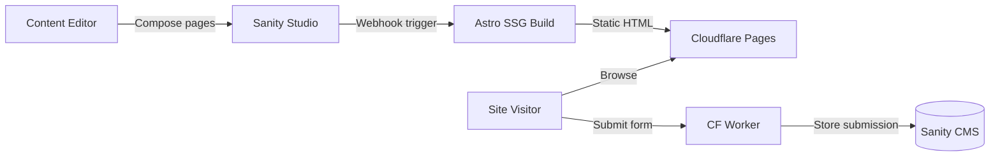
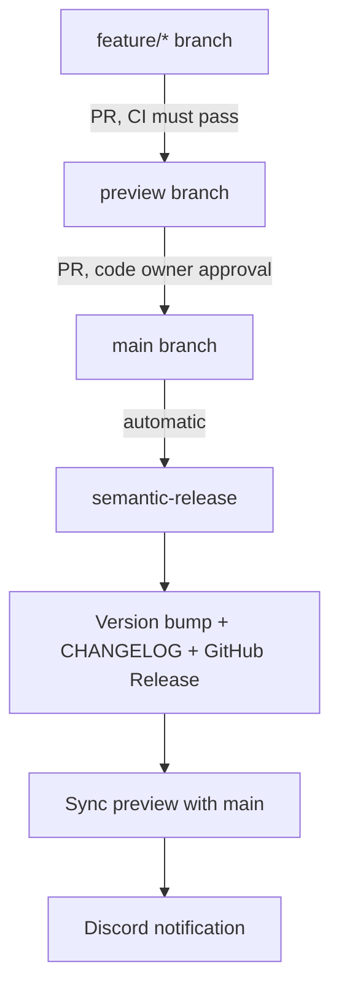
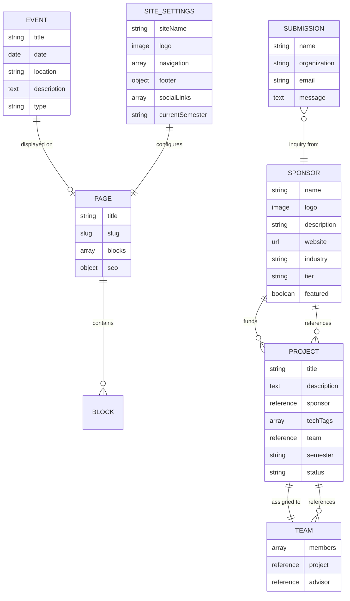

# YWCC Capstone Sponsors


A CMS-driven static website for NJIT's Ying Wu College of Computing Industry Capstone program. Content editors compose pages by stacking reusable UI blocks in Sanity Studio — zero code required.



## Table of Contents

- [Overview](#overview)
- [Tech Stack](#tech-stack)
- [Project Structure](#project-structure)
- [Prerequisites](#prerequisites)
- [Getting Started](#getting-started)
- [Development](#development)
- [Git Workflow](#git-workflow)
- [Block Library](#block-library)
- [Content Model](#content-model)
- [Adding a New Block](#adding-a-new-block)
- [Testing](#testing)
- [Deployment](#deployment)
- [Performance Targets](#performance-targets)
- [Contributing](#contributing)
- [Team](#team)
- [Resources](#resources)
- [License](#license)

## Overview

The platform connects industry sponsors with capstone teams by showcasing sponsor organizations, project proposals, team rosters, and program information. It uses a **toolkit-not-website** approach — a block library maps editor-friendly names to [fulldev/ui](https://ui.full.dev) component internals (vanilla Astro components via the shadcn CLI), making the design system invisible to non-technical users.

**Key goals:**

- Content editors build and update pages independently with no developer involvement
- Prospective sponsors discover the program and submit inquiries
- Students find team assignments, project details, and key dates in one hub
- $0/month operating cost using free tiers across all services
- Lighthouse 90+ across all categories on every page

**Reference site:** [ywcccapstone1.com](https://ywcccapstone1.com)

## Tech Stack

| Layer | Technology |
|---|---|
| Frontend | [Astro 5.x](https://astro.build/) (SSG, `output: 'static'`) |
| CMS | [Sanity 5](https://www.sanity.io/) (headless, Visual Editing) |
| UI Components | [fulldev/ui](https://ui.full.dev) — vanilla `.astro` components via shadcn CLI |
| Styling | [Tailwind CSS v4](https://tailwindcss.com/) (`@tailwindcss/vite`, CSS-first config) |
| Icons | [@iconify/utils](https://iconify.design/) + Lucide (`@iconify-json/lucide`, `@iconify-json/simple-icons`) |
| Interactivity | Vanilla JS (< 5KB total) |
| Hosting | [Cloudflare Pages](https://pages.cloudflare.com/) (production: static, preview: SSR) |
| Storybook | [GitHub Pages](https://pages.github.com/) (component library only) |
| Form Proxy | [Cloudflare Worker](https://workers.cloudflare.com/) (deferred) |
| Analytics | GA4 + Monsido |
| Unit Tests | [Vitest](https://vitest.dev/) (jsdom) |
| E2E Tests | [Playwright](https://playwright.dev/) (5 browser projects + axe-core a11y) |
| CI/CD | [GitHub Actions](https://github.com/features/actions) (CI, release, Storybook deploy) |
| Releases | [semantic-release](https://semantic-release.gitbook.io/) (automated versioning + changelog) |
| Component Dev | [Storybook 10](https://storybook.js.org/) (via `storybook-astro` renderer) |

Production builds bake all content into static HTML — zero runtime API calls. The `preview` branch uses SSR for live Visual Editing with draft content.

## Project Structure

```text
astro-shadcn-sanity/
├── astro-app/                # Astro frontend (SSG)
│   ├── astro.config.mjs      # output: 'static', @tailwindcss/vite, @sanity/astro
│   ├── components.json       # shadcn CLI config with @fulldev registry
│   ├── src/
│   │   ├── components/
│   │   │   ├── ui/           # fulldev/ui primitives (installed via shadcn CLI)
│   │   │   ├── blocks/       # Block components (compose from ui/ primitives)
│   │   │   └── *.astro       # Layout components (Header, Footer, etc.)
│   │   ├── layouts/          # Base HTML layout
│   │   ├── lib/              # Sanity client, GROQ queries, image helpers
│   │   ├── pages/            # Astro page routes
│   │   └── styles/
│   │       └── global.css    # @import "tailwindcss" + theme + CSS variables
│   └── package.json
├── studio/                   # Sanity Studio (CMS)
│   └── src/
│       └── schemaTypes/
│           ├── blocks/       # Block object schemas (one per block)
│           ├── documents/    # Document schemas (page, sponsor, etc.)
│           ├── objects/      # Shared objects (SEO, button, portable text)
│           └── helpers/      # defineBlock helper
├── .github/workflows/        # CI, release, Storybook deploy, branch enforcement
├── docs/team/                # Developer guides and onboarding
├── tests/                    # Playwright tests
├── package.json              # Root workspace config
├── .releaserc.json           # semantic-release configuration
└── CHANGELOG.md              # Auto-generated (do not edit manually)
```

This is an **npm workspaces** monorepo with two packages: `astro-app` and `studio`.

## Prerequisites

- [Node.js](https://nodejs.org/) v24 or later
- npm v10 or later
- A [Sanity.io](https://www.sanity.io/) account (free tier)
- A [GitHub](https://github.com/) account
- A [Cloudflare](https://www.cloudflare.com/) account (free tier, for deployment)

## Getting Started

### 1. Clone the repository

```bash
git clone git@github.com:gsinghjay/astro-shadcn-sanity.git
cd astro-shadcn-sanity
```

### 2. Install dependencies

```bash
npm install
```

This command installs dependencies for both the Astro app and Sanity Studio.

### 3. Configure environment variables

Create a `.env` file in `astro-app/` with your Sanity project credentials:

```bash
PUBLIC_SANITY_PROJECT_ID=your_project_id
PUBLIC_SANITY_DATASET=production
```

### 4. Start development servers

```bash
npm run dev
```

This starts both servers concurrently:

- **Astro app:** <http://localhost:4321>
- **Sanity Studio:** <http://localhost:3333>

### 5. Sign in to Sanity Studio

Open <http://localhost:3333> and sign in with the same service (Google, GitHub, or email) you used when creating your Sanity project.

## Development

| Command | What it does |
|---|---|
| `npm run dev` | Start Astro + Studio dev servers |
| `npm run dev:storybook` | Start Astro + Studio + Storybook (all three) |
| `npm run storybook` | Start Storybook alone (port 6006) |
| `npm run build --workspace=astro-app` | Build Astro for production |
| `npm run test:unit` | Run Vitest unit tests |
| `npm run test:unit:watch` | Unit tests in watch mode |
| `npm run test` | Run Playwright E2E tests (builds first) |
| `npm run test:integration` | Run integration tests (fast, no browser) |
| `npm run test:ui` | Run Playwright in UI mode |

## Git Workflow

We use [Conventional Commits](https://www.conventionalcommits.org/) + [semantic-release](https://semantic-release.gitbook.io/) for automated versioning and changelog generation.



### Branch rules

| Branch | Purpose | Protection |
|---|---|---|
| `main` | Production releases | PRs only from `preview`, code owner approval required |
| `preview` | Staging/integration | PRs only, CI must pass (unit tests + Lighthouse) |
| `feature/*` | Your working branches | No restrictions |

### Commit format

```
<type>: <description>
```

| Prefix | Release? | Version bump |
|---|---|---|
| `feat:` | Yes | Minor (0.1.0 → 0.2.0) |
| `fix:` | Yes | Patch (0.1.0 → 0.1.1) |
| `feat!:` | Yes | Major (0.1.0 → 1.0.0) |
| `chore:`, `docs:`, `ci:`, `test:`, `refactor:` | No | — |

See [docs/team/git-workflow-guide.md](docs/team/git-workflow-guide.md) for the full guide with examples and troubleshooting.

## Block Library

Pages are composed from a flat array of reusable CMS blocks. Each block inherits a shared base schema providing background variant, spacing, and max-width options.

### P0 Blocks (MVP)

| Block | Description |
|---|---|
| Hero Banner | Heading, subheading, optional background image, CTA buttons, configurable alignment |
| Feature Grid | Icon/image + title + description cards in configurable column layouts |
| Sponsor Cards | Sponsor documents with tier badges |
| Rich Text | Portable Text with inline images and callout boxes |
| CTA Banner | Heading, description, and action buttons |
| FAQ Accordion | Expandable question/answer pairs with keyboard accessibility |
| Contact Form | Configurable fields with server-side submission via Cloudflare Worker |
| Timeline | Date-ordered milestones with current-phase highlighting |
| Logo Cloud | Sponsor logos from sponsor documents |

### P1 Blocks (Growth)

Tabbed Content, Testimonials, Stats Row, Data Table, Team Grid, CarouselWrapper

### P2 Blocks (Expansion)

Image Gallery, Video Embed, Alert/Notice

## Content Model



**7 document types:** Page, Sponsor, Project, Team, Event, Submission, Site Settings.

## Adding a New Block

Every block follows this checklist:

### 1. Create the Sanity schema

Use the `defineBlock` helper (merges shared base fields automatically):

```typescript
// studio/src/schemaTypes/blocks/your-block.ts
import { defineBlock } from '../helpers/defineBlock'

export const yourBlock = defineBlock({
  name: 'yourBlock',
  title: 'Your Block',
  fields: [
    // Block-specific fields only — base fields added by defineBlock
  ],
})
```

### 2. Register the schema

Add to `studio/src/schemaTypes/index.ts` and the page schema's `blocks[]` array.

### 3. Install needed fulldev/ui primitives

```bash
npx shadcn@latest add @fulldev/button @fulldev/badge  # whatever the block needs
```

### 4. Create the Astro component

Compose from fulldev/ui primitives in `src/components/ui/`:

```astro
---
// astro-app/src/components/blocks/custom/YourBlock.astro
import type { YourBlockBlock } from '@/lib/types'
import { Button } from '@/components/ui/button'

interface Props {
  block: YourBlockBlock
}

const { block } = Astro.props
---

<section>
  <h2>{block.heading}</h2>
  <!-- Compose from ui/ primitives + Tailwind utilities -->
</section>
```

### 5. Register in BlockRenderer

Add the import and case in `BlockRenderer.astro`.

### 6. Add GROQ projection

Add the type-specific projection in `src/lib/sanity.ts`.

Build and verify Lighthouse scores hold at 90+.

## Testing

| Layer | Tool | Command | What it tests |
|---|---|---|---|
| Unit | Vitest | `npm run test:unit` | Utilities, GROQ queries, mock data, DOM scripts |
| Integration | Playwright | `npm run test:integration` | Schema validation, module imports |
| E2E | Playwright | `npm run test` | Full browser tests across 5 device configs |
| Accessibility | axe-core | Included in E2E | WCAG 2.1 AA compliance |
| Performance | Lighthouse CI | CI only (preview PRs) | Core Web Vitals, performance budgets |

## Deployment

### Astro site → Cloudflare Pages

Deployed automatically via Cloudflare Pages git integration:

- **Push to `main`** → Production (static, Visual Editing OFF)
- **Push to any branch** → Preview URL (SSR, Visual Editing ON)

Environment variables are configured in the [Cloudflare Pages dashboard](https://dash.cloudflare.com/). See [docs/team/cloudflare-setup-guide.md](docs/team/cloudflare-setup-guide.md).

### Sanity Studio

```bash
npx sanity deploy --workspace=studio
```

### Storybook → GitHub Pages

Deployed automatically via `.github/workflows/deploy-storybook.yml` on pushes to `main` that touch component files. Can also be triggered manually from the Actions tab.

### Releases

Fully automated via [semantic-release](https://semantic-release.gitbook.io/). When `preview` merges into `main`:

1. Commits are analyzed for version bump (based on conventional commit prefixes)
2. `CHANGELOG.md` and `package.json` are updated
3. A git tag and GitHub Release are created
4. `preview` is auto-synced with `main`
5. Discord notification confirms the sync

See the [CHANGELOG](CHANGELOG.md) and [GitHub Releases](https://github.com/gsinghjay/astro-shadcn-sanity/releases) for version history.

## Performance Targets

| Metric | Target |
|---|---|
| Lighthouse Performance | 95+ |
| Lighthouse Accessibility | 90+ |
| Cumulative Layout Shift | < 0.05 |
| JS payload | < 5KB minified |
| CSS payload | < 15KB after Tailwind purge |

Optimize for fast First Contentful Paint and Largest Contentful Paint on 4G connections. No framework runtime — Total Blocking Time stays near zero.

## Contributing

> **Read the [Git Workflow Guide](docs/team/git-workflow-guide.md) before your first contribution.** It covers branch strategy, commit conventions, and the full release pipeline.

1. Pull the latest `preview` branch: `git checkout preview && git pull`
2. Create a feature branch: `git checkout -b feat/your-feature`
3. Follow the [block checklist](#adding-a-new-block) for new blocks
4. Write [conventional commits](#commit-format): `git commit -m "feat: add your feature"`
5. Push and open a PR to `preview`: `gh pr create --base preview`
6. After CI passes and merge, open a PR from `preview` → `main`
7. Code owner reviews and merges → release happens automatically

### Code conventions

- **Sanity schemas:** TypeScript with `defineBlock` helper (blocks) or `defineType`/`defineField` (documents)
- **UI primitives:** fulldev/ui components in `src/components/ui/` — install via `npx shadcn@latest add @fulldev/{name}`
- **Block components:** `.astro` files in `src/components/blocks/custom/` composing from `ui/` primitives
- **Styling:** Tailwind v4 utility classes, CSS-first config in `global.css`, no `tailwind.config.mjs`
- **Interactivity:** Vanilla JS with data-attribute driven event delegation, each handler under 50 lines
- **Block architecture:** Flat array only — no nested blocks
- **No React/JSX for page UI** — React is only for Sanity Visual Editing (Presentation tool)

### Team documentation

| Document | When to read it |
|---|---|
| [Git Workflow Guide](docs/team/git-workflow-guide.md) | Before your first commit |
| [Onboarding Guide](docs/team/onboarding-guide.md) | First day setup |
| [Cloudflare Setup Guide](docs/team/cloudflare-setup-guide.md) | Deployment and environment variables |
| [How Preview & Publish Works](docs/team/how-preview-and-publish-works.md) | Visual Editing and draft content |

## Team

| Name | GitHub | Role |
|---|---|---|
| Jay Singh | [@gsinghjay](https://github.com/gsinghjay) | Project Lead |
| Roberson Sanchez | [@ras242](https://github.com/ras242)| - |
| Sahil Parmar |[@SahilP20](https://github.com/SahilP20)| Discord Bot Dev |
| Aryaan Panda |[@panzemary](https://github.com/panzemary)| - |
| | | |
| | | |
| | | |
| | | |
| | | |

> **Team members:** Add your name, GitHub link, and role by editing this table on a feature branch and opening a PR to `preview`.

## Resources

- [Astro documentation](https://docs.astro.build/)
- [Sanity documentation](https://www.sanity.io/docs/)
- [fulldev/ui documentation](https://ui.full.dev/docs)
- [Tailwind CSS v4 documentation](https://tailwindcss.com/docs)
- [Cloudflare Pages documentation](https://developers.cloudflare.com/pages/)
- [Conventional Commits](https://www.conventionalcommits.org/)
- [semantic-release documentation](https://semantic-release.gitbook.io/)
- [Keep a Changelog](https://keepachangelog.com/)

## License

UNLICENSED
