# WordPress Site Scraped Content

**Source:** https://real-world-connections.com/
**Scraped:** 2026-03-01
**Purpose:** Content migration to Astro + Sanity CMS

---

## Site-Wide Data

### Site Title

RWC-US

### Navigation

| Label | URL |
|---|---|
| Home | https://hs673.wordpress.com |
| About Us | https://hs673.wordpress.com/about/ |
| Get Involved | https://hs673.wordpress.com/for-students/ |
| For Students | https://hs673.wordpress.com/for-students/ |
| For Parents | https://hs673.wordpress.com/for-parents/ |
| For Schools | https://hs673.wordpress.com/for-schools/ |
| For Coaches | https://hs673.wordpress.com/about-2/ |
| For Partnerships | https://hs673.wordpress.com/for-partnerships/ |
| News & Events | https://hs673.wordpress.com/news-events/ |
| Activities | https://hs673.wordpress.com/Activities/ |
| Gallery | https://hs673.wordpress.com/Gallery/ |
| FAQ | https://hs673.wordpress.com/faq/?frame-nonce=96fd6f1c1e |
| Contact Us | https://hs673.wordpress.com/contacts/ |
| Apply Now | https://fs7.formsite.com/eljabiri2/29hkthux9h/index |

### Font

"Times New Roman"

---

## Page: Home (/)

**Screenshot:** `screenshots/home.png`

- Home
- About Us
- Get Involved
- News & Events
- Activities
- Gallery
- FAQ
- Contact Us

## Welcome to Real World Connections

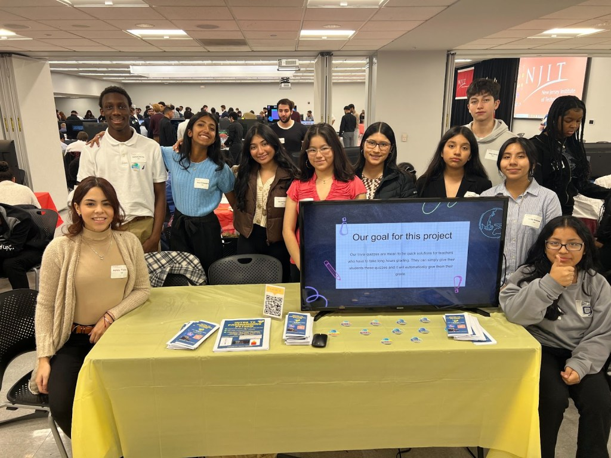

Real World Connections (RWC) is a unique program that offers talented middle and high school students the opportunity to be involved in a fun-filled and hands-on educational experience.

Students have a unique chance to work with well-known companies or become entrepreneurs as well as industry subject matter experts, alumni, NJIT students and faculty. RWC is the founder of a “University without Walls” model.

## Current & Upcoming Programs

## About RWC

### Classes

RWC classes work as a very social “learning organization” co-designed by students, university, and industry.

These classes adapt to students’ demands, learn from weekly feedback and respond rapidly to real world clients’ expectations, so education becomes more relevant, exciting and rewarding.

### Projects

In addition to classes, RWC offers hands-on training in project management, leadership, entrepreneurship, research and development, software tools, programming, engineering, social, presentation and communication skills.

This training is integrated with mentorship by industry, university and peers.

## Program Overview

### Knowledge Enrichment

Enrich your knowledge and skills in a wide spectrum of STEM topics using real world scenarios with role model mentorship.

### Facilitating Creativity

Develop proactive approaches and innovative thinking to become major players in significant real-world projects

### Personality Development

Build professionalism, leadership, social, communication and presentation skills.

### Boosting Motivation

Join an exciting learning environment where education is relevant and challenging with a strong sense of ownership.

### Learning by Doing

Practice existing high school curriculums while solving real world problems via project-based learning.

## Join our RWC Family!

### Students

### Parents

### Schools

### Coaches

### Partners

## News & Events

Check out what we have in store for RWC and future RWC participants!

## Recent Achievements & Notable Events

The RWC program won the State of New Jersey Governor award in 2017, given to individuals and organizations with great community impact and acts of public service.

All RWC showcases were attended by NJIT’s senior leadership with big attendance of major corporations and university faculty and students.

RWC offered satellite locations in Newark, Mount Olive and Freehold and partnered with Newark Public Schools, Orange school district, Kearny High School and Union City High School.

(Left to right) Senator Cory Booker, Altice CEO Dexter Goei, NJIT President Joel Bloom and Newark Mayor Ras Baraka

A Senator, Mayor, Congressman and CEO Visit NJIT Senator Cory Booker and Newark Mayor Ras Baraka were on hand to hear presentations by the students as well as engage in a “fireside chat” with them, discussing their own paths to success. Also visiting was Dexter Goei, CEO of broadband communications and video services provider Altice, one of many SYEP funders.

NJIT’s Osama Eljabiri’s Real World Connections Program provides educational opportunities to high school students in the U.S. and abroad. Pictured are the students from a recent session in Medellin, Colombia.

NJIT Program started by NJIT Professor Spreading Entrepreneurial Spirit Around the World – RWC goes International. Three times a year, NJIT’s Dr. Osama Eljabiri makes the trip to Medellin, Colombia, as part of his Real World Connections (RWC) program.

“RWC has helped many students get into some of the best schools in the country, paving the way to permanent, meaningful employment in high-tech fields for individuals from underserved communities”

– Dr. Osama Eljabiri
Founder of the RWC Program

## Student Testimonials

“RWC is a place where we can come and we learn not in a school way but in a fun way where we can express ourselves with creativity and exceed our intelligence.”

“For me, RWC is just a big family. Even though it’s only been 5 weeks, I’m running the server file.”

“RWC is a place where kids can just take charge of the projects they wanna do and they are guided by the teachers and students.”

“RWC is a way for me to learn new things and experience things that I wouldn’t be able to on a normal basis and I’m able to explore the career opportunities for later on in my life.”

## Current Sponsors

### Mount Olive

### Big Brother Big Sister

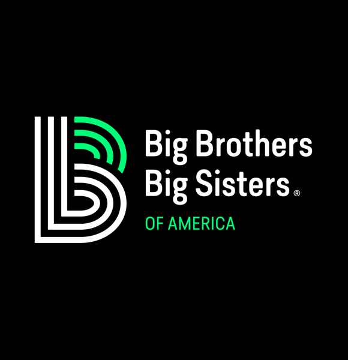

### Union City

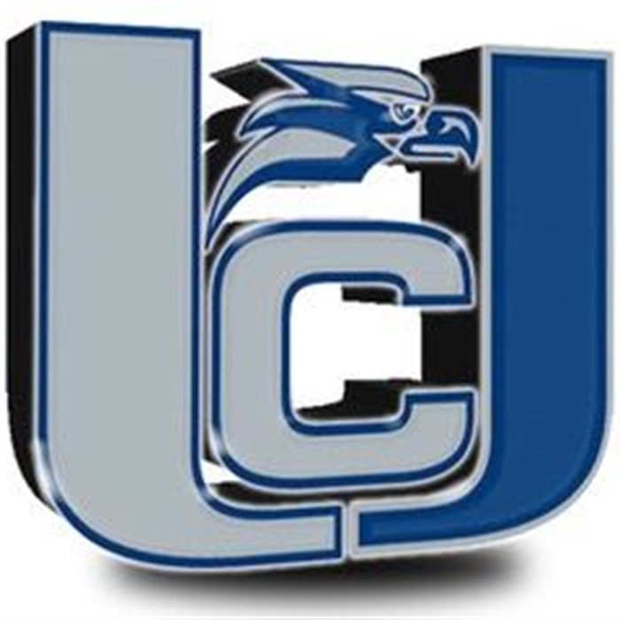

### Panasonic

### Orange

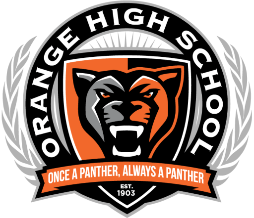

### Johnson & Johnson

RWC-US

### Forms

**Action:** ref: <Node> (post)

| Field | Type | Required |
|---|---|---|
| email | email | No |

**Action:** https://real-world-connections.com/ (get)

| Field | Type | Required |
|---|---|---|
| jetpack-instant-search__box-input-1 | search | No |

### Embedded Content

- **Iframe:** `https://calendar.google.com/calendar/embed?src=c_6f9c3b50c0b03af58fca0851b9c4735238d075a75e29ffd6c5905bf18f46dedf%40group.calendar.google.com&ctz=America%2FNew_York`

### Call-to-Action Links

- **Contact Us** -> https://hs673.wordpress.com/contacts/
- **Apply Now** -> https://fs7.formsite.com/eljabiri2/29hkthux9h/index
- **Students – Apply Now** -> https://fs7.formsite.com/eljabiri2/29hkthux9h/index
- **Learn More About RWC Tracks!** -> https://real-world-connections.com/for-students/
- **Learn More** -> https://real-world-connections.com/for-students/
- **Apply Now** -> https://fs7.formsite.com/eljabiri2/29hkthux9h/index
- **Learn More** -> https://hs673.wordpress.com/for-parents/
- **Learn More** -> https://real-world-connections.com/for-schools/
- **Learn More** -> https://real-world-connections.com/about-2/
- **Apply Now** -> https://fs7.formsite.com/eljabiri2/afh8mljzw7/index
- **Learn More** -> https://real-world-connections.com/for-partnerships/
- **Learn More About Our Sponsors’ Involvement!** -> https://real-world-connections.com/for-partnerships/

---

## Page: About (/about/)

### About

**Screenshot:** `screenshots/about.png`

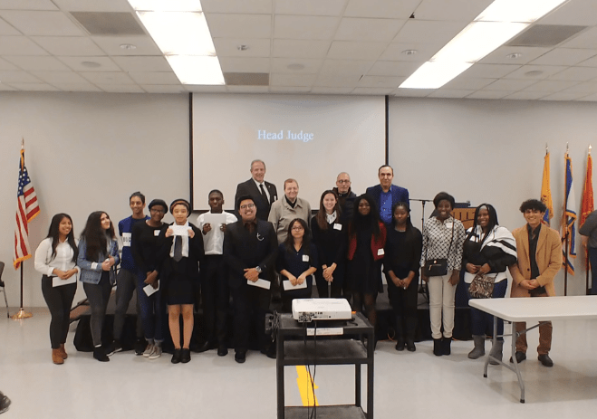

Twenty years ago, Osama Eljabiri, Ph.D. created a college-level capstone program at NJIT that focused on project-based learning and real-world experiences.

With a network of over 1500 industry, government, and community sponsors and partners, the program inspired us to create a K-12 version called RWC (Real World Connections) 17 years ago. We aimed to provide an exciting and engaging STEM learning experience that motivates students in a unique way.

Most people thought it would be limited by traditional course constraints, budget, capacity, politics, students’ capabilities and resources. While they did not see anything but constraints and challenges, we saw nothing but endless possibilities for middle and high school students, university and community.

## Facts About RWC

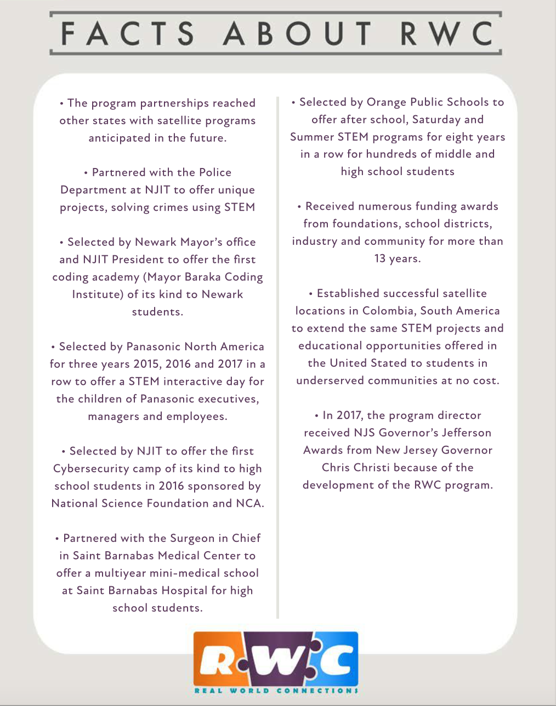

## Our Story

As a network of networks, the multidisciplinary RWC program is changing how classrooms operate and redefining how students learn, running a FREE real-world project-based learning environment year round, transforming the way business work with education, impacting K-12 education through students ownership, and creating a pipeline from middle school to industry while partnering with the world to empower our students.

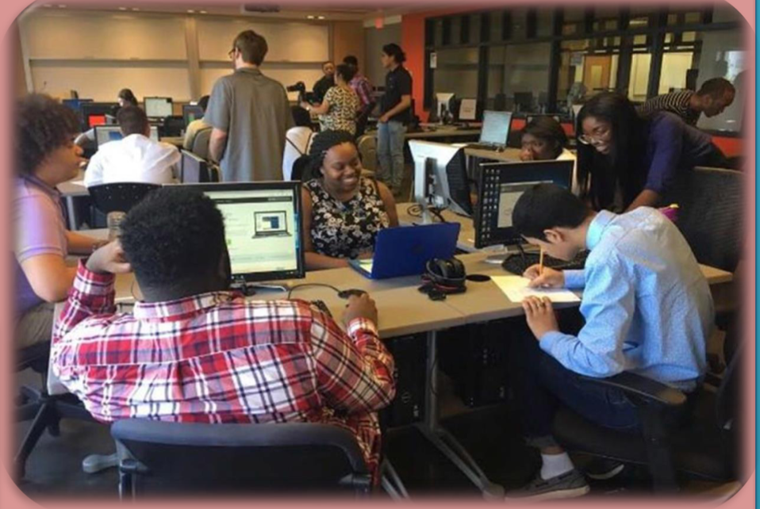

## RWC In Action

In summer 2007, RWC students presented their real-world projects at News12 New Jersey TV and were interviewed by Brian Jenks for more than 20 minutes; in 2012 RWC students presented their innovations at the Liberty Science Center.

## Sense of Ownership

Students select their projects, co-design the course, run class as a company, elect their CEO’s, vote for activities and major decisions and get rewarded for constructive criticism.

## Social Intelligence

Students help each other within the team & between teams, teach the class, advise & mentor peers, sit in a u-shape style and enjoy social activities inside and outside the classroom.

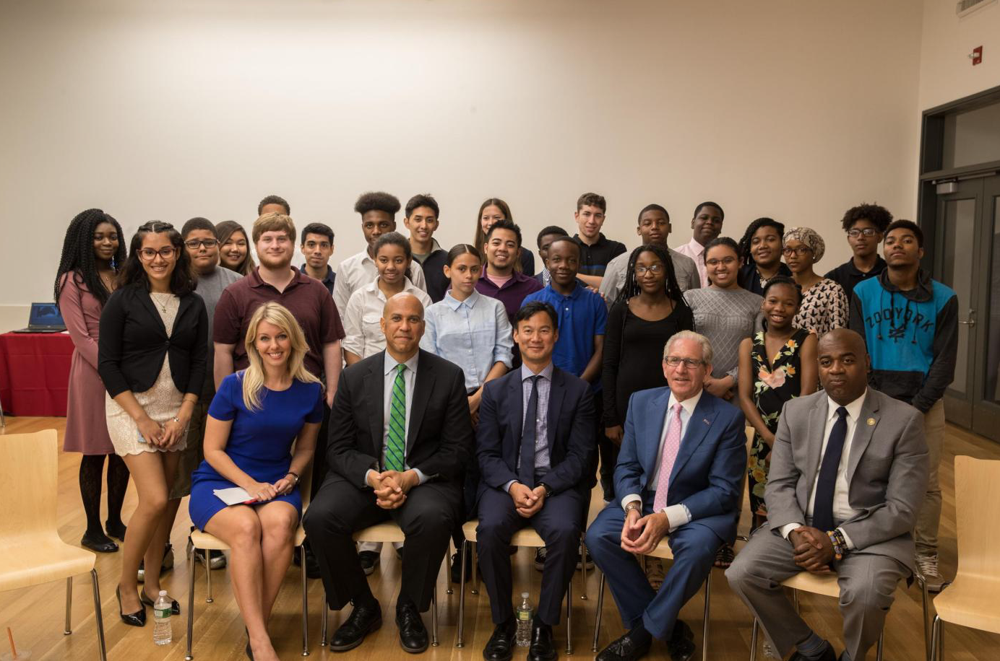

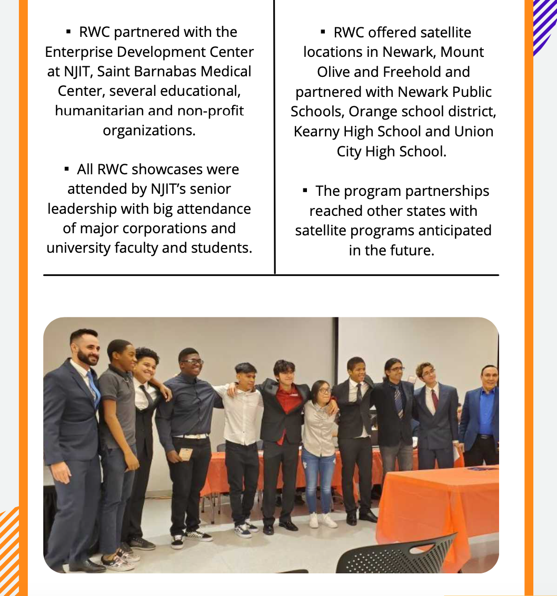

## RWC Achievements

Year 2007

In summer 2007, RWC students presented their real-world projects at News12 NJ TV and were interviewed by Brian Jenks for 20+ minutes. In Fall, the founder of RWC won a national award from Carnegie Foundation with a permanent congressional record for innovation in education and NJIT’s- wide excellence in service award.

Year 2008-09

In summer 2008, RWC students presented their Global Microscope project to NASA headquarters in Washington DC and received an appreciation letter from NASA executive director of education. In summer 2008 and 2009, RWC winners received year-long mentorships from top executives at Saint Barnabas Health Care System.

Year 2012-13

In 2012, RWC students presented their Innovations at the Liberty Science Center. In summer 2013 RWC students ran the entire program by themselves as teachers and managers

Current Partnerships

Partnered with Johnson & Johnson for more than seven years and this partnership only continues to grow. Partnered with the Enterprise Development Center at NJIT, Saint Barnabas Medical Center, several educational, humanitarian and non-profit organizations.

### Forms

**Action:** https://real-world-connections.com/about/ (get)

| Field | Type | Required |
|---|---|---|
| comment | textarea | No |
| email | text | No |
| author | text | No |
| url | text | No |

**Action:** ref: <Node> (post)

| Field | Type | Required |
|---|---|---|
| email | email | No |

**Action:** https://real-world-connections.com/about/ (get)

| Field | Type | Required |
|---|---|---|
| jetpack-instant-search__box-input-1 | search | No |

---

## Page: For Students (/for-students/)

### For Students

**Screenshot:** `screenshots/for-students.png`

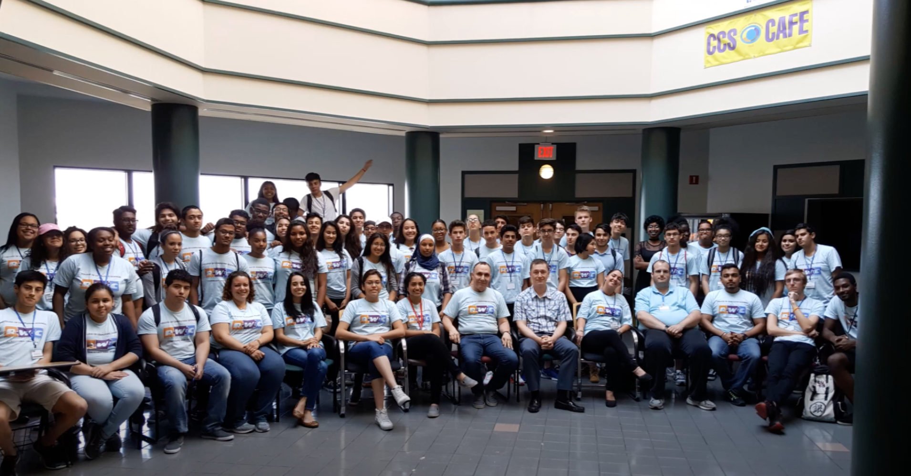

Join our dynamic learning environment where students explore exciting subjects like programming, music, technology, and robotics.

Our interactive approach helps students acquire technical skills and develop critical thinking, problem-solving, and teamwork abilities.

### “RWC is a place where we can come and we learn not in a school way but in a fun way where we can express ourselves with creativity and exceed our intelligence.”

## Tracks and Courses

Web Development: Explore the essentials of web development by learning HTML, CSS, and JavaScript. Students engage in hands-on projects that cover responsive design, user experience (UX), and backend development, honing their coding skills while collaborating with peers.

Game Design: Unleash creativity in game design! Students discover storytelling, character development, and mechanics while using industry-standard tools to craft immersive gaming experiences. This track blends coding, animation, and graphics.

Animation: Enter the vibrant world of animation, where students bring characters and stories to life. With hands-on projects, they learn principles like movement and timing, using software such as Adobe Animate and Blender to create stunning 2D and 3D animations.

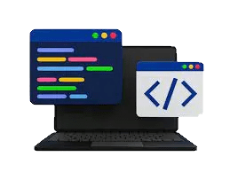

Intro to Programming: Begin your coding journey by mastering fundamental programming concepts. Through interactive lessons and practical exercises, students work with languages like Python and JavaScript to create their own projects and solve problems.

Robotics: Design, build, and program robots to tackle challenges! Students explore mechanical engineering, electrical circuits, and programming languages like Python and C++. This track emphasizes problem-solving and innovation through engaging hands-on experiences.

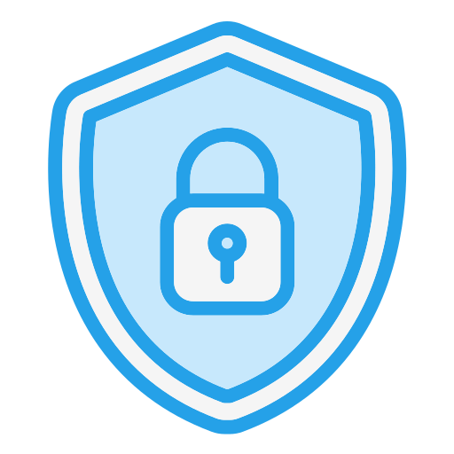

Cybersecurity: Learn to protect digital systems from cyber threats! Through interactive activities and real-world simulations, students explore encryption, threat detection, and risk assessment, developing critical skills for safeguarding sensitive information.

App Development: Dive into app development and create mobile applications for smartphones and tablets. Through hands-on projects and expert guidance, students learn the fundamentals of coding and design to bring their ideas to life.

Film: Immerse in the art of filmmaking! From script to screen, students learn storytelling, cinematography, and editing through hands-on projects, gaining experience with industry-standard equipment to produce short films, documentaries, or music videos.

PC and Network Building: Explore the world of PC and network building by constructing and configuring computer systems. Students gain hands-on experience with hardware components, troubleshooting, and optimization, learning essential skills for tech enthusiasts.

### Forms

**Action:** https://real-world-connections.com/for-students/ (get)

| Field | Type | Required |
|---|---|---|
| comment | textarea | No |
| email | text | No |
| author | text | No |
| url | text | No |

**Action:** ref: <Node> (post)

| Field | Type | Required |
|---|---|---|
| email | email | No |

**Action:** https://real-world-connections.com/for-students/ (get)

| Field | Type | Required |
|---|---|---|
| jetpack-instant-search__box-input-1 | search | No |

### Call-to-Action Links

- **Apply Now** -> https://fs7.formsite.com/eljabiri2/29hkthux9h/index

---

## Page: For Parents (/for-parents/)

### For Parents

**Screenshot:** `screenshots/for-parents.png`

## See how your child can benefit

### Teamwork

The program provides an environment that cultivates teamwork. Through working together, students learn how to communicate effectively, share ideas, and leverage each other’s skills towards a common goal.

### Inspiration

Students can choose from many different areas of technology. They engage in projects and interactive learning activities, which ignites their curiosity and provide avenues for exploration in the future.

### Real Experience

Students engage in project-based learning that mirrors real-life job scenarios, fostering collaboration and honing practical troubleshooting skills essential for professional success.

### Sense of Ownership

Students select their projects, co-design the course, run class as a company, elect their CEO’s, vote for activities and major decisions and get rewarded for constructive criticism.

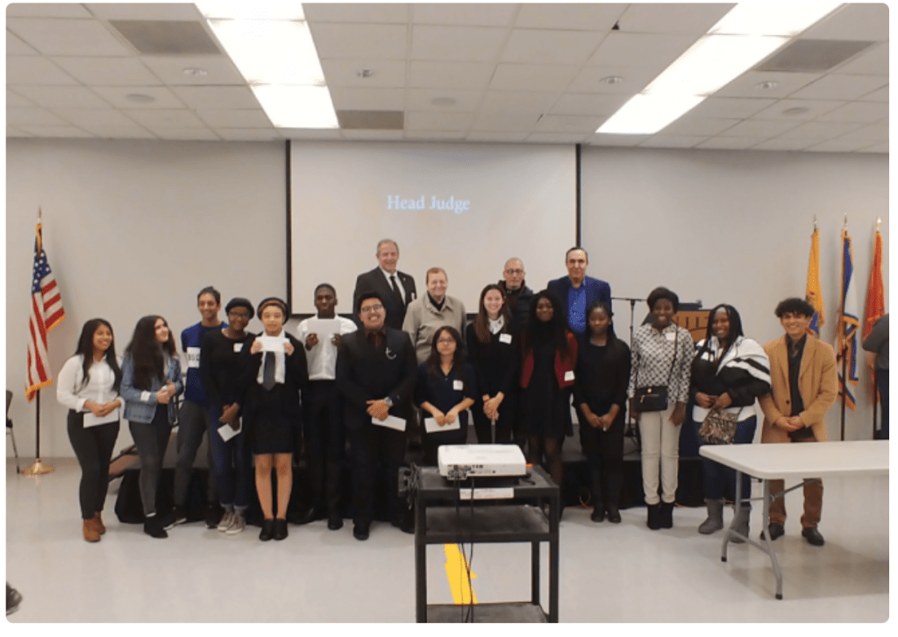

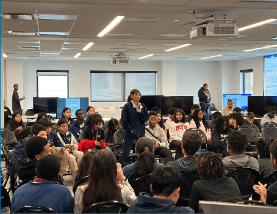

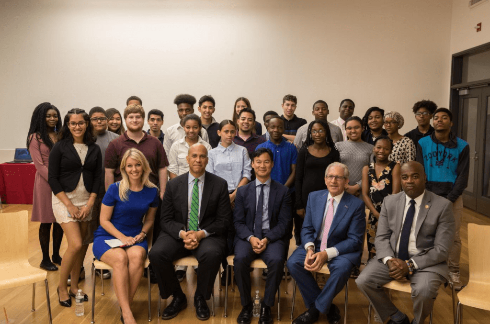

## Parental Support and Involvement

At the end of the program, parents have the opportunity to witness their child’s journey and accomplishments. They can view their children’s projects, which range from creating webpages to building robotics and programming PCs. It’s a chance for parents to see their children’s projects come to life and watch them confidently present their work to everyone involved.

### Safety and Supervision

Ensuring the safety and well-being of every student is our top priority. We maintain a secure environment by implementing strict safety protocols and precautions. We regularly inspect our facilities and equipment to uphold safety standards. We enforce supervision guidelines to ensure that all activities are conducted under responsible supervision. Parents can have peace of mind knowing that their children are in a safe environment while participating in our program

## Register Today!

### Fill out application below to register your child

### Forms

**Action:** https://real-world-connections.com/for-parents/ (get)

| Field | Type | Required |
|---|---|---|
| comment | textarea | No |
| email | text | No |
| author | text | No |
| url | text | No |

**Action:** ref: <Node> (post)

| Field | Type | Required |
|---|---|---|
| email | email | No |

**Action:** https://real-world-connections.com/for-parents/ (get)

| Field | Type | Required |
|---|---|---|
| jetpack-instant-search__box-input-1 | search | No |

### Call-to-Action Links

- **Application** -> https://fs17.formsite.com/Rk0JZN/rlwgrjvlzm/index

---

## Page: For Schools (/for-schools/)

### For Schools

**Screenshot:** `screenshots/for-schools.png`

## Our Impact

RWC powers the future of STEM education by connecting middle school talent with industry opportunities. Through collaborative partnerships with professional leaders, we’re building an ecosystem where innovation thrives. Our data-driven approach has delivered exceptional results:

- 95% of participating students report increased interest in STEM careers
- Over 1,000 students trained annually across multiple school districts
- 85% of students demonstrate improved problem-solving skills

## Program Offerings

Our industry-aligned curriculum includes:

- Mobile App Development
- Professional Website Design
- CISCO Academy Cybersecurity Training
- Video Game Development
- Robotics Engineering
- Creative Technology Integration (Art & Music)

## Why Partner with RWC?

- Expert mentorship from industry professionals and university faculty
- Hands-on, project-based learning experiences
- State-of-the-art technology resources

- Proven curriculum aligned with industry standards
- Regular progress reports
- Customized programs to meet your school’s needs

## School Testimonials

> Coming Soon!

Coming Soon!

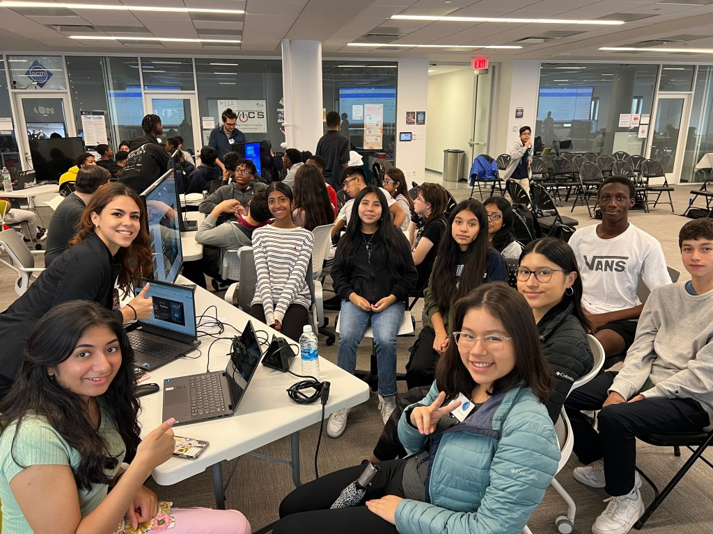

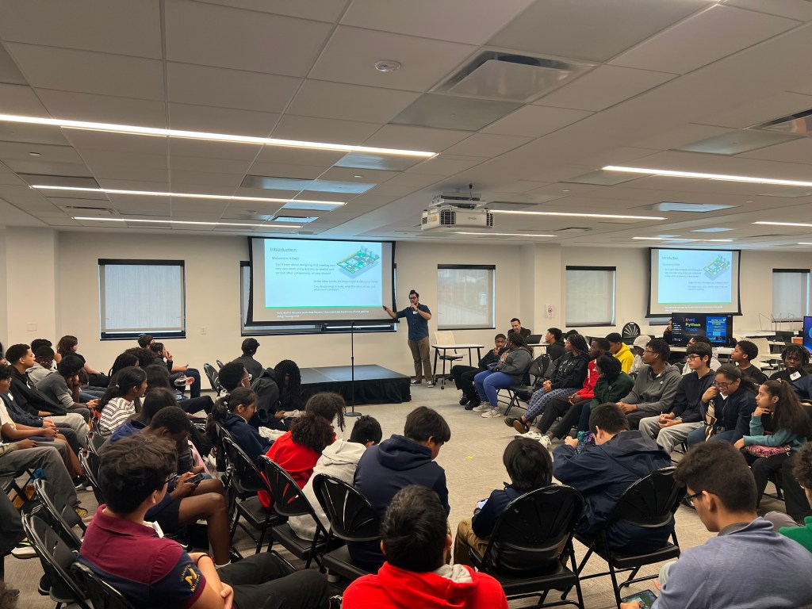

## RWC Partner Schools

Current Partners

- Mount Olive Schools
- Orange School District
- Union City High School
- Big Brother Big Sister

Previous/Seasonal Partners

- Newark Public Schools
- Kearny High School
- Freehold Bio-Tech

Students also come individually from many other school districts!

Contact us today to join our award-winning program

### Forms

**Action:** https://real-world-connections.com/for-schools/ (get)

| Field | Type | Required |
|---|---|---|
| comment | textarea | No |
| email | text | No |
| author | text | No |
| url | text | No |

**Action:** ref: <Node> (post)

| Field | Type | Required |
|---|---|---|
| email | email | No |

**Action:** https://real-world-connections.com/for-schools/ (get)

| Field | Type | Required |
|---|---|---|
| jetpack-instant-search__box-input-1 | search | No |

### Call-to-Action Links

- **Contact Us** -> /contact

---

## Page: About 2 (/about-2/)

### For Coaches

**Screenshot:** `screenshots/about-2.png`

## Why Become a Coach?

#### Facilitating Creativity

Encouraging proactive approaches and innovative thinking, as students become major players in significant real-world projects.

#### Personality Development

Building professionalism, leadership, social, communication and presentation skills.

#### Learning By Doing

Practicing existing high school curriculum in solving real world problems via project-based learning.

#### Knowledge Enrichment

Enriching student’s knowledge and skills in a wide spectrum of STEM topics using real world scenarios and role model mentorship

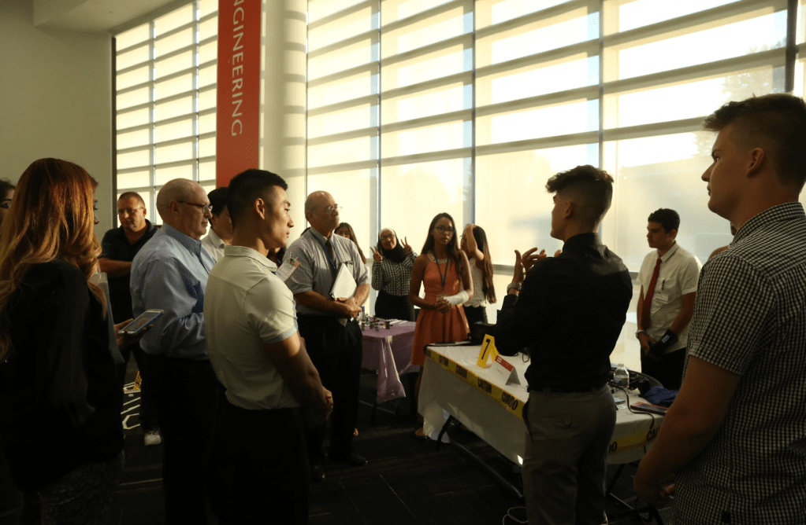

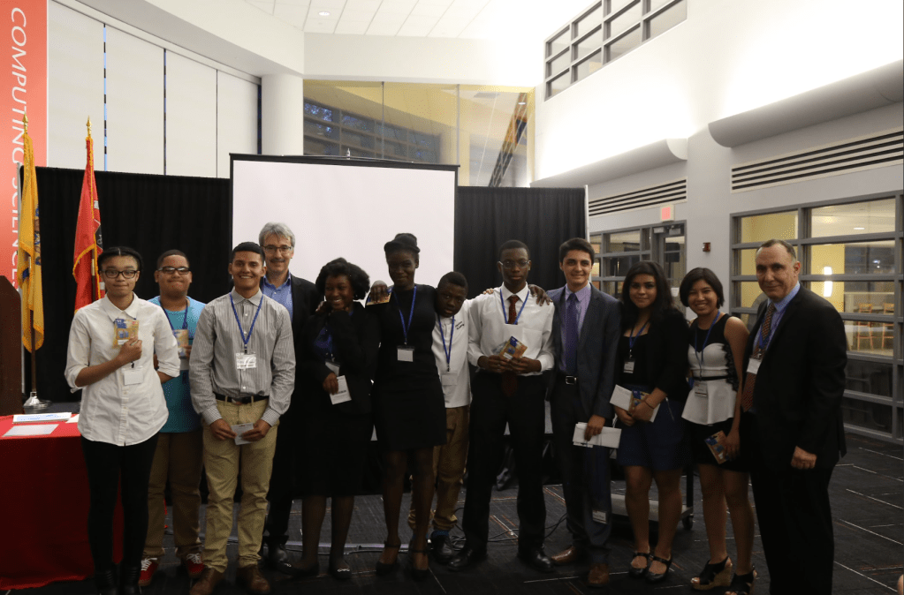

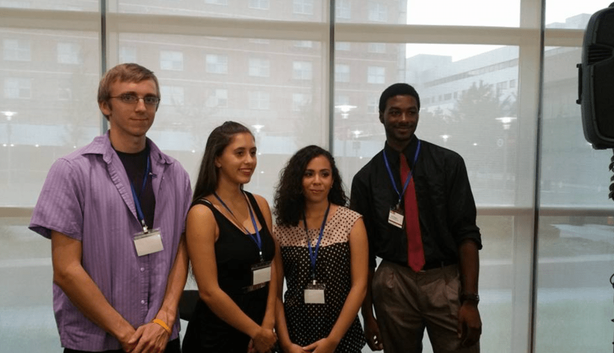

## Benefits

#### Being a coach to students can be incredibly rewarding and impactful. Here are some benefits:

#### Personal Growth

Helping students navigate challenges fosters personal growth, while their unique perspectives offer valuable insights and broaden your understanding.

#### Making a Difference

You can positively impact students’ lives by helping them achieve their goals, contributing to society by empowering the next generation.

#### Lasting Effect

You’ll form strong, lasting relationships built on trust and respect, with the potential to inspire students to become mentors themselves, creating a ripple effect of positive influence.

#### Leadership

Guiding others hones leadership qualities like communication, empathy, and problem-solving, while bringing a deep sense of fulfillment as students succeed under your guidance.

#### Staying Current

Staying engaged with new ideas and developments in your field, you can also foster a positive learning environment where students feel encouraged to explore their potential.

### Become a Coach!

#### Fill out our application through the button below.

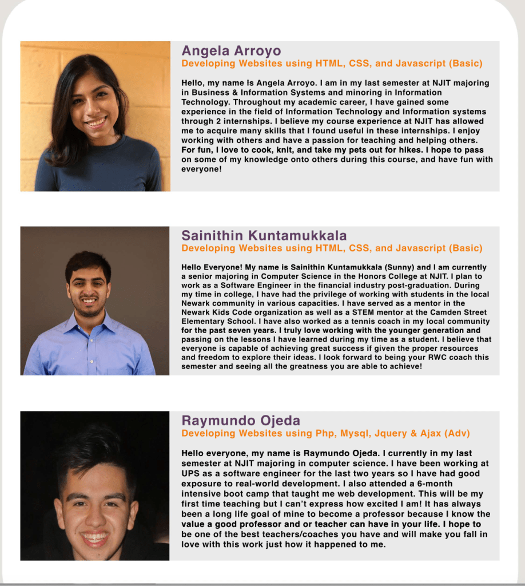

#### Coaches And Experiences

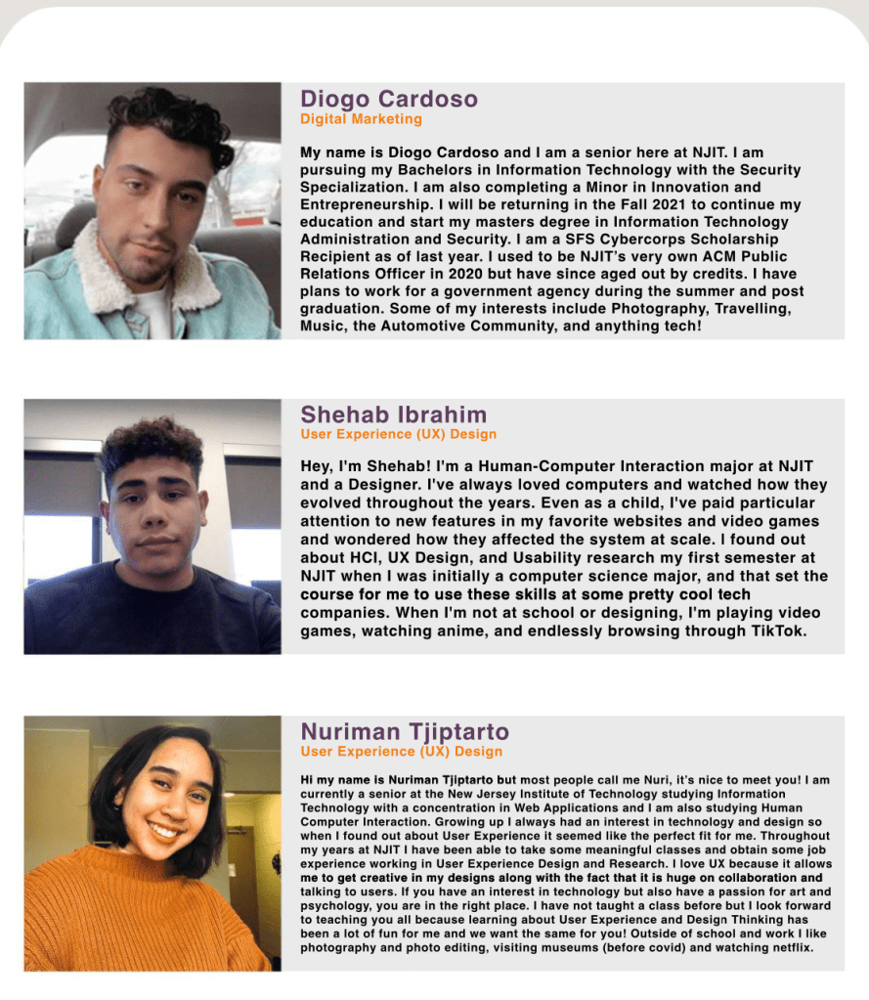

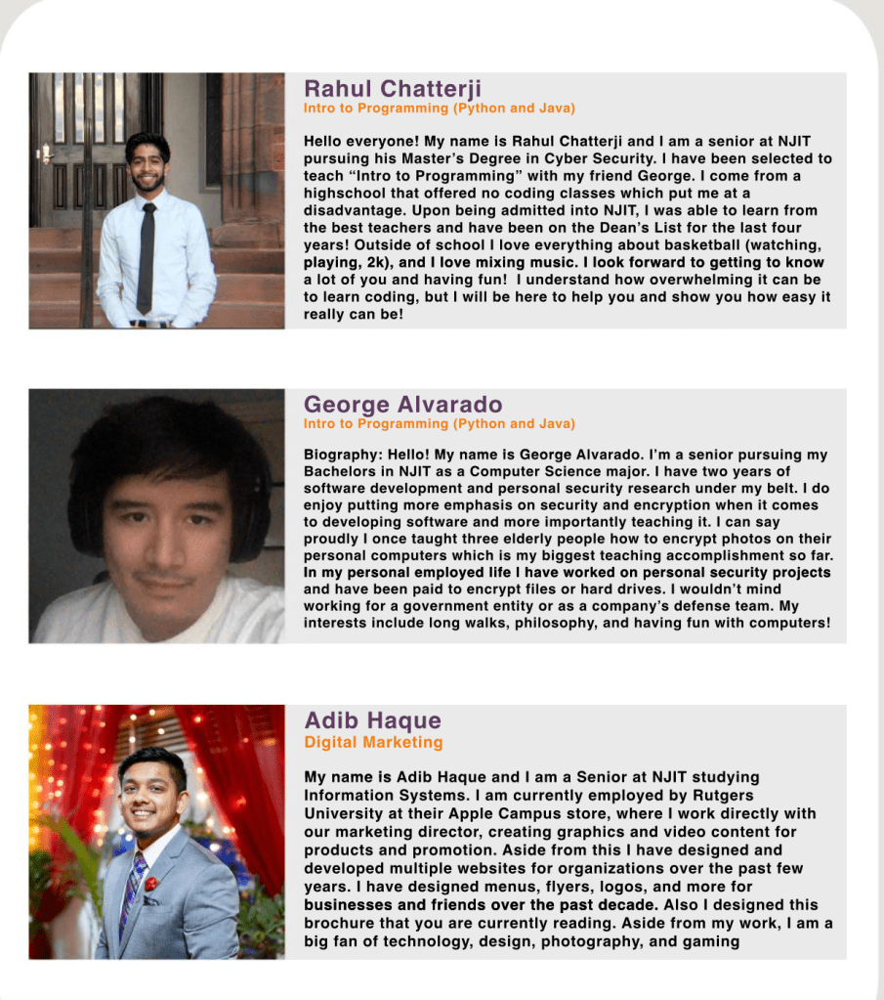

### Forms

**Action:** https://real-world-connections.com/about-2/ (get)

| Field | Type | Required |
|---|---|---|
| comment | textarea | No |
| email | text | No |
| author | text | No |
| url | text | No |

**Action:** ref: <Node> (post)

| Field | Type | Required |
|---|---|---|
| email | email | No |

**Action:** https://real-world-connections.com/about-2/ (get)

| Field | Type | Required |
|---|---|---|
| jetpack-instant-search__box-input-1 | search | No |

### Embedded Content

- **Iframe:** `https://www.youtube.com/embed/id0qmIOcklo?version=3&rel=1&showsearch=0&showinfo=1&iv_load_policy=1&fs=1&hl=en&autohide=2&wmode=transparent`

### Call-to-Action Links

- **Apply Now** -> https://fs7.formsite.com/eljabiri2/afh8mljzw7/index

---

## Page: For Partnerships (/for-partnerships/)

### For Partnerships

**Screenshot:** `screenshots/for-partnerships.png`

## Partners/Community

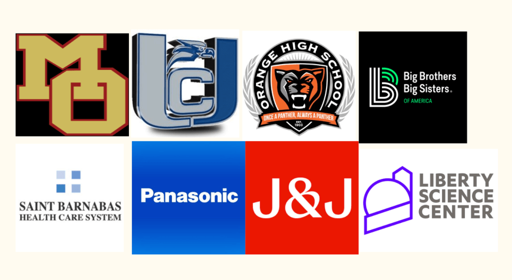

Partnership Opportunities

- Enroll your school in RWC.

- Invite RWC to visit your company.

- Join RWC parents’ support board.

- Join the RWC alumni board.

- Help us as a judge.

- Become an RWC coach.

- Propose an industry or community project to an RWC team.

### Impact On Community And Industry

- Industry Partnerships

Enables students to engage in practical projects, build skills, and foster innovation through strong industry ties.
- Non-profit Partnerships

Contributes to community development with initiatives in sustainability, healthcare, and education.
- Government Partnerships

Supports public policy, research, and technology for societal progress.
- Community Impact

Benefits local businesses and residents through outreach and workforce programs.
- Industry Impact

Aligns academic programs with industry needs, advancing innovation and supporting economic growth.

Enables students to engage in practical projects, build skills, and foster innovation through strong industry ties.

Contributes to community development with initiatives in sustainability, healthcare, and education.

Supports public policy, research, and technology for societal progress.

Benefits local businesses and residents through outreach and workforce programs.

Aligns academic programs with industry needs, advancing innovation and supporting economic growth.

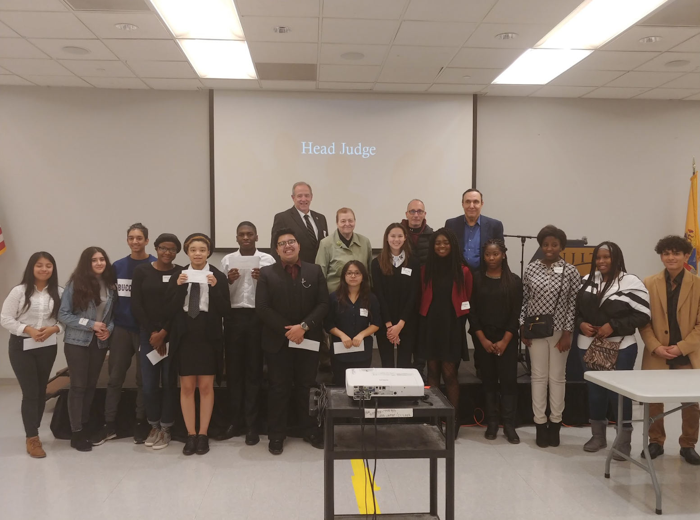

## Current Partners

### Mount Olive

### Big Brother Big Sister

### Union City

### Panasonic

### Orange

### Johnson And Johnson

## How To Apply

To apply to become a Partner/Community Leader,
contact Osama Eljabiri.

Go to the Contact Us page for more information.

### Forms

**Action:** https://real-world-connections.com/for-partnerships/ (get)

| Field | Type | Required |
|---|---|---|
| comment | textarea | No |
| email | text | No |
| author | text | No |
| url | text | No |

**Action:** ref: <Node> (post)

| Field | Type | Required |
|---|---|---|
| email | email | No |

**Action:** https://real-world-connections.com/for-partnerships/ (get)

| Field | Type | Required |
|---|---|---|
| jetpack-instant-search__box-input-1 | search | No |

---

## Page: News Events (/news-events/)

### News & Events

**Screenshot:** `screenshots/news-events.png`

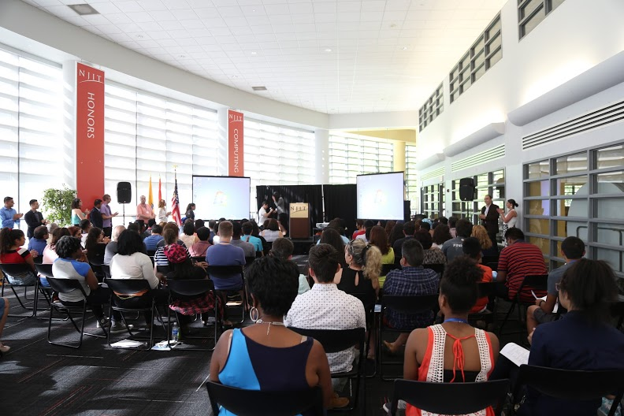

## Registration for Summer RWC is now open!

Join us and many other students over the summer to learn more about STEM!
Programs Offered:

- May~June Virtual RWC Program
- July~August Hybrid RWC Program

## Registration for Fall RWC will open soon!

Include RWC in your schedule this Fall Semester!

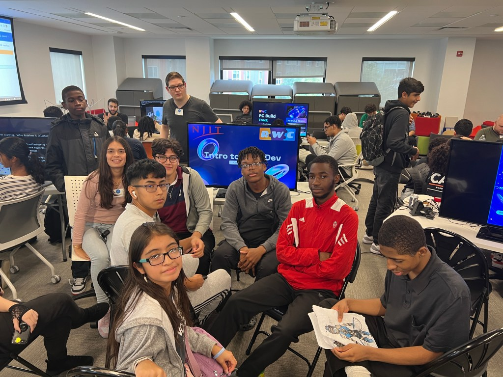

Saturday, April 27, 2024

11:00am – 7:00pm

Capstone & RWC Showcase

Saturday, May 4, 2024

11:00am – 3:00pm

RWC Main Program (Virtual)

### May-June Virtual Program

Saturday, May 18, 2024

11:00pm – 4:00pm

Track/Workshops

Sunday, May 19, 2024

1:00pm – 4:00pm

Project-Based Learning

Saturday, May 25, 2024

11:00pm – 4:00pm

Track/Workshops

Sunday, May 26, 2024

1:00pm – 4:00pm

Project-Based Learning

Saturday, June 1, 2024

11:00pm – 4:00pm

Track/Workshops

Sunday, June 2, 2024

1:00pm – 4:00pm

Project-Based Learning

Saturday, June 8, 2024

11:00pm – 4:00pm

Track/Workshops

Sunday, June 9, 2024

1:00pm – 5:00pm

Project-Based Learning

Saturday, June 15, 2024

11:00pm – 4:00pm

Track/Workshops

Sunday, June 16, 2024

1:00pm – 5:00pm

Project-Based Learning

Saturday, June 22, 2024

11:00pm – 4:00pm

Track/Workshops

Sunday, June 23, 2024

1:00pm – 5:00pm

Project-Based Learning

Thursday, June 27, 2024

5:00pm – 9:00pm

Final Presentations

## July-August Hybrid Program

Saturday, June 29, 2024

10:00pm – 4:00pm

Open House (Virtual)

Friday, July 12, 2024

9:00am – 1:00pm

First Day (Face-to-Face)

Saturday, July 13, 2024

10:00am – 2:00pm

Main Program (Virtual)

Friday, July 19, 2024

9:00am – 1:00pm

Main Program (Face-to-Face)

Saturday, July 20, 2024

10:00am – 2:00pm

Main Program (Virtual)

Friday, July 26, 2024

9:00am – 1:00pm

Main Program (Face-to-Face)

Saturday, July 27, 2024

10:00am – 2:00pm

Main Program (Virtual)

Friday, August 2, 2024

9:00am – 1:00pm

Main Program (Face-to-Face)

Saturday, August 3, 2024

10:00am – 2:00pm

Main Program (Virtual)

Monday, August 5, 2024

10:00am – 4:00pm

Main Program (Face-to-Face)

Tuesday, August 6, 2024

10:00am – 2:00pm

Main Program (Virtual)

Wednesday, August 7, 2024

10:00am – 4:00pm

Main Program (Face-to-Face)

Thursday, June 27, 2024

10:00am – 2:00pm

Main Program (Virtual)

### Forms

**Action:** https://real-world-connections.com/news-events/ (get)

| Field | Type | Required |
|---|---|---|
| comment | textarea | No |
| email | text | No |
| author | text | No |
| url | text | No |

**Action:** ref: <Node> (post)

| Field | Type | Required |
|---|---|---|
| email | email | No |

**Action:** https://real-world-connections.com/news-events/ (get)

| Field | Type | Required |
|---|---|---|
| jetpack-instant-search__box-input-1 | search | No |

### Call-to-Action Links

- **Register Now!** -> https://fs17.formsite.com/Rk0JZN/rlwgrjvlzm/index

---

## Page: Activities (/Activities/)

### Activities

**Screenshot:** `screenshots/activities.png`

Our unique program not only offers middle and high school students the opportunity to be involved in a hands-on educational experience, but also provides various activities to foster bonding outside of the working environment. This includes video games, board games, pool, and trips to places such as Six Flags Great Adventure, all of which are excellent team-building activities.

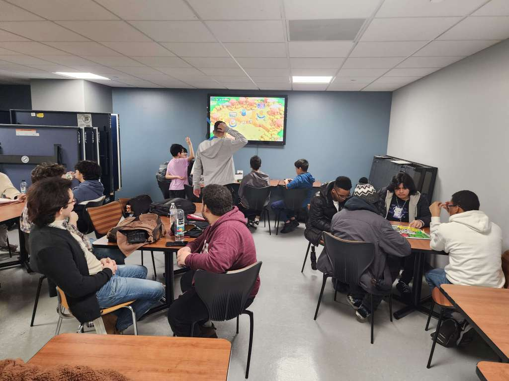

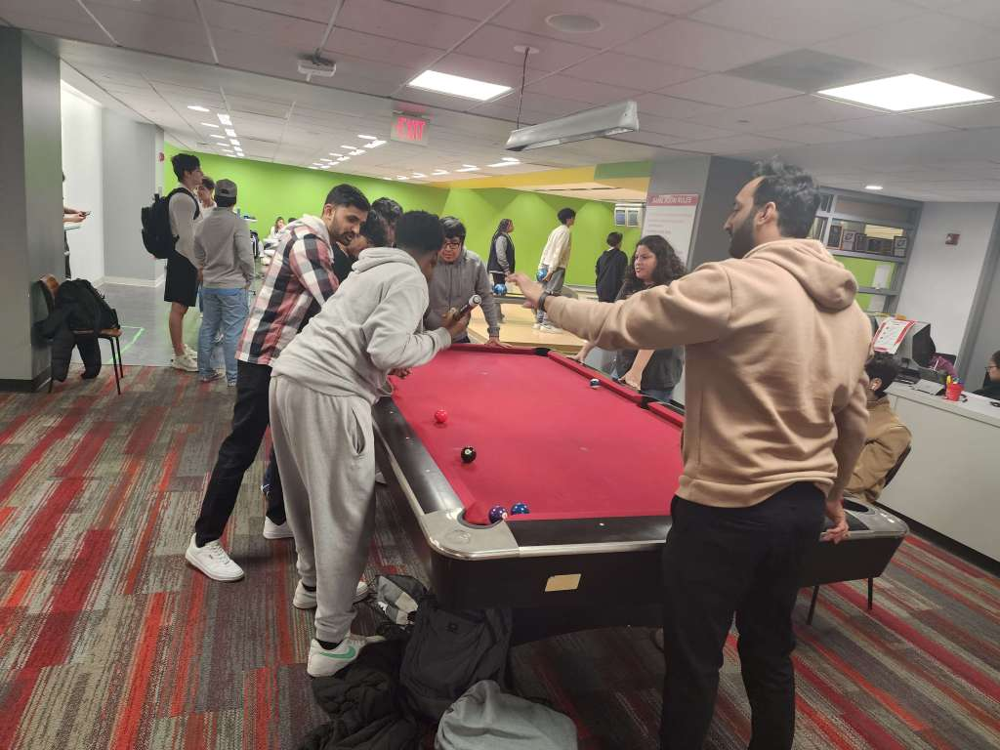

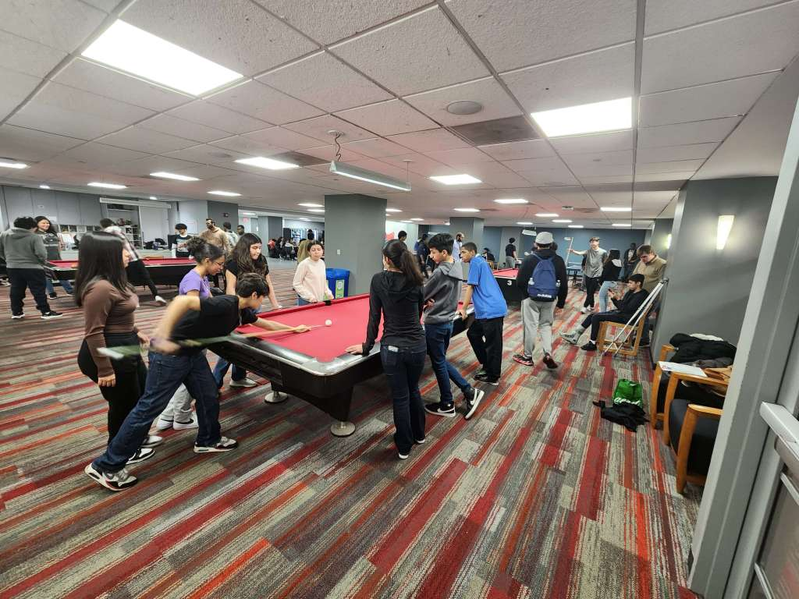

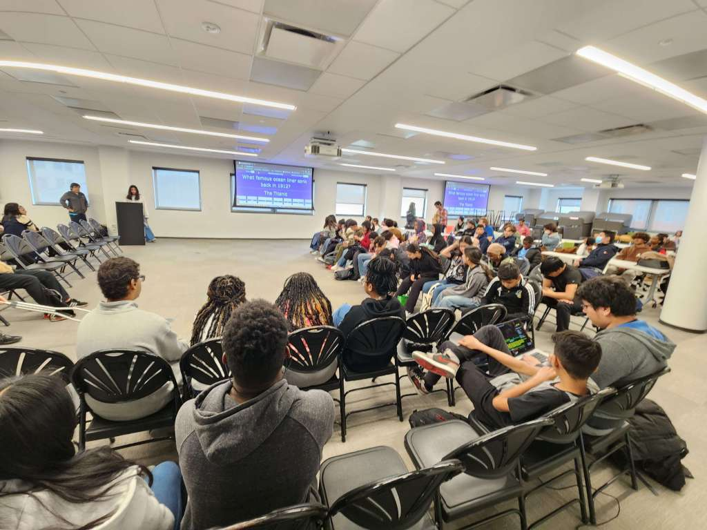

### Forms

**Action:** https://real-world-connections.com/Activities/ (get)

| Field | Type | Required |
|---|---|---|
| comment | textarea | No |
| email | text | No |
| author | text | No |
| url | text | No |

**Action:** ref: <Node> (post)

| Field | Type | Required |
|---|---|---|
| email | email | No |

**Action:** https://real-world-connections.com/Activities/ (get)

| Field | Type | Required |
|---|---|---|
| jetpack-instant-search__box-input-1 | search | No |

---

## Page: Gallery (/gallery-page-description-and-grid/)

### Gallery

**Screenshot:** `screenshots/gallery.png`

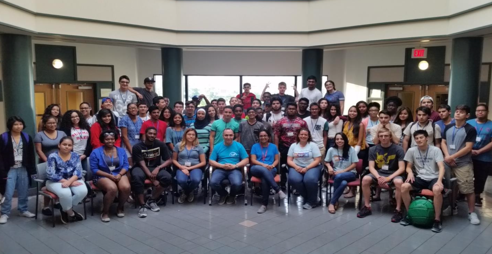

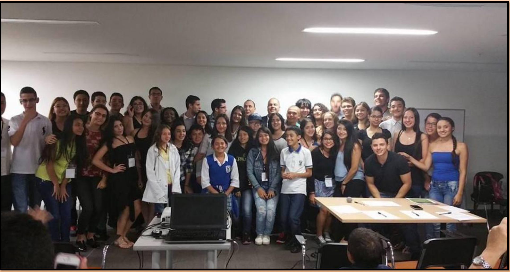

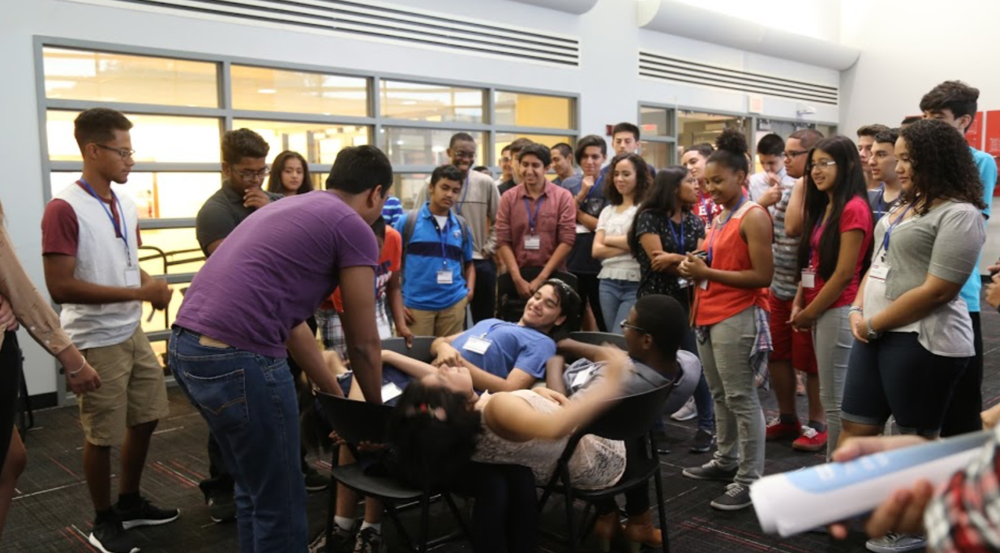

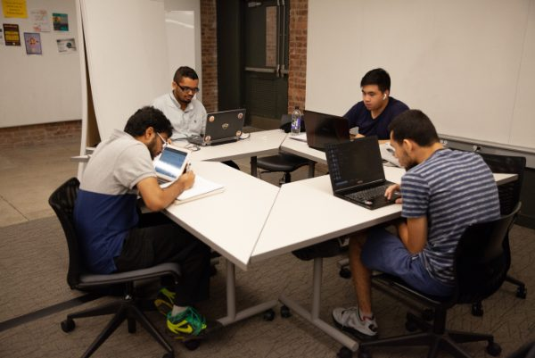

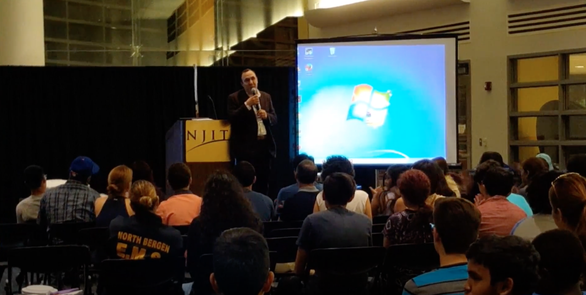

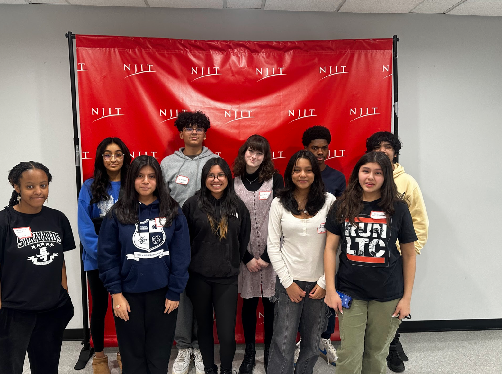

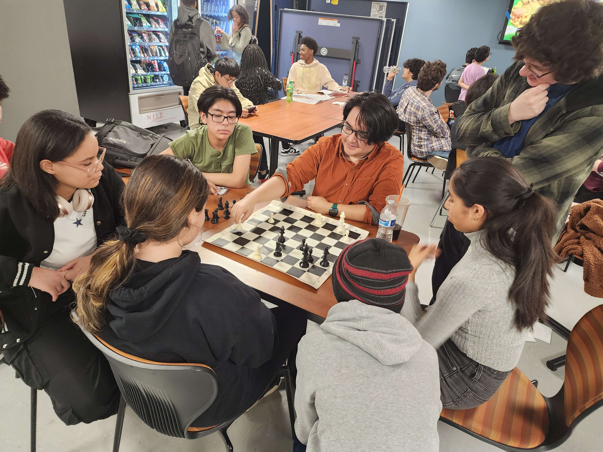

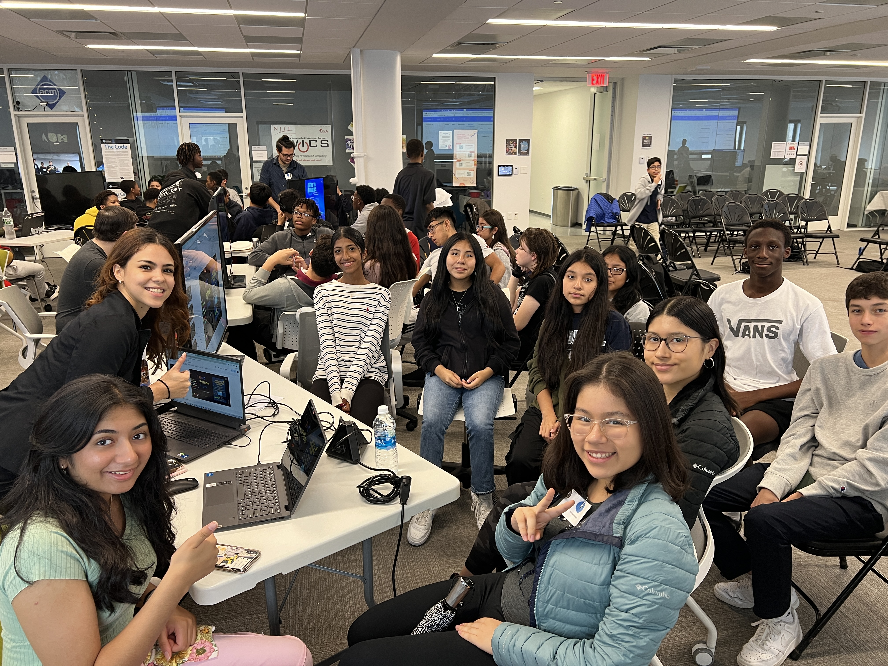

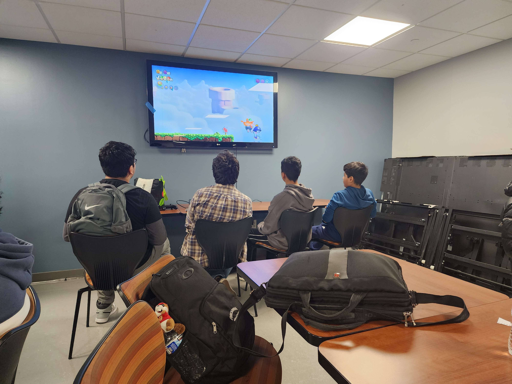

### Forms

**Action:** https://real-world-connections.com/gallery-page-description-and-grid/ (get)

| Field | Type | Required |
|---|---|---|
| comment | textarea | No |
| email | text | No |
| author | text | No |
| url | text | No |

**Action:** ref: <Node> (post)

| Field | Type | Required |
|---|---|---|
| email | email | No |

**Action:** https://real-world-connections.com/gallery-page-description-and-grid/ (get)

| Field | Type | Required |
|---|---|---|
| jetpack-instant-search__box-input-1 | search | No |

---

## Page: Faq (/faq/)

### FAQ

**Screenshot:** `screenshots/faq.png`

### General

### Coaches

### Partnership Opportunities

### Forms

**Action:** ref: <Node> (post)

| Field | Type | Required |
|---|---|---|
| email | email | No |

**Action:** https://real-world-connections.com/faq/ (get)

| Field | Type | Required |
|---|---|---|
| jetpack-instant-search__box-input-1 | search | No |

---

## Page: Contacts (/contacts/)

### Contact Us

**Screenshot:** `screenshots/contacts.png`

Thank you for your interest in RWC! Whether you’re a potential participant, partner organization, or simply curious about our initiatives, we’re excited to hear from you.

Please use the form below to reach out to us with any questions, feedback, or collaboration opportunities. Our team is dedicated to responding promptly to all inquiries.

← Back

#### Thank you for your response.

Δ
document.getElementById( "ak_js_1" ).setAttribute( "value", ( new Date() ).getTime() );

Osama Eljabiri, PhD
Senior University Lecturer/ Director of CCS Capstone Program
Osama.eljabiri@njit.edu

College of Computing Sciences University Heights
Newark, NJ 07102

### Forms

**Action:** ref: <Node> (post)

| Field | Type | Required |
|---|---|---|
| g547-firstname | text | Yes |
| g547-lastname | text | Yes |
| g547-email | email | Yes |
| g547-message | textarea | No |
| ak_hp_textarea | textarea | No |

**Action:** https://real-world-connections.com/contacts/ (get)

| Field | Type | Required |
|---|---|---|
| comment | textarea | No |
| email | text | No |
| author | text | No |
| url | text | No |

**Action:** ref: <Node> (post)

| Field | Type | Required |
|---|---|---|
| email | email | No |

**Action:** https://real-world-connections.com/contacts/ (get)

| Field | Type | Required |
|---|---|---|
| jetpack-instant-search__box-input-1 | search | No |

---

## Downloaded Images Inventory

All images saved to `real-world-connections/images/`

| File | Alt Text | Source Page | Size |
|---|---|---|---|
| home-rwc-us.png | RWC-US | Home | 196.0K |
| home-rwcus.jpg | - | Home | 181.9K |
| home-image-1.png | - | Home | 63.0K |
| home-14252654-1701329e74a443ae8b38855d54f4d9a8-png.jpeg | - | Home | 33.2K |
| home-bbbs-logo-onblack-2.jpeg | - | Home | 39.5K |
| home-1655289-524d9334be764bf89704a93e960b53c0.jpg | - | Home | 69.3K |
| home-9tzk-iah-400x400.jpg | - | Home | 10.0K |
| home-orangehs-crest.webp | - | Home | 38.5K |
| home-images.png | - | Home | 3.3K |
| home-cropped-scr-20241120-qbbq.png | - | Home | 1.4K |
| home-img10.gif | - | Home | 50B |
| about-image-3.png | - | About | 140.8K |
| about-screenshot-2024-02-17-at-12-16-13-pm.png | - | About | 331.3K |
| about-screenshot-2024-02-17-at-12-02-57-pm.png | - | About | 811.7K |
| about-screenshot-2024-02-20-at-7-25-32-pm-2.png | - | About | 1.2M |
| about-screenshot-2024-02-17-at-12-33-02-pm.png | - | About | 603.3K |
| about-img16.gif | - | About | 50B |
| for-students-screenshot-2024-02-20-at-10-14-12-pm.png | - | For Students | 1.8M |
| for-students-2210153.png | - | For Students | 10.6K |
| for-students-remove-png-background-1.png | - | For Students | 15.2K |
| for-students-5272236.png | - | For Students | 5.8K |
| for-students-remove-png-background-3.png | - | For Students | 12.3K |
| for-students-remove-png-background-4.png | - | For Students | 4.7K |
| for-students-8460433.png | - | For Students | 14.6K |
| for-students-5738031.png | - | For Students | 9.2K |
| for-students-2503508.png | - | For Students | 6.0K |
| for-students-remove-png-background-2.png | - | For Students | 84.0K |
| for-students-img27.gif | - | For Students | 50B |
| for-parents-screenshot-2024-03-29-at-1-31-33-pm.png | - | For Parents | 289.2K |
| for-parents-image-4.png | - | For Parents | 88.3K |
| for-parents-screenshot-2024-02-20-at-7-25-32-pm-2.png | - | For Parents | 310.5K |
| for-parents-img31.gif | - | For Parents | 50B |
| for-schools-img-1528-1-1.jpg | - | For Schools | 245.1K |
| for-schools-img-1501.jpg | - | For Schools | 172.1K |
| for-schools-img34.gif | - | For Schools | 50B |
| about-2-screenshot-2024-02-29-at-11-51-25-am.png | - | About 2 | 276.5K |
| about-2-screenshot-2024-02-29-at-11-49-40-am.png | - | About 2 | 265.4K |
| about-2-screenshot-2024-02-29-at-11-49-15-am.png | - | About 2 | 260.1K |
| about-2-screenshot-2024-02-29-at-1-45-39-pm.png | - | About 2 | 204.2K |
| about-2-screenshot-2024-02-29-at-1-48-11-pm.png | - | About 2 | 231.7K |
| about-2-screenshot-2024-02-29-at-1-49-20-pm.png | - | About 2 | 234.0K |
| about-2-img41.gif | - | About 2 | 50B |
| for-partnerships-screenshot-2024-03-09-at-1-48-13-pm.png | - | For Partnerships | 75.5K |
| for-partnerships-screenshot-2024-03-09-at-2-06-24-pm.png | - | For Partnerships | 1.4M |
| for-partnerships-img44.gif | - | For Partnerships | 50B |
| news-events-img-7246.jpg | - | News Events | 104.2K |
| news-events-img-1537-1.jpg | - | News Events | 206.9K |
| news-events-img47.gif | - | News Events | 50B |
| activities-games-2.jpg | - | Activities | 72.1K |
| activities-game2-5.jpg | - | Activities | 62.0K |
| activities-video-game-controller-icon-svg.png | - | Activities | 13.9K |
| activities-pool2.jpg | - | Activities | 79.4K |
| activities-4295446.png | - | Activities | 15.7K |
| activities-pool3-1.jpg | - | Activities | 110.1K |
| activities-chess-1.jpg | - | Activities | 97.8K |
| activities-etc1-1.jpg | - | Activities | 86.9K |
| activities-screenshot-2024-04-26-at-4-03-33e280afpm.png | - | Activities | 132.7K |
| activities-img57.gif | - | Activities | 50B |
| gallery-screenshot-2024-02-20-at-10-14-12-pm-2.png | - | Gallery | 1.8M |
| gallery-screenshot-2024-02-20-at-7-32-32-pm-2.png | - | Gallery | 1.8M |
| gallery-screenshot-2024-02-17-at-11-54-22-am.png | - | Gallery | 1.6M |
| gallery-screenshot-2024-02-29-at-11-46-23-am.png | - | Gallery | 2.0M |
| gallery-screenshot-2024-02-29-at-11-51-25-am.png | - | Gallery | 1.8M |
| gallery-classroom-tutoring-ckb-600x401-1.jpg | - | Gallery | 36.7K |
| gallery-screenshot-2024-02-20-at-10-09-51-pm.png | - | Gallery | 1.4M |
| gallery-screenshot-2024-04-22-at-6-03-38-pm.png | - | Gallery | 2.4M |
| gallery-chess-1.jpg | - | Gallery | 1.0M |
| gallery-img-1528-1.jpg | - | Gallery | 3.3M |
| gallery-game2-3.jpg | - | Gallery | 652.8K |
| gallery-img69.gif | - | Gallery | 50B |
| faq-img70.gif | - | Faq | 50B |
| contacts-2728.svg | ✨ | Contacts | 1.0K |
| contacts-img72.gif | - | Contacts | 50B |

## Screenshots Inventory

All screenshots saved to `real-world-connections/screenshots/`

| File | Page |
|---|---|
| home.png | Home |
| about.png | About |
| for-students.png | For Students |
| for-parents.png | For Parents |
| for-schools.png | For Schools |
| about-2.png | About 2 |
| for-partnerships.png | For Partnerships |
| news-events.png | News Events |
| activities.png | Activities |
| gallery.png | Gallery |
| faq.png | Faq |
| contacts.png | Contacts |

