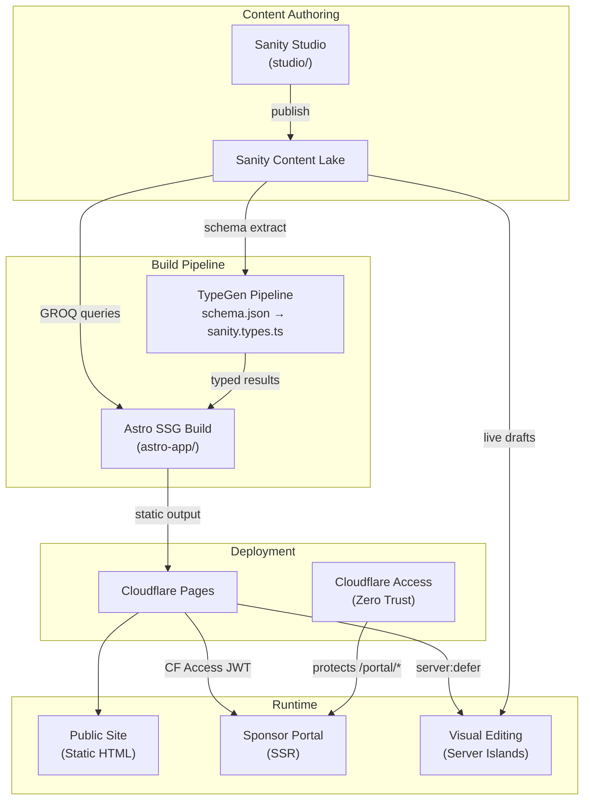
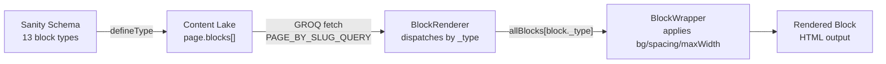
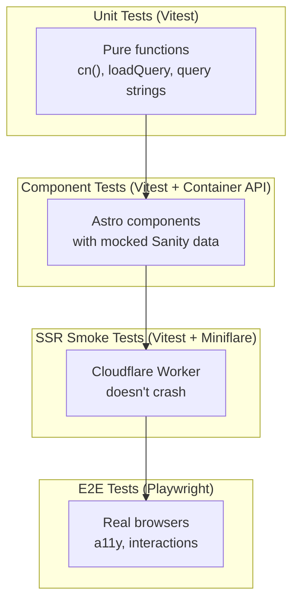

# Architecture

This document describes the architecture of the YWCC Industry Capstone website (v1.7.0), an Astro + Sanity monorepo that produces a statically generated marketing site with an authenticated sponsor portal.

## System Overview

The system consists of two workspaces in an npm monorepo: an Astro 5 frontend (`astro-app/`) and a Sanity Studio v5 CMS (`studio/`). Content authors manage pages and blocks in Sanity Studio; the Astro frontend fetches that content via GROQ queries at build time and produces static HTML deployed to Cloudflare Pages.



## Technology Stack

| Category | Technology | Version | Purpose |
|----------|-----------|---------|---------|
| Framework | Astro | 5.17 | Static site generation with selective SSR |
| CMS | Sanity | 5.10 | Headless content management |
| Styling | Tailwind CSS | 4.1 | CSS-first utility framework |
| UI Runtime | React | 19.2 | Client islands (portal components, visual editing) |
| Build Tool | Vite | 7.3 | Bundler and dev server |
| Language | TypeScript | 5.9 | Type safety across both workspaces |
| Hosting | Cloudflare Pages | -- | Static + edge SSR hosting |
| Auth | Cloudflare Access | -- | Zero Trust JWT-based portal auth |
| JWT | jose | 6.1 | Server-side JWT validation |
| Image | @sanity/image-url | 1.2 | CDN image URL builder |
| Testing | Vitest + Playwright | 3.2 / 1.58 | Unit/component + E2E testing |
| Component Dev | Storybook | 10.2 | Isolated component development |
| CI/CD | GitHub Actions | -- | 7 workflows for CI, release, deploy |

## Architecture Patterns

### Page Builder Lifecycle

The core architecture pattern is a **page builder** where content authors compose pages from reusable blocks in Sanity Studio. The lifecycle flows through four stages:



1. **Schema definition** -- Each block type is defined in `studio/src/schemaTypes/blocks/` using `defineType`. All blocks share `blockBaseFields` (backgroundVariant, spacing, maxWidth).
2. **GROQ query** -- `PAGE_BY_SLUG_QUERY` in `astro-app/src/lib/sanity.ts` fetches a page by slug with type-conditional projections for each block type, returning only the fields each block needs.
3. **Block dispatch** -- `BlockRenderer.astro` iterates over the `blocks[]` array, looks up each block's `_type` in the `allBlocks` registry, and renders the matching component.
4. **Block wrapper** -- `BlockWrapper.astro` wraps each block with background variant, spacing, and max-width CSS classes based on the shared fields.

### Block Registry

The block registry (`astro-app/src/components/block-registry.ts`) uses `import.meta.glob` to auto-discover blocks from two directories:

- **Custom blocks** (`blocks/custom/*.astro`) -- 13 Sanity-mapped blocks (HeroBanner, FeatureGrid, CtaBanner, StatsRow, TextWithImage, LogoCloud, SponsorSteps, RichText, FaqSection, ContactForm, SponsorCards, Testimonials, EventList). PascalCase filenames map to camelCase `_type` values.
- **UI blocks** (`blocks/*.astro`) -- Generic UI blocks from the fulldev/ui library. Kebab-case filenames used directly as `_type` values (e.g., `hero-1`, `features-3`).

### Template System

Pages in Sanity have a `template` field that selects one of five layout templates:

| Template | File | Behavior |
|----------|------|----------|
| `default` | `DefaultTemplate.astro` | Standard content width |
| `fullWidth` | `FullWidthTemplate.astro` | Edge-to-edge content |
| `landing` | `LandingTemplate.astro` | No navigation header |
| `sidebar` | `SidebarTemplate.astro` | Content + sidebar layout |
| `twoColumn` | `TwoColumnTemplate.astro` | Two-column grid |

The `[...slug].astro` catch-all page reads the template field from the fetched page data and renders the corresponding template component around `BlockRenderer`.

## Data Architecture

### Sanity Content Model

The schema defines 27 types organized in three categories:

**Documents (6):** `page`, `siteSettings` (singleton), `sponsor`, `project`, `testimonial`, `event`

**Objects (8):** `seo`, `button`, `link`, `portableText`, `faqItem`, `featureItem`, `statItem`, `stepItem`

**Blocks (13):** `heroBanner`, `featureGrid`, `ctaBanner`, `statsRow`, `textWithImage`, `logoCloud`, `sponsorSteps`, `richText`, `faqSection`, `contactForm`, `sponsorCards`, `testimonials`, `eventList`

Schema files live in `studio/src/schemaTypes/` and are registered in the `index.ts` barrel export.

### GROQ Query Patterns

All queries use `defineQuery` from the `groq` package for TypeGen compatibility. The project defines 13 queries in `astro-app/src/lib/sanity.ts`:

| Query | Purpose |
|-------|---------|
| `SITE_SETTINGS_QUERY` | Singleton site settings (nav, footer, social) |
| `PAGE_BY_SLUG_QUERY` | Full page with blocks and type-conditional projections |
| `ALL_PAGE_SLUGS_QUERY` | Slug list for `getStaticPaths` |
| `ALL_SPONSORS_QUERY` | All sponsors for build-time cache |
| `SPONSOR_BY_SLUG_QUERY` | Single sponsor detail with reverse-referenced projects |
| `ALL_SPONSOR_SLUGS_QUERY` | Sponsor slug list for static paths |
| `ALL_PROJECTS_QUERY` | All projects with resolved sponsor references |
| `PROJECT_BY_SLUG_QUERY` | Single project detail with linked testimonials |
| `ALL_PROJECT_SLUGS_QUERY` | Project slug list for static paths |
| `ALL_TESTIMONIALS_QUERY` | All testimonials for build-time cache |
| `ALL_EVENTS_QUERY` | All events for build-time cache |
| `ALL_EVENT_SLUGS_QUERY` | Event slug list for static paths |
| `EVENT_BY_SLUG_QUERY` | Single event detail |

### Module-Level Caching

The `sanity.ts` module implements build-time memoization for shared data. Each collection (settings, sponsors, projects, testimonials, events) has a module-scoped cache variable. The first call fetches from the Content Lake; subsequent calls return the cached result. Caching is bypassed when visual editing is enabled to ensure fresh draft data.

```
let _sponsorsCache: ALL_SPONSORS_QUERY_RESULT | null = null;

export async function getAllSponsors() {
  if (!visualEditingEnabled && _sponsorsCache) return _sponsorsCache;
  const result = await loadQuery({ query: ALL_SPONSORS_QUERY });
  _sponsorsCache = result ?? [];
  return _sponsorsCache;
}
```

Pages also use `prefetchPages()` during `getStaticPaths` to batch-fetch all page data in parallel with configurable concurrency (default 6).

### TypeGen Pipeline

Type generation keeps GROQ query results type-safe:

1. `sanity schema extract --path=schema.json` -- Extracts the schema from Studio into JSON.
2. `sanity typegen generate` -- Generates `sanity.types.ts` (1,387 lines) from the schema and all `defineQuery` calls.
3. `astro-app/src/lib/types.ts` -- Re-exports and refines generated types (e.g., `PageBlock = Extract<...>`).

Run the full pipeline with `npm run typegen` from the repo root.

## Component Architecture

### Component Hierarchy

```
Layout.astro (HTML shell, head, GTM, CSP)
├── Header.astro (navigation from siteSettings)
├── <slot> (page content)
│   ├── TemplateComponent (one of 5 templates)
│   │   └── BlockRenderer.astro
│   │       └── BlockWrapper.astro
│   │           └── Block Component (custom or UI)
│   └── SanityPageContent.astro (server island, VE mode)
└── Footer.astro (footer from siteSettings)
```

### Block Components

- **13 custom blocks** in `blocks/custom/` -- Map directly to Sanity schema block types. Receive typed props from GROQ query results. Some blocks (logoCloud, sponsorCards, testimonials, eventList) receive additional resolved data via `resolveBlock*` helper functions.
- **101 generic UI blocks** in `blocks/` -- Pre-built presentational components from the fulldev/ui library. Available in the block registry but not mapped to Sanity schema types.

### UI Primitives

The project uses **shadcn-astro** UI primitives organized in `astro-app/src/components/ui/`. These provide accessible, composable building blocks (buttons, cards, dialogs, etc.) styled with Tailwind CSS and `class-variance-authority` for variants.

### Portal Components

Five React components in `astro-app/src/components/portal/` power the sponsor portal:
- `PortalCard.tsx` -- Dashboard card with icon, title, description, and disabled state
- `PortalIcon.tsx` -- Icon renderer for portal cards
- `PortalSkeleton.tsx` -- Loading skeleton for portal content
- `types.ts` -- Shared TypeScript types for portal components

These are React components because the portal uses SSR (`prerender = false`) and benefits from React's component model for interactive UI.

## Rendering Strategy

### Static Site Generation (Default)

The site uses `output: "static"` in `astro.config.mjs`. All public pages are pre-rendered at build time:
- `index.astro` -- Homepage
- `[...slug].astro` -- Dynamic pages from Sanity (uses `getStaticPaths`)
- `sponsors/index.astro`, `sponsors/[slug].astro` -- Sponsor listing and detail
- `projects/index.astro`, `projects/[slug].astro` -- Project listing and detail
- `events/[slug].astro` -- Event detail pages

### Server-Side Rendering (Portal)

The portal route (`pages/portal/index.astro`) sets `export const prerender = false` to enable SSR. This route runs through Cloudflare Pages Functions, and the Astro middleware validates the Cloudflare Access JWT before rendering.

### Server Islands (Visual Editing)

When `PUBLIC_SANITY_VISUAL_EDITING_ENABLED` is `"true"`, pages use the `SanityPageContent` component with `server:defer`. This creates a Server Island pattern:
- The **page shell** (Layout, Header, Footer) is pre-rendered as static HTML.
- The **content area** is deferred to a server-side request that fetches fresh draft data from Sanity with stega encoding enabled.
- A pulse-animated fallback skeleton displays while the server island loads.
- `VisualEditingMPA` (React, `client:only="react"`) enables Sanity's presentation tool overlay.

### Client Islands

React components load as client islands only where interactivity is required:
- `VisualEditingMPA` -- `client:only="react"` for Sanity visual editing overlay
- Portal components render server-side in the SSR context (no client hydration directives)

## Authentication and Security

### Cloudflare Access (Zero Trust)

Portal routes (`/portal/*`) are protected by Cloudflare Access at the edge. Authenticated users receive a `Cf-Access-Jwt-Assertion` header containing a signed JWT.

### Middleware Validation

`astro-app/src/middleware.ts` implements defense-in-depth:
1. **Public routes** -- Requests not matching `/portal` pass through without auth checks.
2. **Local dev** -- In `DEV` mode, a mock user (`dev@localhost`) is injected.
3. **Production** -- `validateAccessJWT()` verifies the JWT using `jose`:
   - Fetches the JWKS from the Cloudflare Access certs endpoint.
   - Validates issuer (team domain) and audience claims.
   - Extracts the user's email from the payload.
4. **Fallback** -- Returns 401 if JWT validation fails (indicates misconfiguration).

Environment variables (`CF_ACCESS_TEAM_DOMAIN`, `CF_ACCESS_AUD`) are read from Cloudflare Workers runtime env first, then `process.env` as fallback.

### Content Security Policy

The Layout component sets a strict CSP via meta tag:
- `script-src`: self + inline + Google Tag Manager
- `img-src`: self + Sanity CDN + placeholder service + GTM
- `connect-src`: self + Google Analytics + GTM + Sanity API + WebSocket
- `frame-src`: self + GTM

## Design System

### Tailwind CSS 4 (CSS-First)

The project uses Tailwind CSS 4.1 with the CSS-first configuration approach. The global stylesheet (`astro-app/src/styles/global.css`) imports:
- `tailwindcss` -- Core framework
- `tw-animate-css` -- Animation utilities
- `shadcn/tailwind.css` -- shadcn design tokens

### Theme Tokens

The `@theme` block defines custom design tokens:

| Token Group | Values |
|-------------|--------|
| Fonts | Helvetica Neue (sans), Courier New (mono) |
| Swiss palette | swiss-red (#E30613), swiss-black, swiss-white, swiss-100 through swiss-900 |
| NJIT palette | njit-red (#D22630), njit-navy (#003366), njit-gold (#E89B32) |

Typography follows Swiss design principles: tight letter-spacing (-0.03em headings, -0.01em body), bold headings (700 weight), and tight line-height (1.05 headings).

### shadcn-astro Primitives

UI primitives use the shadcn-astro port with `class-variance-authority` for variant management and `tailwind-merge` via the `cn()` utility for safe class composition.

## Testing Architecture



### Four-Layer Testing Strategy

| Layer | Runner | Location | What It Tests |
|-------|--------|----------|---------------|
| Unit | Vitest | `astro-app/src/lib/__tests__/` | Pure functions (`cn`, `loadQuery`, query strings) |
| Component | Vitest + Container API | `astro-app/src/components/__tests__/` | Astro component rendering with mocked Sanity data |
| SSR Smoke | Vitest + Miniflare | `astro-app/src/cloudflare/__tests__/` | Cloudflare Worker boots without crashing |
| E2E | Playwright | `tests/e2e/` | Real browser interactions, accessibility, cross-browser |

### Test Configuration

**Vitest** (`astro-app/vitest.config.ts`):
- Uses `getViteConfig()` from `astro/config` to resolve Astro virtual modules.
- Mocks `sanity:client` via alias to `__mocks__/sanity-client.ts`.
- V8 coverage provider targeting `src/lib/` and `src/scripts/`.

**Playwright** (`playwright.config.ts`):
- 5 browser projects: Chromium, Firefox, WebKit, Mobile Chrome (Pixel 7), Mobile Safari (iPhone 14).
- Builds the site and starts Wrangler preview before running tests.
- Trace on first retry, screenshots on failure, video retained on failure.

### Visual Regression

153 Storybook stories serve as the visual regression baseline. Storybook deploys to GitHub Pages on pushes to `main`.

## Deployment Architecture

### Cloudflare Pages

The site deploys to Cloudflare Pages with the `@astrojs/cloudflare` adapter:
- **Worker name**: `ywcc-capstone`
- **Build output**: `astro-app/dist/`
- **Compatibility flags**: `nodejs_compat`, `disable_nodejs_process_v2`
- **Platform proxy**: Enabled for local dev with `wrangler pages dev`

### CI/CD Pipeline

Seven GitHub Actions workflows manage the development lifecycle:

| Workflow | Trigger | Purpose |
|----------|---------|---------|
| `ci.yml` | PR to `preview` | Unit tests + Lighthouse CI |
| `enforce-preview-branch.yml` | PR to `main` | Only `preview` branch can merge to `main` |
| `enforce-preview-source.yml` | PR to `preview` | Blocks PRs from `main` to `preview` |
| `release.yml` | Push to `main` | Semantic release (changelog, version, GitHub release) |
| `sync-preview.yml` | After Release completes | Merges `main` back into `preview` + Discord notification |
| `sanity-deploy.yml` | Repository dispatch | Rebuilds + deploys site when Sanity content publishes |
| `deploy-storybook.yml` | Push to `main` (src changes) | Builds and deploys Storybook to GitHub Pages |

### Branch Strategy

```
feature/* ──PR──> preview ──PR──> main
                     ^               │
                     └───auto-sync───┘
```

- **Feature branches** merge into `preview` via pull request (CI runs tests + Lighthouse).
- **Preview** merges into `main` via pull request (enforced by `enforce-preview-branch.yml`).
- **Main** triggers semantic release, then auto-syncs back to `preview` via `sync-preview.yml`.
- **Sanity content changes** trigger a rebuild and deploy via `sanity-deploy.yml` (repository dispatch).

## Key Design Decisions

### Static-first with selective SSR
The site defaults to static output for performance and cost. Only the portal (`/portal/*`) uses SSR because it requires per-request authentication. Visual editing uses Server Islands to keep the page shell static while dynamically rendering content.

### Module-level caching over per-request caching
Shared data (settings, sponsors, projects, testimonials, events) is cached at the module level during the Astro build. This avoids redundant API calls across pages without introducing a caching layer. The cache bypasses automatically when visual editing is enabled.

### Batch prefetching during getStaticPaths
`prefetchPages()` fetches all page data in parallel batches (concurrency of 6) during `getStaticPaths`. Individual `getPage()` calls then read from the populated cache, turning O(N) sequential fetches into batched parallel requests.

### Auto-discovered block registry
Using `import.meta.glob` to auto-discover blocks eliminates manual registry maintenance. Adding a new block only requires creating the component file in the correct directory.

### Type-safe content pipeline
The TypeGen pipeline ensures that GROQ query results flow through generated TypeScript types. Block types are extracted from the query result union using `Extract<PageBlock, { _type: 'heroBanner' }>`, providing compile-time safety from Sanity schema to Astro component props.

### Defense-in-depth authentication
Cloudflare Access enforces authentication at the edge. The Astro middleware re-validates the JWT server-side using jose, catching edge cases where Access might be misconfigured or bypassed.

### Single-Section detail page pattern
Detail pages (sponsors, projects, events) use a single `<Section>` with one `<SectionContent>` to avoid the doubled vertical padding bug caused by stacking multiple Section components.
