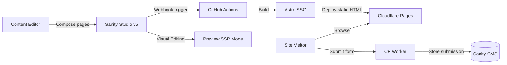
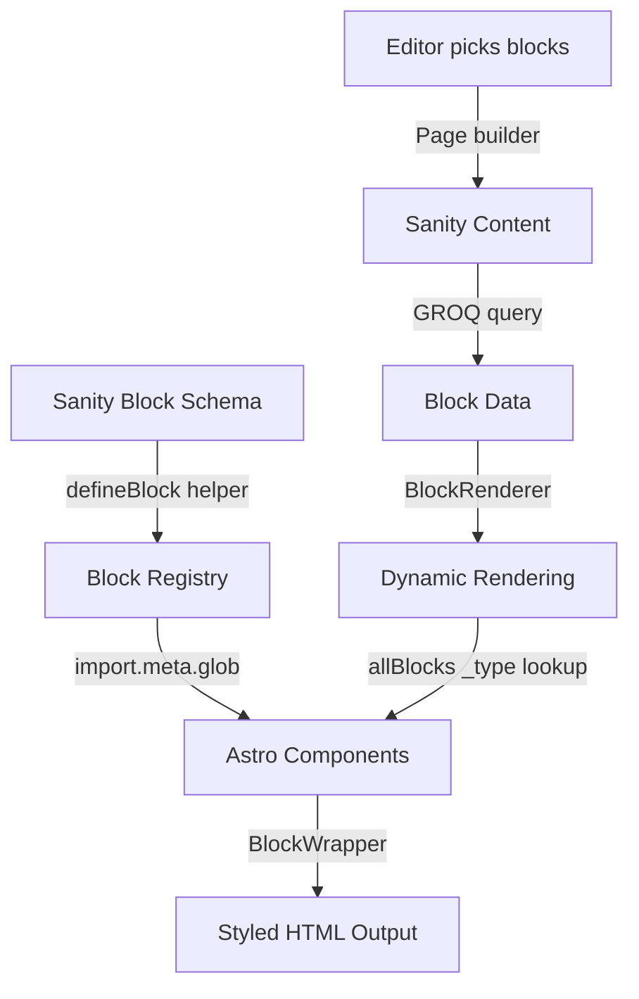
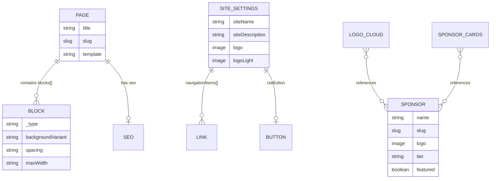
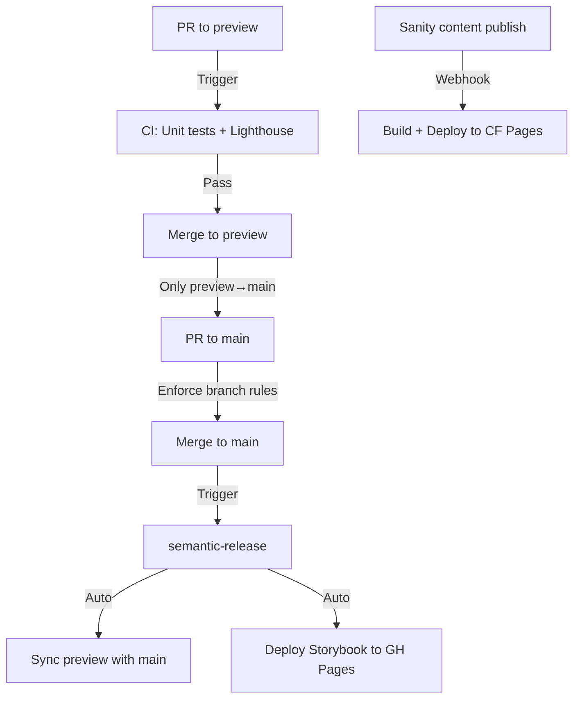

# Architecture

**Generated:** 2026-02-13 | **Mode:** Exhaustive Rescan | **Workflow:** document-project v1.2.0

## System Design



### Production Flow (Static)

1. Editor creates/updates content in Sanity Studio
2. Sanity webhook triggers GitHub Actions `sanity-deploy.yml`
3. Astro builds static HTML from all GROQ queries at build time
4. Cloudflare Pages serves pre-rendered HTML (zero runtime API calls)

### Preview Flow (SSR)

1. Editor uses Presentation Tool in Sanity Studio
2. Astro runs in SSR mode on `preview` branch
3. Visual Editing (stega encoding) enables click-to-edit overlays
4. Draft content rendered in real-time via `drafts` perspective

## Block-Based Page Composition

### Block Lifecycle



1. **Schema definition** (`studio/src/schemaTypes/blocks/`) — Each block uses `defineBlock()` helper which auto-injects base layout fields (backgroundVariant, spacing, maxWidth)
2. **Block registry** (`astro-app/src/components/block-registry.ts`) — Auto-discovers blocks via `import.meta.glob()`, maps PascalCase filenames to camelCase `_type`
3. **Content creation** — Editor stacks blocks in Sanity page builder with grid preview and insert menu groups
4. **Data fetching** (`astro-app/src/lib/sanity.ts`) — `PAGE_BY_SLUG_QUERY` fetches all block types with type-conditional GROQ projections
5. **Rendering** (`BlockRenderer.astro`) — Iterates blocks array, resolves component from registry by `_type`, wraps in `BlockWrapper`
6. **Styling** (`BlockWrapper.astro`) — Applies background variant, spacing, and maxWidth CSS classes with stega-cleaned values

### Block Types (11 Custom)

| Block | _type | Purpose |
|-------|-------|---------|
| HeroBanner | heroBanner | Hero section with background images, heading, CTAs |
| FeatureGrid | featureGrid | Grid of feature items with icons |
| CtaBanner | ctaBanner | Call-to-action section with buttons |
| StatsRow | statsRow | Statistics display row |
| TextWithImage | textWithImage | Rich text content alongside an image |
| LogoCloud | logoCloud | Sponsor logo showcase (auto-populate or manual) |
| SponsorSteps | sponsorSteps | Step-by-step process with CTA |
| RichText | richText | Portable Text content block |
| FaqSection | faqSection | FAQ accordion section |
| ContactForm | contactForm | Contact form with success message |
| SponsorCards | sponsorCards | Sponsor card display (all/featured/manual) |

## Template System

5 page templates control layout structure:

| Template | Use Case | Layout |
|----------|----------|--------|
| `default` | Standard content pages | Constrained width, standard header/footer |
| `fullWidth` | Wide content pages | Full-width blocks, standard chrome |
| `landing` | Marketing/landing pages | Full-width, minimal navigation |
| `sidebar` | Pages with side navigation | Two-column with sidebar |
| `twoColumn` | Dual-content layouts | Two equal columns |

Schema validation warns if wide blocks (heroBanner, statsRow, logoCloud, sponsorCards) are placed in constrained templates (sidebar, twoColumn).

## Data Architecture

### Sanity Content Model



### GROQ Query Strategy

- **`SITE_SETTINGS_QUERY`** — Fetches singleton with all navigation, footer, and branding data
- **`ALL_PAGE_SLUGS_QUERY`** — Generates static paths for `getStaticPaths()`
- **`PAGE_BY_SLUG_QUERY`** — Fetches single page with type-conditional block projections
- **Module-level caching** — `getSiteSettings()` caches at module scope for build performance
- All queries use `defineQuery()` for TypeGen integration

## Design System

### Color Palette

| Token | Value | Usage |
|-------|-------|-------|
| Swiss Red | `#E30613` | Primary brand color |
| Swiss Black | `#0A0A0A` | Text, dark backgrounds |
| NJIT Red | `#D32032` | Accent, hover states |
| NJIT Blue | `#003A6B` | Secondary accent |

### Component Hierarchy

```
fulldev/ui primitives (39 components in ui/)
  └── Custom blocks (12 in blocks/custom/)
       └── Block variants (~100 in blocks/)
            └── Page templates (5 in layouts/templates/)
                 └── Main Layout (Header + Footer + Content)
```

### Styling Approach

- **Tailwind CSS v4** with CSS-first configuration via `@tailwindcss/vite`
- **class-variance-authority** for component variants
- **tailwind-merge** via `cn()` utility for conflict-free class composition
- **CSS custom properties** for dark mode and brand tokens
- **Stega cleaning** — Visual editing encoded strings cleaned before CSS class application

## Testing Architecture

| Layer | Runner | Location | Purpose |
|-------|--------|----------|---------|
| Unit | Vitest | `astro-app/src/lib/__tests__/` | Pure functions (cn, loadQuery, image) |
| Component | Vitest + Container API | `astro-app/src/components/__tests__/` | Astro component rendering with mocked Sanity data |
| SSR Smoke | Vitest | `astro-app/src/cloudflare/__tests__/` | Cloudflare Worker build validation |
| Integration | Vitest | `tests/integration/` | Schema validation, data wiring, type checks (241 cases) |
| E2E | Playwright | `tests/e2e/` | Real browser: a11y (axe-core), interactions, 5 browsers (34 cases) |

## Deployment Architecture

### Environments

| Environment | Branch | Mode | Host |
|-------------|--------|------|------|
| Production | `main` | Static (SSG) | Cloudflare Pages |
| Preview | `preview` | SSR | Cloudflare Pages |
| Storybook | `main` | Static | GitHub Pages |
| Studio | — | Hosted | Sanity Cloud |

### CI/CD Pipeline



### Branch Protection

- `main` ← only accepts PRs from `preview` (enforced by `enforce-preview-branch.yml`)
- `preview` ← rejects PRs from `main` (enforced by `enforce-preview-source.yml`)
- After release, `sync-preview.yml` auto-merges `main` back into `preview`
- Discord notifications on sync success/failure

### CI Workflows (7)

| Workflow | Trigger | Actions |
|----------|---------|---------|
| `ci.yml` | PR to preview | Unit tests + Lighthouse CI |
| `release.yml` | Push to main | semantic-release (versioning + changelog) |
| `deploy-storybook.yml` | Push to main (src changes) | Build + deploy Storybook to GH Pages |
| `sanity-deploy.yml` | Sanity webhook | Build Astro + deploy to Cloudflare Pages |
| `sync-preview.yml` | After release | Merge main into preview + Discord notify |
| `enforce-preview-branch.yml` | PR to main | Block non-preview source branches |
| `enforce-preview-source.yml` | PR to preview | Block PRs from main |
