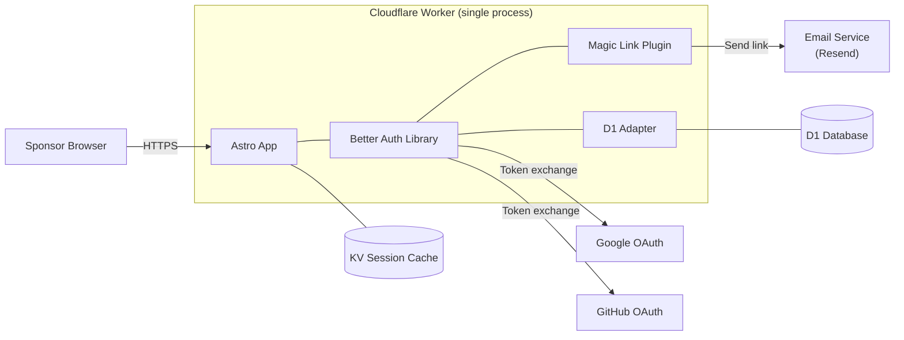

# Authentication Consolidation Strategy

This document explains two related decisions: descoping the student portal and migrating the sponsor portal from Cloudflare Access to Better Auth. It covers the reasoning for stakeholders and the technical migration path for developers.

## Table of Contents

- [Executive Summary](#executive-summary)
- [What Changed and Why](#what-changed-and-why)
  - [Student Portal: Descoped](#student-portal-descoped)
  - [Sponsor Portal: Migrating to Better Auth](#sponsor-portal-migrating-to-better-auth)
- [What Better Auth Is](#what-better-auth-is)
- [Login Methods](#login-methods)
- [Why Better Auth Works on Cloudflare](#why-better-auth-works-on-cloudflare)
- [What the Migration Looks Like](#what-the-migration-looks-like)
  - [Before and After](#before-and-after)
  - [What Sponsors Experience](#what-sponsors-experience)
  - [What Gets Removed](#what-gets-removed)
  - [What Gets Added](#what-gets-added)
- [Technical Migration Path](#technical-migration-path)
  - [Phase 1: Better Auth Sponsor Routes](#phase-1-better-auth-sponsor-routes)
  - [Phase 2: Middleware Consolidation](#phase-2-middleware-consolidation)
  - [Phase 3: Cloudflare Access Teardown](#phase-3-cloudflare-access-teardown)
- [Trade-Offs](#trade-offs)
- [Cost Impact](#cost-impact)

---

## Executive Summary

The YWCC Capstone platform currently uses two separate authentication systems: **Cloudflare Access** gates the sponsor portal (`/portal/*`), and **Better Auth** handles student login (`/student/*`). A planned student portal (Epic 16) would have expanded Better Auth to support ~400 students with team management, calendars, and program resources.

**Two decisions simplify this:**

1. **The student portal is descoped.** The team management, calendar, and resource features planned in Epic 16 (Stories 16.4 through 16.10) are removed from the roadmap. The auth infrastructure built in Stories 16.1-16.3 (Better Auth, D1 sessions, dual-auth middleware) remains — it is production-tested and already deployed.

2. **The sponsor portal migrates to Better Auth.** Instead of maintaining two auth systems, sponsors move from Cloudflare Access to Better Auth with three login methods: Google OAuth, Magic Link (email), and GitHub OAuth. This eliminates the 50-seat limit imposed by Cloudflare Access's free tier and reduces the codebase to a single authentication path.

```text
BEFORE (dual auth):                 AFTER (unified auth):

  Sponsors ─── CF Access ──┐         Sponsors ─── Better Auth ──┐
                            ├─ App                               ├─ App
  Students ─── Better Auth ─┘         (Students descoped)        │
                                                                 │
  2 auth systems                      1 auth system              │
  2 middleware branches               1 middleware branch         │
  50-seat sponsor cap                 No seat limit              ─┘
```

The result is a simpler platform with fewer dependencies, fewer configuration surfaces, and no artificial cap on the number of sponsors who can access the portal.

---

## What Changed and Why

### Student Portal: Descoped

Epic 16 planned a full student-facing portal with team management, event calendars, program resources, and PM/APM role-based access. This required seven new stories (16.4 through 16.10), three new Sanity schema types (`team`, `capstoneStudent`, `studentResource`), and several new SSR pages and API routes.

**Why it's descoped:**

- The core problem the student portal solved (team coordination, resource access) is already handled by existing tools — Canvas, Discord, and GitHub.
- Building and maintaining a parallel system for ~400 students adds complexity without proportional value.
- The auth infrastructure (Stories 16.1-16.3) that *was* built provides the foundation for the sponsor portal migration. That work is not wasted.

**What remains from Epic 16:**

| Component | Status | Location |
|---|---|---|
| Better Auth library + config | Deployed | `astro-app/src/lib/auth.ts`, `auth-client.ts` |
| D1 auth tables (user, session, account) | Deployed | `migrations/0001_student_auth.sql` |
| Google OAuth flow | Deployed | `/api/auth/[...all].ts` |
| KV session cache | Deployed | `SESSION_CACHE` binding |
| Dual-auth middleware | Deployed | `src/middleware.ts` |

All of this infrastructure carries directly into the sponsor portal migration.

### Sponsor Portal: Migrating to Better Auth

Cloudflare Access currently protects `/portal/*` by intercepting requests at the CDN edge and presenting a login screen. After authentication, it sets a JWT that the application middleware validates. This works, but it comes with constraints:

- **50-seat limit** on the free tier. The program currently has ~20 sponsors, but this leaves limited room for growth.
- **Split configuration.** Auth policies live in the Cloudflare Zero Trust dashboard (outside version control), while JWT validation lives in application code.
- **Dedicated dependencies.** The `jose` library exists solely to verify CF Access JWTs. Better Auth handles its own session validation without external JWT libraries.
- **Two code paths in middleware.** The middleware branches on URL path (`/portal/*` vs `/student/*`) to route requests through different auth flows.

Migrating sponsors to Better Auth collapses this to a single system. Sponsors sign in via Google OAuth, Magic Link (email), or GitHub OAuth — all handled by Better Auth through a dedicated login page at `/portal/login`. Session management uses D1 + KV — the same infrastructure, the same code path, no branching.

---

## What Better Auth Is

Better Auth is not a separate server. It is a TypeScript library that compiles into the Astro application. The application *is* the auth server.



There is no separate container, no external identity provider to manage, no ports to expose. The Worker handles the entire auth flow — OAuth redirects, callbacks, token exchange, magic link delivery, session creation — in a single process. Sessions are stored in D1 and cached in KV for fast validation on subsequent page loads.

For a deeper comparison with standalone identity servers (Authentik, Keycloak), see [Better Auth vs Identity Servers](better-auth-vs-identity-servers.md).

---

## Login Methods

The sponsor login page at `/portal/login` offers three ways to sign in:

| Method | How it works | Who it's for |
|---|---|---|
| **Google OAuth** | One-click sign-in via Google account | Sponsors with Google/Gmail accounts |
| **GitHub OAuth** | One-click sign-in via GitHub account | Sponsors with GitHub accounts |
| **Magic Link** | Enter email, receive a one-time sign-in link | Any sponsor — no third-party account required |

All three methods create the same session in D1 and set the same cookie. The portal experience is identical regardless of which method the sponsor uses.

### Email Whitelist (Sanity-Managed)

Not everyone who completes a login flow should have portal access. A **Sanity-managed email whitelist** controls who is authorized. Osama manages this list directly in Sanity Studio — no developer intervention or code changes needed to add or remove sponsors.

```text
Sponsor completes login (Google, GitHub, or Magic Link)
    |
    v
Middleware validates session (D1/KV)
    |
    v
Middleware queries Sanity: is this email on the whitelist?
    |
    ├── YES → populate Astro.locals.user, render portal page
    └── NO  → destroy session, redirect to /portal/denied
```

The whitelist is an `allowedSponsorEmail` document type in Sanity with one field: `email`. Creating a new document with a sponsor's email address grants them portal access. Deleting it revokes access. This replaces the Cloudflare Access policy management that currently lives in the Zero Trust dashboard — but now it's version-controllable CMS content instead of external dashboard configuration.

### Why Not Email + Password?

Password-based login requires bcrypt hashing, which consumes 50-200ms of CPU per login. The Cloudflare Workers free plan enforces a 10ms CPU cap. Magic Link provides the same "sign in with just your email" experience without any cryptographic CPU cost — the token is a random string, and verification is a D1 lookup.

---

## Why Better Auth Works on Cloudflare

The Cloudflare Workers free plan imposes a **10ms CPU limit** per request. Better Auth fits within this because:

1. **OAuth providers do the heavy lifting.** Google and GitHub handle identity verification (password check, MFA, account security) on their servers. The Worker only exchanges a code for a token — that is a network call (I/O), not CPU.

2. **Magic Link avoids password hashing.** Bcrypt and other hashing algorithms consume 50-200ms of CPU. Magic Link skips this entirely — the Worker generates a random token (trivial CPU), sends it via an email API call (I/O), and validates it on click (one D1 lookup). Zero cryptographic CPU cost.

3. **Session validation is a D1 lookup.** Checking whether a session token is valid requires one indexed SQLite query (~0.5ms CPU). With the KV cache, most page loads skip even that.

4. **The entire auth flow stays under 3ms CPU.** The remaining 7ms is available for page rendering, Sanity queries, and response serialization.

This was validated in the Story 16.1 spike — a production deployment on Cloudflare Workers free plan confirmed that Better Auth + Drizzle + D1 stays well within all limits.

---

## What the Migration Looks Like

### Before and After

| Aspect | Before (CF Access) | After (Better Auth) |
|---|---|---|
| Login methods | Email OTP or Google (via CF Access screen) | Google OAuth, Magic Link (email), GitHub OAuth |
| Login screen | Cloudflare-branded | Application-branded at `/portal/login` |
| Session storage | Cloudflare-managed JWT | D1 database + KV cache |
| Seat limit | 50 (free tier) | None |
| Edge blocking | Yes (CDN-level) | No (Worker-level) |
| JWT library (`jose`) | Required | Removed |
| Zero Trust dashboard config | Required | Removed |
| Middleware branches | 2 (portal + student) | 1 (unified) |
| Environment variables | `CF_ACCESS_TEAM_DOMAIN`, `CF_ACCESS_AUD` | `GOOGLE_CLIENT_ID`, `GOOGLE_CLIENT_SECRET`, `GITHUB_CLIENT_ID`, `GITHUB_CLIENT_SECRET`, `RESEND_API_KEY` |

### What Sponsors Experience

The login experience changes, but the portal itself does not.

**Current flow:**
1. Sponsor visits `/portal/`
2. Cloudflare Access intercepts and shows a branded login page
3. Sponsor enters email for a one-time PIN, or clicks "Sign in with Google"
4. After auth, Cloudflare redirects back to `/portal/`

**New flow:**
1. Sponsor visits `/portal/`
2. Middleware detects no session and redirects to `/portal/login`
3. Sponsor chooses: "Sign in with Google," "Sign in with GitHub," or "Sign in with Email" (Magic Link)
4. After auth, Better Auth redirects back to `/portal/`

The login page is application-branded and customizable. Magic Link replaces the email OTP experience — sponsors enter their email, receive a one-time link, and click it to sign in. Google and GitHub OAuth provide one-click alternatives.

### What Gets Removed

| Component | Location |
|---|---|
| `jose` dependency | `package.json` |
| CF Access JWT validation module | `lib/auth.ts` (~60 lines) |
| Portal middleware branch | `middleware.ts` (lines 29-36) |
| Dev-mode portal bypass | `middleware.ts` (lines 18-20) |
| `CF_ACCESS_TEAM_DOMAIN` env var | `wrangler.jsonc` + CF Pages dashboard |
| `CF_ACCESS_AUD` env var | `wrangler.jsonc` + CF Pages dashboard |
| CF Access application + policies | Cloudflare Zero Trust dashboard |

### What Gets Added

| Component | Location |
|---|---|
| Portal login page | `/portal/login.astro` — three sign-in options: Google, GitHub, Magic Link |
| Magic Link plugin | Better Auth `magicLink` plugin in `student-auth.ts` config |
| GitHub OAuth provider | Better Auth `socialProviders.github` in `student-auth.ts` config |
| Email service integration | Resend SDK for Magic Link delivery |
| Sponsor role assignment on login | Better Auth `onCreateUser` hook or D1 `users` table `role` column |
| Email whitelist (Sanity-managed) | `allowedSponsorEmail` document type in Sanity — post-login check validates email against whitelist |
| Sponsor session check in middleware | `middleware.ts` (reuses existing Better Auth validation) |
| `GITHUB_CLIENT_ID` env var | CF Pages dashboard + `wrangler.jsonc` |
| `GITHUB_CLIENT_SECRET` env var | CF Pages dashboard (secret) |
| `RESEND_API_KEY` env var | CF Pages dashboard (secret) |

---

## Technical Migration Path

### Phase 1: Better Auth Sponsor Routes

Extend the existing Better Auth configuration to handle sponsor login:

1. **Add GitHub OAuth and Magic Link to Better Auth config.** The `student-auth.ts` config gains two new providers alongside the existing Google OAuth:

   ```typescript
   socialProviders: {
     google: {
       clientId: env.GOOGLE_CLIENT_ID,
       clientSecret: env.GOOGLE_CLIENT_SECRET,
     },
     github: {
       clientId: env.GITHUB_CLIENT_ID,
       clientSecret: env.GITHUB_CLIENT_SECRET,
     },
   },
   plugins: [
     magicLink({
       sendMagicLink: async ({ email, url }) => {
         await resend.emails.send({
           from: 'YWCC Capstone <noreply@yourdomain.com>',
           to: email,
           subject: 'Sign in to the Sponsor Portal',
           html: `<a href="${url}">Click here to sign in</a>`,
         });
       },
     }),
   ],
   ```

2. **Add a `role` column to the `users` table** via a new D1 migration. When a sponsor completes any auth flow (Google, GitHub, or Magic Link), a post-login hook marks their role as `sponsor`. This enables the middleware to populate `Astro.locals.user.role` correctly.

3. **Create the sponsor login page** at `/portal/login.astro`. This page presents three sign-in options:

   - "Sign in with Google" button
   - "Sign in with GitHub" button
   - "Sign in with Email" field + submit (Magic Link)

4. **Implement the Sanity-managed email whitelist.** Create an `allowedSponsorEmail` document type in Sanity (or a single `portalSettings` singleton with an array of allowed emails). After any successful login, the middleware queries Sanity to verify the authenticated email is on the whitelist. If not, the session is destroyed and the user is redirected to a denial page.

   ```groq
   // Check if email is whitelisted
   count(*[_type == "allowedSponsorEmail" && email == $email]) > 0
   ```

   This gives Osama full control over portal access directly from Sanity Studio — no code changes needed to add or remove sponsors.

### Phase 2: Middleware Consolidation

Replace the dual-branch middleware with a single session check:

```typescript
// BEFORE: two auth paths
if (url.pathname.startsWith('/portal')) {
  // CF Access JWT validation (jose library)
  const user = await validateCFAccessJWT(request);
  locals.user = { email: user.email, role: 'sponsor' };
} else if (url.pathname.startsWith('/student')) {
  // Better Auth session validation
  const session = await validateSession(request);
  locals.user = { email: session.email, role: 'student' };
}

// AFTER: one auth path
if (url.pathname.startsWith('/portal') || url.pathname.startsWith('/student')) {
  const session = await validateSession(request);
  if (!session) return redirect('/portal/login');
  locals.user = { email: session.email, role: session.role };
}
```

The KV session cache already works for this pattern. No new infrastructure is needed.

### Phase 3: Cloudflare Access Teardown

After the migration is validated in production:

1. **Remove the CF Access application** from the Zero Trust dashboard
2. **Remove `CF_ACCESS_TEAM_DOMAIN` and `CF_ACCESS_AUD`** from `wrangler.jsonc` and the Pages dashboard
3. **Uninstall `jose`** from `package.json`
4. **Delete `lib/auth.ts`** (the JWT validation module)
5. **Remove the dev-mode portal bypass** from middleware (the unified session check handles both environments)

---

## Trade-Offs

Consolidating to Better Auth is not purely additive. You gain simplicity and remove a seat cap, but you give up two things:

### Edge-level blocking is gone

Cloudflare Access stops unauthenticated requests at the CDN edge — before the Worker wakes up. With Better Auth, every request to `/portal/*` spins up a Worker and runs the middleware before deciding to redirect. This consumes Worker requests (counted against the 100K/day free limit) and ~2-3ms CPU per unauthenticated hit.

**Mitigation:** Cloudflare WAF rate-limiting rules can throttle suspicious traffic to `/portal/*`. At current traffic levels (~200 sponsor requests/day), this is not a concern. The 100K/day limit provides 500x headroom even without edge blocking.

### Defense-in-depth is reduced

The current architecture has two independent auth layers on sponsor routes: CF Access at the edge, then JWT validation in code. An attacker bypassing one still faces the other. After migration, a single session check protects sponsor routes.

**Mitigation:** Better Auth's session management includes CSRF protection, secure cookie attributes (`HttpOnly`, `SameSite=Lax`, `Secure`), and server-side session validation on every request. This is a well-tested, standards-compliant auth layer — it is a single layer, but a robust one.

---

## Cost Impact

The migration has zero cost impact. Every component involved — including the email service for Magic Links — fits within free-tier limits.

| Resource | Before | After | Change |
|---|---|---|---|
| CF Access seats | ~20 of 50 | 0 (service removed) | Freed |
| D1 reads/day | ~200 | ~400 (sponsors added) | Negligible (5M limit) |
| KV reads/day | ~2K | ~2.2K (sponsors added) | Negligible (100K limit) |
| Worker requests/day | ~2K | ~2.2K | Negligible (100K limit) |
| Sanity API reads | ~10K/month | ~10.5K/month (whitelist checks) | Negligible (100K limit) |
| Resend emails | 0 | ~5-10/day (Magic Link logins) | Negligible (100/day free tier) |
| `jose` bundle size | ~15KB | 0 (removed) | Smaller bundle |
| Monthly cost | $0 | $0 | No change |

The 50-seat ceiling is permanently eliminated. Sponsor count can grow to hundreds without triggering a plan upgrade or a VPS migration. The only remaining constraint that matters is the 10ms CPU cap per Worker invocation, which has 2-3x headroom and is unaffected by this change.

For full details on free-tier limits and upgrade triggers, see [Cost Optimization Strategy](cost-optimization-strategy.md).
