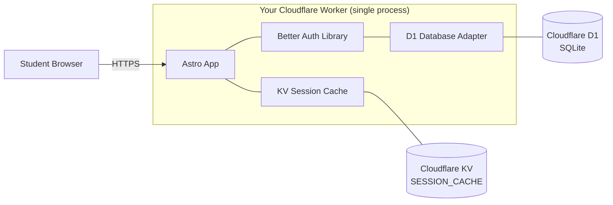
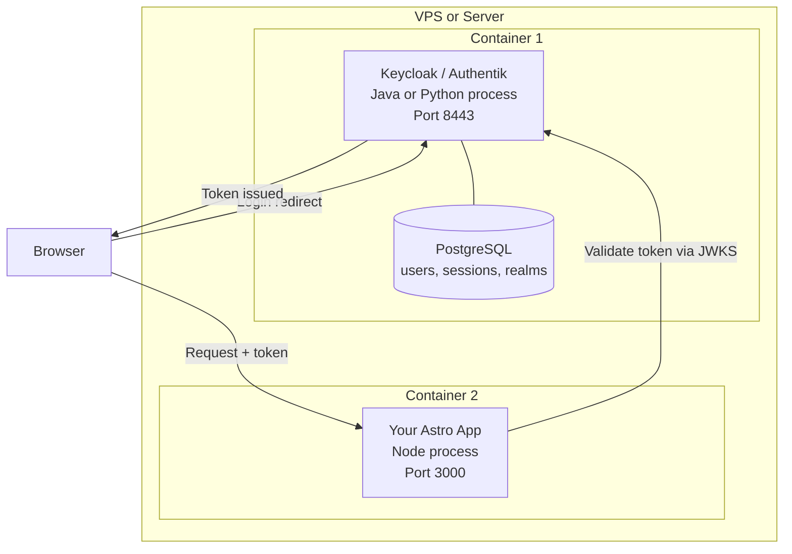

# Better Auth vs Identity Servers (Authentik/Keycloak)

This document explains how Better Auth works inside our Cloudflare Workers deployment and why it is fundamentally different from self-hosted identity servers like Authentik or Keycloak. For context on the decision to consolidate all authentication onto Better Auth, see [Authentication Consolidation Strategy](auth-consolidation-strategy.md).

## Better Auth: An Embedded Library, Not a Service

Better Auth is a library that compiles into your application. It is not a separate process, container, or server. Your Astro app *is* the auth server.



When a student hits `/api/auth/sign-in/social`, the request goes to your Worker, Better Auth's route handler picks it up, and it orchestrates the OAuth flow — all inside the same Worker invocation that serves your pages. There is no network hop to a separate auth service. Subsequent page loads use a KV-backed session cache to avoid repeated D1 reads.

## The Login Flow on Cloudflare

Here is what happens step by step when a student signs in:

```text
Student clicks "Sign in with Google"
        |
        v
+------------------------------------+
|  Worker receives POST to           |
|  /api/auth/sign-in/social          |
|                                    |
|  Better Auth (inside Worker):      |
|  1. Generates OAuth state param    |
|  2. Stores state in D1             |
|  3. Returns redirect to Google     |
+------------------+-----------------+
                   | 302 Redirect
                   v
+------------------------------------+
|  Google OAuth consent screen       |
|  Student signs in with @njit.edu   |
|  Google redirects back with code   |
+------------------+-----------------+
                   | GET /api/auth/callback/google?code=xxx
                   v
+------------------------------------+
|  Worker receives callback          |
|                                    |
|  Better Auth (inside Worker):      |
|  1. Exchanges code for tokens      |
|     (Worker -> Google API call)    |
|  2. Extracts user email, name      |
|  3. Upserts user row in D1         |
|  4. Creates session row in D1      |
|  5. Sets session cookie            |
|  6. Redirects to /student/         |
+------------------------------------+
```

Every step runs inside a single Cloudflare Worker. The D1 database stores users and sessions as SQLite rows colocated with your Worker. No external auth server is involved.

## KV Session Cache: Avoiding Repeated D1 Reads

After the initial login, every student page load needs to validate the session. Without caching, that means a D1 read on every request. The middleware uses **Cloudflare KV** as a write-through session cache to short-circuit this.

```text
Student visits /student/projects (already logged in)
        |
        v
+----------------------------------------+
|  Middleware checks for session cookie   |
|                                        |
|  1. Extract session token from         |
|     better-auth.session_token cookie   |
|                                        |
|  2. Check KV (SESSION_CACHE)           |
|     Key: session token                 |
|     TTL: 300 seconds (5 min)           |
|       HIT  -> Set locals.user, done    |
|       MISS -> Continue to step 3       |
|                                        |
|  3. Query D1 via Better Auth           |
|     (full session validation)          |
|       VALID -> Set locals.user         |
|             -> Write to KV             |  <-- fire-and-forget,
|                (async, non-blocking)   |      error-tolerant
|       INVALID -> Redirect to login     |
+----------------------------------------+
```

The KV binding (`SESSION_CACHE`) is **optional**. If KV is unavailable or errors out, the middleware falls back to D1 directly. This graceful degradation is tested explicitly — a KV outage does not break authentication.

### Why KV and Not Just D1?

- **KV reads are faster.** KV is a globally distributed key-value store optimized for reads. D1 is SQLite — excellent for structured queries, but each session lookup requires a SQL round-trip.
- **KV reduces D1 read volume.** A student navigating between pages generates many session checks. The 5-minute KV TTL means most page loads skip D1 entirely.
- **KV reads are free at this scale.** The free tier includes 100K KV reads/day. Even with 400 active students, daily KV reads stay well below that.

## Resource Cost on Cloudflare

| Operation | Cloudflare Resource | Free Tier Impact |
|:----------|:-------------------|:-----------------|
| OAuth redirect + callback | 2 Worker requests | Negligible vs 100K/day |
| Store/read session | D1 read + write | Negligible vs 5M reads/day |
| Session validation (KV hit) | 1 KV read (<1ms) | Negligible vs 100K KV reads/day |
| Session validation (KV miss) | 1 D1 read + 1 KV write | Infrequent (every 5 min per session) |
| Token exchange with Google | 1 outbound fetch | Subrequest (no extra cost) |

The entire auth system costs zero infrastructure. No containers, no VMs, no ports to expose, no TLS certificates to manage for an auth endpoint.

## How Authentik and Keycloak Differ

Authentik and Keycloak are **standalone identity servers**. They run as their own process (typically a Java or Python application in a Docker container) with their own database, their own web UI, and their own network endpoint.



### Architecture Comparison

| Aspect | Better Auth (Embedded) | Authentik / Keycloak (Standalone) |
|:-------|:----------------------|:----------------------------------|
| Deployment model | Library inside your app | Separate running server |
| Extra processes | None | Own container + database |
| Auth logic | Function calls within process | HTTP calls to another service |
| Database | D1 (embedded SQLite) + KV session cache | PostgreSQL (separate database) + Redis (optional) |
| Infrastructure to manage | None | Java/Python runtime + reverse proxy + TLS |
| Scaling | Scales with your Worker | Scales independently (needs its own RAM/CPU) |

## Why You Cannot Run Authentik or Keycloak on Cloudflare

Cloudflare Workers are **short-lived, stateless functions** with a 10ms CPU limit on the free plan. Authentik and Keycloak are **long-running, stateful applications** that require:

- **Persistent processes** — Workers spin up and terminate per request
- **Hundreds of MB of RAM** — Workers get 128MB max
- **Disk access** for config and themes — Workers have no filesystem
- **A PostgreSQL connection** — Workers cannot run PostgreSQL
- **Open ports** for admin UI, OIDC endpoints, LDAP — Workers serve HTTP only

These are not limitations you can work around. The runtime model is fundamentally different.

## When Each Approach Makes Sense

| Factor | Better Auth (Embedded) | Authentik / Keycloak (Standalone) |
|:-------|:----------------------|:----------------------------------|
| **Best for** | Serverless, edge, single-app | VPS, multi-app, enterprise |
| **Runtime** | Runs inside your app process | Runs as its own service |
| **Multi-app SSO** | Not designed for it | Core strength (OIDC/SAML provider) |
| **Admin UI** | None (manage via code/DB) | Full web console for user management |
| **LDAP/SCIM** | No | Yes |
| **User federation** | No | Yes (AD, LDAP, social, SAML) |
| **Cost at this project's scale** | $0 | ~$5-15/month VPS + ops overhead |
| **Ops burden** | Zero (deploys with your app) | Updates, backups, monitoring, TLS |

## Why Not Consolidate Everything to Better Auth?

> **UPDATE (Story 9.18):** This consolidation was completed. Cloudflare Access has been fully replaced by Better Auth for sponsor authentication. The dual system described below no longer exists. See `docs/auth-consolidation-strategy.md` for the migration details.

Better Auth handles students well. It *could* handle sponsors too — the spike validated that it runs correctly on Cloudflare Workers. The trade-off is real code maintenance cost on one side and real security benefits on the other.

### What the dual system costs to maintain

Keeping Cloudflare Access for sponsors is not just an `if/else` branch. It requires a dedicated JWT verification module with its own dependency and configuration:

| Component | Location | What it does |
|:----------|:---------|:-------------|
| `lib/auth.ts` (~60 lines) | JWT validation module | Fetches Cloudflare's JWKS endpoint, verifies token signature, validates issuer and audience claims, extracts user email |
| `jose` dependency | `package.json` | Third-party JWT/JWK library that must stay compatible with the Workers runtime |
| Portal branch in middleware | `middleware.ts` lines 29-36 | Routes portal requests through JWT validation instead of session validation |
| Dev-mode portal bypass | `middleware.ts` lines 18-20 | Separate mock user for local development |
| `CF_ACCESS_TEAM_DOMAIN` | `wrangler.jsonc` + CF dashboard | Cloudflare team domain for JWKS endpoint |
| `CF_ACCESS_AUD` | `wrangler.jsonc` + CF dashboard | Audience tag for JWT validation |
| CF Access application + policies | Cloudflare Zero Trust dashboard | External configuration that lives outside version control |

Consolidating to Better Auth would delete all of the above. The middleware would collapse to a single session check for all protected routes — no path-based branching, no JWT library, no remote JWKS call, no `jose` dependency.

### What consolidating would sacrifice

**Edge-level blocking.** Cloudflare Access stops unauthenticated requests to `/portal/*` at the CDN edge — before your Worker wakes up or burns any CPU. With Better Auth alone, every unauthenticated hit to a sponsor route spins up a Worker, runs middleware, and counts against the 100K requests/day free limit.

```text
With CF Access:                    With Better Auth only:
  Bot hits /portal/dashboard         Bot hits /portal/dashboard
  -> Blocked at edge (0 CPU)         -> Worker starts (~3-5ms CPU)
  -> Your code never runs            -> Middleware checks session
                                     -> Redirects to login
                                     -> Repeat 10,000 times...
```

Cloudflare WAF rules (rate limiting, bot detection) can partially mitigate this, but they are blunter tools than Access's identity-aware gate.

**Defense-in-depth.** Sponsor routes currently have two independent auth layers: Cloudflare Access blocks at the edge, then the middleware re-validates the JWT in code. An attacker who bypasses one layer still faces the other. Consolidating to a single system removes that second layer for the routes that protect the most sensitive data (project evaluations, sponsor agreements).

**Infrastructure-managed auth.** Cloudflare Access handles the login screen, email OTP, Google sign-in, session management, and token signing as Cloudflare infrastructure. Moving sponsors to Better Auth means owning the full OAuth flow and session storage for a second user group — more code that can have security bugs.

### The current math

Sponsors are ~20 people. The free plan covers 50 seats — 2.5x headroom. There is no cost pressure forcing consolidation today. But the maintenance cost of the dual system is not zero — it is a JWT module, a third-party dependency, split configuration across code and the Cloudflare dashboard, and a middleware that handles two fundamentally different auth flows.

If sponsors ever exceed 50, the decision becomes straightforward: move sponsors to Better Auth (consolidate) or upgrade to the paid Zero Trust plan.

## Summary

Better Auth embeds authentication *into* your app as a library — perfect for serverless environments where you cannot run a separate identity server. Authentik and Keycloak *are* the auth server as a standalone service — perfect for self-hosted, multi-service environments where SSO, LDAP, and centralized user management justify the infrastructure cost.

This project uses Better Auth for students because:

- The deployment target (Cloudflare Workers) cannot host a standalone identity server
- The student population (~400/semester) exceeds Cloudflare Access's 50-seat free limit
- The embedded library model costs $0 in infrastructure and $0 in ops overhead

This project keeps Cloudflare Access for sponsors because:

- Edge-level blocking stops unauthenticated requests before they consume Worker CPU
- Defense-in-depth — two independent auth layers protect the most sensitive routes
- 20 sponsors fit comfortably within the 50-seat free limit

The trade-off is honest: keeping both systems means maintaining a JWT verification module, a `jose` dependency, and split configuration. That is real maintenance cost. It buys edge-level security and defense-in-depth for the routes that need it most.
