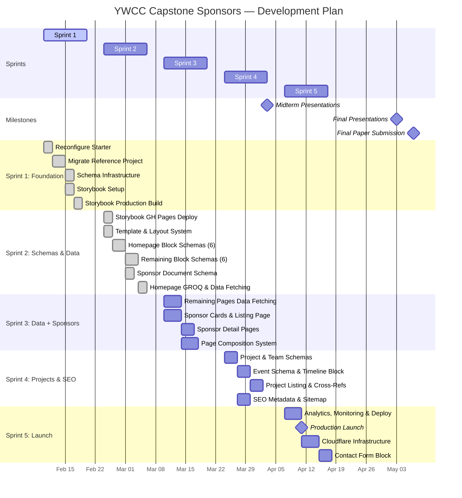
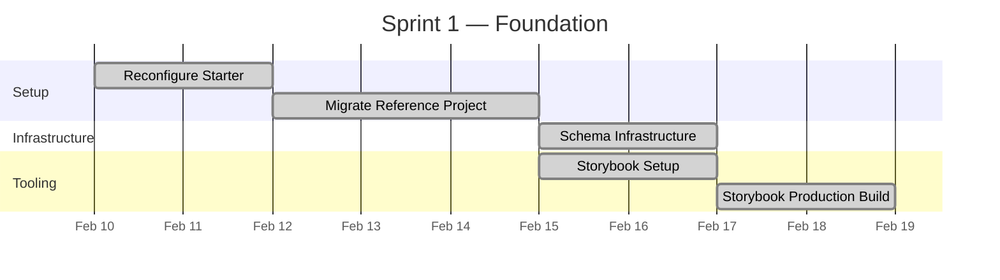
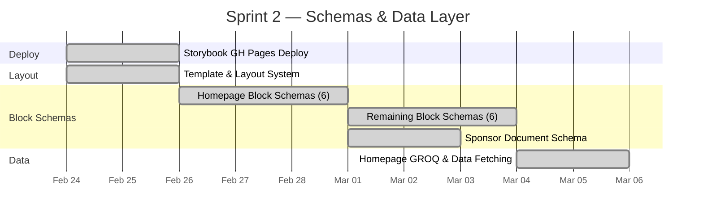
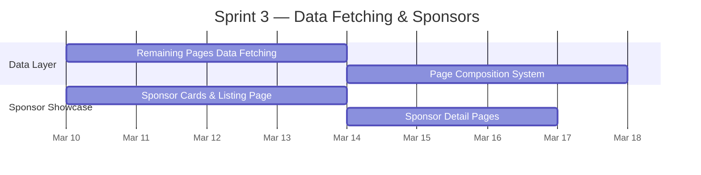
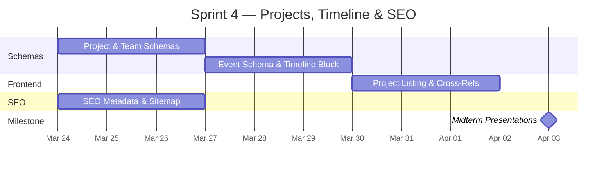
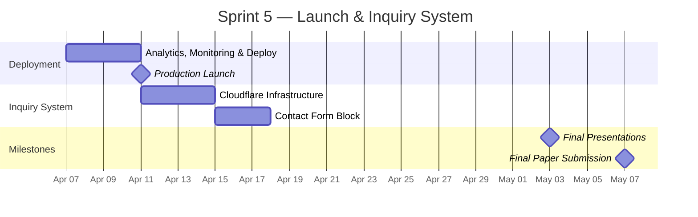

# Software Development Plan

**Project:** YWCC Capstone Sponsors Platform\
**Author:** Jose Andrew Gonzalez\
**Date:** February 2026\
**Duration:** 13 weeks (Feb 10 -- May 7, 2026)\
**Sprints:** 5

---

## Executive Summary

The YWCC Capstone Sponsors platform is a modular, CMS-driven static website for NJIT's Ying Wu College of Computing Industry Capstone program. It connects industry sponsors with capstone teams by showcasing sponsor organizations, project proposals, team rosters, and program information.

Content editors compose pages by stacking reusable UI blocks in Sanity Studio with zero code required. The block library maps editor-friendly names to shadcn/ui component internals, making the design system invisible to non-technical users.

### Technology Stack

| Technology | Version | Purpose |
|---|---|---|
| Astro | 5.x | Static site generator (SSG), `output: 'static'` |
| Sanity Studio | 4.x | Headless CMS with structured content |
| Tailwind CSS | 4.x | CSS-first utility framework via `@tailwindcss/vite` plugin |
| fulldev/ui (shadcn) | latest | Vanilla `.astro` UI primitives (`@fulldev` registry) |
| TypeScript | 5.x | Strict mode, type safety across both workspaces |
| Vite | 7.x | Build tool, custom plugin architecture for Storybook patches |
| storybook-astro | 0.1.0 | Native Astro Storybook framework (with production build patches) |
| Astro Container API | -- | Component isolation for Storybook dev mode rendering |
| Playwright | latest | Integration testing framework (175+ schema/infrastructure tests) |
| GROQ | -- | Sanity query language with `defineQuery` for type generation |
| GitHub Actions | -- | CI/CD pipeline for static site and Storybook deployment |
| GitHub Pages | -- | Static hosting ($0/month) |
| Cloudflare Pages | -- | Future hosting for server-side form processing |
| Node.js | 24+ | Runtime for build and development |

#### Storybook Production Build Architecture

The `storybook-astro` framework (v0.1.0) works in dev mode via WebSocket + Astro Container API but produces broken production builds. Story 1.5 resolved this with two patches:

1. **Vite plugin filter** -- removes `astro:html` plugin during build (was intercepting `iframe.html` generation, reducing transforms from 784 to 3 modules)
2. **Patched renderer** -- custom `entry-preview.ts` that renders Astro components directly in the browser using Astro runtime's `renderToString` (zero Node.js dependencies), replacing the WebSocket-dependent renderer

Both patches activate only during `storybook build` via a `configResolved` guard, leaving dev mode untouched.

### Constraints

- $0/month operating cost (all free tiers)
- Lighthouse 90+ across all categories
- Zero runtime API calls to Sanity
- WCAG 2.1 AA accessibility compliance

---

## Sprint Schedule

| Sprint | Dates | Class Sessions | Key Milestone |
|---|---|---|---|
| **Sprint 1** | Feb 10 -- Feb 19 | Tue 2/10, Thu 2/12 (Deliverables Training), Tue 2/17 (Deliverables Training), Thu 2/19 | -- |
| **Sprint 2** | Feb 24 -- Mar 5 | Tue 2/24, Thu 2/26, Tue 3/3, Thu 3/5 | -- |
| **Sprint 3** | Mar 10 -- Mar 19 | Tue 3/10, Thu 3/12, Tue 3/17, Thu 3/19 | -- |
| **Sprint 4** | Mar 24 -- Apr 2 | Tue 3/24, Thu 3/26, Tue 3/31, Thu 4/2 | **Midterm Presentations** (Apr 3, 11:00 PM) |
| -- | Apr 5 | -- | **Capstone Showcase / Final Presentations Orientation** (Zoom) |
| **Sprint 5** | Apr 7 -- Apr 16 | Tue 4/7, Thu 4/9, Tue 4/14, Thu 4/16 | -- |
| -- | May 3 | -- | **Final Capstone Presentations** (11am--7pm) |
| -- | May 7 | -- | **Final Paper Submission** (no class) |

---

## Full Project Gantt Chart

---

## Sprint Breakdown

### Sprint 1: Foundation (Feb 10 -- Feb 19)

Establish the monorepo, design system, component library, and development tooling. Migrate the proven reference implementation.

| Story | Status | Deliverables |
|---|---|---|
| 1.1 Reconfigure Starter | Done | Removed React/Vercel, added Tailwind v4 via `@tailwindcss/vite`, fulldev/ui, monorepo directory structure |
| 1.2 Migrate Reference | Done | 12 block components, 22 UI component families, 5 pages, Layout/Header/Footer, placeholder data |
| 1.3 Schema Infrastructure | Done | `defineBlock` helper merging base fields, 4 shared objects (SEO, button, portable-text, block-base), page + site-settings document schemas, 34 integration tests |
| 1.4 Storybook Setup | Done | storybook-astro framework configured, `*Story.astro` wrapper pattern for slot-based components, stories for Button, Badge, HeroBanner, CtaBanner, FeatureGrid |
| 1.5 Storybook Prod Build | Done | Diagnosed `astro:html` plugin hijacking `iframe.html`, patched renderer using Astro runtime `renderToString` for browser-side rendering, 784+ Vite modules transforming correctly |

### Sprint 2: Block Schemas & Data Layer (Feb 24 -- Mar 5)

Create all 12 block schemas, sponsor document schema, and wire homepage data fetching from Sanity.

| Story | Status | Deliverables |
|---|---|---|
| 1.6 Storybook GH Pages | Done | GitHub Actions workflow deploying Storybook static build to GitHub Pages |
| 2.0 Template & Layout | Done | Reusable page templates, layout integration patterns |
| 2.1 Homepage Blocks | Done | heroBanner, featureGrid, ctaBanner, statsRow, textWithImage, logoCloud schemas |
| 2.1b Remaining Blocks | Done | richText, faqSection, contactForm, sponsorCards, timeline, teamGrid schemas |
| 3.1 Sponsor Schema | Done | Sponsor document with name, slug, logo, description, website, tier, featured flag; 11 integration tests |
| 2.2 Homepage Data | Done | Typed GROQ queries for homepage, Sanity content replacing placeholder data |

### Sprint 3: Data Fetching & Sponsor Showcase (Mar 10 -- Mar 19)

Wire remaining pages to Sanity, build sponsor browsing experience, and complete the page composition system.

| Story | Status | Deliverables |
|---|---|---|
| 2.2b Remaining Pages | Planned | GROQ queries for About, Projects, Sponsors, Contact; placeholder data removed |
| 2.3 Page Composition | Planned | Dynamic `[...slug].astro` catch-all, drag-and-drop block ordering in Studio |
| 3.2 Sponsor Cards | Planned | Card-based layout with tier badges, `/sponsors/` listing page |
| 3.3 Sponsor Details | Planned | `/sponsors/[slug]` detail pages with associated projects section |

### Sprint 4: Projects, Timeline & SEO (Mar 24 -- Apr 2)

Build project/team management, program timeline, and SEO infrastructure. **Midterm presentations due April 3.**

| Story | Status | Deliverables |
|---|---|---|
| 4.1 Project & Team Schemas | Planned | project + team document schemas with sponsor cross-references |
| 4.2 Event & Timeline | Planned | Event documents, timeline block with completed/current/upcoming indicators |
| 4.3 Project Listing | Planned | `/projects/` page, sponsor-project-team cross-reference navigation |
| 5.1 SEO & Sitemap | Planned | Per-page meta tags, Open Graph, canonical URLs, `@astrojs/sitemap` |

### Sprint 5: Production Launch & Inquiry System (Apr 7 -- Apr 16)

Deploy to production, integrate analytics, and build the contact form system. **Final presentations May 3, paper due May 7.**

| Story | Status | Deliverables |
|---|---|---|
| 5.2 Analytics & Deploy | Planned | GA4, Monsido, GitHub Actions CI/CD, security headers, production URL |
| 6.1 Cloudflare Infrastructure | Planned | `@astrojs/cloudflare` adapter, Worker form proxy, rate limiting |
| 6.2 Contact Form Block | Planned | Validated form, honeypot, Sanity submission documents for admin review |

---

## Milestones

| Milestone | Target Date | Criteria |
|---|---|---|
| Foundation Complete | Feb 19 (Sprint 1) | Monorepo, 12 blocks migrated, schema infrastructure, Storybook, 175+ integration tests |
| CMS Content Live | Mar 5 (Sprint 2) | All 12 block schemas, sponsor schema, homepage rendering from Sanity |
| Full Data Integration | Mar 19 (Sprint 3) | All 5 pages from Sanity, sponsor listing/detail pages, page composition |
| **Midterm Presentations** | **Apr 3** | **Projects, teams, timeline, SEO all functional** |
| Production Launch | Apr 11 (Sprint 5) | Live on GitHub Pages, Lighthouse 90+, analytics integrated |
| **Final Capstone Presentations** | **May 3** | **All epics complete, contact form live, final demo** |
| **Final Paper Submission** | **May 7** | **Documentation deliverable** |

---

## Functional Requirements Summary

| ID | Requirement | Epic | Sprint |
|---|---|---|---|
| FR1--FR5 | Page composition & content management | Epic 2 | 2--3 |
| FR6--FR9 | Sponsor management & discovery | Epic 3 | 2--3 |
| FR10--FR16 | Projects, teams & program timeline | Epic 4 | 4 |
| FR17--FR21 | Sponsor inquiry & contact form | Epic 6 | 5 |
| FR22--FR30 | Block library (12 P0 blocks) | Epics 1--2 | 1--2 |
| FR31--FR34 | Site navigation & layout | Epic 1 | 1 |
| FR35--FR39 | SEO, analytics & monitoring | Epic 5 | 4--5 |
| FR40 | Global site settings | Epic 1 | 1 |

## Non-Functional Requirements Summary

| Category | Key Targets |
|---|---|
| **Performance** | Lighthouse 95+, FCP < 1s, LCP < 2s, JS < 5KB, CSS < 15KB |
| **Security** | Write token server-side only, honeypot + rate limiting, HTTPS + security headers |
| **Accessibility** | WCAG 2.1 AA, Lighthouse A11y 90+, keyboard navigable, alt text enforced |
| **Maintainability** | New block = 2 files + registration, zero framework runtime, TypeScript throughout |

---

## Risk Assessment

| Risk | Impact | Mitigation |
|---|---|---|
| Sanity free tier limits (100K API/month) | Medium | All queries build-time only; zero runtime calls |
| Cloudflare migration complexity | Low | Deferred to Sprint 5; GitHub Pages works for all static content |
| Schema changes after content entry | High | Deprecation pattern (never delete fields); migration scripts |
| storybook-astro upstream instability | Medium | Local patches with `configResolved` guard; documented sync strategy |
| Scope creep from sponsor requests | Medium | Block library approach absorbs new layouts without new code |
| Sprint 4/5 compression near deadlines | Medium | Epics 1--2 front-loaded; Epic 6 is stretch goal if time is tight |
