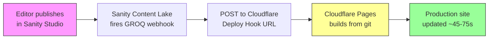

# Cloudflare Guide

Everything you need to deploy, authenticate, monitor, and optimize this project on Cloudflare — in one place.

---

## Table of Contents

1. [Overview](#1-overview)
2. [Pages Setup and Deployment](#2-pages-setup-and-deployment)
3. [Authentication (Cloudflare Access)](#3-authentication-cloudflare-access)
4. [Free Tier Limits](#4-free-tier-limits)
5. [Cost Optimization and Descoping](#5-cost-optimization-and-descoping)
6. [Environment Variables](#6-environment-variables)
7. [Testing](#7-testing)
8. [Monitoring and Observability](#8-monitoring-and-observability)
9. [Troubleshooting](#9-troubleshooting)
10. [VPS Migration Path](#10-vps-migration-path)

---

## 1. Overview

### Architecture

The site runs on **Cloudflare Pages** with the `@astrojs/cloudflare` adapter. Public pages are statically pre-rendered at build time (`output: "static"`). Only `/portal/*` routes use SSR via a Cloudflare Worker.

```
Visitor → Cloudflare CDN (static HTML from edge cache)
                         ↓ (portal routes only)
           Cloudflare Access (enforces auth at edge)
                         ↓
           Cloudflare Pages Worker (Astro SSR)
                         ↓
           middleware.ts → lib/auth.ts (JWT defense-in-depth)
                         ↓
           Portal page renders with Astro.locals.user
```

### Services in Use

| Service | Status | Purpose |
|:--------|:-------|:--------|
| **Pages** | Active | Static hosting + CDN |
| **Workers** (SSR) | Active | `/portal/*` and `/_server-islands/*` routes |
| **Access / Zero Trust** | Active | Auth gate for `/portal/*` |
| **Deploy Hook** | Active | Sanity webhook triggers production rebuild |
| **Build Cache** | Active (beta) | Faster rebuilds (~45-75s warm) |
| **D1** | Planned (Story 9.8) | Portal database (RSVPs, agreements, notification prefs) |
| **KV** | Planned (Stories 9.5, 9.13) | Site health index + notification storage |
| **R2** | Planned (Story 9.5) | Lighthouse/Pa11y report storage |
| **Queues** | Planned (Story 9.13) | Async notification creation pipeline |
| **Analytics Engine** | Planned (Stories 9.9, 9.15) | Portal activity tracking + admin analytics |
| **Cron Triggers** | Planned (Story 9.13) | Daily event reminder notifications |
| **Turnstile** | Planned | Bot protection for contact form |

### Key Files

| File | Role |
|:-----|:-----|
| `astro-app/astro.config.mjs` | `output: "static"`, `adapter: cloudflare({ platformProxy: { enabled: true } })` |
| `astro-app/wrangler.jsonc` | Project name, compat flags, build output dir, Access env vars |
| `astro-app/public/_headers` | Security response headers (applied at CDN edge) |
| `astro-app/src/env.d.ts` | TypeScript types for Cloudflare runtime env |
| `astro-app/src/middleware.ts` | JWT validation for `/portal/*` routes |
| `astro-app/src/lib/auth.ts` | `Cf-Access-Jwt-Assertion` header verification via `jose` |
| `astro-app/src/layouts/PortalLayout.astro` | Portal layout with CF Access logout URL |

---

## 2. Pages Setup and Deployment

### Prerequisites

- Cloudflare account ([sign up free](https://dash.cloudflare.com/sign-up))
- GitHub repository access with admin permissions
- Node.js 22+ installed locally

### 2.1 Create a Pages Project

1. Go to [dash.cloudflare.com](https://dash.cloudflare.com) → **Workers & Pages** → **Create**
2. Select **Pages** → **Connect to Git** → select the `astro-shadcn-sanity` repo
3. Configure:
   - **Project name:** `ywcc-capstone`
   - **Build command:** `npm run build --workspace=astro-app`
   - **Build output directory:** `astro-app/dist`
4. Set environment variables (see [Section 6](#6-environment-variables))
5. Save and deploy

> You can skip manual creation — the first `wrangler pages deploy` auto-creates the project. But connecting git enables native preview deployments.

### 2.2 Get Credentials

**Account ID:**
1. [dash.cloudflare.com](https://dash.cloudflare.com) → right sidebar → **Account ID**
2. Copy it for local testing and GitHub secrets

**API Token:**
1. Go to [dash.cloudflare.com/profile/api-tokens](https://dash.cloudflare.com/profile/api-tokens) → **Create Token**
2. Under **Custom token**, click **"Get started"**
3. Configure:
   - **Token name:** `ywcc-capstone-pages-deploy`
   - **Permissions:** Account → Cloudflare Pages → Edit
   - **Account Resources:** Include → your account
4. Create and copy the token (shown only once)

> Use the custom token approach — the pre-built "Edit Cloudflare Workers" template gives broader permissions than needed.

### 2.3 Local Deploy Test

```bash
export CLOUDFLARE_API_TOKEN="your-token-here"
export CLOUDFLARE_ACCOUNT_ID="your-account-id-here"

npm run build --workspace=astro-app
cd astro-app && npx wrangler pages deploy dist/ --project-name=ywcc-capstone && cd ..
```

Verify at `https://ywcc-capstone.pages.dev`:

- Site loads with HTTPS
- Pages render (homepage, about, sponsors, projects, contact)
- DevTools → Network → response headers include security headers

### 2.4 Local Wrangler Preview

Preview the build locally using Miniflare:

```bash
cd astro-app
npx wrangler pages dev dist/
```

Runs on `http://localhost:8788`. The `_headers` file is not applied locally — that is Cloudflare Pages infrastructure only.

### 2.5 How Deployment Works (Deploy Hook)

Content rebuilds use a **Cloudflare deploy hook** — the simplest possible pipeline with no GitHub Actions in the loop.



**What triggers a build:**

| Trigger | Result |
|:--------|:-------|
| Push to `main` (or merge PR) | Production deploy to `ywcc-capstone.pages.dev` |
| Push to any other branch | Preview deploy to `branch.ywcc-capstone.pages.dev` |
| Sanity content published | Deploy hook fires → production rebuild |

#### Set Up the Deploy Hook

1. [dash.cloudflare.com](https://dash.cloudflare.com) → `ywcc-capstone` → **Settings** → **Builds & deployments** → **Deploy hooks**
2. **Add deploy hook** → Name: `Sanity Content Publish`, Branch: `main` → **Save**
3. Copy the generated URL (treat it as a secret — anyone with this URL can trigger a build)

#### Configure the Sanity Webhook

1. [sanity.io/manage](https://sanity.io/manage) → your project → **API** → **Webhooks**
2. Create or edit the `Trigger production rebuild` webhook:

| Field | Value |
|:------|:------|
| **URL** | The deploy hook URL from above |
| **Trigger on** | Create, Update, Delete |
| **Filter** | `_type in ["page", "siteSettings", "sponsor", "project", "team", "event"]` |
| **Drafts** | OFF (only fire on publish) |
| **HTTP method** | POST |
| **HTTP Headers** | None required |

3. Enable and save

#### Verify

1. Publish a content change in Sanity Studio
2. Check **sanity.io/manage** → Webhooks → **Attempts** tab → `200 OK`
3. Check **CF Pages dashboard** → **Deployments** → new production build appears
4. Build completes in ~45-75 seconds (with build cache)

### 2.6 Build Caching

Cloudflare Pages caches dependencies and build outputs across deployments.

**Enable:**
1. CF Pages → your project → **Settings** → **Build** → **Build cache** → **Enable**

**What gets cached:**

| Cache | Directory | Effect |
|:------|:----------|:-------|
| npm global cache | `.npm` | `npm ci` pulls from local cache |
| Astro build cache | `node_modules/.astro` | Incremental builds |

**Build times:**

| Scenario | Build Time |
|:---------|:-----------|
| Cold start (no cache) | ~2 minutes |
| Warm (cached) | ~45-75 seconds |

**Constraints:** 10 GB per project, expires after 7 days without a build, beta feature.

**Clear cache:** CF Pages → **Settings** → **Build** → **Build cache** → **Clear Cache**

### 2.7 Security Headers

`astro-app/public/_headers` applies these response headers on all routes via Cloudflare Pages CDN:

- `X-Content-Type-Options: nosniff`
- `Referrer-Policy: strict-origin-when-cross-origin`
- `Permissions-Policy: camera=(), microphone=(), geolocation=()`
- `Content-Security-Policy: frame-ancestors 'self' https://*.sanity.studio https://*.sanity.io`

These are only active on deployed Cloudflare Pages, not in local dev.

---

## 3. Authentication (Cloudflare Access)

Cloudflare Access (Zero Trust) protects `/portal/*` routes. Unauthenticated requests never reach the Astro Worker.

### 3.1 How It Works

```
Browser → Cloudflare Edge (Access enforces auth)
  → CF login page (OTP or Google) → identity verified
  → Request forwarded with Cf-Access-Jwt-Assertion header
  → Cloudflare Pages Worker (Astro SSR)
  → middleware.ts validates JWT (defense-in-depth)
  → Sets Astro.locals.user = { email }
  → Portal page renders
```

**Key point:** `lib/auth.ts` JWT validation is defense-in-depth. CF Access is the primary auth gate. The middleware catches misconfiguration or bypass attempts.

### 3.2 Access Application Setup

These steps are performed in the [Cloudflare Zero Trust dashboard](https://one.dash.cloudflare.com).

1. Navigate to **Access → Applications**
2. Click **Add an application** → select **Self-hosted**
3. Configure:
   - **Application name:** `YWCC Capstone Sponsor Portal`
   - **Session duration:** 24 hours
   - **Public hostname:** Your project domain (custom domain or `*.pages.dev`)
   - **Path:** `/portal/`
4. Create a second rule for exact path `/portal` — the wildcard `/portal/*` does **not** match `/portal` alone
5. Record the **Application Audience (AUD) tag** — needed for JWT verification
6. Verify non-portal routes (`/`, `/sponsors`, `/projects`) remain publicly accessible

#### Path Wildcard Rules

- `/portal/*` protects all subpaths but **not** `/portal` itself
- Create two rules: `/portal` (exact) and `/portal/*`
- Only one wildcard per path segment
- Query strings, ports, and anchors are stripped from path matching

### 3.3 Identity Providers

Two login methods: **One-Time PIN** (fallback) and **Google** (external sponsors).

#### One-Time PIN (OTP)

1. **Cloudflare One → Settings → Authentication → Login methods**
2. **Add new** → select **One-time PIN**
3. Save — no client ID or secret needed

#### Google Login

**Google Cloud Console:**

1. [console.cloud.google.com](https://console.cloud.google.com/) → create or select a project
2. **APIs & Services → OAuth consent screen** → User Type: External
3. **APIs & Services → Credentials → Create Credentials → OAuth client ID**
4. Application type: **Web application**
5. Authorized JavaScript origin: `https://ywcc-capstone-pages.cloudflareaccess.com`
6. Authorized redirect URI: `https://ywcc-capstone-pages.cloudflareaccess.com/cdn-cgi/access/callback`
7. Copy **Client ID** and **Client Secret**

**Cloudflare Zero Trust:**

1. **Cloudflare One → Settings → Authentication → Login methods**
2. **Add new** → select **Google**
3. Enter Client ID (as "App ID") and Client Secret
4. Save

### 3.4 Email Allow Policy

1. In the Access Application, add an **Allow** policy
2. Add **Include** rules:
   - **Individual emails:** "Emails" selector → `sponsor@company.com`
   - **Domain patterns:** "Emails ending in" selector → `@njit.edu`
3. For multiple domains, use **separate Include rules** (OR logic)

> **Warning:** NEVER put multiple domains in a single "Require" rule. Require uses AND logic — everyone gets locked out.

### 3.5 Add Sponsor Access

1. **Access → Applications → YWCC Capstone Sponsor Portal**
2. Open the **Allow** policy
3. Add a new **Include** rule:
   - Individual: "Emails" → `sponsor@company.com`
   - Organization: "Emails ending in" → `@company.com`
4. Save

No account creation needed — CF Access handles authentication.

### 3.6 Remove Sponsor Access

1. **Access → Applications → YWCC Capstone Sponsor Portal**
2. Open the **Allow** policy → delete the Include rule → Save

The session remains valid until expiry (24 hours). To force immediate revocation:

1. **Access → Applications → Overview → Active sessions**
2. Revoke the specific user's session

### 3.7 Logging Out

To log out (or switch accounts), visit:

```
https://ywcc-capstone-pages.cloudflareaccess.com/cdn-cgi/access/logout
```

This clears the session cookie. The next visit to `/portal/` shows the login page.

### 3.8 JWT Validation (Defense-in-Depth)

`astro-app/src/lib/auth.ts` validates the JWT that CF Access attaches to every authenticated request:

1. Reads the `Cf-Access-Jwt-Assertion` header
2. Fetches Cloudflare's public keys from `{team-domain}/cdn-cgi/access/certs`
3. Verifies the JWT signature using `jose` library's `createRemoteJWKSet`
4. Validates `iss` (team domain) and `aud` (application AUD tag)
5. Extracts the `email` claim from the verified payload

**Key rotation:** Cloudflare rotates signing keys every 6 weeks. The previous key stays valid for 7 days. The `jose` library handles this automatically via `kid` matching.

**Runtime access pattern:**

- **CF Workers:** `context.locals.runtime.env.CF_ACCESS_TEAM_DOMAIN`
- **Local dev:** `process.env.CF_ACCESS_TEAM_DOMAIN` (from `.env`)

In local dev, the middleware bypasses JWT validation and sets a mock user when `import.meta.env.DEV` is true.

---

## 4. Free Tier Limits

All services run on the **Workers Free** plan ($0/month). These are the hard limits.

### Pages

| Resource | Limit | Our Usage |
|:---------|:------|:----------|
| Builds per month | 500 | ~30-60 |
| Concurrent builds | 1 | Sufficient |
| Custom domains | 100 | 1 |
| Bandwidth | Unlimited | N/A |
| Static asset files | 20,000/deploy | ~200-500 |

### Workers

| Resource | Limit |
|:---------|:------|
| Requests | 100,000/day |
| CPU time | **10 ms/invocation** (hard cap — exceeding returns 503) |
| Memory | 128 MB/invocation |
| Subrequests | 50/invocation (external); 1,000/invocation (to CF services like D1) |
| Worker size | 3 MB compressed |

### D1 (Database)

| Resource | Limit |
|:---------|:------|
| Rows read | 5,000,000/day |
| Rows written | 100,000/day |
| Storage | 5 GB total / 500 MB per DB |
| Databases | 10 per account |
| Queries per invocation | 50 |

D1 limits reset daily at 00:00 UTC. Exceeding them blocks all queries until reset — no graceful degradation.

### KV (Key-Value)

| Resource | Limit |
|:---------|:------|
| Reads | 100,000/day |
| Writes | 1,000/day |
| Storage | 1 GB |

### R2 (Object Storage)

| Resource | Limit |
|:---------|:------|
| Storage | 10 GB/month |
| Class A ops (writes) | 1,000,000/month |
| Class B ops (reads) | 10,000,000/month |
| Egress | Free (always) |

### Queues

| Resource | Limit |
|:---------|:------|
| Operations (read + write + delete) | 10,000/day |
| Queues per account | 10,000 |
| Message size | 128 KB |
| Message retention | 24 hours (free) / 14 days (paid) |
| Consumer batch size | 100 messages max |
| Consumer batch timeout | 60 seconds max |

Queues are available on the free plan (added Feb 2026). Queue consumers must be standalone Workers — Pages Functions can only produce to queues.

### Analytics Engine

| Resource | Limit |
|:---------|:------|
| Data points written | 100,000/day |
| SQL API read queries | 10,000/day |
| Data retention | 31 days |
| Index columns | 1 (string) |
| Blob columns | 20 (string) |
| Double columns | 20 (numeric) |

**Key advantage:** SQL API reads run on Cloudflare's infrastructure via HTTP (`api.cloudflare.com`), NOT inside your Worker. This means aggregations (GROUP BY, SUM, COUNT) consume zero Worker CPU time and zero D1 rows-read budget. Writes via `writeDataPoint()` are fire-and-forget I/O calls from Workers.

### Cron Triggers

| Resource | Limit |
|:---------|:------|
| Cron Triggers per account | 5 (free) / 250 (paid) |
| CPU time per invocation | 10 ms (same as Workers) |

### Access (Zero Trust)

| Resource | Limit |
|:---------|:------|
| Users (seats) | **50** |
| Access Applications | Unlimited |
| Identity providers | Unlimited |

A "seat" is consumed when a user authenticates. Seats are held indefinitely by default. To auto-release inactive seats, enable seat expiration in **Cloudflare One → Settings → Account** (configurable: 1 month to 1 year). Monitor usage at **Cloudflare One → Settings → Account → Usage**.

---

## 5. Cost Optimization and Descoping

### 5.1 Why Static Output Matters

`output: "static"` in `astro.config.mjs` is the most impactful cost decision. Every public page (home, sponsors, projects, events) is pre-rendered at build time and served from CDN edge cache. **Zero Worker invocations, zero CPU time, zero subrequests** for the public site.

Only `/portal/*` and `/dev` routes set `export const prerender = false` for SSR.

### 5.2 SSR Page Budget

Each SSR page consumes one Worker invocation with a 10ms CPU cap. The planned SSR routes:

| Route | Purpose |
|:------|:--------|
| `/portal/[sponsor-slug]` | Sponsor project view |
| `/portal/events` | Events and program info |
| `/portal/dashboard` | Submissions panel |
| `/portal/site-health` | Site health dashboard |
| `/portal/api/projects` | JSON API for React island |
| `/portal/api/rsvp` | RSVP POST/GET |
| `/portal/api/agreements/*` | Agreement signing |
| `/portal/api/db-health` | D1 verification |
| `/dev` | GitHub dev dashboard |

At 50 sponsors visiting 5 pages/day = 250 invocations/day (well under 100K limit).

### 5.3 CPU Time Budget per SSR Page

| Operation | Estimated CPU |
|:----------|:-------------|
| JWT validation (`jose`) | ~1-2ms |
| Sanity API call | ~0ms CPU (network I/O is wall-clock, not CPU) |
| D1 query (single) | ~0.5-1ms CPU |
| Response serialization | ~1-2ms CPU |
| **Total per page** | **~3-6ms** (under 10ms) |

Cloudflare measures **CPU time**, not wall-clock time. Network I/O (Sanity API calls, D1 queries) does not count against the 10ms limit.

**Tactics:**

- Cache the JWKS public key in a module-level variable
- Use `db.batch()` to combine multiple D1 queries into one round-trip
- Avoid `JSON.parse()` on large payloads in the hot path
- Keep React island props minimal

### 5.4 D1 Query Optimization

Index everything in a WHERE clause — unindexed queries do full table scans, and every scanned row counts against 5M/day.

```typescript
// BAD: 3 subrequests (50 max on free tier)
const rsvps = await db.prepare('SELECT ...').all();
const agreements = await db.prepare('SELECT ...').all();
const prefs = await db.prepare('SELECT ...').all();

// GOOD: 1 subrequest
const [rsvps, agreements, prefs] = await db.batch([
  db.prepare('SELECT ... FROM event_rsvps WHERE sponsor_email = ?').bind(email),
  db.prepare('SELECT ... FROM agreement_signatures WHERE sponsor_email = ?').bind(email),
  db.prepare('SELECT ... FROM notification_preferences WHERE sponsor_email = ?').bind(email),
]);
```

### 5.5 Epic 9 Descoping Decisions

Some stories exceed free-tier limits and were descoped or deferred:

| Story | Status | Rationale |
|:------|:-------|:----------|
| 9.1 — CF Access | **IN** | Auth foundation, zero D1 |
| 9.2 — Sponsor Project View | **IN** | SSR + Sanity only |
| 9.3 — Events & Program Info | **IN** | SSR + Sanity only |
| 9.4 — GitHub Dev Dashboard | **IN** | Low-traffic admin page |
| 9.5 — Site Health CI | **IN** | R2/KV writes in CI, not Workers |
| 9.6 — Site Health Dashboard | **IN** | Low-traffic, minimal R2/KV reads |
| 9.7 — Submission Dashboard | **PARTIAL** | Submissions panel only; GA4 engagement panel deferred |
| 9.8 — D1 Setup | **REDUCED** | 4 tables instead of 6 (removed `portal_activity`) |
| 9.9 — Activity Tracking | **UN-DESCOPED** | Analytics Engine replaces D1 — `writeDataPoint()` is I/O, SQL API reads run outside Worker |
| 9.10 — Event RSVPs | **IN** | Low D1 volume (~100 writes/semester) |
| 9.11 — Evaluations | **DEFERRED** | Low priority for MVP |
| 9.12 — Agreement Signatures | **IN** | One-time writes, legally required |
| 9.13 — Notifications | **UN-DEFERRED** | Queues + KV replace D1 — single KV read per page load, Queue for async creation |
| 9.14 — Multi-Provider Auth | **IN** | Dashboard config only |
| 9.15 — Admin Analytics | **UN-DESCOPED** | Analytics Engine SQL API replaces D1 GROUP BY — aggregations run on CF infra, not Worker |

Three previously blocked stories were un-descoped/un-deferred (2026-02-20) by replacing D1 with purpose-built free services:
- **9.9 + 9.15:** Workers Analytics Engine (writes from Worker, reads via HTTP SQL API — zero D1 pressure)
- **9.13:** Cloudflare Queues + KV (async notification pipeline, single-key reads instead of D1 table queries)

The $5/month Workers Paid plan removes all remaining daily limits and unlocks Story 9.11 (Evaluations) with zero architectural changes.

---

## 6. Environment Variables

### Cloudflare-Specific Variables

| Variable | Purpose | Set Where |
|:---------|:--------|:----------|
| `CF_ACCESS_TEAM_DOMAIN` | Zero Trust team domain URL for JWT validation | CF Pages dashboard (Production + Preview), `.env` (local) |
| `CF_ACCESS_AUD` | Access Application Audience tag (64-char hex) | CF Pages dashboard (as **Secret**), `.env` (local) |
| `CLOUDFLARE_API_TOKEN` | API token for `wrangler pages deploy` | GitHub Actions secrets (only if using manual deploy) |
| `CLOUDFLARE_ACCOUNT_ID` | Cloudflare account ID | GitHub Actions secrets (only if using manual deploy) |
| `PUBLIC_SITE_URL` | Production URL | CF Pages dashboard, `.env` (local) |

### Where to Set Them

**CF Pages dashboard (required for production and preview):**

1. Go to **CF Pages → ywcc-capstone → Settings → Environment variables**
2. Set for **both Production and Preview**:
   - `CF_ACCESS_TEAM_DOMAIN` → Plaintext → `https://ywcc-capstone-pages.cloudflareaccess.com`
   - `CF_ACCESS_AUD` → **Secret (encrypted)** → your 64-char hex AUD tag
   - `PUBLIC_SITE_URL` → Plaintext → `https://ywcc-capstone.pages.dev`

**Local development (`astro-app/.env`, not committed):**

```bash
CF_ACCESS_TEAM_DOMAIN=https://ywcc-capstone-pages.cloudflareaccess.com
CF_ACCESS_AUD=your-64-char-aud-tag-here
PUBLIC_SITE_URL=http://localhost:4321
```

**GitHub Actions secrets (only needed for `wrangler pages deploy` in CI):**

| Secret | Value |
|:-------|:------|
| `CLOUDFLARE_API_TOKEN` | API token from [Section 2.2](#22-get-credentials) |
| `CLOUDFLARE_ACCOUNT_ID` | Account ID from [Section 2.2](#22-get-credentials) |
| `SANITY_API_READ_TOKEN` | Sanity read token |

**GitHub Actions variables:**

| Variable | Value |
|:---------|:------|
| `PUBLIC_SANITY_STUDIO_PROJECT_ID` | `49nk9b0w` |
| `PUBLIC_SANITY_STUDIO_DATASET` | `production` |
| `PUBLIC_GTM_ID` | Your GTM container ID or empty |
| `PUBLIC_SITE_URL` | `https://ywcc-capstone.pages.dev` |

### Runtime Access Patterns

On Cloudflare Workers, env vars are **not** available via `process.env`. They come through the Cloudflare runtime context:

- **Workers runtime:** `context.locals.runtime.env.CF_ACCESS_TEAM_DOMAIN`
- **Local dev:** `process.env.CF_ACCESS_TEAM_DOMAIN` (from `.env`)

The `wrangler.jsonc` `vars` section holds placeholder values for reference. Real secrets must be set in the CF Pages dashboard — never commit `CF_ACCESS_AUD` to the repo.

---

## 7. Testing

### Test Files

| Test | File | What It Validates |
|:-----|:-----|:-----------------|
| Wrangler config | `astro-app/src/cloudflare/__tests__/wrangler-config.test.ts` | `wrangler.jsonc` schema: project name, compat date, flags, output dir |
| SSR Worker smoke | `astro-app/src/cloudflare/__tests__/ssr-worker-smoke.test.ts` | Built `_worker.js/` runs in Miniflare without crashing; no `[object Object]` bug; valid HTML; concurrent requests |
| Build output | `astro-app/src/cloudflare/__tests__/build-output.test.ts` | `_worker.js/` dir, `_routes.json` schema, `/_astro/*` CDN exclusion, `_headers` file |
| Deploy integration | `tests/integration/deploy-5-2/cloudflare-deploy.test.ts` | `@astrojs/cloudflare` adapter import, `platformProxy` config, `output: "static"`, security headers (43 test cases) |

### Running Tests

```bash
# All unit + component + schema tests
npm run test:unit

# Direct Vitest from astro-app/
cd astro-app && npx vitest run

# Playwright E2E (builds first)
npm run test:e2e
```

### Post-Deploy Verification Checklist

After deploying to `https://ywcc-capstone.pages.dev`:

- [ ] Site loads with HTTPS
- [ ] All pages render: `/`, `/about`, `/sponsors`, `/projects`, `/contact`
- [ ] View Source: CSP `<meta>` tag present
- [ ] DevTools → Network → response headers show: `X-Content-Type-Options`, `Referrer-Policy`, `Permissions-Policy`
- [ ] Portal routes (`/portal/*`) show CF Access login page when not authenticated
- [ ] Non-portal routes are publicly accessible (no auth prompt)
- [ ] Lighthouse scores 90+ across Performance, Accessibility, Best Practices, SEO

---

## 8. Monitoring and Observability

### 8.1 Cloudflare Dashboard

All free-tier metrics are visible at [dash.cloudflare.com](https://dash.cloudflare.com):

| Dashboard | What It Shows |
|:----------|:-------------|
| Workers Metrics (`/:account/workers-and-pages`) | Requests, CPU time, errors, duration |
| D1 Metrics (`/:account/workers/d1` → select DB → Metrics) | Rows read/written, query latency, storage |
| KV Metrics (`/:account/workers/kv`) | Read/write operations, storage |
| R2 Metrics (`/:account/r2`) | Operations (Class A/B), storage |

Workers metrics retention: 3 months (queryable in 1-week increments).

### 8.2 Workers Observability MCP Server

Cloudflare provides an MCP server for Workers observability (`github.com/cloudflare/mcp-server-cloudflare` → `apps/workers-observability`). Add it to `.mcp.json` to query metrics, logs, and traces from your dev environment. Note: this only covers standalone Workers, not Pages Functions/SSR workers. For Pages worker metrics, use the CF Pages dashboard directly.

### 8.3 D1 Query-Level Monitoring

Every D1 query returns a `meta` object with row counts:

```typescript
const result = await db.prepare('SELECT * FROM event_rsvps WHERE sponsor_email = ?')
  .bind(email)
  .all();

console.log(result.meta);
// { duration: 0.5, rows_read: 3, rows_written: 0, size_after: 45137920 }
```

A query returning 3 rows but reading 3,000 means the index is missing.

### 8.4 Alert Thresholds

Monitor these thresholds manually or via GitHub Actions + GraphQL API:

| Metric | Warning (70%) | Critical (90%) | Limit |
|:-------|:-------------|:---------------|:------|
| Worker requests/day | 70,000 | 90,000 | 100,000 |
| D1 rows read/day | 3,500,000 | 4,500,000 | 5,000,000 |
| D1 rows written/day | 70,000 | 90,000 | 100,000 |
| D1 storage | 350 MB | 450 MB | 500 MB/DB |
| KV writes/day | 700 | 900 | 1,000 |
| R2 storage | 7 GB | 9 GB | 10 GB |

### 8.5 GraphQL Analytics API

For automated monitoring, query the Cloudflare GraphQL Analytics API:

```graphql
query D1Usage($accountTag: string!, $start: Date, $end: Date, $databaseId: string) {
  viewer {
    accounts(filter: { accountTag: $accountTag }) {
      d1AnalyticsAdaptiveGroups(
        limit: 10000
        filter: { date_geq: $start, date_leq: $end, databaseId: $databaseId }
        orderBy: [date_DESC]
      ) {
        sum { readQueries writeQueries rowsRead rowsWritten }
        dimensions { date databaseId }
      }
    }
  }
}
```

---

## 9. Troubleshooting

### Deployment

**Build fails with "Invalid binding `SESSION`":**
Informational warning from the Cloudflare adapter about KV sessions. Does not affect static builds. Safe to ignore.

**`_headers` not showing in response:**
- Verify `astro-app/public/_headers` exists
- Verify `dist/_headers` is present after build
- `_headers` only works on deployed CF Pages, not local dev

**GitHub Actions workflow fails:**
- Verify secrets: `CLOUDFLARE_API_TOKEN`, `CLOUDFLARE_ACCOUNT_ID`, `SANITY_API_READ_TOKEN`
- Verify variables: `PUBLIC_SANITY_STUDIO_PROJECT_ID`, `PUBLIC_SANITY_STUDIO_DATASET`, `PUBLIC_GTM_ID`, `PUBLIC_SITE_URL`
- Check the API token has `Cloudflare Pages: Edit` permission

**Wrangler local preview shows errors:**
- Build first: `npm run build --workspace=astro-app`
- Run from the correct directory: `cd astro-app && npx wrangler pages dev dist/`

### Deploy Hook

**Webhook shows 403:**
The deploy hook URL is wrong or was deleted. Recreate in CF Pages dashboard and update the Sanity webhook URL.

**Webhook shows 200 but no build appears:**
Check that the deploy hook targets the `main` branch and the CF Pages project has git integration active.

**Build triggers but fails:**
Check CF Pages build logs. Common causes: missing environment variables, monorepo build command misconfigured.

**Build succeeds but content is stale:**
Brief CDN propagation delay after publish. Wait 30 seconds and hard-refresh.

**Multiple builds per publish:**
The Sanity webhook filter should exclude drafts (Drafts: OFF). Cloudflare deduplicates builds on the same branch within a short window.

### Authentication

**OTP email not received:**
- Check spam/junk folder
- Allowlist `noreply@notify.cloudflare.com`
- Wait 60 seconds between attempts (rate-limited)

**"Access denied" after entering OTP:**
The email is not in the Allow policy. Add it (see [Section 3.5](#35-add-sponsor-access)). Cloudflare always shows "A code has been emailed" regardless of policy — this prevents email enumeration.

**JWT validation failing (401 from middleware):**
- Verify `CF_ACCESS_TEAM_DOMAIN` matches exactly (include `https://`)
- Verify `CF_ACCESS_AUD` matches the Application Audience tag
- Check env vars are available at runtime (not just build time)
- After key rotation, wait a few minutes for JWK cache refresh

**Portal routes not protected:**
- Confirm Access Application has paths `/portal` and `/portal/*`
- Confirm the application is enabled (not paused)
- Verify the domain matches your deployment URL

**Public routes showing auth prompt:**
- Verify Access Application path is `/portal/` (not `/`)
- Check for other Access Applications with broader path rules

### GTM

**GTM script not appearing in page source:**
- Confirm `PUBLIC_GTM_ID` is set (not empty)
- Rebuild after changing `.env` — env vars are baked in at build time

---

## 10. VPS Migration Path

A full migration plan exists at [`docs/vps-migration-plan.md`](vps-migration-plan.md). This section summarizes why and when to migrate.

### When to Migrate

- Sponsor count exceeds 50 (CF Access seat limit)
- Descoped stories are needed (9.9 activity tracking, 9.15 admin analytics)
- SSR routes consistently hit 10ms CPU cap
- D1 daily limits are reached

### Architecture Comparison

| Factor | Cloudflare Pages (Free) | VPS + Docker + Authentik |
|:-------|:-----------------------|:------------------------|
| **Cost** | $0 | ~$6/month (existing VPS) |
| **Auth** | CF Access (50 seats) | Authentik (no seat limit) |
| **SSR runtime** | Workers (10ms CPU cap) | Node.js (no limit) |
| **Database** | D1 (5M reads/day) | PostgreSQL (unlimited) |
| **CDN** | Built-in edge network | CF free DNS proxy (optional) |

### What Changes in Code

1. `astro.config.mjs` — swap `@astrojs/cloudflare` → `@astrojs/node`
2. `middleware.ts` — replace JWT validation with `x-authentik-email` header read
3. `lib/auth.ts` — can be removed (Authentik validates upstream)
4. `wrangler.jsonc` — deleted
5. `env.d.ts` — gains additional user fields (`username`, `name`, `groups`)

### Recommendation

Start with Cloudflare (free, zero-ops). Migrate when the program outgrows the free tier. The code patterns translate directly — both use path-based auth on `/portal/*`, just with different headers.
