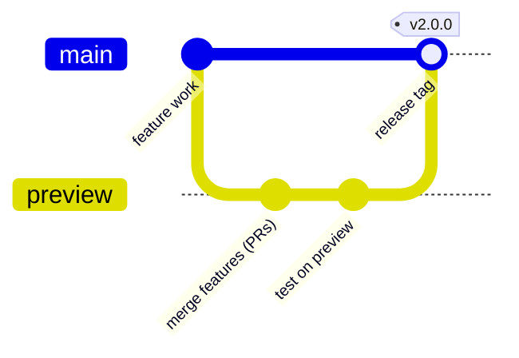

# Cloudflare Infrastructure Guide

This document describes every Cloudflare resource used by the YWCC program websites. Use it to understand, maintain, or replicate the infrastructure when onboarding new team members or handing off the project.

> **Revised 2026-04-29 for the Cloudflare Workers cutover (PR #681).** All three sites now run as **Cloudflare Workers** with `@astrojs/cloudflare` v13 (Workers-only, full SSR via `output: 'server'`). The legacy Pages projects are scheduled for deletion on **2026-05-03**. This guide describes the post-cutover Workers topology; previous Pages-era guidance is no longer accurate. Cloudflare Access has also been retired in favor of Better Auth.

## Table of Contents

- [Architecture Overview](#architecture-overview)
- [Cloudflare Account](#cloudflare-account)
- [Workers (this repo)](#workers-this-repo)
  - [How Workers + Static Assets work](#how-workers--static-assets-work)
  - [ywcc-capstone (production)](#ywcc-capstone-production)
  - [rwc-us, rwc-intl (production, content-only)](#rwc-us-rwc-intl-production-content-only)
  - [\*-preview Workers (Studio Presentation)](#-preview-workers-studio-presentation)
  - [Standalone Workers](#standalone-workers)
  - [Out-of-tree Workers](#out-of-tree-workers)
- [Environment Variables](#environment-variables)
  - [How env vars are sourced](#how-env-vars-are-sourced)
  - [Public client/server vars](#public-clientserver-vars)
  - [Server-only secrets](#server-only-secrets)
  - [Variable matrix by Worker](#variable-matrix-by-worker)
- [Bindings](#bindings)
  - [D1 database (PORTAL_DB)](#d1-database-portal_db)
  - [KV namespaces](#kv-namespaces)
  - [Durable Object (RATE_LIMITER, cross-script)](#durable-object-rate_limiter-cross-script)
  - [Static Assets (ASSETS)](#static-assets-assets)
- [D1 Database Schema](#d1-database-schema)
- [Authentication: Better Auth](#authentication-better-auth)
- [Turnstile (Bot Protection)](#turnstile-bot-protection)
- [Deployment Pipeline](#deployment-pipeline)
- [Local Development](#local-development)
- [Troubleshooting](#troubleshooting)
- [Handoff Checklist](#handoff-checklist)

---

## Architecture Overview

You deploy three production websites and three preview websites — six total Workers — from a single GitHub monorepo. Each Worker builds the same Astro 6 application with different `CLOUDFLARE_ENV` values to control which content, theme, and bindings are active. Static assets ride along inside each Worker via the Workers Static Assets binding (`ASSETS`).

```mermaid
flowchart TD
    subgraph GitHub["GitHub Repository (gsinghjay/astro-shadcn-sanity)"]
        Repo["astro-app/ workspace<br/>+ standalone Workers"]
    end

    subgraph CF["Cloudflare Account: YWCC Capstone Sponsors + RWC<br/>(70bc6caa244ede05b7f964c0c2d533bb)"]
        subgraph Prod["Production Workers"]
            Cap["ywcc-capstone<br/>www.ywcccapstone1.com<br/>red theme · D1+KV+DO"]
            US["rwc-us<br/>rwc-us.js426.workers.dev<br/>blue theme · content-only"]
            Intl["rwc-intl<br/>rwc-intl.js426.workers.dev<br/>green theme · content-only"]
        end

        subgraph Preview["Preview Workers (Studio Presentation)"]
            CapP["ywcc-capstone-preview<br/>drafts + stega"]
            USP["rwc-us-preview"]
            IntlP["rwc-intl-preview"]
        end

        subgraph Standalone["Standalone Workers"]
            RL["rate-limiter-worker<br/>(Durable Object)"]
            ER["ywcc-event-reminders<br/>(daily 09:00 UTC cron)"]
        end

        subgraph Services["Shared services (one D1, several KV)"]
            D1["D1: ywcc-capstone-portal<br/>(PORTAL_DB)"]
            KV["KV: SESSION_CACHE<br/>+ per-Worker session namespaces"]
            Turnstile["Turnstile<br/>Bot protection"]
        end
    end

    subgraph External["External services"]
        Sanity["Sanity CMS<br/>Project: 49nk9b0w<br/>Datasets: production / rwc"]
        OAuth["Google + GitHub OAuth"]
        Resend["Resend<br/>Magic link + reminders"]
        GTM["Google Tag Manager"]
        Discord["Discord Webhooks"]
    end

    Repo -->|"wrangler deploy<br/>(per Worker)"| Prod
    Repo -->|"wrangler deploy"| Preview
    Repo -->|"wrangler deploy"| Standalone

    Cap --> D1
    Cap --> KV
    Cap --> RL
    Cap --> Turnstile
    US --> Turnstile
    Intl --> Turnstile

    ER --> D1
    ER --> Sanity
    ER --> Resend
    ER --> Discord

    Cap --> Sanity
    US --> Sanity
    Intl --> Sanity
    CapP --> Sanity
    USP --> Sanity
    IntlP --> Sanity

    Cap --> OAuth
    Cap --> Resend
    Cap --> GTM
    US --> GTM
    Intl --> GTM
```



**Key concept:** All three sites share one codebase and a single `astro-app/wrangler.jsonc` with six `[env.<name>]` blocks. The `PUBLIC_SITE_ID`, `PUBLIC_SITE_THEME`, and `PUBLIC_SANITY_DATASET` vars (set per-env in `wrangler.jsonc`) tell the application which content to fetch and which theme to apply. Build-time selection happens via `CLOUDFLARE_ENV=<name> astro build`.

---

## Cloudflare Account

| Field | Value |
|---|---|
| Account Name | YWCC Capstone Sponsors + RWC |
| Account ID | `70bc6caa244ede05b7f964c0c2d533bb` |
| Dashboard URL | <https://dash.cloudflare.com/70bc6caa244ede05b7f964c0c2d533bb> |

You access all Workers, D1 databases, KV namespaces, and Turnstile widgets from this single account. **Pages projects are still listed (scheduled for deletion 2026-05-03) but no longer serve traffic.** Custom domains have been detached from the legacy Pages projects and re-attached to the corresponding Workers.

---

## Workers (this repo)

### How Workers + Static Assets work

Cloudflare Workers run JavaScript / WebAssembly on Cloudflare's edge. Each Worker is a single deployable unit configured by `wrangler.jsonc`. The `@astrojs/cloudflare` v13 adapter compiles the Astro app to a server entry (`@astrojs/cloudflare/entrypoints/server`) and emits prerendered files into `astro-app/dist`. The Worker serves SSR routes via the entry; prerendered pages and JS/CSS/images come from the **Static Assets** binding (`ASSETS`), which has unlimited bandwidth on the free plan.

Deploy is explicit: `CLOUDFLARE_ENV=<name> astro build && wrangler deploy`. Astro 6's CF Vite plugin owns env selection and bakes per-env values into the build via `dist/server/wrangler.json` (auto-located by wrangler via `.wrangler/deploy/config.json`). The legacy `wrangler deploy --env <name>` flag is **no longer applicable** under the v13 adapter.

There is no automatic deploy-on-push for the astro-app — pushes to `main` only trigger `release.yml` (semantic-release versioning) and `deploy-storybook.yml`. Cloudflare deploy is manual / on demand.

### ywcc-capstone (production)

The main Capstone Sponsors website — the only Worker with portal, auth, D1, KV, and the rate limiter.

| Field | Value |
|---|---|
| Worker name | `ywcc-capstone` |
| Production domain | <https://www.ywcccapstone1.com> (apex `ywcccapstone1.com` → www via zone-level Single Redirect) |
| `CLOUDFLARE_ENV` | `capstone` |
| Site ID | `capstone` |
| Theme | `red` |
| Sanity Dataset | `production` |
| Bindings | D1 `PORTAL_DB`, KV `SESSION_CACHE`, DO `RATE_LIMITER` (cross-script), `ASSETS` |

**Features that need server-side bindings:**

- Sponsor portal (Better Auth — Google + GitHub OAuth + Resend Magic Link)
- Sponsor agreement gate (audit columns on `user`, version-pinned per active `sponsorAgreement` document)
- GitHub repo linkages for sponsor projects (`project_github_repos` D1 table)
- Contact form Astro Action (Turnstile + Sanity write + Discord webhook)
- Per-IP rate limiting via cross-script Durable Object (`SlidingWindowRateLimiter`)

### rwc-us, rwc-intl (production, content-only)

The Real World Connections US and International program websites. Same codebase as `ywcc-capstone` but with **no D1, no KV, no DO bindings**, no portal, no auth. Any portal/auth/api request returns 503.

| Field | rwc-us | rwc-intl |
|---|---|---|
| Worker name | `rwc-us` | `rwc-intl` |
| Production URL | <https://rwc-us.js426.workers.dev> | <https://rwc-intl.js426.workers.dev> |
| `CLOUDFLARE_ENV` | `rwc_us` | `rwc_intl` |
| Site ID | `rwc-us` | `rwc-intl` |
| Theme | `blue` | `green` |
| Sanity Dataset | `rwc` | `rwc` (same dataset, site-aware filter selects subset) |
| Bindings | `ASSETS` only | `ASSETS` only |

### *-preview Workers (Studio Presentation)

Three additional Workers host the Studio Presentation iframe — drafts perspective + stega, no caching, no portal. The Studio's `presentation/resolve.ts` selects the right preview origin per workspace.

| Worker | Workspace | Preview origin | Notes |
|---|---|---|---|
| `ywcc-capstone-preview` | capstone | <https://ywcc-capstone-preview.js426.workers.dev> | `PUBLIC_SANITY_VISUAL_EDITING_ENABLED=true` |
| `rwc-us-preview` | rwc-us | <https://rwc-us-preview.js426.workers.dev> | `PUBLIC_SANITY_VISUAL_EDITING_ENABLED=true` |
| `rwc-intl-preview` | rwc-intl | <https://rwc-intl-preview.js426.workers.dev> | `PUBLIC_SANITY_VISUAL_EDITING_ENABLED=true` |

These Workers have no D1/KV/DO. They carry `BETTER_AUTH_URL` only because shared code reads it during build — the auth flow itself can't run without `BETTER_AUTH_SECRET` + `PORTAL_DB`.

### Standalone Workers

Two additional Workers ship from this repo with their own `wrangler.jsonc` / `wrangler.toml`:

| Worker name | Source path | Type | Bindings |
|---|---|---|---|
| `rate-limiter-worker` | `rate-limiter-worker/` | Durable Object (`SlidingWindowRateLimiter`) | DO migration v1 (SQLite) |
| `ywcc-event-reminders` | `event-reminders-worker/` | Daily cron `0 9 * * *` | D1 `DB → ywcc-capstone-portal`, secrets for Sanity / Resend / Discord |

Deploy commands:

```bash
# Rate limiter — deploy FIRST when bootstrapping a fresh CF account (capstone middleware fails closed without it)
npm run deploy:rate-limiter   # (root)

# Event reminders
cd event-reminders-worker && npm run deploy
```

### Out-of-tree Workers

Operationally adjacent but **not** in this repo's deploy pipeline:

| Worker name | Purpose |
|---|---|
| `capstone-bot` | Production Discord bot front-end. Service-binds to `capstone-ask-worker`. |
| `capstone-ask-worker` | RAG over CF AI Search index `bf002610-921a-4047-9298-cc2d2668451a`. |
| `little-dawn-0015-nlweb` | MCP-style Worker exposing AI / ASSETS / MCP_OBJECT (DO) / RAG_ID / RATE_LIMITER bindings. |

Touch these via their own change windows.

---

## Environment Variables

### How env vars are sourced

Public + server vars live in `astro-app/wrangler.jsonc` under each `[env.<name>].vars` block. Secrets live in Cloudflare's secret store (one set per Worker). At build time, `astro.config.mjs`:

1. Reads `wrangler.jsonc`, strips comments / strings, parses JSON.
2. Looks up `cfg.env[CLOUDFLARE_ENV].vars`.
3. Mirrors values into `process.env` before `defineConfig` runs (CI overrides win; wrangler block beats `.env`).

This makes `astro:env` (and any direct `process.env` reads inside `src/`) see per-environment values during `astro build`. At runtime, server code reads bindings via `import { env } from 'cloudflare:workers'` and declared vars via `astro:env/client` or `astro:env/server`.

> **Never** use `Astro.locals.runtime.env` or `import.meta.env.VAR` for declared envs. The first was removed in adapter v13; the second is a build-time-only escape hatch reserved for `astro.config.mjs`.

### Public client/server vars

Configured in `wrangler.jsonc` per-env. Safe to display publicly.

| Variable | Purpose | Example value |
|---|---|---|
| `PUBLIC_SANITY_STUDIO_PROJECT_ID` | Sanity project ID | `49nk9b0w` |
| `PUBLIC_SANITY_DATASET` | Frontend dataset | `production` (capstone) / `rwc` (RWC sites) |
| `PUBLIC_SANITY_STUDIO_DATASET` | Studio link dataset | Same as above |
| `PUBLIC_SANITY_STUDIO_URL` | Studio URL (edit links) | `https://ywcccapstone.sanity.studio` |
| `PUBLIC_SANITY_VISUAL_EDITING_ENABLED` | Drafts + stega mode | `false` (prod) / `true` (preview Workers) |
| `PUBLIC_SITE_ID` | Multi-site filter key | `capstone` / `rwc-us` / `rwc-intl` |
| `PUBLIC_SITE_THEME` | CSS theme attr | `red` / `blue` / `green` |
| `PUBLIC_SITE_URL` | Canonical URL | `https://www.ywcccapstone1.com` |
| `PUBLIC_GTM_ID` | GTM container | `GTM-NS9N926Q` (prod) / `""` (preview) |
| `PUBLIC_TURNSTILE_SITE_KEY` | Turnstile widget key | `0x4AAAAAACf0yCNwVePpAiMn` |
| `BETTER_AUTH_URL` | Auth base URL (capstone-only) | `https://www.ywcccapstone1.com` |
| `GITHUB_CLIENT_ID` | OAuth client ID (capstone-only) | `Ov23liFtOiWIyCqJXJMi` |
| `RESEND_FROM_EMAIL` | Sender (capstone-only) | `YWCC Capstone <noreply@intraphase.com>` |
| `STUDIO_ORIGIN` | Allowed Studio frame origin | `https://ywcccapstone.sanity.studio` |

### Server-only secrets

Set via `wrangler secret put <NAME> --name <worker>` or the dashboard. **Never** put these in `wrangler.jsonc` `vars`.

| Variable | Purpose | Used by |
|---|---|---|
| `BETTER_AUTH_SECRET` | Session signing key | `ywcc-capstone` |
| `GITHUB_CLIENT_SECRET` | GitHub OAuth secret | `ywcc-capstone` |
| `GOOGLE_CLIENT_ID` | Google OAuth client ID (kept secret per BA setup) | `ywcc-capstone` |
| `GOOGLE_CLIENT_SECRET` | Google OAuth secret | `ywcc-capstone` |
| `RESEND_API_KEY` | Magic-link + reminder mailer | `ywcc-capstone`, `ywcc-event-reminders` |
| `SANITY_API_READ_TOKEN` | Drafts perspective | preview Workers only |
| `SANITY_API_WRITE_TOKEN` | Sanity write (`submitForm`) | `ywcc-capstone` |
| `TURNSTILE_SECRET_KEY` | Turnstile siteverify | `ywcc-capstone` (forms run on this Worker) |
| `DISCORD_WEBHOOK_URL` | Notifications | `ywcc-capstone`, `ywcc-event-reminders` |

> **Cutover requirement:** at production cutover, `GITHUB_CLIENT_SECRET` must be re-put with the prod GitHub OAuth App's secret (paired with `GITHUB_CLIENT_ID Ov23liFtOiWIyCqJXJMi`). The staging-phase secret paired with `Ov23li8R7jigMPatjOml` is no longer valid.

### Variable matrix by Worker

| Variable | ywcc-capstone | rwc-us | rwc-intl | *-preview |
|---|:---:|:---:|:---:|:---:|
| `PUBLIC_SANITY_STUDIO_PROJECT_ID` | ✓ | ✓ | ✓ | ✓ |
| `PUBLIC_SANITY_DATASET` (`production` vs `rwc`) | ✓ | ✓ | ✓ | ✓ |
| `PUBLIC_SITE_ID` | ✓ | ✓ | ✓ | ✓ |
| `PUBLIC_SITE_THEME` | ✓ | ✓ | ✓ | ✓ |
| `PUBLIC_SITE_URL` | ✓ | ✓ | ✓ | ✓ |
| `PUBLIC_SANITY_VISUAL_EDITING_ENABLED` | `false` | `false` | `false` | `true` |
| `PUBLIC_GTM_ID` | ✓ (`GTM-NS9N926Q`) | ✓ | ✓ | empty |
| `PUBLIC_TURNSTILE_SITE_KEY` | ✓ | ✓ | ✓ | ✓ |
| `BETTER_AUTH_URL` | ✓ | — | — | ✓ (capstone preview only, in vars) |
| `GITHUB_CLIENT_ID` | ✓ | — | — | ✓ (capstone preview only) |
| `BETTER_AUTH_SECRET` (secret) | ✓ | — | — | — |
| `GITHUB_CLIENT_SECRET` (secret) | ✓ | — | — | — |
| `GOOGLE_CLIENT_ID` (secret) | ✓ | — | — | — |
| `GOOGLE_CLIENT_SECRET` (secret) | ✓ | — | — | — |
| `RESEND_API_KEY` (secret) | ✓ | — | — | — |
| `RESEND_FROM_EMAIL` | ✓ | — | — | ✓ (capstone preview only) |
| `SANITY_API_READ_TOKEN` (secret) | — | — | — | ✓ |
| `SANITY_API_WRITE_TOKEN` (secret) | ✓ | — | — | — |
| `TURNSTILE_SECRET_KEY` (secret) | ✓ | — | — | — |
| `DISCORD_WEBHOOK_URL` (secret) | ✓ | — | — | — |

(`ywcc-event-reminders` is a separate standalone Worker; its secrets are managed there: `SANITY_API_TOKEN`, `RESEND_API_KEY`, `DISCORD_WEBHOOK_URL`.)

After any `wrangler.jsonc` change: regenerate types via `npx wrangler types -C astro-app` so `worker-configuration.d.ts` stays in sync with TypeScript.

---

## Bindings

Bindings connect a Worker to other Cloudflare services. They live in `astro-app/wrangler.jsonc` under each `[env.<name>]` block — **not** in the dashboard. Edit + commit + redeploy to change bindings; the wrangler.jsonc is the source of truth.

### D1 database (PORTAL_DB)

D1 is Cloudflare's serverless SQLite database. This project uses **one** D1 database shared by `ywcc-capstone` (binding `PORTAL_DB`) and `ywcc-event-reminders` (binding `DB`).

| Field | Value |
|---|---|
| Binding name (capstone) | `PORTAL_DB` |
| Binding name (event-reminders) | `DB` |
| Database name | `ywcc-capstone-portal` |
| Database UUID | `76887418-c356-46d8-983b-fa6e395d8b16` |
| Region | ENAM (US East) |
| Tables | 13 (4 Better Auth + 3 feature + 6 legacy `0000_init`) |

**Configured in:** `astro-app/wrangler.jsonc` `[env.capstone].d1_databases` and `event-reminders-worker/wrangler.toml` `[[d1_databases]]`.

**Common pitfall:** Only `[env.capstone]` declares `d1_databases`. The RWC and preview blocks omit them intentionally. If a portal route accidentally runs against an RWC Worker, the missing binding causes a 503 (the middleware catches it).

### KV namespaces

KV is a global, low-latency key-value store. The capstone Worker uses one for Better Auth session caching. Several other namespaces exist in the account from the cutover provisioning — only `SESSION_CACHE` (id `f78af5695075451c9d3d7887368e90dc`) is bound by the current code.

| Binding name | Namespace title | Namespace ID | Used by |
|---|---|---|---|
| `SESSION_CACHE` | `SESSION_CACHE` | `f78af5695075451c9d3d7887368e90dc` | `ywcc-capstone` |
| (unbound) | `ywcc-capstone-session` | `4baee499566e42859dc003213cfffe94` | (cutover-provisioned, not in code) |
| (unbound) | `ywcc-capstone-preview-session` | `dfe44815e6ce4689bc2d868d088c77c1` | (cutover-provisioned, not in code) |
| (unbound) | `rwc-us-session` | `6bfebcb0cea7491cbb124d014ce43e43` | (cutover-provisioned) |
| (unbound) | `rwc-us-preview-session` | `3abcd743fdea4182ba7eedfa19c74e2b` | (cutover-provisioned) |
| (unbound) | `rwc-intl-session` | `efde9d43ed2e4bac8366374c19917643` | (cutover-provisioned) |
| (unbound) | `rwc-intl-preview-session` | `402d0ca31cdc4e96b45a4a9398eab218` | (cutover-provisioned) |
| (unbound) | `KV` | `992346b9e7884c97b3fe652c4da27632` | (legacy from earlier experiments) |

**Cleanup recommendation:** the seven unbound namespaces can be deleted after the Pages projects are removed (2026-05-03), unless any of them is referenced by an out-of-tree Worker — verify before deletion.

**Graceful degradation:** if `SESSION_CACHE` is missing, the middleware skips the KV cache and queries D1 directly. The site still works, with slightly higher latency on authenticated routes.

### Durable Object (RATE_LIMITER, cross-script)

The capstone Worker binds the rate-limit DO from a **separate Worker** (`rate-limiter-worker`) via `script_name`. The DO class lives in `rate-limiter-worker/src/index.ts`; the capstone Worker only holds a binding stub.

```jsonc
// astro-app/wrangler.jsonc — under [env.capstone]
"durable_objects": {
  "bindings": [{
    "name": "RATE_LIMITER",
    "class_name": "SlidingWindowRateLimiter",
    "script_name": "rate-limiter-worker"
  }]
}
```

**Critical**: deploy `rate-limiter-worker` **before** `ywcc-capstone`. The capstone middleware fails closed if the binding is unhealthy — see [Rate Limiting with Durable Objects](rate-limiting-with-durable-objects.md).

### Static Assets (ASSETS)

Each Worker binds the build output directory `./dist` via the Workers Static Assets runtime:

```jsonc
"assets": {
  "directory": "./dist",
  "binding": "ASSETS"
}
```

This serves prerendered HTML, JS, CSS, and image bundles from Cloudflare's edge with unlimited bandwidth on the free plan. The Astro server entry handles only SSR routes.

---

## D1 Database Schema

The database contains **13 tables** in three eras: legacy portal scaffolding (`0000_init.sql`), Better Auth core (`0001_student_auth.sql`), and feature additions (`0004` / `0005` / `0006`). Sponsor agreement gate state is stored as **columns on `user`** (added by 0007 / 0009), not a separate table.

For the full schema, column lists, indexes, and migration descriptions, see [Data Models](data-models.md). Quick reference:

| Migration | Effect |
|---|---|
| 0000_init.sql | Legacy portal tables (`portal_activity`, `event_rsvps`, `evaluations`, `agreement_signatures`, `notification_preferences`, `notifications`) — predates Better Auth |
| 0001_student_auth.sql | Better Auth core (`user`, `session`, `account`, `verification`) |
| 0002_add_user_role.sql | `user.role` column |
| 0003_backfill_sponsor_roles.sql | Backfill |
| 0004_create_subscribers.sql | Newsletter subscribers |
| 0005_create_sent_reminders.sql | Reminder dedupe (used by event-reminders Worker) |
| 0006_create_project_github_repos.sql | Sponsor → GitHub repo linkages |
| 0007_add_agreement_acceptance.sql | `user.agreement_accepted_at` |
| 0008_backfill_agreement_acceptance.sql | Backfill |
| 0009_add_agreement_version_and_audit.sql | `user.agreement_version` + `agreement_accepted_ip` + `agreement_accepted_user_agent` |

### Running migrations

Wrangler CLI from `astro-app/`:

```bash
# Local (creates a local SQLite file under .wrangler/)
npx wrangler d1 migrations apply PORTAL_DB --local

# Production (remote)
npx wrangler d1 migrations apply PORTAL_DB --remote

# Status
npx wrangler d1 migrations list PORTAL_DB --remote

# Ad-hoc query
npx wrangler d1 execute PORTAL_DB --remote --command='SELECT count(*) FROM user'
```

Migrations apply in filename order. The `event-reminders-worker` does **not** maintain its own migration set — `astro-app/migrations/` is the single source of truth.

---

## Authentication: Better Auth

Cloudflare Access has been **retired**. Authentication is now handled entirely by Better Auth on `ywcc-capstone`:

- **Providers**: Google OAuth, GitHub OAuth, Resend Magic Link.
- **Session storage**: D1 `session` table.
- **Session cache**: KV `SESSION_CACHE`.
- **Catch-all routes**: `src/pages/api/auth/[...all].ts` proxies Better Auth's request handler.
- **Session lookup**: middleware verifies session per request; the agreement gate adds version pinning + audit on top.

Sponsor lookup uses `SPONSOR_BY_EMAIL_QUERY` against Sanity (matches `contactEmail` or `$email in allowedEmails`), so multi-contact sponsors can authorize multiple addresses.

For the full migration rationale, see [Authentication Consolidation Strategy](auth-consolidation-strategy.md).

---

## Turnstile (Bot Protection)

Turnstile is Cloudflare's CAPTCHA alternative. It protects forms from bots without showing puzzles to real users.

| Field | Value |
|---|---|
| Site Key (public) | `0x4AAAAAACf0yCNwVePpAiMn` |
| Secret Key | Stored as `TURNSTILE_SECRET_KEY` (Worker secret on `ywcc-capstone`) |

**How it works:**

1. Forms include the Turnstile widget keyed to `PUBLIC_TURNSTILE_SITE_KEY`.
2. The widget generates a token when the user interacts with the page.
3. The `submitForm` Astro Action POSTs the token to `https://challenges.cloudflare.com/turnstile/v0/siteverify` with `TURNSTILE_SECRET_KEY`.
4. Cloudflare responds with pass/fail; the form submission is rejected if verification fails.

The same site key is shared across all Workers (the public key is safe to expose). Only `ywcc-capstone` runs the Action (RWC sites omit form processing).

---

## Deployment Pipeline

### Branch strategy



| Branch | Role |
|---|---|
| `feature/*` | Active development. PR target = `preview`. |
| `preview` | Integration. PR target = `main`. CI runs Vitest + LHCI + Pa11y on every PR here. |
| `main` | Release. `release.yml` (semantic-release) tags + bumps version + writes `CHANGELOG.md`. `sync-preview.yml` auto-merges back to `preview`. |

`enforce-preview-branch.yml` blocks any PR into `main` from a branch other than `preview`. `enforce-preview-source.yml` blocks `main → preview` PRs (auto-sync only). Branch protection is enforced at the workflow level.

### Build configuration

Each Worker builds the same source with a different `CLOUDFLARE_ENV`. Build commands live in `astro-app/package.json`:

| Script | Effect |
|---|---|
| `deploy:capstone` | `CLOUDFLARE_ENV=capstone astro build && wrangler deploy` |
| `deploy:rwc-us` | `CLOUDFLARE_ENV=rwc_us astro build && wrangler deploy` |
| `deploy:rwc-intl` | `CLOUDFLARE_ENV=rwc_intl astro build && wrangler deploy` |
| `deploy:capstone-preview` | `CLOUDFLARE_ENV=capstone_preview astro build && wrangler deploy` |
| `deploy:rwc-us-preview` | `CLOUDFLARE_ENV=rwc_us_preview astro build && wrangler deploy` |
| `deploy:rwc-intl-preview` | `CLOUDFLARE_ENV=rwc_intl_preview astro build && wrangler deploy` |

Wrangler reads `dist/server/wrangler.json` (auto-generated by the Astro v13 adapter) to find the right env block. The `--env <name>` flag is **not** used.

### How to trigger a deploy

**No automatic Cloudflare deploy on git push.** The astro-app deploys on demand:

```bash
# From astro-app/
npm run deploy:capstone           # production capstone
npm run deploy:rwc-us             # production RWC US
npm run deploy:rwc-intl           # production RWC International
npm run deploy:capstone-preview   # Studio Presentation iframe target
```

Standalone Workers:

```bash
npm run deploy:rate-limiter            # (root) — deploy first when bootstrapping
cd event-reminders-worker && npm run deploy
```

Sanity content updates (publish-only on `_type in ["page","siteSettings","sponsor","project","team","event"]`) trigger CF Deploy Hooks per environment (~45-75s rebuild):

| Worker | Hook ID | Hook name |
|---|---|---|
| ywcc-capstone | `f6e2c5c6-8951-455c-b48b-6afcbbc82bbb` | sanity-content-update-capstone |
| rwc-us | `bca5ddca-d7d0-4742-9308-e405aa38122f` | sanity-content-update-rwc-us |
| rwc-intl | `8edab80c-19c0-4b68-8ca2-5bba8586646c` | sanity-content-update-rwc-intl |

### How to roll back

Workers keep deployment history. Roll back via dashboard: **Workers & Pages > <worker-name> > Deployments > [previous deploy] > Rollback**.

Or from the CLI:

```bash
npx wrangler deployments list --name ywcc-capstone
npx wrangler rollback --name ywcc-capstone --message "Rolling back to vX.Y.Z" <deployment-id>
```

Each deployment gets a unique URL like `<hash>-ywcc-capstone.js426.workers.dev` for verification before promoting.

---

## Local Development

`astro-app/wrangler.jsonc` is the **single source of truth** for production env vars and bindings. There is no separate Pages dashboard configuration.

**Astro dev server (no Cloudflare bindings — recommended for most work):**

```bash
npm run dev -w astro-app   # http://localhost:4321
```

In dev mode, the middleware short-circuits authentication and creates a mock sponsor user. You don't need D1 / KV / DO running locally for most feature work.

**Astro preview against the built dist (Workers-style):**

```bash
npm run build -w astro-app
npm run preview -w astro-app  # serves dist/ on :4321
```

> **The legacy `wrangler pages dev` command is no longer applicable** — the Pages adapter is dropped. Use `astro preview` for local SSR preview against a built `dist/`.

**Local D1**:

```bash
cd astro-app
npx wrangler d1 migrations apply PORTAL_DB --local
npx wrangler d1 execute PORTAL_DB --local --command='SELECT * FROM user'
```

The local SQLite file lives under `astro-app/.wrangler/`.

### Compatibility flags

Configured at the top of `astro-app/wrangler.jsonc`:

| Flag | Purpose |
|---|---|
| `compatibility_date: "2025-12-01"` | Locks runtime behavior to this date |
| `nodejs_compat` | Allows Node.js APIs (Better Auth, Drizzle) |
| `global_fetch_strictly_public` | Prevents accidental fetches to private CF infrastructure |
| `disable_nodejs_process_v2` | Workaround for Astro #15434 / #14511 (SSR responses stringifying to `[object Object]`). **Re-evaluate when `compatibility_date >= 2026-02-19` lands `fetch_iterable_type_support`.** |

Bumping `compatibility_date` past `2025-12-01` requires re-validating the workaround flag set.

---

## Troubleshooting

### 503 Service Unavailable on `/portal/*`

**Cause:** A required binding is missing on the Worker handling the request, or the request hit `rwc-us` / `rwc-intl` (which intentionally don't bind D1/KV/DO).

**Fix:** Check that the request is hitting `ywcc-capstone` (the only Worker that serves portal routes). If so, verify D1 + KV + DO bindings are present in `[env.capstone]` in `wrangler.jsonc` and that `npx wrangler types -C astro-app` has been re-run after any binding edit. The middleware at `astro-app/src/middleware.ts` catches errors in the auth branches and returns 503; check Worker logs for the underlying message.

### `[object Object]` in SSR responses

**Cause:** Astro 6 + adapter v13 + middleware emits SSR responses as async iterables that workerd stringifies to literal `[object Object]` without the right compat flags.

**Fix:** Confirm `compatibility_flags` includes all of `nodejs_compat`, `global_fetch_strictly_public`, `disable_nodejs_process_v2`. This is the documented workaround for Astro #15434 / #14511. Remove `disable_nodejs_process_v2` only after `compatibility_date >= 2026-02-19` (when `fetch_iterable_type_support` lands).

### Capstone deploy fails with "DO class not found"

**Cause:** `rate-limiter-worker` is not deployed (or is unhealthy), so the cross-script DO binding fails.

**Fix:** Deploy the rate limiter first:

```bash
npm run deploy:rate-limiter   # (root)
```

Then deploy capstone. When bootstrapping a fresh CF account, this is always the order.

### Login redirects in a loop

**Cause:** `BETTER_AUTH_URL` does not match the actual deployment URL.

**Fix:** Confirm `[env.capstone].vars.BETTER_AUTH_URL` is `https://www.ywcccapstone1.com`. The apex `ywcccapstone1.com` 301s to `www` via a zone-level Single Redirect rule and never reaches the Worker — `BETTER_AUTH_URL` must use the canonical `www` host.

### OAuth `redirect_uri_mismatch`

**Cause:** The Google or GitHub OAuth app does not list the deployment URL as an authorized redirect URI.

**Fix:** Add to the OAuth app:

```
https://www.ywcccapstone1.com/api/auth/callback/google
https://www.ywcccapstone1.com/api/auth/callback/github
```

For preview deployments (Studio Presentation), the iframe origin is `https://ywcc-capstone-preview.js426.workers.dev`. Preview Workers don't run the auth flow but the URL must be valid for any test sign-in attempts.

### Turnstile verification fails for all submissions

**Cause:** `TURNSTILE_SECRET_KEY` not set on `ywcc-capstone`, or the public site key in `wrangler.jsonc` doesn't match.

**Fix:** Confirm both:

```bash
# Public site key in wrangler.jsonc (per env)
grep PUBLIC_TURNSTILE_SITE_KEY astro-app/wrangler.jsonc

# Secret on the Worker
npx wrangler secret list --name ywcc-capstone | grep TURNSTILE
# If missing:
npx wrangler secret put TURNSTILE_SECRET_KEY --name ywcc-capstone
```

### `wrangler.jsonc` change doesn't take effect

**Cause:** Either you forgot to re-run the type generator, or the Astro Vite plugin cached a previous env block.

**Fix:**

```bash
npx wrangler types -C astro-app
rm -rf astro-app/.wrangler astro-app/dist
npm run deploy:<env> -w astro-app
```

---

## Handoff Checklist

Use this checklist when transferring the project to another team.

### Account access

- [ ] New team member invited to Cloudflare account `70bc6caa244ede05b7f964c0c2d533bb`
- [ ] Appropriate role assigned (Admin for full control, or specific Workers / D1 / KV permissions)
- [ ] Pages projects (scheduled for deletion 2026-05-03) — confirm no traffic, then delete

### Secrets rotation

When handing off, rotate these secrets and update them on each Worker via `wrangler secret put <NAME> --name <worker>`:

- [ ] `BETTER_AUTH_SECRET` — Generate new: `openssl rand -hex 32`
- [ ] `SANITY_API_READ_TOKEN` — Generate new in Sanity management console (preview Workers)
- [ ] `SANITY_API_WRITE_TOKEN` — Generate new in Sanity management console (capstone)
- [ ] `TURNSTILE_SECRET_KEY` — Rotate in Cloudflare Turnstile dashboard
- [ ] `GITHUB_CLIENT_SECRET` — Rotate in GitHub OAuth App settings
- [ ] `GOOGLE_CLIENT_SECRET` — Rotate in Google Cloud Console
- [ ] `RESEND_API_KEY` — Rotate in Resend dashboard
- [ ] `DISCORD_WEBHOOK_URL` — Rotate via the target Discord channel settings

### External service access

These services are outside Cloudflare and need access transferred:

- [ ] **Sanity CMS** — Project ID `49nk9b0w` at <https://ywcccapstone.sanity.studio>
- [ ] **Google Cloud Console** — OAuth credentials for sponsor login
- [ ] **GitHub OAuth App** — `Ov23liFtOiWIyCqJXJMi` (production)
- [ ] **Resend** — API key for magic link + reminders
- [ ] **Google Tag Manager** — Container `GTM-NS9N926Q`
- [ ] **Discord** — Webhook URLs for form notifications
- [ ] **GitHub repository** — `gsinghjay/astro-shadcn-sanity`

### Verification

After handoff, verify each Worker works end-to-end:

- [ ] <https://www.ywcccapstone1.com> loads (apex redirects to www)
- [ ] <https://www.ywcccapstone1.com/portal> shows Better Auth login
- [ ] Sponsor login succeeds with Google / GitHub / Magic Link
- [ ] Sponsor agreement gate shows on first authenticated visit; accepting unblocks portal
- [ ] <https://rwc-us.js426.workers.dev> loads with blue theme
- [ ] <https://rwc-intl.js426.workers.dev> loads with green theme
- [ ] Contact form submits successfully (Turnstile + Sanity + Discord)
- [ ] Studio Presentation preview opens an iframe at `ywcc-capstone-preview.js426.workers.dev`
- [ ] D1 is accessible: `npx wrangler d1 execute PORTAL_DB --remote --command='SELECT count(*) FROM user'`
- [ ] Daily event reminders cron fires at 09:00 UTC (check Worker logs)
- [ ] Rate limiter responds to repeated requests with 429 + `Retry-After` header
