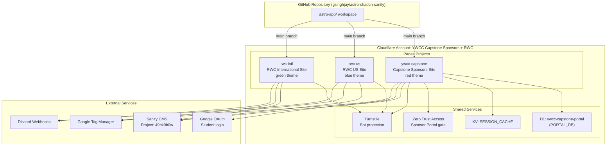
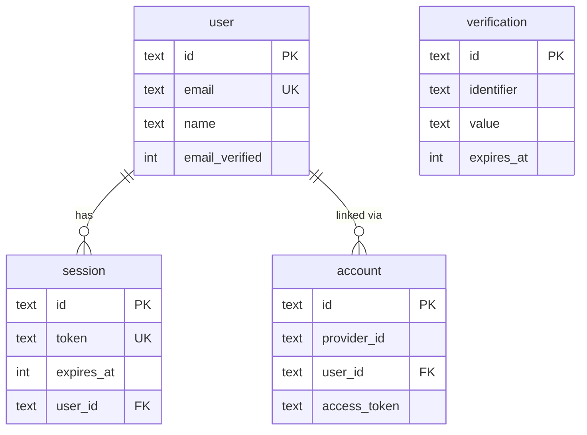
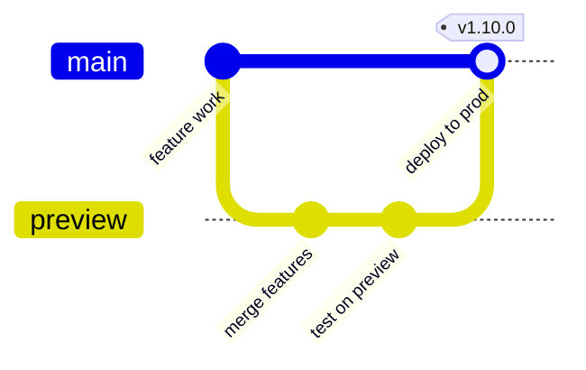

# Cloudflare Infrastructure Guide

This document describes every Cloudflare resource used by the YWCC program websites. Use it to understand, maintain, or replicate the infrastructure when onboarding new team members or handing off the project.

## Table of Contents

- [Architecture Overview](#architecture-overview)
- [Cloudflare Account](#cloudflare-account)
- [Pages Projects](#pages-projects)
  - [How Pages Works](#how-pages-works)
  - [ywcc-capstone](#ywcc-capstone)
  - [rwc-us](#rwc-us)
  - [rwc-intl](#rwc-intl)
- [Environment Variables](#environment-variables)
  - [Build-Time Variables (PUBLIC_)](#build-time-variables-public_)
  - [Server-Side Secrets](#server-side-secrets)
  - [Variable Matrix by Project](#variable-matrix-by-project)
- [Bindings](#bindings)
  - [D1 Database (PORTAL_DB)](#d1-database-portal_db)
  - [KV Namespace (SESSION_CACHE)](#kv-namespace-session_cache)
- [D1 Database Schema](#d1-database-schema)
  - [Sponsor Portal Tables](#sponsor-portal-tables)
  - [Student Auth Tables](#student-auth-tables)
  - [Running Migrations](#running-migrations)
- [Cloudflare Access (Zero Trust)](#cloudflare-access-zero-trust)
  - [Application: Sponsor Portal](#application-sponsor-portal)
  - [Identity Providers](#identity-providers)
- [Turnstile (Bot Protection)](#turnstile-bot-protection)
- [Deployment Pipeline](#deployment-pipeline)
  - [Branch Strategy](#branch-strategy)
  - [Build Configuration](#build-configuration)
  - [Path Filtering](#path-filtering)
  - [How to Trigger a Deploy](#how-to-trigger-a-deploy)
  - [How to Roll Back](#how-to-roll-back)
- [Local Development](#local-development)
- [Troubleshooting](#troubleshooting)
- [Handoff Checklist](#handoff-checklist)

---

## Architecture Overview

You deploy three websites from a single GitHub monorepo. Each website is a separate Cloudflare Pages project that builds the same Astro application with different environment variables to control which content and theme is displayed.



**Key concept:** All three sites share one codebase. The `PUBLIC_SITE_ID` variable (`capstone`, `rwc-us`, or `rwc-intl`) tells the application which content to fetch and which theme to apply.

---

## Cloudflare Account

| Field | Value |
|---|---|
| Account Name | YWCC Capstone Sponsors + RWC |
| Account ID | `70bc6caa244ede05b7f964c0c2d533bb` |
| Dashboard URL | <https://dash.cloudflare.com/70bc6caa244ede05b7f964c0c2d533bb> |

You access all Pages projects, D1 databases, KV namespaces, Access applications, and Turnstile widgets from this single account.

---

## Pages Projects

### How Pages Works

Cloudflare Pages is a hosting platform that builds and deploys your site automatically when you push code to GitHub. Each Pages project connects to the same GitHub repository but produces a separate website with its own URL, environment variables, and bindings.

When you push to a branch:

1. Cloudflare detects the push
2. It clones the repo and runs the build command
3. The build output is deployed to Cloudflare's global network
4. The site is available at `https://<project-name>.pages.dev`

Each project has two environments: **production** (from the `main` branch) and **preview** (from other configured branches).

### ywcc-capstone

The main Capstone Sponsors website. This project has the richest configuration because it runs both the sponsor portal (Cloudflare Access) and the student portal (Better Auth + Google OAuth).

| Field | Value |
|---|---|
| Project Name | `ywcc-capstone` |
| Production URL | <https://ywcc-capstone.pages.dev> |
| Site ID | `capstone` |
| Theme | `red` |
| Sanity Dataset | `production` |
| Framework | Astro |

**Features requiring server-side bindings:**

- Sponsor portal authentication (Cloudflare Access)
- Student portal authentication (Better Auth + D1 + KV cache)
- Contact form submission (Turnstile + Discord webhook + Sanity write)
- Event RSVPs, evaluations, agreement signatures (D1)

### rwc-us

The Real World Connections US program website. A content-only site with no portal authentication.

| Field | Value |
|---|---|
| Project Name | `rwc-us` |
| Production URL | <https://rwc-us.pages.dev> |
| Site ID | `rwc-us` |
| Theme | `blue` |
| Sanity Dataset | `rwc` |

### rwc-intl

The Real World Connections International program website. Identical configuration to `rwc-us` except for the site ID and theme.

| Field | Value |
|---|---|
| Project Name | `rwc-intl` |
| Production URL | <https://rwc-intl.pages.dev> |
| Site ID | `rwc-intl` |
| Theme | `green` |
| Sanity Dataset | `rwc` |

---

## Environment Variables

Cloudflare Pages uses two kinds of variables:

- **Build-time variables** (prefix `PUBLIC_`): Baked into the JavaScript bundle during the build. Available in browser-side code via `import.meta.env.PUBLIC_*`. Visible to anyone who inspects your site's source code.
- **Server-side secrets**: Available only inside server-side functions (middleware, API routes) at runtime via `context.locals.runtime.env.*`. Never exposed to the browser.

You set these in the Cloudflare Pages dashboard under **Settings > Environment variables** for each project. Each project has separate settings for **Production** and **Preview**.

### Build-Time Variables (PUBLIC_)

These are safe to display publicly. They configure which content and features the site shows.

| Variable | Purpose | Example Value |
|---|---|---|
| `PUBLIC_SANITY_STUDIO_PROJECT_ID` | Sanity project identifier | `49nk9b0w` |
| `PUBLIC_SANITY_DATASET` | Which Sanity dataset to query | `production` or `rwc` |
| `PUBLIC_SANITY_STUDIO_DATASET` | Dataset for Studio links | Same as above |
| `PUBLIC_SANITY_STUDIO_URL` | URL to Sanity Studio (for edit links) | `https://ywcccapstone.sanity.studio` |
| `PUBLIC_SANITY_VISUAL_EDITING_ENABLED` | Enable live preview editing | `true` or `false` |
| `PUBLIC_SITE_ID` | Controls content filtering and navigation | `capstone`, `rwc-us`, or `rwc-intl` |
| `PUBLIC_SITE_THEME` | Color theme for the site | `red`, `blue`, or `green` |
| `PUBLIC_SITE_URL` | Canonical URL of the site | `https://ywcc-capstone.pages.dev` |
| `PUBLIC_GTM_ID` | Google Tag Manager container ID | `GTM-NS9N926Q` |
| `PUBLIC_TURNSTILE_SITE_KEY` | Turnstile widget public key (for forms) | `0x4AAAAAACf0yCNwVePpAiMn` |

### Server-Side Secrets

These are sensitive values that must never appear in client-side code. The Cloudflare dashboard shows them as `(encrypted)` after you save them.

| Variable | Purpose | Used By |
|---|---|---|
| `SANITY_API_READ_TOKEN` | Read content from Sanity (when visual editing is on) | All projects |
| `SANITY_API_WRITE_TOKEN` | Write to Sanity (contact form submissions) | All projects |
| `TURNSTILE_SECRET_KEY` | Server-side Turnstile verification | All projects |
| `DISCORD_WEBHOOK_URL` | Send form notifications to Discord | `rwc-us`, `rwc-intl` |
| `CF_ACCESS_TEAM_DOMAIN` | Cloudflare Access team domain URL | `ywcc-capstone` |
| `CF_ACCESS_AUD` | Cloudflare Access application audience tag | `ywcc-capstone` (production only) |
| `GOOGLE_CLIENT_ID` | Google OAuth client ID for student login | `ywcc-capstone` |
| `GOOGLE_CLIENT_SECRET` | Google OAuth client secret | `ywcc-capstone` |
| `BETTER_AUTH_SECRET` | Session signing key for student auth | `ywcc-capstone` |
| `BETTER_AUTH_URL` | Base URL for OAuth callbacks | `ywcc-capstone` |

### Variable Matrix by Project

This table shows which variables are configured on each project. Use it as a checklist when setting up a new project or auditing an existing one.

| Variable | ywcc-capstone | rwc-us | rwc-intl |
|---|---|---|---|
| `PUBLIC_SANITY_STUDIO_PROJECT_ID` | `49nk9b0w` | `49nk9b0w` | `49nk9b0w` |
| `PUBLIC_SANITY_DATASET` | `production` | `rwc` | `rwc` |
| `PUBLIC_SITE_ID` | `capstone` | `rwc-us` | `rwc-intl` |
| `PUBLIC_SITE_THEME` | `red` | `blue` | `green` |
| `PUBLIC_SITE_URL` | `https://ywcc-capstone.pages.dev` | `https://rwc-us.pages.dev` | `https://rwc-intl.pages.dev` |
| `PUBLIC_GTM_ID` | `GTM-NS9N926Q` | `GTM-NS9N926Q` | `GTM-NS9N926Q` |
| `PUBLIC_TURNSTILE_SITE_KEY` | `0x4AAAAAACf0yCNwVePpAiMn` | `0x4AAAAAACf0yCNwVePpAiMn` | `0x4AAAAAACf0yCNwVePpAiMn` |
| `SANITY_API_READ_TOKEN` | Yes (secret) | Yes (secret) | Yes (secret) |
| `SANITY_API_WRITE_TOKEN` | Yes (secret) | Yes (secret) | Yes (secret) |
| `TURNSTILE_SECRET_KEY` | Yes (secret) | Yes (secret) | Yes (secret) |
| `DISCORD_WEBHOOK_URL` | -- | Yes (secret) | Yes (secret) |
| `CF_ACCESS_TEAM_DOMAIN` | Yes | -- | -- |
| `CF_ACCESS_AUD` | Yes (secret) | -- | -- |
| `GOOGLE_CLIENT_ID` | Yes (secret) | -- | -- |
| `GOOGLE_CLIENT_SECRET` | Yes (secret) | -- | -- |
| `BETTER_AUTH_SECRET` | Yes (secret) | -- | -- |
| `BETTER_AUTH_URL` | Yes (secret) | -- | -- |

---

## Bindings

Bindings connect your Pages project to other Cloudflare services (databases, key-value stores, etc.). You configure them in the Pages dashboard under **Settings > Functions > Bindings**, separately for Production and Preview.

**Only `ywcc-capstone` uses bindings.** The RWC sites do not need them because they have no portals or authentication.

### D1 Database (PORTAL_DB)

D1 is Cloudflare's serverless SQLite database. This project uses a single D1 database for both the sponsor portal (transactional data) and student portal (auth sessions).

| Field | Value |
|---|---|
| Binding Name | `PORTAL_DB` |
| Database Name | `ywcc-capstone-portal` |
| Database ID | `76887418-c356-46d8-983b-fa6e395d8b16` |
| Region | ENAM (US East) |
| Tables | 11 |

**Where to configure:** Pages dashboard > `ywcc-capstone` > Settings > Functions > D1 database bindings. Add the binding for both **Production** and **Preview** environments.

**Common pitfall:** If you add the binding to Preview but forget Production, the `/student/` and `/portal/` routes return **503 Service Unavailable**. The middleware catches the missing binding error and returns a 503.

### KV Namespace (SESSION_CACHE)

KV (Key-Value) is a global, low-latency key-value store. This project uses it as an optional session cache to reduce D1 reads during student authentication.

| Field | Value |
|---|---|
| Binding Name | `SESSION_CACHE` |
| Namespace Title | `SESSION_CACHE` |
| Namespace ID | `f78af5695075451c9d3d7887368e90dc` |

**Where to configure:** Pages dashboard > `ywcc-capstone` > Settings > Functions > KV namespace bindings. Add for both **Production** and **Preview**.

**Graceful degradation:** If this binding is missing, the middleware skips the KV cache and queries D1 directly for every request. The site still works, but with slightly higher latency on authenticated routes.

---

## D1 Database Schema

The database contains two groups of tables. Two migration files create them.

### Sponsor Portal Tables

The migration file `astro-app/migrations/0000_init.sql` creates these tables. They store transactional data for sponsor interactions.

| Table | Purpose | Key Columns |
|---|---|---|
| `portal_activity` | Tracks sponsor page views and actions | `sponsor_email`, `action`, `resource_type` |
| `event_rsvps` | Event attendance responses | `event_sanity_id`, `sponsor_email`, `status` |
| `evaluations` | Sponsor evaluations of student projects | `project_sanity_id`, `evaluator_email`, `scores` |
| `agreement_signatures` | Legal agreement sign-off records | `sponsor_email`, `agreement_type`, `signed_at` |
| `notification_preferences` | Per-sponsor notification settings | `sponsor_email`, `email_digest` |
| `notifications` | Notification inbox items | `sponsor_email`, `title`, `is_read` |

### Student Auth Tables

The migration file `astro-app/migrations/0001_student_auth.sql` creates these tables. They handle Better Auth session management.

| Table | Purpose | Key Columns |
|---|---|---|
| `user` | Student accounts | `id`, `email`, `name`, `email_verified` |
| `session` | Active login sessions | `token`, `user_id`, `expires_at` |
| `account` | OAuth provider links (Google) | `provider_id`, `user_id`, `access_token` |
| `verification` | Email/OAuth verification tokens | `identifier`, `value`, `expires_at` |



### Running Migrations

You apply migrations using the Wrangler CLI, running them against the remote D1 database.

**Apply all migrations to production:**

```bash
npx wrangler d1 migrations apply ywcc-capstone-portal --remote
```

**Apply to local development database:**

```bash
npx wrangler d1 migrations apply ywcc-capstone-portal --local
```

**Check migration status:**

```bash
npx wrangler d1 migrations list ywcc-capstone-portal --remote
```

Migration files live in `astro-app/migrations/` and are applied in filename order (`0000_`, `0001_`, etc.).

---

## Cloudflare Access (Zero Trust)

> **Transitional.** Cloudflare Access is being retired for this project. The sponsor portal is migrating to Better Auth (Google OAuth + D1 sessions), which eliminates the 50-seat free-tier limit and consolidates both portals onto a single auth system. See [Authentication Consolidation Strategy](auth-consolidation-strategy.md) for the full migration plan. The information below remains accurate until the migration is complete.

Cloudflare Access protects the sponsor portal (`/portal/*` routes) by requiring authentication before users reach the application. This is a separate auth system from the student portal's Better Auth.

### Application: Sponsor Portal

| Field | Value |
|---|---|
| Application Name | YWCC Capstone Sponsor Portal |
| Application ID | `432ca3d7-4cfe-42da-813e-5cb6b08ba7f3` |
| Type | Self-hosted |
| Protected Domain | `ywcc-capstone.pages.dev/portal` |
| Session Duration | 24 hours |

When a sponsor visits `/portal`, Cloudflare Access intercepts the request and presents a login screen. After authentication, Access sets a JWT cookie that the application middleware validates on every request.

### Identity Providers

The application uses two login methods:

| Provider | Type | ID |
|---|---|---|
| One-Time PIN | Email code (magic link) | `9b29905a-76d5-455a-a16c-e95d21a22ecb` |
| Google | Google Workspace / Gmail | `f74ec429-ee52-4274-8568-718eeaa7a3d0` |

**How it works:** Sponsors receive a one-time PIN via email or sign in with Google. Access policies (configured in the Zero Trust dashboard) control which email addresses or domains are allowed.

**Related environment variables:**

- `CF_ACCESS_TEAM_DOMAIN` — The Access team URL (e.g., `https://ywcc-capstone-pages.cloudflareaccess.com`)
- `CF_ACCESS_AUD` — The application audience tag (a long string from the Zero Trust dashboard, used to verify JWTs)

---

## Turnstile (Bot Protection)

Turnstile is Cloudflare's CAPTCHA alternative. It protects forms from bots without showing puzzles to real users.

| Field | Value |
|---|---|
| Site Key (public) | `0x4AAAAAACf0yCNwVePpAiMn` |
| Secret Key | Stored as `TURNSTILE_SECRET_KEY` in each project |

**How it works:**

1. The contact form includes the Turnstile widget (using `PUBLIC_TURNSTILE_SITE_KEY`)
2. The widget generates a token when the user interacts with the page
3. The server-side form handler sends the token to Cloudflare's API with the `TURNSTILE_SECRET_KEY`
4. Cloudflare responds with pass/fail
5. The form submission is rejected if verification fails

The same site key and secret key are shared across all three projects.

---

## Deployment Pipeline

### Branch Strategy



| Branch | Deploys To | URL Pattern |
|---|---|---|
| `main` | Production | `https://<project>.pages.dev` |
| `preview` | Preview | `https://preview.<project>.pages.dev` |
| `feat/*` | Preview (if configured) | `https://<hash>.<project>.pages.dev` |

The `ywcc-capstone` project also deploys preview builds for the `feat/16-3-dual-auth-middleware-integration` branch specifically.

### Build Configuration

All three projects share the same build settings:

| Setting | Value |
|---|---|
| Build Command | `npm run build --workspace=astro-app` |
| Build Output Directory | `astro-app/dist` |
| Root Directory | (repo root) |
| Build Image | v3 |
| Build Caching | Enabled |

### Path Filtering

Cloudflare only triggers builds when changes are detected in specific paths. This prevents unnecessary builds when you edit documentation or Studio schemas.

**Included paths (trigger builds):**

- `astro-app/*`

**Excluded paths (skip builds):**

- `studio/*`, `_templates/*`, `docs/*`, `_bmad/*`, `_bmad-output/*`, `_wp-scrape/*`, `tests/*`, `.github/*`

### How to Trigger a Deploy

**Automatic:** Push or merge to the `main` branch (production) or `preview` branch (preview). Cloudflare detects the push and starts a build.

**Manual redeploy (same code, new config):** Use the Cloudflare dashboard or API to retry the latest deployment. This is useful when you change environment variables or bindings and want them to take effect without pushing new code.

```bash
# Via Wrangler CLI
npx wrangler pages deployment create ywcc-capstone --branch main
```

### How to Roll Back

If a production deployment causes issues, you can roll back to a previous deployment from the Cloudflare dashboard:

1. Go to **Pages > ywcc-capstone > Deployments**
2. Find the last known-good deployment
3. Click the three-dot menu and select **Rollback to this deployment**

Each deployment has a unique URL like `https://<hash>.ywcc-capstone.pages.dev` that you can test before rolling back.

---

## Local Development

The file `astro-app/wrangler.jsonc` configures local development. It is **not** the source of truth for production — that is the Cloudflare Pages dashboard.

**Start the Astro dev server (no Cloudflare bindings):**

```bash
npm run dev -w astro-app
```

In dev mode, the middleware bypasses all authentication and creates a test user automatically. You do not need D1 or KV locally for basic development.

**Start with full Cloudflare bindings (D1, KV):**

```bash
npx wrangler pages dev --compatibility-date=2025-12-01 -- npm run dev -w astro-app
```

This spins up a local D1 database and KV store. Run migrations locally first:

```bash
npx wrangler d1 migrations apply ywcc-capstone-portal --local
```

### Compatibility Flags

Both local and production use these compatibility settings:

| Setting | Value | Why |
|---|---|---|
| `compatibility_date` | `2025-12-01` | Locks runtime behavior to this date |
| `nodejs_compat` | Enabled | Allows Node.js APIs (needed by Better Auth, Drizzle) |
| `disable_nodejs_process_v2` | Enabled | Prevents `process` global conflicts |

---

## Troubleshooting

### 503 Service Unavailable on `/student/` or `/portal/`

**Cause:** A required binding is missing from the deployment environment.

**Fix:** Check that `PORTAL_DB` (D1) is configured for both Production and Preview in the Pages dashboard under **Settings > Functions > D1 database bindings**. Redeploy after adding it.

The middleware at `astro-app/src/middleware.ts` catches all errors in the auth branches and returns a 503. Check the deployment logs (Workers > Logs or `wrangler pages deployment tail`) for the actual error message.

### Student Login Redirects in a Loop

**Cause:** `BETTER_AUTH_URL` does not match the actual deployment URL.

**Fix:** For production, set `BETTER_AUTH_URL` to `https://ywcc-capstone.pages.dev`. For preview deployments, the application derives the URL from the request origin automatically (see commit `948bbc6`).

### Google OAuth "redirect_uri_mismatch" Error

**Cause:** The Google Cloud Console does not list the deployment URL as an authorized redirect URI.

**Fix:** In the Google Cloud Console, add the redirect URI:

```text
https://ywcc-capstone.pages.dev/api/auth/callback/google
```

For preview deployments, also add the preview URL pattern.

### Build Succeeds But Site Shows Old Content

**Cause:** Build caching or CDN edge cache serving stale content.

**Fix:** Purge the build cache from the Pages dashboard (**Settings > Build > Purge build cache**), then trigger a new deployment.

### Preview Deployment Not Triggering

**Cause:** The branch is not listed in the preview branch includes.

**Fix:** In the Pages dashboard under **Settings > Builds & deployments**, add the branch name to **Preview branch includes**. Currently configured: `preview` and `feat/16-3-dual-auth-middleware-integration`.

---

## Handoff Checklist

Use this checklist when transferring the project to another team.

### Account Access

- [ ] New team member invited to Cloudflare account `70bc6caa244ede05b7f964c0c2d533bb`
- [ ] Appropriate role assigned (Admin for full control, or specific Pages/D1 permissions)
- [ ] Zero Trust dashboard access confirmed (for managing Access policies)

### Secrets Rotation

When handing off, rotate these secrets and update them in the Pages dashboard:

- [ ] `BETTER_AUTH_SECRET` — Generate new: `openssl rand -hex 16`
- [ ] `SANITY_API_READ_TOKEN` — Generate new in Sanity management console
- [ ] `SANITY_API_WRITE_TOKEN` — Generate new in Sanity management console
- [ ] `TURNSTILE_SECRET_KEY` — Rotate in Cloudflare Turnstile dashboard (if needed)
- [ ] `GOOGLE_CLIENT_SECRET` — Rotate in Google Cloud Console (if needed)

### External Service Access

These services are outside Cloudflare and also need access transferred:

- [ ] **Sanity CMS** — Project ID `49nk9b0w` at <https://ywcccapstone.sanity.studio>
- [ ] **Google Cloud Console** — OAuth credentials for student login
- [ ] **Google Tag Manager** — Container `GTM-NS9N926Q`
- [ ] **Discord** — Webhook URLs for form notifications
- [ ] **GitHub** — Repository `gsinghjay/astro-shadcn-sanity`

### Verification

After handoff, verify each site works end-to-end:

- [ ] <https://ywcc-capstone.pages.dev> loads correctly
- [ ] <https://ywcc-capstone.pages.dev/portal> shows Access login gate
- [ ] <https://ywcc-capstone.pages.dev/student/> shows student login or dashboard
- [ ] <https://rwc-us.pages.dev> loads with blue theme
- [ ] <https://rwc-intl.pages.dev> loads with green theme
- [ ] Contact forms submit successfully on all three sites
- [ ] D1 database is accessible: `npx wrangler d1 execute ywcc-capstone-portal --remote --command "SELECT count(*) FROM user;"`
