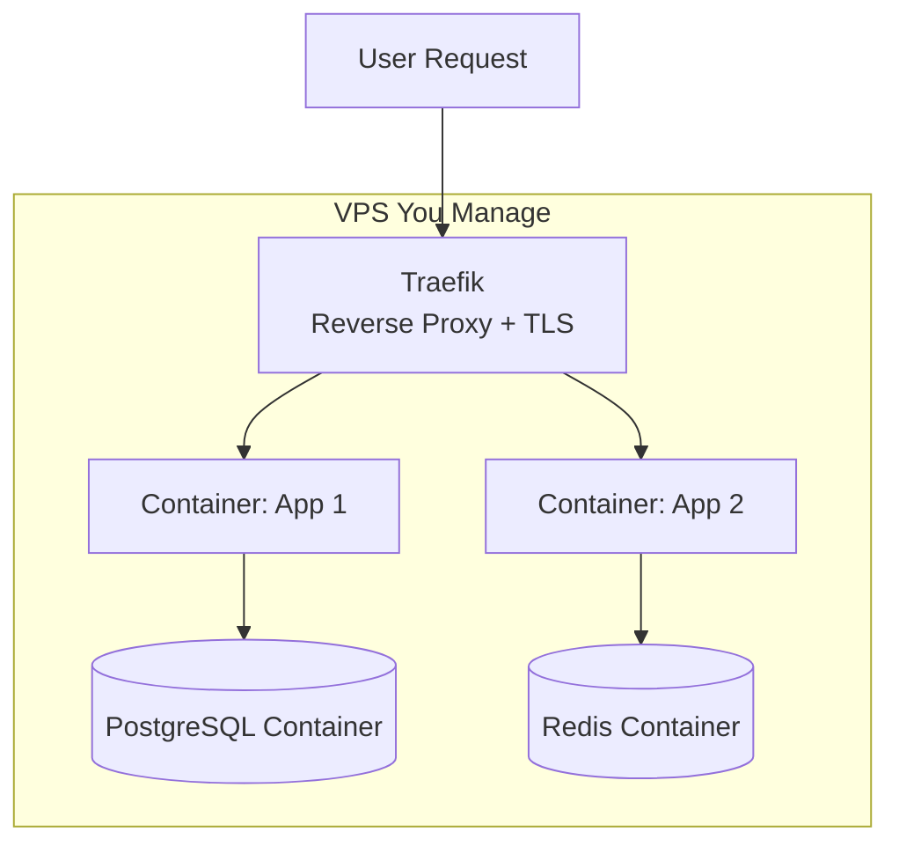
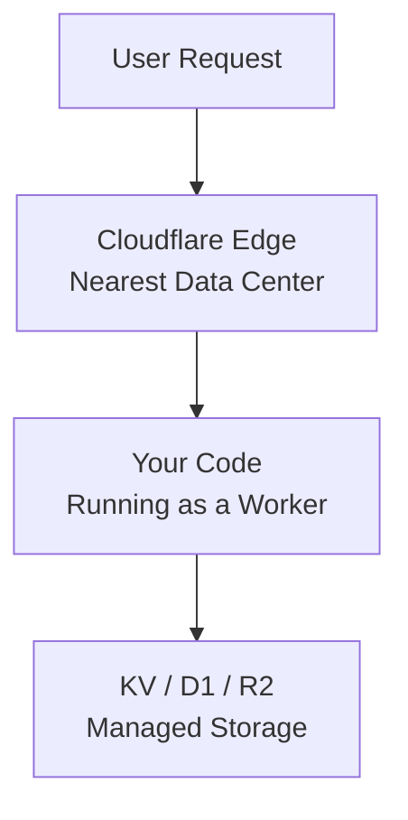
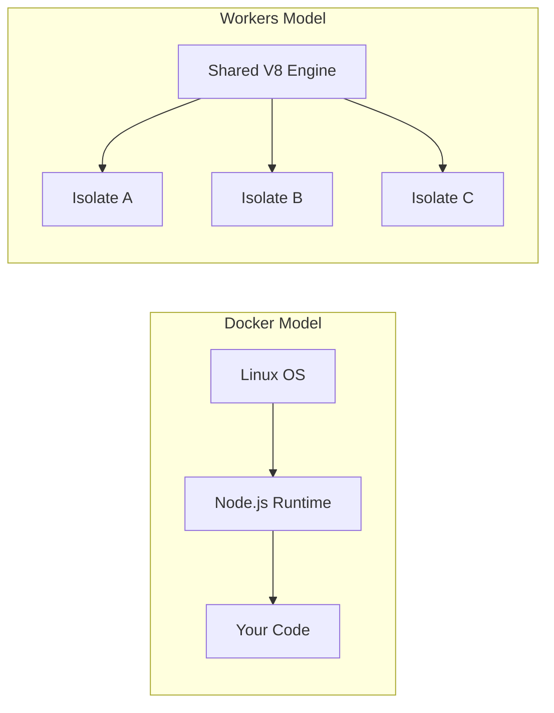
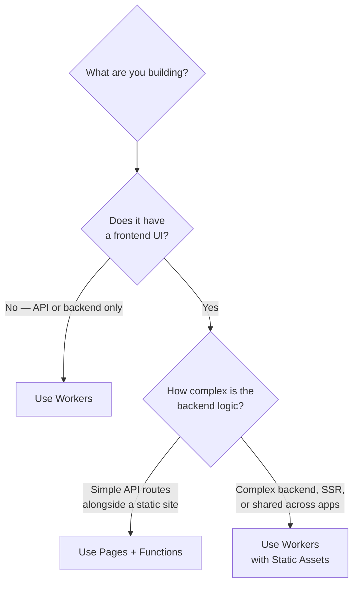
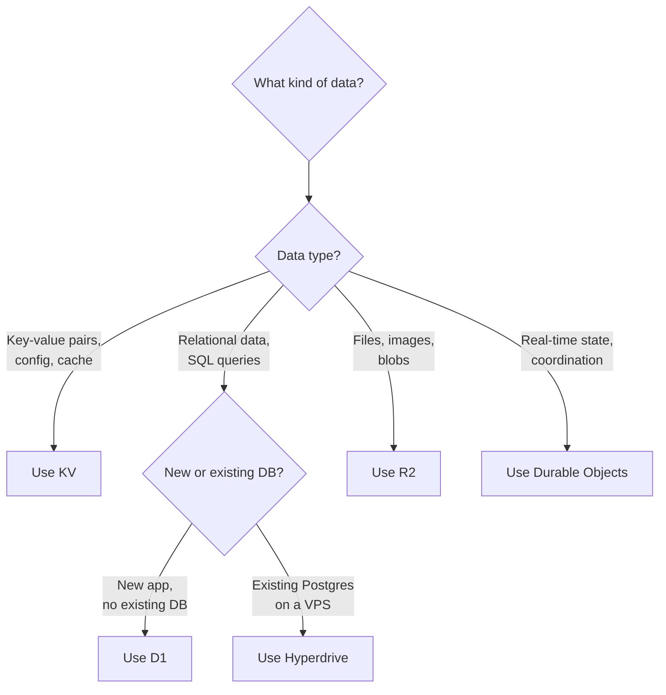
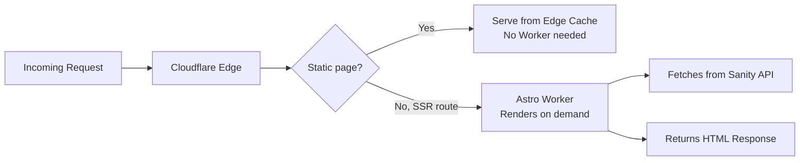

# Cloudflare Serverless Primer

A beginner-friendly guide to Cloudflare Workers and Pages Functions — written for developers who know Docker, VPS hosting, and reverse proxies like Traefik, and want to understand what serverless actually means in practice.

---

## Table of Contents

- [What Is Serverless?](#what-is-serverless)
- [The Mental Model Shift](#the-mental-model-shift)
- [Cloudflare Workers](#cloudflare-workers)
- [Cloudflare Pages and Pages Functions](#cloudflare-pages-and-pages-functions)
- [Workers vs Pages Functions: When to Use Which](#workers-vs-pages-functions-when-to-use-which)
- [Replacing Your Docker Stack: A Translation Guide](#replacing-your-docker-stack-a-translation-guide)
- [Storage and Databases: Replacing Your Containers](#storage-and-databases-replacing-your-containers)
- [How This Project Uses Workers](#how-this-project-uses-workers)
- [Key Differences to Keep in Mind](#key-differences-to-keep-in-mind)
- [Getting Started: Your First Worker](#getting-started-your-first-worker)
- [Further Reading](#further-reading)

---

## What Is Serverless?

"Serverless" does not mean "no servers." It means **you don't manage them**. Servers still exist — Cloudflare owns and operates them across 300+ data centers worldwide. You write code, deploy it, and Cloudflare handles everything else: provisioning, scaling, load balancing, TLS, failover, and patching.

You pay per request instead of per server-hour. Zero traffic = zero cost. Spike to a million requests = Cloudflare handles it automatically.

---

## The Mental Model Shift

### Your Current World: Docker + Traefik

In a traditional setup, deploying an app involves several layers you manage:

1. Provision a VPS (DigitalOcean, Hetzner, etc.)
2. Install Docker and a reverse proxy (Traefik, Nginx)
3. Write a `Dockerfile` to package your app
4. Write `docker-compose.yml` to wire up services
5. Configure TLS certificates (Let's Encrypt via Traefik)
6. Monitor uptime, manage scaling, patch the OS



You own every layer. That gives you full control — but also full responsibility.

### The Serverless World: Cloudflare

In the serverless model, most of those layers disappear:

1. Write your code
2. Run `wrangler deploy`
3. Done



No VPS. No Docker. No Traefik. No TLS config. No scaling decisions. Cloudflare runs your code in whichever data center is closest to the user making the request.

### What You Stop Managing

| You manage today | Cloudflare handles it |
|:---|:---|
| OS installation and patching | Fully managed |
| Docker daemon and runtime | Not needed |
| Container networking | Not needed |
| Traefik / Nginx config | Automatic routing |
| TLS certificates | Automatic, always HTTPS |
| Scaling (more containers) | Automatic, per-request |
| Server region and latency | Runs nearest to each user |
| Uptime monitoring | Built-in with 99.99% SLA |

---

## Cloudflare Workers

### What a Worker Is

A Worker is a small program that runs on Cloudflare's network. When a request comes in, Cloudflare picks the nearest data center, spins up your code, handles the request, and responds — all in milliseconds.

**Docker analogy:** A Worker is like a single Docker container running one service — except there is no container, no OS, and it starts in under 5 milliseconds instead of seconds.

### How Workers Run: V8 Isolates

Traditional serverless platforms (AWS Lambda, Google Cloud Functions) spin up a container per function invocation. Cloudflare does something different: it uses **V8 isolates**.

V8 is the JavaScript engine that powers Chrome and Node.js. An "isolate" is a lightweight sandbox within V8 — think of it as a tiny, secure room where your code runs. A single V8 process can host hundreds of isolates simultaneously.



| | Docker container | V8 isolate |
|:---|:---|:---|
| Startup time | 500ms – seconds | Under 5ms |
| Memory per instance | 100MB+ (OS + runtime) | ~128KB |
| Isolation | Full OS-level | V8 memory sandboxing |
| Instances per host | Tens | Hundreds to thousands |

The practical result: Workers have **virtually zero cold starts**. Your users never wait for a container to boot.

### What a Worker Looks Like

Here is a complete Worker. This is the entire deployment artifact — no Dockerfile, no `package.json` dependencies required:

```javascript
// src/index.js
export default {
  async fetch(request, env) {
    const url = new URL(request.url);

    if (url.pathname === "/api/hello") {
      return new Response(
        JSON.stringify({ message: "Hello from the edge!" }),
        { headers: { "Content-Type": "application/json" } }
      );
    }

    if (url.pathname === "/api/time") {
      return new Response(
        JSON.stringify({ now: new Date().toISOString() }),
        { headers: { "Content-Type": "application/json" } }
      );
    }

    return new Response("Not found", { status: 404 });
  },
};
```

Deploy with one command:

```bash
npx wrangler deploy
```

No `docker build`. No `docker push`. No `docker-compose up`. It is live worldwide in seconds.

### The `env` Object: Your Connection to Everything

In Docker, you connect to services through network hostnames (`postgres:5432`, `redis:6379`). In Workers, you connect through **bindings** — secure references injected via the `env` object.

```javascript
export default {
  async fetch(request, env) {
    // KV (key-value store — like Redis)
    const value = await env.MY_KV.get("some-key");

    // D1 (SQL database — like PostgreSQL/SQLite)
    const result = await env.MY_DB.prepare("SELECT * FROM users").all();

    // R2 (object storage — like S3)
    const file = await env.MY_BUCKET.get("uploads/photo.jpg");

    // Environment variables (like Docker env vars)
    const apiKey = env.API_KEY;

    return new Response("OK");
  },
};
```

You declare bindings in `wrangler.jsonc` (the Workers config file — think of it as your `docker-compose.yml`):

```jsonc
{
  "name": "my-worker",
  "main": "src/index.js",
  "compatibility_date": "2025-01-01",

  // Like declaring services in docker-compose
  "kv_namespaces": [
    { "binding": "MY_KV", "id": "abc123" }
  ],
  "d1_databases": [
    { "binding": "MY_DB", "database_id": "def456" }
  ],
  "r2_buckets": [
    { "binding": "MY_BUCKET", "bucket_name": "my-files" }
  ]
}
```

### What Workers Can Do

Workers handle far more than simple API endpoints:

- **Serve full SSR apps** — Astro, Next.js, Remix, SvelteKit all have Cloudflare adapters
- **Act as API gateways** — route, transform, and authenticate requests (replaces Traefik logic)
- **Run cron jobs** — Cron Triggers execute on a schedule without a running server
- **Handle WebSockets** — Durable Objects enable stateful, real-time connections
- **Process data** — transform images, parse HTML, run AI inference

---

## Cloudflare Pages and Pages Functions

### Pages: Static Site Hosting with Git Integration

Cloudflare Pages is a hosting platform optimized for frontend frameworks. Connect a GitHub or GitLab repo, and Cloudflare automatically:

1. Builds your site on every push
2. Deploys the output to the edge
3. Creates preview URLs for every pull request
4. Handles custom domains and TLS

**Docker analogy:** Pages is like having a CI/CD pipeline that runs `npm run build`, then serves the output with Nginx — except Cloudflare handles the build server, the web server, and the CDN.

### Pages Functions: Server-Side Code Inside Pages

Pages Functions add server-side logic to a Pages project. Drop a file into a `functions/` directory and it becomes a serverless API endpoint. The routing is automatic — the file path becomes the URL path.

```
my-site/
├── src/                      # Your frontend code
├── public/                   # Static assets
└── functions/
    ├── api/
    │   ├── hello.js          →  /api/hello
    │   └── users/
    │       └── [id].js       →  /api/users/123 (dynamic route)
    └── _middleware.js         →  Runs before every function
```

A Pages Function looks like this:

```javascript
// functions/api/hello.js
export function onRequestGet(context) {
  return new Response("Hello from a Pages Function!");
}

export function onRequestPost(context) {
  const body = await context.request.json();
  return new Response(JSON.stringify({ received: body }), {
    headers: { "Content-Type": "application/json" },
  });
}
```

### The Key Insight

**Pages Functions are Workers under the hood.** They use the same V8 runtime, the same APIs, and the same execution model. The only difference is the developer experience:

| | Workers | Pages Functions |
|:---|:---|:---|
| Routing | You define routes in code | File-based (automatic) |
| Config file | `wrangler.jsonc` | Managed by Pages |
| Deployment | `wrangler deploy` | Git push (auto-builds) |
| Static assets | Opt-in via Static Assets binding | Built-in |
| Best for | APIs, complex backends, SSR apps | Simple backends alongside a frontend |

---

## Workers vs Pages Functions: When to Use Which



### General Guidelines

- **Workers** — Use when you need full control over routing, configuration, and deployment. Best for standalone APIs, SSR frameworks (Astro, Next.js, Remix), microservices, and complex backends.
- **Pages Functions** — Use when you have a static or mostly-static site and need a few server-side endpoints (form handlers, auth callbacks, simple APIs). The git-based deploy workflow is the primary appeal.
- **Workers with Static Assets** — The newer, converging option. Deploy both static files and server logic as a single Worker. This is the direction Cloudflare is heading for full-stack apps.

### The Convergence Trend

Cloudflare is actively merging Pages capabilities into Workers. Workers now support static assets natively, and features like preview URLs and git integration are coming to Workers too. For new projects, **Workers with Static Assets is the more flexible, future-proof choice**. Pages is not going away, but Workers is becoming the unified platform.

---

## Replacing Your Docker Stack: A Translation Guide

This table maps every piece of a typical Docker + Traefik deployment to its Cloudflare equivalent.

| Docker / VPS concept | Cloudflare equivalent | Notes |
|:---|:---|:---|
| `Dockerfile` | `wrangler.jsonc` | Configuration, not a build recipe |
| `docker build && docker push` | `wrangler deploy` | Builds and deploys in one step |
| `docker-compose.yml` | `wrangler.jsonc` bindings | Declares storage, databases, and service connections |
| Traefik routing rules | Worker routes / custom domains | Configure in dashboard or `wrangler.jsonc` |
| Nginx serving static files | Workers Static Assets / Pages | Edge-cached globally |
| PostgreSQL / MySQL container | **D1** (SQLite at edge) or **Hyperdrive** (proxy to existing Postgres) | D1 for new apps; Hyperdrive to keep your existing DB |
| Redis container | **KV** (simple key-value) or **Durable Objects** (stateful coordination) | KV for caching; DOs for sessions, counters, real-time |
| S3 / MinIO container | **R2** (S3-compatible object storage) | No egress fees — a major cost advantage |
| Cron job container | **Cron Triggers** | Declare a schedule in `wrangler.jsonc` |
| `docker logs` / Loki | `wrangler tail` (live) or **Workers Analytics** | Stream logs in real time during development |
| Let's Encrypt + Traefik | Automatic — always HTTPS | Zero configuration |
| Load balancer | Built into Cloudflare's edge | Every data center handles requests |

---

## Storage and Databases: Replacing Your Containers

### KV (Key-Value) — Your Redis Replacement

KV is a globally distributed key-value store. Data you write is available across all 300+ Cloudflare data centers. It is optimized for **read-heavy workloads** — reads are fast from anywhere, writes are eventually consistent (propagate globally within about 60 seconds).

**Use KV for:** configuration, feature flags, cached API responses, session tokens, translated strings.

```javascript
// Write a value
await env.MY_KV.put("user:123:name", "Jay");

// Read a value
const name = await env.MY_KV.get("user:123:name");
// → "Jay"

// Store JSON
await env.MY_KV.put("config", JSON.stringify({ theme: "dark" }));
const config = await env.MY_KV.get("config", { type: "json" });
// → { theme: "dark" }

// Set expiration (TTL) — like Redis EXPIRE
await env.MY_KV.put("session:abc", "data", { expirationTtl: 3600 });
```

**Docker equivalent:** A Redis container with read replicas, except the replicas are in 300+ cities and you do not manage any of them.

### D1 — Your PostgreSQL Replacement

D1 is a serverless SQL database built on SQLite. You write standard SQL. D1 runs at the edge near your Workers, so queries are fast.

**Use D1 for:** user data, application state, relational data, anything you would put in PostgreSQL or MySQL.

```javascript
// Create a table (run once via wrangler or migration)
// CREATE TABLE users (id INTEGER PRIMARY KEY, name TEXT, email TEXT);

// Insert a row
await env.MY_DB.prepare(
  "INSERT INTO users (name, email) VALUES (?, ?)"
).bind("Jay", "jay@example.com").run();

// Query rows
const { results } = await env.MY_DB.prepare(
  "SELECT * FROM users WHERE name = ?"
).bind("Jay").all();
// → [{ id: 1, name: "Jay", email: "jay@example.com" }]
```

**When to use Hyperdrive instead:** If you already have a PostgreSQL database running on a VPS, Hyperdrive is a connection pooler that lets your Workers talk to it. You keep your existing database and avoid migration — Hyperdrive handles connection management and caching.

### R2 — Your S3 / MinIO Replacement

R2 is S3-compatible object storage with one major difference: **zero egress fees**. In AWS, you pay every time someone downloads a file from S3. With R2, downloads are free.

**Use R2 for:** file uploads, images, videos, backups, static assets, anything you would put in S3.

```javascript
// Upload a file
await env.MY_BUCKET.put("photos/avatar.jpg", imageData, {
  httpMetadata: { contentType: "image/jpeg" },
});

// Download a file
const object = await env.MY_BUCKET.get("photos/avatar.jpg");
const data = await object.arrayBuffer();

// Delete a file
await env.MY_BUCKET.delete("photos/avatar.jpg");

// List files
const list = await env.MY_BUCKET.list({ prefix: "photos/" });
```

**Docker equivalent:** A MinIO container, except globally distributed and with no egress costs.

### Durable Objects — Your Stateful Service

Durable Objects are the most unique Cloudflare primitive. They provide **strongly consistent, single-threaded state** — think of them as tiny stateful microservices that live on the edge.

**Use Durable Objects for:** real-time chat rooms, multiplayer game state, rate limiters, collaborative editing, distributed counters, WebSocket coordination.

**Docker equivalent:** A dedicated microservice container with in-memory state and a persistent volume — except Cloudflare manages placement, failover, and persistence.

### Storage Decision Guide



---

## How This Project Uses Workers

This Astro + Sanity project deploys to Cloudflare using the `@astrojs/cloudflare` adapter. The `wrangler.jsonc` file in `astro-app/` configures the deployment.

### What Happens at Deploy Time

1. Astro builds the site — static pages are pre-rendered to HTML
2. SSR routes (like `/portal/*`) are compiled into a Worker
3. `wrangler deploy` uploads everything to Cloudflare
4. Static assets are served from edge cache (fast, no Worker invocation)
5. SSR routes run through the Worker on each request



This is equivalent to running an Astro Node.js container behind Traefik — but without managing any of it.

---

## Key Differences to Keep in Mind

### Execution Limits

Workers are designed for fast request-response cycles, not long-running processes.

| Limit | Free plan | Paid plan ($5/month) |
|:---|:---|:---|
| CPU time per request | 10ms | 30s |
| Memory | 128MB | 128MB |
| Request size | 100MB | 100MB |
| Subrequests (fetch calls) | 50 | 1,000 |

**What this means:** You cannot run a 10-minute data processing job inside a Worker the way you would in a Docker container. For long-running work, use **Workflows** (durable multi-step execution) or **Queues** (background processing).

### No Filesystem

Workers have no persistent filesystem. You cannot write to `/tmp` and read it later. Use KV, D1, or R2 for any data that needs to persist.

### No Long-Running Processes

A Worker handles one request and exits. There is no daemon, no background thread that lives between requests. If you need persistent background processing, use Durable Objects, Cron Triggers, or Queues.

### Language Support

Workers run JavaScript and TypeScript natively. You can also compile Rust, C, C++, and other languages to **WebAssembly (Wasm)** and run them in Workers. Python support is available in beta. Go, Java, Ruby, and PHP are not directly supported.

---

## Getting Started: Your First Worker

### Prerequisites

- Node.js 18+ installed
- A free Cloudflare account

### Create and Deploy

```bash
# Create a new Worker project
npm create cloudflare@latest my-first-worker

# Follow the prompts:
#   - Select "Hello World" template
#   - Choose TypeScript or JavaScript
#   - Say yes to deploy

# The CLI creates the project, installs dependencies,
# and deploys it to a *.workers.dev URL
```

### Develop Locally

```bash
cd my-first-worker

# Start a local dev server (hot-reloads on file changes)
npx wrangler dev

# Your Worker runs at http://localhost:8787
# Edit src/index.ts, save, and the server reloads
```

### Deploy Changes

```bash
npx wrangler deploy
# Output: Published my-first-worker to https://my-first-worker.your-subdomain.workers.dev
```

### View Live Logs

```bash
# Stream real-time logs from production (like docker logs -f)
npx wrangler tail
```

---

## Further Reading

- [Cloudflare Workers documentation](https://developers.cloudflare.com/workers/)
- [Cloudflare Pages documentation](https://developers.cloudflare.com/pages/)
- [Wrangler CLI reference](https://developers.cloudflare.com/workers/wrangler/)
- [D1 database documentation](https://developers.cloudflare.com/d1/)
- [R2 object storage documentation](https://developers.cloudflare.com/r2/)
- [KV key-value documentation](https://developers.cloudflare.com/kv/)
- [Durable Objects documentation](https://developers.cloudflare.com/durable-objects/)
- [Migrating from Pages to Workers](https://developers.cloudflare.com/workers/static-assets/migration-guides/migrate-from-pages/) — Cloudflare's official migration guide
- [This project's Cloudflare deployment guide](./cloudflare-guide.md) — project-specific configuration and setup
