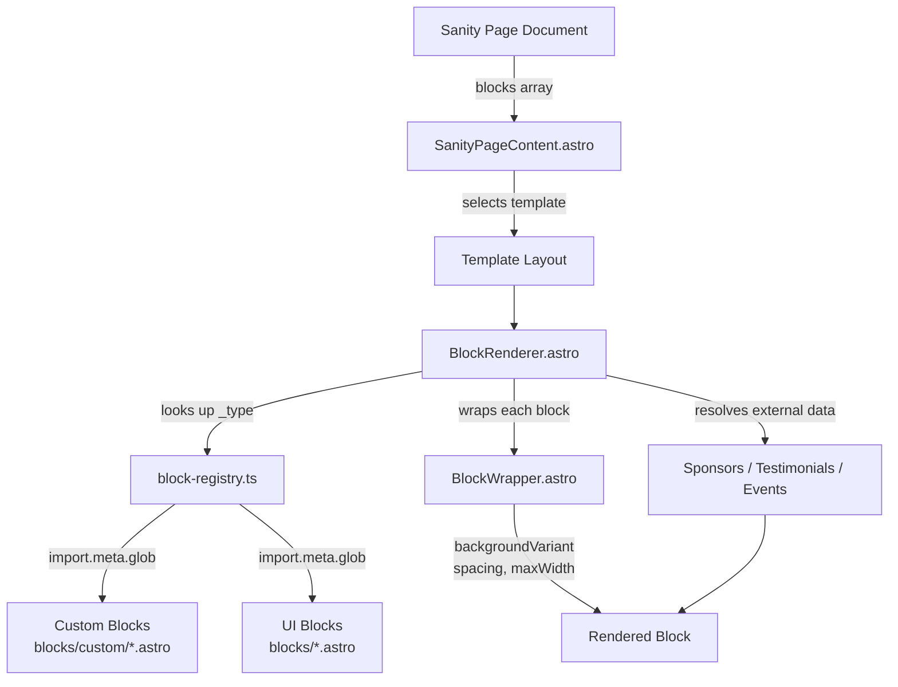

# Component Inventory

Complete inventory of the 508 component files in `astro-app/src/components/`.

## Overview and Counts

| Category | Location | Count | Description |
|----------|----------|------:|-------------|
| Custom Sanity Blocks | `blocks/custom/` | 13 | Page builder blocks mapped to Sanity schema types |
| UI Blocks | `blocks/` | 101 | Generic presentation blocks from fulldev/ui registry |
| UI Primitives | `ui/` | 39 families | shadcn-astro style composable primitives |
| Top-level Components | `components/` | 14 | Layout, routing, and entity card components |
| Portal Components | `portal/` | 5 | React-based authenticated portal UI |
| Storybook Stories | across all dirs | 153 | Visual regression and documentation stories |
| Container API Tests | `__tests__/` | 18 | Vitest component tests using Astro Container API |

## Block System Architecture

The page builder uses a three-layer architecture that maps Sanity document types to rendered Astro components.



**block-registry.ts** auto-discovers components via `import.meta.glob`:
- Custom blocks: PascalCase filename converts to camelCase `_type` (e.g., `HeroBanner.astro` registers as `heroBanner`)
- UI blocks: kebab-case filename used directly as `_type` (e.g., `hero-1.astro` registers as `hero-1`)

**BlockRenderer.astro** receives a `blocks` array from a Sanity page document, resolves each `_type` to a component, and injects external data (sponsors, testimonials, events) where needed.

**BlockWrapper.astro** wraps every block and applies shared `blockBaseFields`:

| Field | Options | Default |
|-------|---------|---------|
| `backgroundVariant` | `white`, `light`, `dark`, `primary` | `white` |
| `spacing` | `none`, `small`, `default`, `large` | `default` |
| `maxWidth` | `narrow`, `default`, `full` | `default` |

## Custom Sanity Blocks

Each custom block lives in `blocks/custom/`, has a matching `.stories.ts` file and a Container API test in `__tests__/`. All receive typed props from Sanity via `BlockRenderer`.

| Component | `_type` | Key Props | External Data |
|-----------|---------|-----------|---------------|
| HeroBanner | `heroBanner` | `heading`, `subheading`, `ctaButtons`, `backgroundImages`, `alignment` | -- |
| FeatureGrid | `featureGrid` | `heading`, `columns`, `items` | -- |
| CtaBanner | `ctaBanner` | `heading`, `description`, `ctaButtons`, `backgroundVariant` | -- |
| StatsRow | `statsRow` | `heading`, `stats`, `backgroundVariant` | -- |
| TextWithImage | `textWithImage` | `heading`, `content` (Portable Text), `image`, `imagePosition` | -- |
| LogoCloud | `logoCloud` | `heading`, `autoPopulate` | `sponsors` |
| SponsorSteps | `sponsorSteps` | `heading`, `steps`, `ctaButtons` | -- |
| RichText | `richText` | `content` (Portable Text) | -- |
| FaqSection | `faqSection` | `heading`, `items` (Portable Text bodies) | -- |
| ContactForm | `contactForm` | `heading`, `description`, form field config | -- |
| SponsorCards | `sponsorCards` | `heading`, `displayMode` | `sponsors` |
| Testimonials | `testimonials` | `heading`, `displayMode` | `testimonials` |
| EventList | `eventList` | `heading`, `filterBy`, `limit` | `events` |

### External Data Resolution

`BlockRenderer` resolves external data for blocks that reference shared collections:

| Block | Resolver Function | Data Source |
|-------|-------------------|-------------|
| LogoCloud, SponsorCards | `resolveBlockSponsors()` | `getAllSponsors()` |
| Testimonials | `resolveBlockTestimonials()` | `getAllTestimonials()` |
| EventList | `resolveBlockEvents()` | `getAllEvents()` |

## UI Block Library

101 generic presentation blocks from the fulldev/ui registry. Each has a matching `.stories.ts` file. These use kebab-case filenames and register directly by filename in the block registry.

| Category | Count | Files |
|----------|------:|-------|
| hero | 14 | `hero-1` through `hero-14` |
| cta | 8 | `cta-1` through `cta-8` |
| services | 7 | `services-1` through `services-7` |
| features | 6 | `features-1` through `features-6` |
| content | 6 | `content-1` through `content-6` |
| reviews | 5 | `reviews-1` through `reviews-5` |
| products | 5 | `products-1` through `products-5` |
| videos | 4 | `videos-1` through `videos-4` |
| faqs | 4 | `faqs-1` through `faqs-4` |
| blocks | 4 | `blocks-1` through `blocks-4` |
| articles | 4 | `articles-1` through `articles-4` |
| video | 3 | `video-1` through `video-3` |
| steps | 3 | `steps-1` through `steps-3` |
| stats | 3 | `stats-1` through `stats-3` |
| pricings | 3 | `pricings-1` through `pricings-3` |
| logos | 3 | `logos-1` through `logos-3` |
| header | 3 | `header-1` through `header-3` |
| footer | 3 | `footer-1` through `footer-3` |
| contact | 3 | `contact-1` through `contact-3` |
| links | 2 | `links-1`, `links-2` |
| images | 2 | `images-1`, `images-2` |
| banner | 2 | `banner-1`, `banner-2` |
| article | 2 | `article-1`, `article-2` |
| table | 1 | `table-1` |
| product | 1 | `product-1` |

## UI Primitives

39 primitive families in `ui/`, following shadcn-astro conventions. Each family uses slot-based composition with a root component and sub-components.

| Family | Sub-components | Key Exports |
|--------|---------------:|-------------|
| accordion | 5 | Accordion, AccordionItem, AccordionTrigger, AccordionContent |
| alert | 4 | Alert, AlertTitle, AlertDescription |
| auto-form | 1 | AutoForm |
| avatar | 4 | Avatar, AvatarImage, AvatarFallback |
| badge | 2 | Badge |
| banner | 6 | Banner and variants |
| button | 2 | Button |
| checkbox | 1 | Checkbox |
| collapsible | 4 | Collapsible, CollapsibleTrigger, CollapsibleContent |
| empty | 7 | Empty state compositions |
| field | 11 | Field, FieldLabel, FieldContent, FieldMessage |
| footer | 14 | Footer, FooterSection, FooterLink, FooterBottom |
| header | 4 | Header components |
| icon | 1 | Icon |
| image | 2 | Image |
| input | 1 | Input |
| item | 8 | Item, ItemContent, ItemTitle, ItemDescription |
| label | 2 | Label |
| list | 3 | List, ListItem |
| logo | 4 | Logo components |
| marquee | 3 | Marquee |
| native-carousel | 6 | NativeCarousel, NativeCarouselItem |
| native-select | 4 | NativeSelect, NativeSelectOption |
| navigation-menu | 10 | NavigationMenu, NavigationMenuItem, NavigationMenuLink |
| price | 4 | Price display components |
| radio-group | 3 | RadioGroup, RadioGroupItem |
| rating | 1 | Rating |
| section | 11 | Section, SectionContent, SectionSplit, SectionGrid, SectionProse, SectionActions, SectionMedia |
| separator | 1 | Separator |
| sheet | 9 | Sheet, SheetTrigger, SheetContent, SheetHeader, SheetFooter |
| sidebar | 7 | Sidebar, SidebarItem, SidebarGroup |
| skeleton | 1 | Skeleton |
| spinner | 1 | Spinner |
| table | 9 | Table, TableHeader, TableBody, TableRow, TableCell |
| tabs | 5 | Tabs, TabsList, TabsTrigger, TabsContent |
| textarea | 1 | Textarea |
| theme-toggle | 2 | ThemeToggle |
| tile | 9 | Tile, TileContent, TileTitle, TileDescription, TileIcon |
| video | 1 | Video |

## Top-level Components

Components at the root of `components/` handle layout structure, navigation, and entity rendering.

| Component | File | Purpose |
|-----------|------|---------|
| BlockRenderer | `BlockRenderer.astro` | Maps page block arrays to components, resolves external data |
| BlockWrapper | `BlockWrapper.astro` | Applies background, spacing, and max-width to each block |
| block | `block.astro` | Generic block wrapper |
| block-registry | `block-registry.ts` | Auto-discovers custom and UI blocks via `import.meta.glob` |
| Breadcrumb | `Breadcrumb.astro` | Breadcrumb navigation container |
| BreadcrumbItem | `BreadcrumbItem.astro` | Individual breadcrumb link |
| EventCard | `EventCard.astro` | Renders event listing cards |
| Footer | `Footer.astro` | Site-wide footer |
| Header | `Header.astro` | Site-wide header with navigation |
| ProjectCard | `ProjectCard.astro` | Renders project listing cards |
| SanityPageContent | `SanityPageContent.astro` | Server Island for draft-aware page rendering |
| SponsorCard | `SponsorCard.astro` | Renders sponsor listing cards |
| TestimonialCard | `TestimonialCard.astro` | Renders testimonial cards |
| VisualEditingMPA | `VisualEditingMPA.tsx` | React component enabling Sanity visual editing overlay |

### SanityPageContent

`SanityPageContent.astro` serves as a Server Island (`server:defer`) for preview mode. It fetches fresh Sanity data per-request, selects a page template (default, fullWidth, landing, sidebar, twoColumn), and passes blocks to `BlockRenderer`.

## Portal Components

React components for the authenticated portal area (`/portal/*`). These are separate from Astro UI components because `.astro` files cannot be imported into `.tsx` files.

| Component | File | Purpose |
|-----------|------|---------|
| PortalCard | `PortalCard.tsx` | Card with icon, title, badge, and children slot |
| PortalIcon | `PortalIcon.tsx` | Renders Lucide icons as inline SVG (SSR only, do not hydrate) |
| PortalSkeleton | `PortalSkeleton.tsx` | Animated placeholder bars (CSS animation only) |
| types | `types.ts` | Shared types: `PortalUser`, `PortalNavItem` |
| CLAUDE | `CLAUDE.md` | Development guide for portal component conventions |

Portal components follow the React Islands pattern: Astro pages handle auth and data fetching, then pass serializable props to React components hydrated with `client:load` or `client:visible`.

## Storybook Coverage

153 story files provide visual regression testing and documentation.

| Location | Stories | Coverage |
|----------|--------:|----------|
| `blocks/custom/*.stories.ts` | 13 | All 13 custom blocks (100%) |
| `blocks/*.stories.ts` | 101 | All 101 UI blocks (100%) |
| `ui/**/*.stories.ts` | 38 | Select UI primitive families |
| `components/*.stories.ts` | 1 | ProjectCard |

## Component Patterns

### Props and Types

Custom blocks extend typed interfaces from `@/lib/types`:

```typescript
interface Props extends HeroBannerBlock {
  class?: string;
  id?: string;
}
```

UI primitives use slot-based composition:

```astro
<Section size="lg">
  <SectionContent>
    <SectionGrid size="default">
      <!-- grid items -->
    </SectionGrid>
  </SectionContent>
</Section>
```

### Stega-Clean Pattern

Sanity visual editing injects invisible stega strings into content. Components call `stegaClean()` before using values in logic:

```typescript
import { stegaClean } from '@sanity/client/stega';
const bg = stegaClean(backgroundVariant) ?? 'white';
```

### Container API Testing

Component tests use Astro Container API with mocked Sanity data:

```typescript
const container = await AstroContainer.create();
const html = await container.renderToString(HeroBanner, {
  props: { ...heroBannerFixture }
});
expect(html).toContain('expected content');
```

18 test files in `__tests__/` cover all custom blocks, BlockRenderer, BlockWrapper, Header, Breadcrumb, and ProjectCard.
