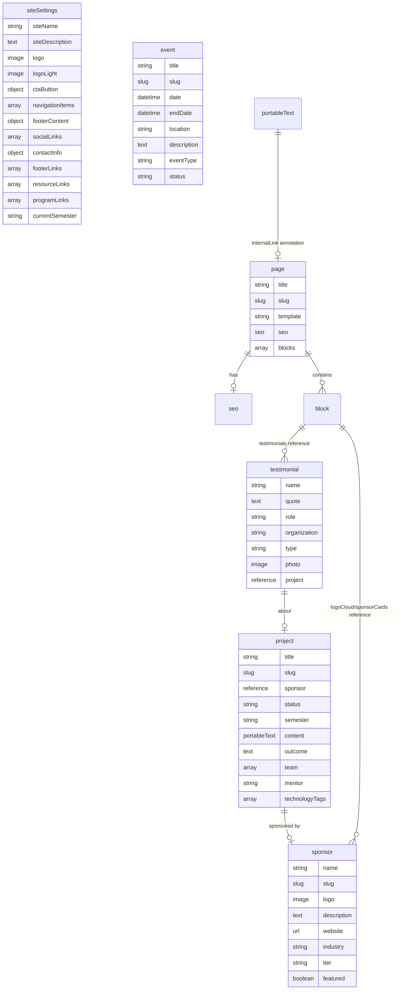
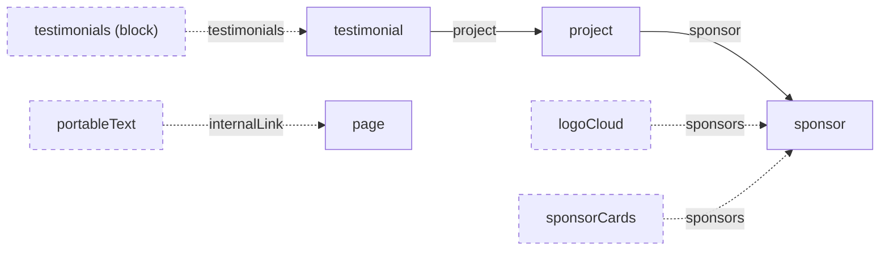

# Data Models

This document describes the Sanity content model that powers the Astro frontend. All schema definitions live in `studio/src/schemaTypes/` and GROQ queries live in `astro-app/src/lib/sanity.ts`.

The schema contains **27 types**: 6 document types, 8 object types, and 13 block types.

## Content Model Overview



## Document Types

All document types are defined in `studio/src/schemaTypes/documents/`.

### page

Composable page built from an ordered array of block types. Supports five layout templates with block-compatibility validation that warns when wide blocks (heroBanner, statsRow, logoCloud, sponsorCards) are placed in constrained templates (sidebar, twoColumn).

**Source:** `studio/src/schemaTypes/documents/page.ts`

| Field | Type | Required | Description |
|-------|------|----------|-------------|
| `title` | `string` | Yes | Page title |
| `slug` | `slug` | Yes | URL slug, sourced from `title`, max 96 chars |
| `template` | `string` | No | Layout template. Options: `default`, `fullWidth`, `landing`, `sidebar`, `twoColumn`. Default: `default` |
| `seo` | `seo` | No | SEO metadata object |
| `blocks` | `array` | No | Ordered array of 13 block types (see [Block Types](#block-types)) |

**Validation:** Custom rule checks block/template compatibility via `validateBlockTemplateCompatibility()`. Wide blocks in narrow templates produce warnings.

### siteSettings

Singleton document for global site configuration. The desk structure limits creation to a single instance.

**Source:** `studio/src/schemaTypes/documents/site-settings.ts`

| Field | Type | Required | Description |
|-------|------|----------|-------------|
| `siteName` | `string` | Yes | Site name used in header and metadata |
| `siteDescription` | `text` | No | Default meta description for the site |
| `logo` | `image` (hotspot) | No | Primary logo with required `alt` field |
| `logoLight` | `image` (hotspot) | No | Light-on-dark variant used in the footer, with required `alt` field |
| `ctaButton` | `object` | No | Header CTA button with `text` (required), `url` (required), `variant` fields |
| `navigationItems` | `array` | No | Top-level nav items, each with `label`, `href`, `external`, and optional `children[]` sub-items |
| `footerContent` | `object` | No | Footer text with `text` and `copyrightText` fields |
| `socialLinks` | `array` | No | Social links, each with `platform` (github/linkedin/twitter/instagram/youtube) and `url` (required) |
| `contactInfo` | `object` | No | Contact info with `address`, `email`, `phone` fields |
| `footerLinks` | `array` | No | Bottom bar links (e.g., Privacy Policy), each with `label`, `href`, `external` |
| `resourceLinks` | `array` | No | Footer Resources section links, each with `label`, `href`, `external` |
| `programLinks` | `array` | No | Footer Programs section links, each with `label`, `href`, `external` |
| `currentSemester` | `string` | No | Current semester label (e.g., "Fall 2026") |

**Groups:** Branding, Navigation, Footer, Social & Contact.

### sponsor

Industry partner or sponsor organization.

**Source:** `studio/src/schemaTypes/documents/sponsor.ts`

| Field | Type | Required | Description |
|-------|------|----------|-------------|
| `name` | `string` | Yes | Sponsor name |
| `slug` | `slug` | Yes | URL slug, sourced from `name` |
| `logo` | `image` (hotspot) | Yes | Sponsor logo with required `alt` field |
| `description` | `text` | No | Sponsor description |
| `website` | `url` | No | Sponsor website URL |
| `industry` | `string` | No | Industry sector |
| `tier` | `string` | No | Sponsorship tier. Options: `platinum`, `gold`, `silver`, `bronze` |
| `featured` | `boolean` | No | Featured flag for filtering. Default: `false` |

### project

Student capstone project linked to a sponsor.

**Source:** `studio/src/schemaTypes/documents/project.ts`

| Field | Type | Required | Description |
|-------|------|----------|-------------|
| `title` | `string` | Yes | Project title |
| `slug` | `slug` | Yes | URL slug, sourced from `title` |
| `sponsor` | `reference` -> `sponsor` | No | Sponsoring organization |
| `status` | `string` | No | Project status. Options: `active`, `completed`, `archived`. Default: `active` |
| `semester` | `string` | No | Academic semester (e.g., "Fall 2026") |
| `content` | `portableText` | No | Rich text project description |
| `outcome` | `text` | No | Outcome and impact summary |
| `team` | `array` of `{name, role}` | No | Team members, each with `name` (required) and `role` |
| `mentor` | `string` | No | Mentor name |
| `technologyTags` | `array` of `string` | No | Technology tags displayed as pills |

**Groups:** Main, Content, Team, Tags.

### testimonial

Quote from an industry partner or student.

**Source:** `studio/src/schemaTypes/documents/testimonial.ts`

| Field | Type | Required | Description |
|-------|------|----------|-------------|
| `name` | `string` | Yes | Person's name |
| `quote` | `text` | Yes | Testimonial quote text |
| `role` | `string` | No | Person's role or title |
| `organization` | `string` | No | Organization name |
| `type` | `string` | No | Testimonial type. Options: `industry`, `student` |
| `photo` | `image` (hotspot) | No | Person's photo with required `alt` field |
| `project` | `reference` -> `project` | No | Links testimonial to a specific project for impact case studies |

### event

Calendar event for showcases, networking, and workshops.

**Source:** `studio/src/schemaTypes/documents/event.ts`

| Field | Type | Required | Description |
|-------|------|----------|-------------|
| `title` | `string` | Yes | Event title |
| `slug` | `slug` | Yes | URL slug, sourced from `title`, max 96 chars |
| `date` | `datetime` | Yes | Start date and time |
| `endDate` | `datetime` | No | End date. Custom validation ensures `endDate > date` |
| `location` | `string` | No | Event location |
| `description` | `text` | No | Event description |
| `eventType` | `string` | No | Event category. Options: `showcase`, `networking`, `workshop` |
| `status` | `string` | No | Event status. Options: `upcoming`, `past`. Default: `upcoming` |

**Orderings:** Date (newest), Date (oldest), Title.

## Object Types

Reusable object schemas used within documents and blocks. Defined in `studio/src/schemaTypes/objects/`.

### seo

SEO metadata attached to pages.

**Source:** `studio/src/schemaTypes/objects/seo.ts`

| Field | Type | Required | Validation |
|-------|------|----------|------------|
| `metaTitle` | `string` | No | Max 60 characters |
| `metaDescription` | `text` | No | Max 160 characters |
| `ogImage` | `image` (hotspot) | No | 1200x630 recommended. Has required `alt` field |

### portableText

Rich text editor configuration used by `project.content`, `richText` block, `textWithImage` block, and `faqItem.answer`.

**Source:** `studio/src/schemaTypes/objects/portable-text.ts`

| Element | Details |
|---------|---------|
| **Block styles** | `normal`, `h2`, `h3`, `h4`, `blockquote` |
| **Decorators** | `strong`, `em`, `code`, `underline` |
| **Lists** | `bullet`, `number` |
| **Annotations** | `link` (external URL with scheme validation), `internalLink` (reference to `page`) |
| **Custom types** | Inline `image` (with `alt` + `caption`), `callout` (with `tone`: info/warning/success + `text`) |

### button

CTA button used in heroBanner, ctaBanner, sponsorSteps, and siteSettings.

**Source:** `studio/src/schemaTypes/objects/button.ts`

| Field | Type | Required | Description |
|-------|------|----------|-------------|
| `text` | `string` | Yes | Button label |
| `url` | `string` | Yes | Relative path, full URL, or mailto/tel. Validated pattern |
| `variant` | `string` | No | Options: `default`, `secondary`, `outline`, `ghost` |

### link

Navigation link used in siteSettings for nav items, footer links, resource links, and program links.

**Source:** `studio/src/schemaTypes/objects/link.ts`

| Field | Type | Required | Description |
|-------|------|----------|-------------|
| `label` | `string` | Yes | Link label |
| `href` | `string` | Yes | Relative path, anchor fragment, or full URL. Validated pattern |
| `external` | `boolean` | No | External link flag. Default: `false` |

### featureItem

Grid item used in featureGrid blocks.

**Source:** `studio/src/schemaTypes/objects/feature-item.ts`

| Field | Type | Required | Description |
|-------|------|----------|-------------|
| `icon` | `string` | No | Icon name from icon set |
| `image` | `image` (hotspot) | No | Feature image with required `alt` field |
| `title` | `string` | Yes | Feature title |
| `description` | `text` | No | Feature description |

### faqItem

Question/answer pair used in faqSection blocks.

**Source:** `studio/src/schemaTypes/objects/faq-item.ts`

| Field | Type | Required | Description |
|-------|------|----------|-------------|
| `question` | `string` | Yes | FAQ question |
| `answer` | `portableText` | Yes | Rich text answer |

### stepItem

Process step used in sponsorSteps blocks.

**Source:** `studio/src/schemaTypes/objects/step-item.ts`

| Field | Type | Required | Description |
|-------|------|----------|-------------|
| `title` | `string` | Yes | Step title |
| `description` | `text` | No | Step description |
| `list` | `array` of `string` | No | Bullet points |

### statItem

Statistic used in statsRow blocks.

**Source:** `studio/src/schemaTypes/objects/stat-item.ts`

| Field | Type | Required | Description |
|-------|------|----------|-------------|
| `value` | `string` | Yes | Stat value (e.g., "50+", "$2M", "98%") |
| `label` | `string` | Yes | Stat label |
| `description` | `string` | No | Additional description |

## Block Types

All 13 block types use the `defineBlock()` helper (`studio/src/schemaTypes/helpers/defineBlock.ts`), which automatically prepends three shared layout fields from `blockBaseFields`.

### Shared Block Base Fields

Every block inherits these fields from `studio/src/schemaTypes/objects/block-base.ts`:

| Field | Type | Options | Default |
|-------|------|---------|---------|
| `backgroundVariant` | `string` | `white`, `light`, `dark`, `primary` | `white` |
| `spacing` | `string` | `none`, `small`, `default`, `large` | `default` |
| `maxWidth` | `string` | `narrow`, `default`, `full` | `default` |

### Block Type Summary

| Block Type | Source | Unique Fields | References |
|------------|--------|---------------|------------|
| `heroBanner` | `blocks/hero-banner.ts` | `heading`\*, `subheading`, `backgroundImages[]`, `ctaButtons[]`, `alignment` | -- |
| `featureGrid` | `blocks/feature-grid.ts` | `heading`, `items[]` (featureItem), `columns` | -- |
| `ctaBanner` | `blocks/cta-banner.ts` | `heading`\*, `description`, `ctaButtons[]` | -- |
| `statsRow` | `blocks/stats-row.ts` | `heading`, `stats[]` (statItem) | -- |
| `textWithImage` | `blocks/text-with-image.ts` | `heading`, `content` (portableText), `image`, `imagePosition` | -- |
| `logoCloud` | `blocks/logo-cloud.ts` | `heading`, `autoPopulate`, `sponsors[]` | `sponsor` (conditional) |
| `sponsorSteps` | `blocks/sponsor-steps.ts` | `heading`, `subheading`, `items[]` (stepItem), `ctaButtons[]` | -- |
| `richText` | `blocks/rich-text.ts` | `content` (portableText) | -- |
| `faqSection` | `blocks/faq-section.ts` | `heading`, `items[]` (faqItem) | -- |
| `contactForm` | `blocks/contact-form.ts` | `heading`, `description`, `successMessage` | -- |
| `sponsorCards` | `blocks/sponsor-cards.ts` | `heading`, `displayMode`, `sponsors[]` | `sponsor` (conditional) |
| `testimonials` | `blocks/testimonials.ts` | `heading`, `displayMode`, `testimonials[]` | `testimonial` (conditional) |
| `eventList` | `blocks/event-list.ts` | `heading`, `filterBy`, `limit` | -- |

\* = required field

### Conditional Reference Patterns

Three block types use a "display mode" pattern where references are only active in `manual` mode:

- **logoCloud:** When `autoPopulate` is `true`, all sponsors display automatically. When `false`, the `sponsors[]` reference array appears and editors pick sponsors manually.
- **sponsorCards:** `displayMode` controls filtering: `all` shows every sponsor, `featured` filters by `sponsor.featured`, `manual` reveals the `sponsors[]` reference picker.
- **testimonials:** `displayMode` supports five modes: `all`, `industry`, `student`, `byProject`, `manual`. Only `manual` reveals the `testimonials[]` reference picker.

## Reference Graph



**Solid arrows** represent direct document-level references. **Dashed arrows** represent conditional references (only active depending on display mode or inline annotations).

| Source | Field | Target | Condition |
|--------|-------|--------|-----------|
| `project` | `sponsor` | `sponsor` | Always available |
| `testimonial` | `project` | `project` | Always available |
| `logoCloud` | `sponsors[]` | `sponsor` | Only when `autoPopulate` is `false` |
| `sponsorCards` | `sponsors[]` | `sponsor` | Only when `displayMode` is `manual` |
| `testimonials` (block) | `testimonials[]` | `testimonial` | Only when `displayMode` is `manual` |
| `portableText` | `internalLink` annotation | `page` | Inline mark annotation in rich text |

## Portable Text Configuration

The `portableText` type (`studio/src/schemaTypes/objects/portable-text.ts`) defines the rich text editing experience. It is used in four locations:

1. `project.content` -- project descriptions
2. `richText` block -- freeform rich text sections on pages
3. `textWithImage` block -- text paired with an image
4. `faqItem.answer` -- FAQ answer content

### Supported Elements

| Category | Elements |
|----------|----------|
| Block styles | Normal, H2, H3, H4, Blockquote |
| Inline decorators | Bold (`strong`), Italic (`em`), Code (`code`), Underline (`underline`) |
| List types | Bullet, Numbered |
| Link annotations | External link (`href` with http/https/mailto/tel validation), Internal link (reference to `page` document) |
| Custom block types | Image (with `alt` + `caption`), Callout box (with `tone`: info/warning/success + `text`) |

## GROQ Queries

All queries use `defineQuery()` for type generation and are defined in `astro-app/src/lib/sanity.ts`.

| Query Constant | Target Type | Description |
|----------------|-------------|-------------|
| `SITE_SETTINGS_QUERY` | `siteSettings` | Fetches the singleton site settings document with all nested objects |
| `ALL_PAGE_SLUGS_QUERY` | `page` | Returns `{slug}` for all pages with defined slugs (static path generation) |
| `PAGE_BY_SLUG_QUERY` | `page` | Fetches a single page by slug with template, SEO, and all block-type projections |
| `ALL_SPONSORS_QUERY` | `sponsor` | Fetches all sponsors ordered by name with resolved image assets |
| `ALL_SPONSOR_SLUGS_QUERY` | `sponsor` | Returns `{slug}` for all sponsors with defined slugs |
| `SPONSOR_BY_SLUG_QUERY` | `sponsor` | Fetches a single sponsor by slug with a reverse-lookup sub-query for associated projects |
| `ALL_PROJECTS_QUERY` | `project` | Fetches all projects ordered by title with dereferenced sponsor data |
| `ALL_PROJECT_SLUGS_QUERY` | `project` | Returns `{slug}` for all projects with defined slugs |
| `PROJECT_BY_SLUG_QUERY` | `project` | Fetches a single project by slug with full sponsor dereference and a reverse-lookup sub-query for testimonials |
| `ALL_TESTIMONIALS_QUERY` | `testimonial` | Fetches all testimonials ordered by name with dereferenced project data |
| `ALL_EVENTS_QUERY` | `event` | Fetches all events ordered by date ascending |
| `ALL_EVENT_SLUGS_QUERY` | `event` | Returns `{slug}` for all events with defined slugs |
| `EVENT_BY_SLUG_QUERY` | `event` | Fetches a single event by slug with all fields |

### Query Patterns

**Slug projection:** All queries that return slugs use `"slug": slug.current` to flatten the nested slug object.

**Image asset resolution:** Image fields consistently resolve `asset->{ _id, url, metadata { lqip, dimensions } }` to provide the CDN URL, low-quality image placeholder (LQIP), and intrinsic dimensions.

**Reverse lookups:** `SPONSOR_BY_SLUG_QUERY` includes `"projects": *[_type == "project" && references(^._id)]` and `PROJECT_BY_SLUG_QUERY` includes `"testimonials": *[_type == "testimonial" && project._ref == ^._id]` to resolve inverse relationships.

**Block-type projections:** `PAGE_BY_SLUG_QUERY` uses conditional projections (`_type == "heroBanner" => { ... }`) to fetch type-specific fields for each block in the blocks array, keeping payloads efficient.

## TypeGen Pipeline

The type generation pipeline produces TypeScript types from the Sanity schema, ensuring compile-time type safety across the frontend.

### Flow

```
studio/src/schemaTypes/**/*.ts   (schema definitions)
        |
        v
  npx sanity schema extract     (extracts schema.json in studio/)
        |
        v
  npx sanity typegen generate    (reads schema.json + GROQ queries)
        |
        v
  astro-app/src/sanity.types.ts  (generated TypeScript types)
```

### Configuration

TypeGen is configured in `studio/sanity.cli.ts`:

| Setting | Value |
|---------|-------|
| `path` | `../astro-app/src/**/*.{ts,tsx,js,jsx}` -- scans Astro source for `defineQuery()` calls |
| `schema` | `schema.json` -- extracted schema file in `studio/` |
| `generates` | `../astro-app/src/sanity.types.ts` -- output file |

### Generated Type Examples

The generated `sanity.types.ts` file produces:

- **Document types:** `Page`, `SiteSettings`, `Sponsor`, `Project`, `Testimonial`, `Event`
- **Query result types:** `SITE_SETTINGS_QUERY_RESULT`, `PAGE_BY_SLUG_QUERY_RESULT`, `ALL_SPONSORS_QUERY_RESULT`, etc.
- **Inferred types:** Each query result type reflects the exact shape of the GROQ projection, including dereferenced images, nested objects, and conditional block fields.

The frontend re-exports convenience aliases in `astro-app/src/lib/sanity.ts`:

```typescript
export type Sponsor = ALL_SPONSORS_QUERY_RESULT[number];
export type Project = ALL_PROJECTS_QUERY_RESULT[number];
export type Testimonial = ALL_TESTIMONIALS_QUERY_RESULT[number];
export type SanityEvent = ALL_EVENTS_QUERY_RESULT[number];
```

`SanityEvent` avoids collision with the global DOM `Event` type.

## Data Fetching Patterns

### loadQuery Wrapper

All data fetching flows through the `loadQuery<T>()` function in `astro-app/src/lib/sanity.ts`. This wrapper:

1. **Checks for Visual Editing mode** -- if `PUBLIC_SANITY_VISUAL_EDITING_ENABLED` is `"true"`, it requires `SANITY_API_READ_TOKEN` and switches to `drafts` perspective with stega encoding enabled.
2. **Selects perspective** -- `"drafts"` during visual editing, `"published"` during production builds.
3. **Configures stega** -- enables result source maps (`withKeyArraySelector`) during visual editing so the Presentation tool can map rendered content back to Sanity fields.

### Build-Time Caching

Four module-level caches prevent redundant API calls during static site generation:

| Cache Variable | Populated By | Consumers |
|----------------|--------------|-----------|
| `_siteSettingsCache` | `getSiteSettings()` | Layout, Header, Footer |
| `_sponsorsCache` | `getAllSponsors()` | logoCloud blocks, sponsorCards blocks |
| `_projectsCache` | `getAllProjects()` | Project listing pages |
| `_testimonialsCache` | `getAllTestimonials()` | testimonials blocks |
| `_eventsCache` | `getAllEvents()` | eventList blocks |
| `_pageCache` (Map) | `prefetchPages()` | `getPage()` for individual page fetches |

Caches are bypassed when Visual Editing is enabled to ensure editors see fresh draft data.

### Block Resolver Functions

Three resolver functions filter cached data for block-level display:

| Function | Block Type | Filtering Logic |
|----------|-----------|-----------------|
| `resolveBlockSponsors()` | `logoCloud`, `sponsorCards` | Filters by `autoPopulate`, `displayMode` (`all`/`featured`/`manual`), or manual reference IDs |
| `resolveBlockTestimonials()` | `testimonials` | Filters by `displayMode` (`all`/`industry`/`student`/`byProject`/`manual`) |
| `resolveBlockEvents()` | `eventList` | Filters by `filterBy` (`all`/`upcoming`/`past`), applies `limit`, sorts by date |

### Page Prefetch Strategy

During `getStaticPaths()`, the `prefetchPages()` function fetches all pages in parallel batches (default concurrency: 6). This populates `_pageCache` so individual `getPage()` calls during rendering resolve instantly from memory rather than making additional API requests.

## Content Lake Statistics

As of the last audit:

| Metric | Count |
|--------|-------|
| User documents | 40 |
| Image assets | 24 |
| Schema types registered | 27 (6 documents, 8 objects, 13 blocks) |
| GROQ queries defined | 13 |

One orphaned document of type `post` exists in the Content Lake. This type is not in the current schema and is likely a remnant from initial project setup.
