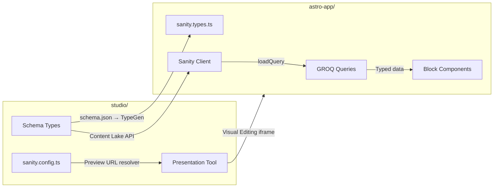
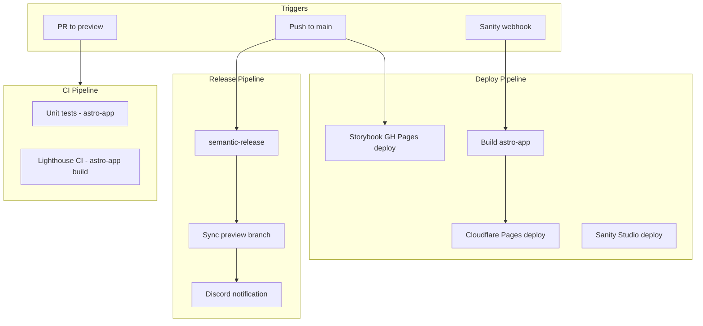
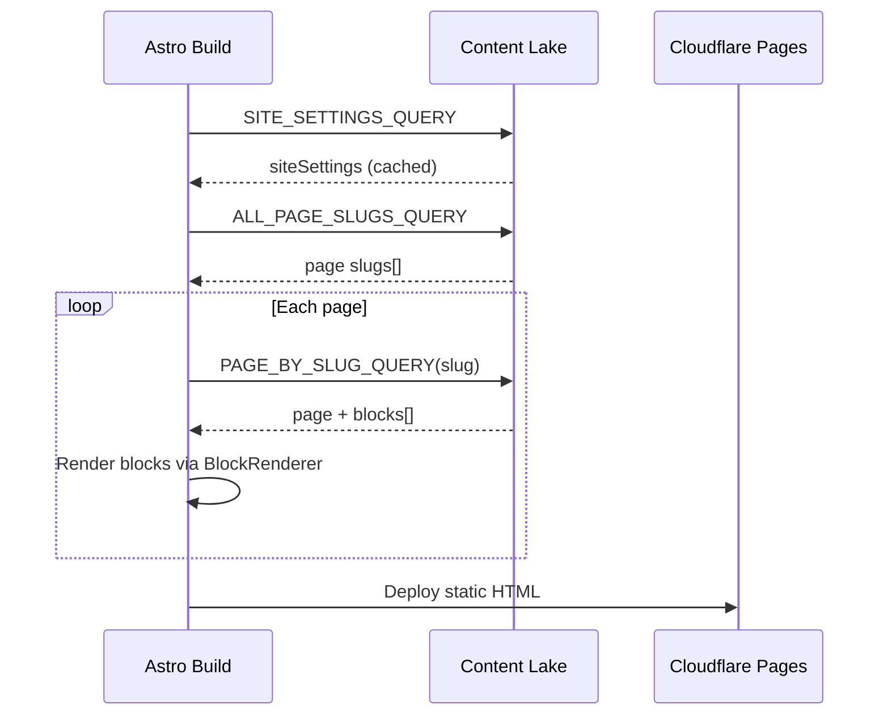
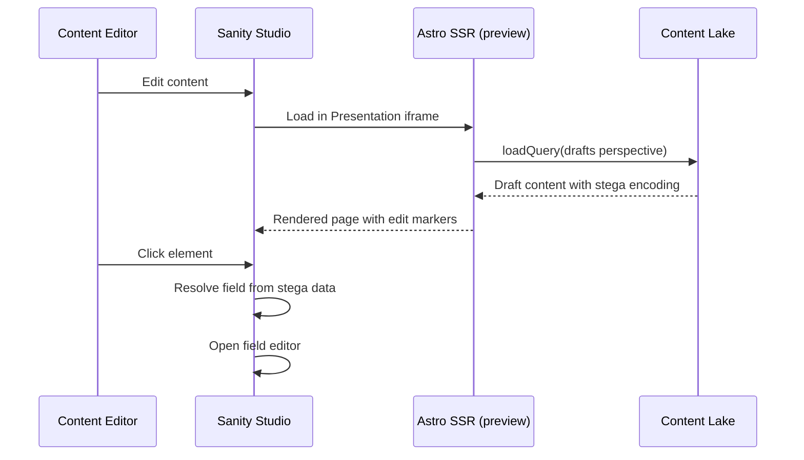
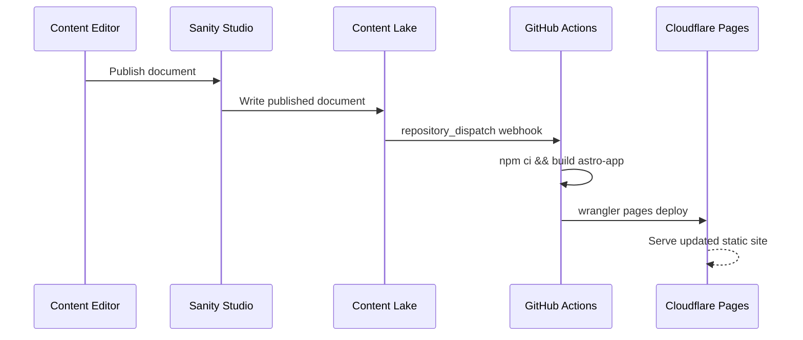

# Integration Architecture

**Generated:** 2026-02-13 | **Mode:** Exhaustive Rescan | **Workflow:** document-project v1.2.0

## Part Communication Overview



## Integration Points (5)

### 1. Content Delivery (GROQ API)

**Direction:** Studio → Astro (via Sanity Content Lake)

| Aspect | Detail |
|--------|--------|
| Protocol | HTTPS REST API (Content Lake) |
| Client | `@sanity/astro` integration (provides `sanity:client` virtual module) |
| Authentication | Public API for published content; API read token for drafts |
| Caching | Module-level caching for `getSiteSettings()` during build |
| API Version | 2025-03-01 |

**Queries:**
- `SITE_SETTINGS_QUERY` — Global config (nav, footer, branding)
- `ALL_PAGE_SLUGS_QUERY` — Static path generation
- `PAGE_BY_SLUG_QUERY` — Page with type-conditional block projections

### 2. Visual Editing (Presentation Tool)

**Direction:** Studio ↔ Astro (bidirectional via iframe + postMessage)

| Aspect | Detail |
|--------|--------|
| Protocol | iframe embedding + Sanity Channels (postMessage) |
| Studio Side | `presentationTool()` plugin with preview URL resolver |
| Astro Side | `VisualEditingMPA.tsx` React component + `@sanity/visual-editing` |
| Stega Encoding | Field values encoded with invisible markers for click-to-edit |
| Perspective | `drafts` for live preview content |
| Preview Origin | `SANITY_STUDIO_PREVIEW_ORIGIN` (default: `http://localhost:4321`) |

**URL Resolution** (`studio/src/presentation/resolve.ts`):
- Pages: `/{slug}` (home page → `/`)
- Sponsors: `/sponsors/{slug}` and `/sponsors`
- Site Settings: Shows all pages (nav/footer appear everywhere)

### 3. Schema Sharing (TypeGen)

**Direction:** Studio → Astro (one-way, build-time)

| Aspect | Detail |
|--------|--------|
| Schema Source | `studio/schema.json` (extracted via `sanity schema extract`) |
| Output | `astro-app/src/sanity.types.ts` (1033 lines of generated types) |
| Watch Patterns | `../astro-app/src/**/*.{ts,tsx,js,jsx}` |
| Type Adapters | `astro-app/src/lib/types.ts` re-exports named types |
| Command | `npm run typegen` (runs from root, executes in studio/) |

**TypeGen Pipeline:**
```
Schema files → sanity schema extract → schema.json → sanity typegen generate → sanity.types.ts
```

### 4. Shared Dependencies (npm Workspaces)

**Direction:** Bidirectional (shared node_modules)

| Aspect | Detail |
|--------|--------|
| Workspace Manager | npm workspaces |
| Root `package.json` | `"workspaces": ["studio", "astro-app"]` |
| Shared Dev Deps | Playwright, axe-core, concurrently (root level) |
| React | Both parts use React 19.2 (astro-app for islands, studio for UI) |

**Workspace Commands:**
- `npm run dev` — Starts both via `concurrently`
- `npm run test` — Runs unit + E2E from root
- `npm run typegen` — Delegates to studio workspace

### 5. CI/CD Pipeline Integration

**Direction:** GitHub Actions orchestrates both parts



**Shared Configuration:**
- Both parts share `PUBLIC_SANITY_STUDIO_PROJECT_ID` and `PUBLIC_SANITY_STUDIO_DATASET` via GitHub Actions variables
- Cloudflare credentials stored as GitHub secrets
- Wrangler config at root (`wrangler.toml`) points to `astro-app/dist`

## Data Flow Diagrams

### Build-Time Data Flow (Production)



### Runtime Data Flow (Visual Editing)



### Content Publish Flow



## Containerized Development

Docker Compose provides isolated development:

| Service | Port | Volume Mounts |
|---------|------|---------------|
| astro-app | 4321 | Source code + separate node_modules |
| studio | 3333 | Source code + separate node_modules |
| storybook | 6006 | Source code (optional profile) |

Named volumes prevent node_modules conflicts: `node_modules`, `astro_node_modules`, `studio_node_modules`.
