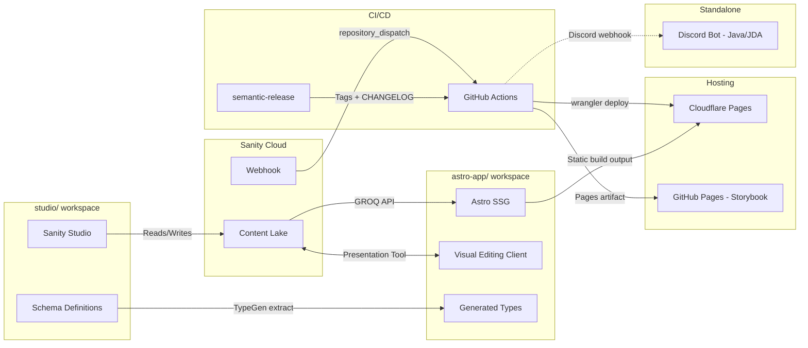
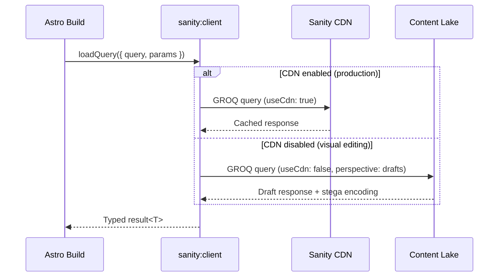
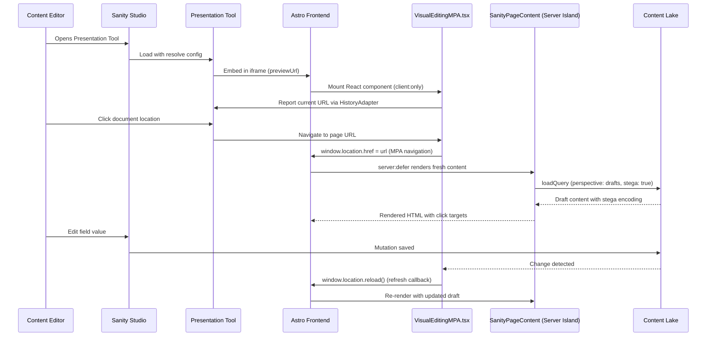
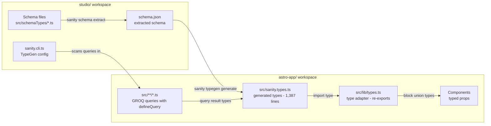
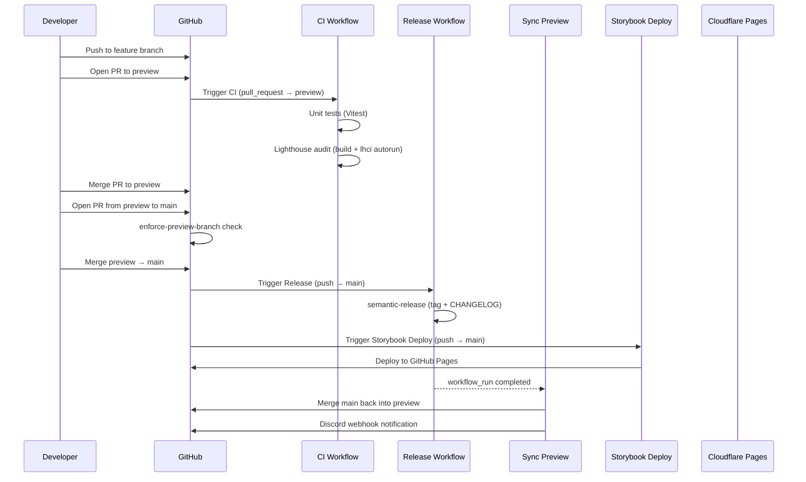
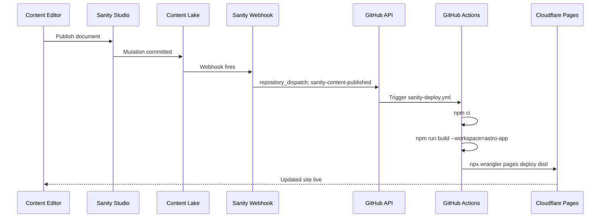
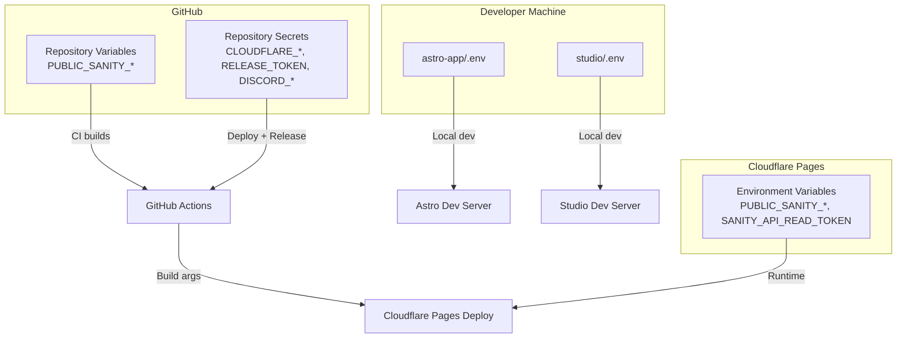

# Integration Architecture

This document maps every integration point in the monorepo: how data flows between Sanity, Astro, Cloudflare, GitHub Actions, and the standalone Discord bot.

## Integration Overview

The following diagram shows all integration points between the major subsystems.



## Content Delivery Pipeline

Astro fetches content from the Sanity Content Lake at build time through the GROQ API.

### Data Flow



### GROQ Query Layer

All queries live in `astro-app/src/lib/sanity.ts` and use `defineQuery` from the `groq` package for type extraction. The file defines 13 queries:

| Query | Purpose |
|:------|:--------|
| `SITE_SETTINGS_QUERY` | Singleton: navigation, footer, social links, contact info |
| `ALL_PAGE_SLUGS_QUERY` | Static path generation for `[...slug].astro` |
| `PAGE_BY_SLUG_QUERY` | Full page with template selection and block array |
| `ALL_SPONSORS_QUERY` | Build-time sponsor cache for logoCloud and sponsorCards |
| `ALL_SPONSOR_SLUGS_QUERY` | Static paths for sponsor detail pages |
| `SPONSOR_BY_SLUG_QUERY` | Single sponsor with reverse-referenced projects |
| `ALL_PROJECTS_QUERY` | All projects with resolved sponsor references |
| `ALL_PROJECT_SLUGS_QUERY` | Static paths for project detail pages |
| `PROJECT_BY_SLUG_QUERY` | Single project with sponsor and testimonial data |
| `ALL_TESTIMONIALS_QUERY` | Build-time testimonial cache |
| `ALL_EVENTS_QUERY` | Build-time event cache for eventList blocks |
| `ALL_EVENT_SLUGS_QUERY` | Static paths for event detail pages |
| `EVENT_BY_SLUG_QUERY` | Single event by slug |

### Caching Strategy

The query layer uses module-level memoization to deduplicate API calls during a single build:

- **Site settings**: `_siteSettingsCache` -- fetched once, shared across Layout, Header, and Footer.
- **Collection data**: `_sponsorsCache`, `_projectsCache`, `_testimonialsCache`, `_eventsCache` -- fetched once per entity type, resolved per-block via helper functions (`resolveBlockSponsors`, `resolveBlockTestimonials`, `resolveBlockEvents`).
- **Page data**: `_pageCache` Map populated by `prefetchPages()` during `getStaticPaths`, making individual `getPage()` calls instant.
- **Cache bypass**: All caches skip when `PUBLIC_SANITY_VISUAL_EDITING_ENABLED` is `"true"`, ensuring fresh draft data for preview.

### Sanity Client Configuration

The `@sanity/astro` integration provides the `sanity:client` virtual module. Configuration in `astro-app/astro.config.mjs`:

| Setting | Value | Notes |
|:--------|:------|:------|
| `apiVersion` | `2025-03-01` | Pinned API version |
| `useCdn` | Conditional | `true` in production, `false` when visual editing enabled |
| `stega.studioUrl` | `PUBLIC_SANITY_STUDIO_URL` | Enables click-to-edit overlays |

## Visual Editing Architecture

Visual editing creates a bidirectional channel between Sanity Studio and the Astro frontend, allowing editors to click on rendered content and edit it in real time.

### Sequence Diagram



### Components

**Studio side** (`studio/`):

- `sanity.config.ts` registers the `presentationTool` plugin with a `resolve` config and `previewUrl`.
- `src/presentation/resolve.ts` implements `DocumentLocationResolver` -- maps `page` documents to their frontend URL (using slug), and maps `siteSettings` to all page URLs (since nav/footer appear everywhere).

**Astro side** (`astro-app/`):

- `VisualEditingMPA.tsx` -- A React component mounted with `client:only="react"`. It wraps `@sanity/visual-editing`'s `VisualEditing` component with a custom MPA `HistoryAdapter` that uses `window.location.href` for navigation (required because Astro is a multi-page app, not an SPA).
- `SanityPageContent.astro` -- A Server Island component used with `server:defer`. It fetches fresh draft data on every request (sets `Cache-Control: no-cache`) and renders the page template with blocks. This enables live preview without a full site rebuild.

### Visual Editing Data Path

When visual editing is active:

1. `loadQuery` switches to `perspective: "drafts"` and includes the `SANITY_API_READ_TOKEN`.
2. Stega encoding is enabled (`stega: true`), embedding invisible metadata in string values.
3. `resultSourceMap: "withKeyArraySelector"` provides field-level mapping for click targets.
4. The CDN is bypassed (`useCdn: false`) to ensure fresh draft reads.

## Schema and TypeGen Pipeline

Schema definitions in the Studio workspace serve as the single source of truth. A TypeGen pipeline extracts the schema and generates TypeScript types consumed by the Astro frontend.

### Flow Diagram



### TypeGen Configuration

Defined in `studio/sanity.cli.ts`:

```typescript
typegen: {
  path: '../astro-app/src/**/*.{ts,tsx,js,jsx}',  // Scan for defineQuery calls
  schema: 'schema.json',                           // Extracted schema file
  generates: '../astro-app/src/sanity.types.ts',   // Output location
}
```

### Type Consumption Chain

1. **Generated types** (`sanity.types.ts`) -- Contains result types for every `defineQuery` call (e.g., `PAGE_BY_SLUG_QUERY_RESULT`, `ALL_SPONSORS_QUERY_RESULT`).
2. **Type adapter** (`src/lib/types.ts`) -- Re-exports and transforms generated types into component-friendly forms: `Page`, `SiteSettings`, `PageBlock`, and individual block types (`HeroBannerBlock`, `FeatureGridBlock`, etc.) extracted via `Extract<>` from the block union.
3. **Domain types** (`src/lib/sanity.ts`) -- Exports array element types (`Sponsor`, `Project`, `Testimonial`, `SanityEvent`) derived from collection query results.

### Workflow

1. Edit schema files in `studio/src/schemaTypes/`.
2. Run `npm run typegen` (from root) -- extracts schema and generates types.
3. TypeScript compilation surfaces any drift between schema, queries, and component props.
4. Deploy schema to Content Lake: `npx sanity schema deploy` (from `studio/`).

## Shared Dependencies and Workspace Structure

The repository uses npm workspaces to share dependencies and coordinate builds across three packages.

### Workspace Layout

```
astro-shadcn-sanity/          # Root workspace manager
  package.json                # workspaces: ["studio", "astro-app"]
  astro-app/                  # Astro frontend (npm workspace)
    package.json              # name: "app"
  studio/                     # Sanity Studio (npm workspace)
    package.json              # name: "ywcc-capstone-studio"
  discord-bot/                # Java/Maven project (NOT a workspace)
    pom.xml
```

### Shared Dependencies

| Dependency | astro-app | studio | Notes |
|:-----------|:---------:|:------:|:------|
| `react` | 19.2.4 | 19.2.1 | Shared via root node_modules hoisting |
| `react-dom` | 19.2.4 | 19.2.1 | Required by both Sanity Studio and Astro React integration |
| `typescript` | 5.9.x | 5.1.x | Each workspace pins its own range |

### Root DevDependencies (Testing Infrastructure)

The root `package.json` holds testing tools used across workspaces:

| Package | Purpose |
|:--------|:--------|
| `@playwright/test` | End-to-end browser testing |
| `@axe-core/playwright` | Accessibility testing in Playwright |
| `@lhci/cli` | Lighthouse CI performance audits |
| `concurrently` | Parallel dev server startup |

### Cross-Workspace Scripts

| Root Script | Delegates To | Action |
|:------------|:-------------|:-------|
| `npm run dev` | Both workspaces via `concurrently` | Starts Astro (port 4321) and Studio in parallel |
| `npm run typegen` | `studio` workspace | Extracts schema and generates types into `astro-app/` |
| `npm run test:unit` | `astro-app` workspace | Runs Vitest |
| `npm run test:e2e` | Root Playwright config | Runs full browser test suite |

## CI/CD and Deployment Pipeline

Six GitHub Actions workflows manage the build, test, release, and deploy lifecycle.

### Pipeline Sequence



### Workflow Details

| Workflow | Trigger | Action |
|:---------|:--------|:-------|
| `ci.yml` | PR to `preview` | Unit tests + Lighthouse CI audit |
| `enforce-preview-branch.yml` | PR to `main` | Blocks PRs not from `preview` branch |
| `enforce-preview-source.yml` | PR to `preview` | Blocks PRs from `main` (sync is automatic) |
| `release.yml` | Push to `main` | semantic-release with conventional commits |
| `sync-preview.yml` | After Release completes | Merges `main` back into `preview`, notifies Discord |
| `deploy-storybook.yml` | Push to `main` (path-filtered) | Builds Storybook, deploys to GitHub Pages |

### Branch Strategy

```
feature/* ──PR──► preview ──PR──► main
                    ▲                │
                    └── sync-preview ┘
```

- Feature branches merge into `preview` (CI runs on PR).
- Only `preview` can merge into `main` (enforced by workflow).
- After release, `main` auto-merges back into `preview` to stay synchronized.

## Content Publishing Webhook Flow

When editors publish content in Sanity Studio, a webhook triggers a full site rebuild and deploy.



### Deploy Configuration

- **Build target**: `astro-app/dist` (static output from Astro build).
- **Cloudflare project**: `ywcc-capstone` on Cloudflare Pages.
- **Deploy branch**: `main`.
- **Required secrets**: `CLOUDFLARE_API_TOKEN`, `CLOUDFLARE_ACCOUNT_ID`.
- **Required vars**: `PUBLIC_SANITY_STUDIO_PROJECT_ID`, `PUBLIC_SANITY_STUDIO_DATASET`.

## Environment Configuration

Environment variables connect the subsystems. Each workspace has its own `.env.example` documenting the required values.

### astro-app/.env

| Variable | Purpose | Example |
|:---------|:--------|:--------|
| `PUBLIC_SANITY_STUDIO_PROJECT_ID` | Sanity project identifier | `abc123de` |
| `PUBLIC_SANITY_STUDIO_DATASET` | Sanity dataset name | `production` |
| `PUBLIC_SANITY_VISUAL_EDITING_ENABLED` | Enables draft mode + stega | `true` / `false` |
| `SANITY_API_READ_TOKEN` | Server-side token for draft reads | `sk...` |
| `PUBLIC_SANITY_STUDIO_URL` | Studio URL for edit links | `http://localhost:3333` |
| `PUBLIC_SITE_URL` | Canonical site URL for SEO | `https://ywcc-capstone.pages.dev` |
| `PUBLIC_GTM_ID` | Google Tag Manager container ID | `GTM-XXXXXXXX` |
| `CF_ACCESS_TEAM_DOMAIN` | Cloudflare Access team domain | `https://...cloudflareaccess.com` |
| `CF_ACCESS_AUD` | Cloudflare Access audience tag | (from Zero Trust dashboard) |

### studio/.env

| Variable | Purpose | Example |
|:---------|:--------|:--------|
| `SANITY_STUDIO_PROJECT_ID` | Sanity project identifier | `abc123de` |
| `SANITY_STUDIO_DATASET` | Sanity dataset name | `production` |
| `SANITY_STUDIO_STUDIO_HOST` | Custom studio hostname (optional) | `ywcccapstone` |
| `SANITY_STUDIO_PREVIEW_ORIGIN` | Astro dev server URL for preview | `http://localhost:4321` |

### tests/.env

| Variable | Purpose | Example |
|:---------|:--------|:--------|
| `TEST_ENV` | Target environment for E2E tests | `local` / `staging` / `production` |
| `BASE_URL` | Override default base URL | `http://localhost:4321` |

### GitHub Actions Secrets and Variables

| Name | Type | Used By |
|:-----|:-----|:--------|
| `CLOUDFLARE_API_TOKEN` | Secret | `sanity-deploy.yml` |
| `CLOUDFLARE_ACCOUNT_ID` | Secret | `sanity-deploy.yml` |
| `RELEASE_TOKEN` | Secret | `release.yml`, `sync-preview.yml` |
| `DISCORD_WEBHOOK_URL` | Secret | `sync-preview.yml` |
| `LHCI_GITHUB_APP_TOKEN` | Secret | `ci.yml` (optional) |
| `PUBLIC_SANITY_STUDIO_PROJECT_ID` | Variable | `sanity-deploy.yml`, `ci.yml` |
| `PUBLIC_SANITY_STUDIO_DATASET` | Variable | `sanity-deploy.yml`, `ci.yml` |

### Variable Flow Between Systems



## Discord Bot Integration

The `discord-bot/` directory contains a standalone Java application. It is **not** an npm workspace and has no runtime dependency on the Sanity or Astro systems.

### Technical Details

| Property | Value |
|:---------|:------|
| Language | Java (JDK 25) |
| Build tool | Maven (pom.xml) |
| Framework | JDA 5.0.0-alpha.12 (Java Discord API) |
| Containerization | Docker multi-stage build (build, prod, dev stages) |
| Configuration | `BOT_TOKEN` via `.env` file or environment variable |

### Connection Points

The Discord bot has no direct API integration with Sanity or Astro. The only connection between the bot ecosystem and the main project is:

1. **Discord webhook notifications** -- The `sync-preview.yml` workflow sends status messages to a Discord channel via `DISCORD_WEBHOOK_URL` when the preview branch syncs (or fails to sync). This uses a raw webhook URL, not the bot itself.
2. **Shared repository** -- The bot lives in the same Git repository for organizational convenience.

### Running the Bot

```bash
# Local development with Docker
cd discord-bot
cp .env.example .env    # Add BOT_TOKEN
docker compose up       # Runs dev target with Maven hot-reload
```
