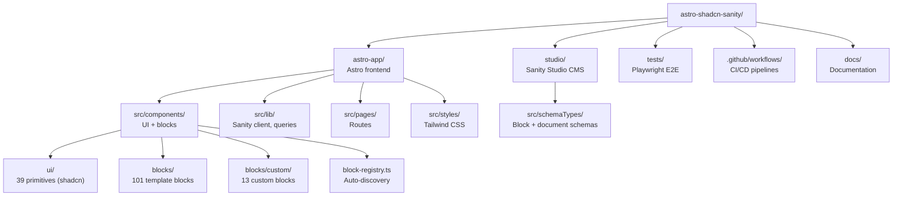
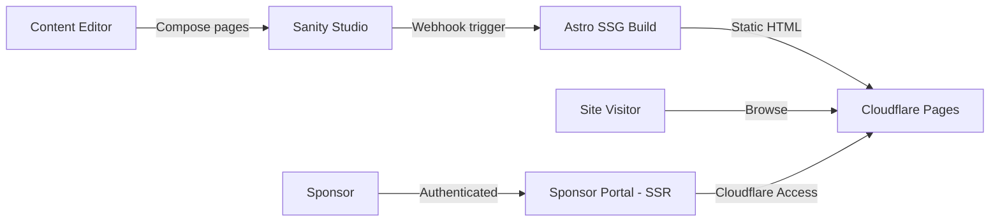

# Project Overview

**ywcc-capstone-template v1.7.0** -- YWCC Capstone Spring 2026

## Executive Summary

This repository is a production-ready portal for NJIT's Ying Wu College of Computing (YWCC) Industry Capstone program. It connects industry sponsors with capstone student teams by showcasing sponsor organizations, project proposals, team rosters, events, and program information. Content editors compose and update pages by stacking reusable UI blocks in Sanity Studio with zero code required.

The site runs on Astro (static-site generation with selective SSR), backed by Sanity CMS for structured content, styled with Tailwind CSS, and deployed to Cloudflare Pages at $0/month using free tiers across all services.

**Reference site:** [ywcccapstone1.com](https://ywcccapstone1.com)

## Project Purpose and Context

The YWCC Industry Capstone program pairs student teams with industry sponsors to work on real-world projects each semester. This platform serves as the central hub where:

- **Content editors** build and update pages independently with no developer involvement
- **Prospective sponsors** discover the program, browse past projects, and submit inquiries
- **Students** find team assignments, project details, and key dates in one place
- **Advisors** manage program information through a structured CMS

The codebase follows a "toolkit-not-website" approach -- a block library maps editor-friendly names to component internals, making the design system invisible to non-technical users.

## Repository Structure



```text
astro-shadcn-sanity/
├── astro-app/                 # Astro frontend (npm workspace)
│   ├── src/
│   │   ├── components/
│   │   │   ├── ui/            # 39 UI primitives (via shadcn CLI)
│   │   │   ├── blocks/        # 101 template blocks (fulldev/ui)
│   │   │   │   └── custom/    # 13 custom CMS-connected blocks
│   │   │   ├── block-registry.ts
│   │   │   └── BlockRenderer.astro
│   │   ├── layouts/           # Base HTML layout
│   │   ├── lib/               # Sanity client, GROQ queries, helpers
│   │   ├── pages/             # Astro page routes + portal (SSR)
│   │   └── styles/            # Tailwind CSS global config
│   └── package.json
├── studio/                    # Sanity Studio (npm workspace)
│   └── src/schemaTypes/
│       ├── blocks/            # Block object schemas
│       ├── documents/         # Document schemas
│       ├── objects/           # Shared objects (SEO, buttons, portable text)
│       └── helpers/           # defineBlock helper
├── tests/                     # Playwright E2E tests
├── .github/workflows/         # 7 CI/CD workflows
├── docs/                      # Project documentation
├── package.json               # Root workspace config
├── .releaserc.json            # semantic-release config
└── CHANGELOG.md               # Auto-generated changelog
```

## Technology Stack Summary

| Layer | Technology | Version |
|---|---|---|
| Frontend framework | Astro (SSG + selective SSR) | 5.17 |
| CMS | Sanity Studio | 5.10 |
| Styling | Tailwind CSS (CSS-first config, `@tailwindcss/vite`) | 4.1 |
| UI components | fulldev/ui primitives (vanilla `.astro` via shadcn CLI) | -- |
| Reactivity | React (Sanity Visual Editing only; not used for page UI) | 19.2 |
| Language | TypeScript | 5.9 |
| Build tool | Vite | 7.3 |
| Hosting | Cloudflare Pages (static production, SSR previews) | -- |
| CMS hosting | Sanity hosted Studio | -- |
| Storybook hosting | GitHub Pages | -- |
| Unit testing | Vitest + jsdom + Astro Container API | 3.2 |
| E2E testing | Playwright + axe-core | 1.58 |
| Component dev | Storybook (storybook-astro renderer) | 10.2 |
| CI/CD | GitHub Actions (7 workflows) | -- |
| Releases | semantic-release (Conventional Commits) | -- |
| Auth | Cloudflare Access (Zero Trust) | -- |
| Analytics | GA4 + Monsido | -- |
| Package management | npm workspaces (monorepo) | -- |
| Runtime | Node.js | 24+ |

## Architecture Overview

The system follows a JAMstack architecture: Sanity CMS stores structured content, Astro builds static HTML at deploy time, and Cloudflare Pages serves the result globally. Preview branches use SSR for live Visual Editing with draft content.



Page rendering uses a block-based dispatch system: each page stores an array of typed blocks in Sanity, and `BlockRenderer.astro` maps each `_type` to its component via `block-registry.ts` with spread props.

For the full architecture breakdown including SSR/SSG modes, block dispatch pipeline, and infrastructure details, see [architecture.md](architecture.md).

## Content Model Overview

The content lake (Sanity project `49nk9b0w`, dataset `production`) contains 40 user documents across 7 document types:

| Document Type | Count | Purpose |
|---|---|---|
| Page | 8 | CMS-composed pages (block arrays + SEO metadata) |
| Sponsor | 7 | Industry partner profiles with tier, logo, description |
| Project | 7 | Capstone project proposals with tech tags, status, sponsor reference |
| Event | 7 | Program dates, deadlines, milestones |
| Testimonial | 10 | Quotes from past participants |
| Site Settings | 1 | Global configuration (navigation, footer, social links, current semester) |
| Submission | -- | Form submissions from sponsor inquiries |

The page builder supports 13 custom block types (Hero Banner, Feature Grid, Sponsor Cards, Rich Text, CTA Banner, FAQ Section, Contact Form, Stats Row, Text with Image, Logo Cloud, Sponsor Steps, and more) plus 101 template blocks from fulldev/ui.

For the complete entity-relationship diagram, field definitions, and schema details, see [data-models.md](data-models.md).

## Key Features

- **Page builder with 13 block types** -- Content editors compose pages by stacking blocks in Sanity Studio; no code changes needed
- **5 page templates** -- Pre-configured layouts for common page patterns
- **Visual editing** -- Real-time preview of draft content on the `preview` branch (SSR mode)
- **Sponsor portal (SSR)** -- Authenticated area for sponsors, protected by Cloudflare Access (Zero Trust)
- **Block auto-discovery** -- `block-registry.ts` automatically registers all block components; no manual wiring
- **508 components** -- 13 custom blocks, 101 template blocks, 39 UI primitives, 14 top-level, and 5 portal components
- **153 Storybook stories** -- Component documentation and visual testing
- **563 test cases** -- Unit tests (Vitest), component tests (Container API), and E2E tests (Playwright + axe-core)
- **GTM analytics** -- Google Tag Manager integration for event tracking
- **Automated releases** -- semantic-release with Conventional Commits generates changelogs, tags, and GitHub Releases
- **$0/month hosting** -- Free tiers across Cloudflare Pages, Sanity, and GitHub

## Deployment Targets

| Target | Platform | Trigger | Mode |
|---|---|---|---|
| Production site | Cloudflare Pages | Push to `main` | Static (SSG) |
| Preview deployments | Cloudflare Pages | Push to any branch | SSR (Visual Editing ON) |
| Sanity Studio | Sanity hosted | `npx sanity deploy` | Hosted |
| Storybook | GitHub Pages | Push to `main` (component changes) | Static |
| CI checks | GitHub Actions | Pull requests | 7 workflows |

Branch strategy: `feature/*` --> `preview` --> `main`. Merges to `main` trigger semantic-release for automated versioning.

## Related Documentation

| Document | Description |
|---|---|
| [README.md](../README.md) | Getting started, development commands, contributing guide |
| [Architecture](architecture.md) | SSR/SSG modes, block dispatch pipeline, infrastructure diagram |
| [Data Models](data-models.md) | Full content model, entity relationships, schema definitions |
| [Cloudflare Guide](cloudflare-guide.md) | Deployment configuration, environment variables, Cloudflare Access |
| [GitHub Issues and Projects Guide](team/github-issues-and-projects-guide.md) | Issue tracking, project board setup, workflow automation |
| [CHANGELOG](../CHANGELOG.md) | Auto-generated version history |
