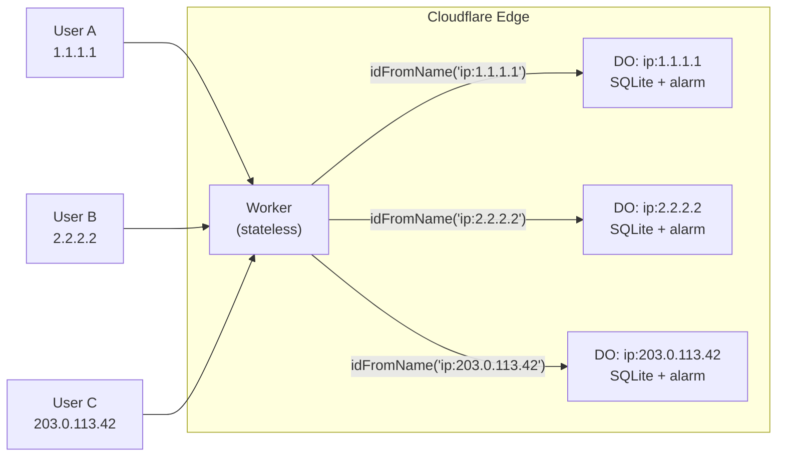
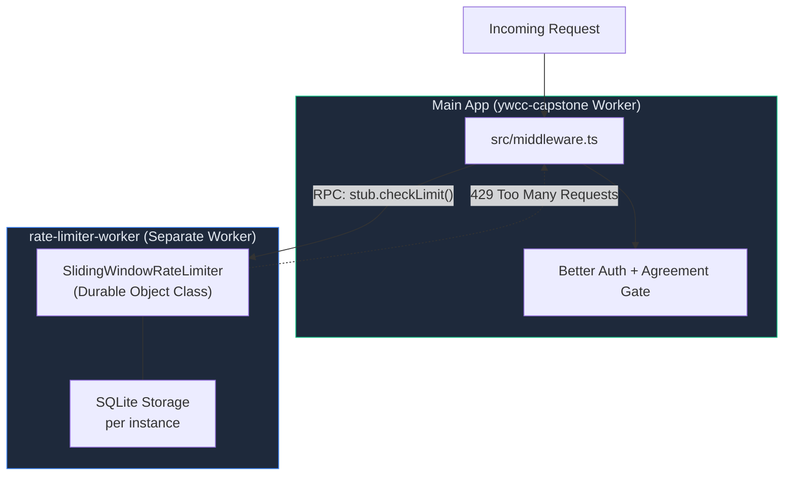
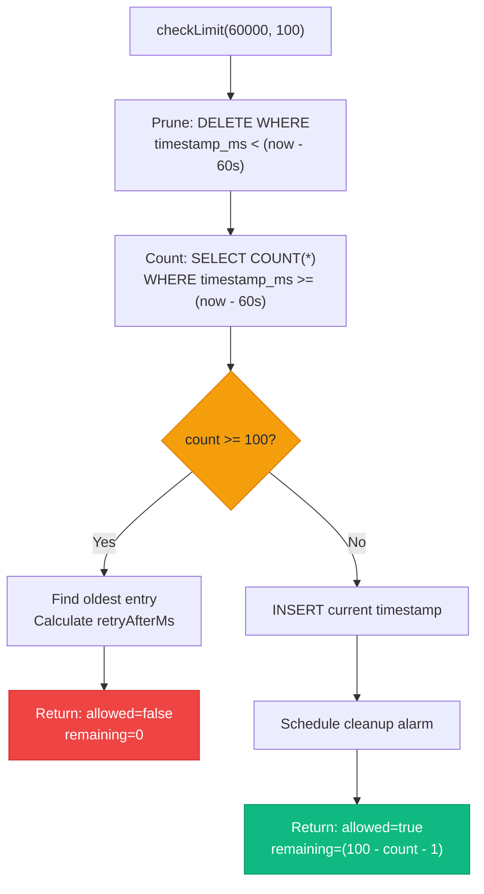
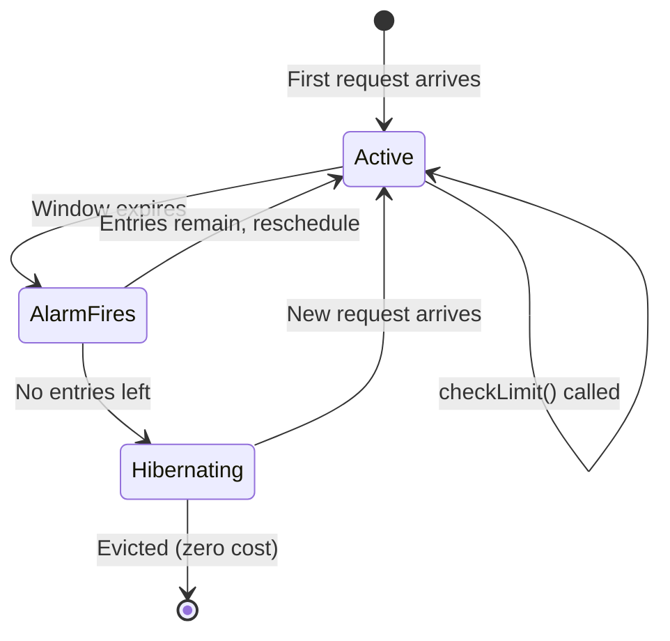
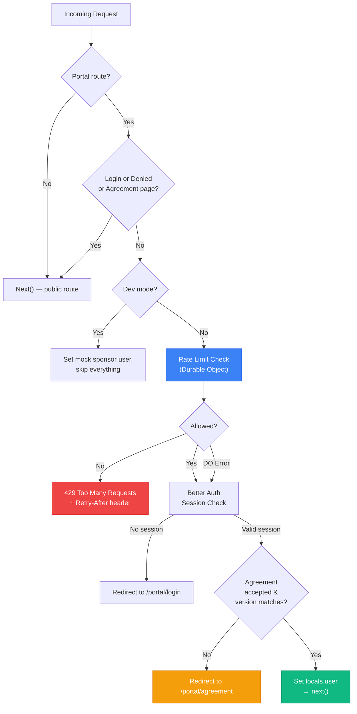

# Rate Limiting with Cloudflare Durable Objects

How Cloudflare Durable Objects provide stateful, per-IP rate limiting at the edge — and how this project implements it.

> **Revised 2026-04-29 for the Cloudflare Workers cutover (PR #681).** The middleware now runs inside an Astro 6 Worker (`@astrojs/cloudflare` v13, `output: 'server'`), not a Pages project. The cross-script Durable Object architecture is unchanged. Cloudflare Access has been fully retired (Stories 9.17 / 9.18 both shipped); the DO rate limiter is the sole pre-auth traffic filter.

## Why This Exists

This project originally used **Cloudflare Access** to protect sponsor portal routes (`/portal/*`). CF Access blocked unauthenticated requests at the CDN edge — zero Worker CPU consumed, zero D1 reads. That edge-level protection has been removed; sponsor auth is now unified under **Better Auth** (Google + GitHub OAuth + Resend Magic Link), with sessions in D1 and a KV cache.

Without a CDN-edge gate, every bot probe, brute-force attempt, and unauthenticated hit to protected routes spins up a Worker, runs middleware, and counts against plan limits. The Durable Object rate limiter fills that gap — blocking abusive traffic **before** it reaches the auth layer.

The rate limiter was deployed first (Story 9.17), while CF Access was still active, so both layers ran in parallel during the transition. With Story 9.18 (Better Auth consolidation) and PR #681 (Workers cutover) both shipped, the rate limiter is now the **sole pre-auth defense** at the edge.

## The Problem: Stateless Workers Need State

Cloudflare Workers are stateless by design. Each incoming request spins up an isolate, runs your code, and tears down. There is no shared memory between invocations. That makes rate limiting — which fundamentally requires counting requests over time — impossible inside a single Worker.

Traditional solutions involve external state stores (Redis, a database), but those add latency and a network hop on every request. Durable Objects solve this by giving you **single-threaded, named objects that live at the edge** with their own persistent storage.

## What Durable Objects Are

A Durable Object (DO) is a JavaScript class instance that Cloudflare keeps alive in a single location. Three properties make it useful for rate limiting:

1. **Named addressing** — You create instances by name (e.g., `ip:203.0.113.42`). The same name always routes to the same instance.
2. **Single-threaded execution** — Only one request runs inside a DO at a time. No race conditions, no locks needed.
3. **Embedded SQLite storage** — Each DO has its own SQLite database that persists across requests and survives hibernation.

Think of each DO as a tiny, private server dedicated to a single purpose — in this case, tracking one IP address's request history.



## Why One DO per IP (Not a Global Singleton)

A common first instinct is to create a single global rate limiter DO. Cloudflare explicitly warns against this — a single DO instance tops out at roughly 500-1,000 requests per second because everything serializes through one thread.

The correct pattern is **one DO per rate-limit key**. Each IP address gets its own instance. This scales horizontally — 10,000 unique IPs means 10,000 independent DOs, each handling only that IP's traffic. Cloudflare distributes them across its network automatically.

## Architecture: Separate Worker via Cross-Script Binding

The astro-app and the rate limiter live in **separate Workers** in the same Cloudflare account. The DO class is declared on `rate-limiter-worker`; the astro-app references it by `script_name` via a cross-script Durable Object binding. This keeps each Worker's bundle small and lets the rate limiter be deployed/upgraded independently.



Two `wrangler.jsonc` files wire this together:

**Rate limiter worker** — declares the DO class and its SQLite migration:

```jsonc
// rate-limiter-worker/wrangler.jsonc
{
  "name": "rate-limiter-worker",
  "durable_objects": {
    "bindings": [{ "name": "RATE_LIMITER", "class_name": "SlidingWindowRateLimiter" }]
  },
  "migrations": [{ "tag": "v1", "new_sqlite_classes": ["SlidingWindowRateLimiter"] }]
}
```

**Main app** — binds to the DO via `script_name`, pointing to the other worker. The binding lives inside the `[env.capstone]` block (only the production capstone Worker uses the rate limiter; RWC content Workers and preview Workers don't bind it):

```jsonc
// astro-app/wrangler.jsonc
{
  "env": {
    "capstone": {
      "name": "ywcc-capstone",
      "durable_objects": {
        "bindings": [{
          "name": "RATE_LIMITER",
          "class_name": "SlidingWindowRateLimiter",
          "script_name": "rate-limiter-worker"
        }]
      }
    }
  }
}
```

The rate limiter worker must be deployed **before** the main app — the binding references it by name. Bootstrapping a fresh CF account: deploy `rate-limiter-worker` first, then `ywcc-capstone`.

## The Sliding Window Algorithm

The rate limiter uses a **sliding window** — not fixed buckets. A fixed window (e.g., "100 requests per minute starting at :00") allows bursts of 200 at the boundary (100 at :59, 100 at :00). A sliding window counts from *right now* back N milliseconds, avoiding that spike.

Each DO instance maintains a SQLite table of timestamps:

```sql
CREATE TABLE IF NOT EXISTS requests (
    id INTEGER PRIMARY KEY,
    timestamp_ms INTEGER NOT NULL
);
CREATE INDEX IF NOT EXISTS idx_requests_ts ON requests(timestamp_ms);
```

When `checkLimit(windowMs, maxRequests)` is called:



### Why SQLite Over KV Storage

Durable Objects offer both key-value and SQLite storage. SQLite is the better fit here because:

- **Atomic operations** — DELETE + COUNT run in one coalesced transaction with no `await` between them, so there is no race condition window.
- **Indexed range queries** — `WHERE timestamp_ms >= ?` uses the index directly. No need to deserialize an entire array of timestamps.
- **Efficient pruning** — `DELETE WHERE timestamp_ms < ?` cleans up in one statement vs. reading, filtering, and rewriting a KV value.

### The RPC Call (Not fetch)

The Worker communicates with the DO using **RPC method calls**, not HTTP `fetch()`. RPC is typed, avoids URL parsing overhead, and is available with `compatibility_date >= "2024-04-03"`:

```typescript
// Modern RPC (this project uses this approach)
const result = await stub.checkLimit(60_000, 100);

// Legacy fetch — avoid this
const result = await stub.fetch(new Request("https://fake/check"));
```

The DO class extends `DurableObject` and exposes `checkLimit` as a public async method. Cloudflare routes the RPC call to the correct instance automatically.

## Alarm-Based Cleanup and Hibernation

Each DO gets one alarm timer. The rate limiter uses it to prune expired rows *after* the window passes:



The alarm flow:

1. On each allowed request, the DO schedules an alarm for `now + windowMs` (only if no alarm exists yet).
2. When the alarm fires, it prunes rows older than the window.
3. If rows remain, it reschedules the alarm for when the oldest surviving entry expires.
4. If no rows remain, it does **not** reschedule — the DO hibernates automatically at zero cost.

Hibernation is key to keeping costs low. A DO that has no pending alarms and no active connections consumes no resources and incurs no charges. When a new request arrives for that IP, Cloudflare wakes the DO, its SQLite data is still there, and it resumes normally.

## Middleware Integration

The middleware sits in the request pipeline between the "is this a protected route?" check and the auth logic. With CF Access retired, the rate limiter is the sole pre-auth gate; a unified Better Auth session check + sponsor agreement gate handles every authenticated request:



The middleware code uses the Astro 6 / adapter v13 binding pattern (`import { env } from 'cloudflare:workers'`):

```typescript
import { env } from 'cloudflare:workers';

const rateLimiter = env.RATE_LIMITER;
if (rateLimiter) {
  const ip = context.request.headers.get("CF-Connecting-IP") ?? "unknown";
  try {
    const id = rateLimiter.idFromName(`ip:${ip}`);
    const stub = rateLimiter.get(id);
    const result = await stub.checkLimit(RATE_LIMIT_WINDOW_MS, RATE_LIMIT_MAX_REQUESTS);
    if (!result.allowed) {
      return new Response("Too Many Requests", {
        status: 429,
        headers: {
          "Retry-After": String(Math.ceil(result.retryAfterMs / 1000)),
          "X-RateLimit-Remaining": "0",
          "X-RateLimit-Limit": String(RATE_LIMIT_MAX_REQUESTS),
        },
      });
    }
  } catch (e) {
    console.error("[middleware] Rate limiter error, failing open:", e);
  }
}
```

Three design choices to note:

1. **`CF-Connecting-IP` header** — Cloudflare populates this with the true client IP, even behind proxies. Falls back to `"unknown"` if absent (e.g., in test environments).
2. **Optional binding** (`RATE_LIMITER?`) — The binding is typed as optional in `env.d.ts`. RWC content Workers (`rwc-us`, `rwc-intl`) and all preview Workers do **not** bind the rate limiter; they don't serve portal traffic. The middleware skips rate limiting on those Workers.
3. **Dev mode bypass** — `import.meta.env.DEV` short-circuits the entire pipeline, including rate limiting. You don't need the rate-limiter-worker running locally.

> Pre-Astro-6 code paths used `runtimeEnv = (Astro.locals as any).runtime?.env` — that path was removed in `@astrojs/cloudflare` v13. Always import from `cloudflare:workers`.

## Fail-Open Design

If the DO throws an error (network issue, storage corruption, Cloudflare internal problem), the `catch` block logs the error and **lets the request through**. This is a deliberate choice:

- A rate limiter outage should not become an **auth outage**.
- The downstream auth layer (Better Auth session validation) still protects the routes — no unauthenticated user can access content just because the rate limiter is down.
- Rate limiting is a defense-in-depth layer, not the only gate.

The alternative — fail-closed — would block legitimate users during any DO disruption.

### Post-CF-Access State (Story 9.18 + PR #681)

Before 9.18, two layers sat in front of the auth logic: CF Access at the CDN edge and the DO rate limiter in the Worker. After 9.18 + the Workers cutover (PR #681), CF Access is gone. The rate limiter is the **only pre-auth traffic filter**.

This does not change the fail-open rationale. Even without CF Access, the auth layer (Better Auth session check + Sanity sponsor email whitelist + agreement gate) still rejects unauthenticated and unauthorized requests. A rate limiter failure means abusive IPs consume more Worker CPU and D1 reads, but they still cannot access protected content. The impact is a cost/resource concern, not a security breach.

## Type Safety Across the Boundary

The main app and the rate limiter worker are separate deployments. To keep the RPC call type-safe, `env.d.ts` augments `Cloudflare.Env` with an interface that mirrors the DO's public method. The base `Cloudflare.Env` type is generated by `npx wrangler types -C astro-app` (it reads `wrangler.jsonc` and produces `worker-configuration.d.ts`) — re-run that command after every binding edit:

```typescript
/** Rate limiter Durable Object RPC interface (hosted in rate-limiter-worker) */
interface RateLimiterDO {
  checkLimit(windowMs: number, maxRequests: number): Promise<{
    allowed: boolean;
    remaining: number;
    retryAfterMs: number;
  }>;
}

// In env.d.ts, augment Cloudflare.Env:
declare namespace Cloudflare {
  interface Env {
    RATE_LIMITER?: DurableObjectNamespace<RateLimiterDO>;
  }
}
```

TypeScript now enforces that `stub.checkLimit()` is called with the correct arguments and returns the expected shape — even though the actual class lives in a different Worker bundle.

## Testing Strategy

Two layers of tests validate the system:

**DO unit tests** (`rate-limiter-worker/test/rate-limiter.test.ts`) — Run inside Cloudflare's `cloudflare:test` Vitest environment, which provides real DO instances:

| Test Case | What It Validates |
|:----------|:-----------------|
| Allows requests under limit | `remaining` decrements correctly |
| Blocks at limit | `allowed=false`, `retryAfterMs >= 1000` |
| Alarm prunes expired entries | SQLite table empty after alarm fires |
| Alarm reschedules when entries remain | Alarm is non-null, entries persist |
| Separate instances per IP | Filling `ip:1.1.1.1` does not affect `ip:2.2.2.2` |
| Persists windowMs for alarm | Storage contains the correct value |
| No AUTOINCREMENT overhead | `sqlite_sequence` table absent |

**Middleware integration tests** (`astro-app/src/__tests__/middleware.test.ts`) — Mock the DO binding and verify the middleware response:

| Test Case | What It Validates |
|:----------|:-----------------|
| 429 with correct headers | `Retry-After` and `X-RateLimit-Remaining` present |
| Pass-through on allowed | Request reaches auth logic |
| Fail-open on DO error | Request continues despite exception |
| Missing IP fallback | `"unknown"` key used, no crash |
| Dev mode skip | Rate limiting not invoked |
| Undefined binding skip | Graceful no-op |

## Cost Profile: Free Plan vs Paid Plan

Durable Objects with SQLite storage are available on both plans. The implementation uses SQLite and requires no changes to run on either.

### Free Plan (Daily Limits, Hard Cap)

| Resource | Free Allowance | Estimated Daily Usage |
|:---------|:---------------|:---------------------|
| DO requests | 100,000/day | ~2,000 (20 sponsors x 100 page loads) |
| DO compute (GB-s) | 13,000/day | ~3 (2,000 x 10ms x 128MB) |
| Storage per account | 5 GB | Negligible (timestamps, pruned) |
| DO classes | 100 max | 1 |

At ~20 sponsors with the agreement gate active, normal traffic uses **under 2%** of the daily budget. Note: only the production capstone Worker hits the rate limiter — RWC content Workers and preview Workers don't bind it, so they don't contribute to DO request counts.

**The catch:** Free plan limits are hard caps. If you exceed any limit, further DO operations **fail with an error** (not throttled — they error). The fail-open `catch` block handles this gracefully: requests pass through to auth, and the limit resets the next day.

**The irony under attack:** A bot hammering `/portal/*` is the scenario where you most need rate limiting, but each of those requests also consumes a DO call. A sustained attack can exhaust the 100K daily DO quota, at which point the rate limiter stops working for the rest of the day. With CF Access retired (Story 9.18), there is no other edge-level filter to fall back on — the auth layer (Better Auth session + agreement gate + sponsor email allowlist) still blocks unauthorized access, but every request burns Worker CPU and D1 reads until the daily limit resets.

### Paid Plan ($5/month, Monthly Limits)

| Resource | Included | Impact per Rate Check |
|:---------|:---------|:---------------------|
| DO requests | 1M/month | 1 |
| SQLite row reads | 25B/month | ~2 (COUNT + oldest row) |
| SQLite row writes | 50M/month | ~2 (DELETE + INSERT) + 1 per alarm |
| Storage | Unlimited | Negligible (timestamps only, pruned) |
| DO compute (GB-s) | 400K/month | Minimal (DOs hibernate between bursts) |

On the paid plan, the same bot attack just costs fractions of a cent in overages. The rate limiter keeps working through the attack without hitting a ceiling.

### Recommendation

The free plan works for this project's current scale under normal traffic. The risk is only during sustained abuse — and even then, the auth layer prevents unauthorized access. With CF Access retired and the rate limiter as the sole pre-auth filter, upgrading to the Workers Paid plan ($5/month) is the obvious escape hatch if real abuse traffic ever arrives — it eliminates the daily ceiling concern entirely.
