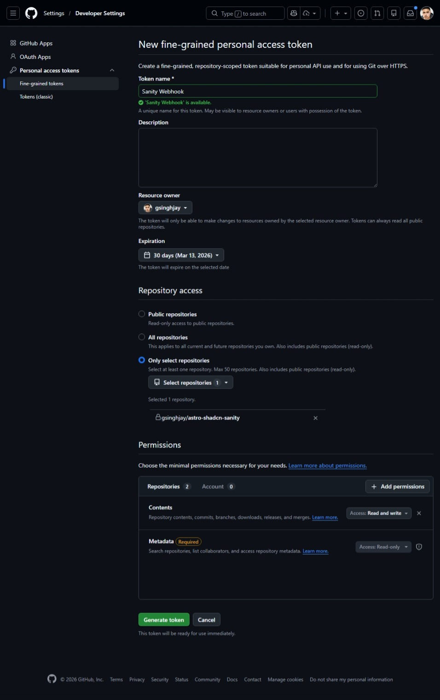
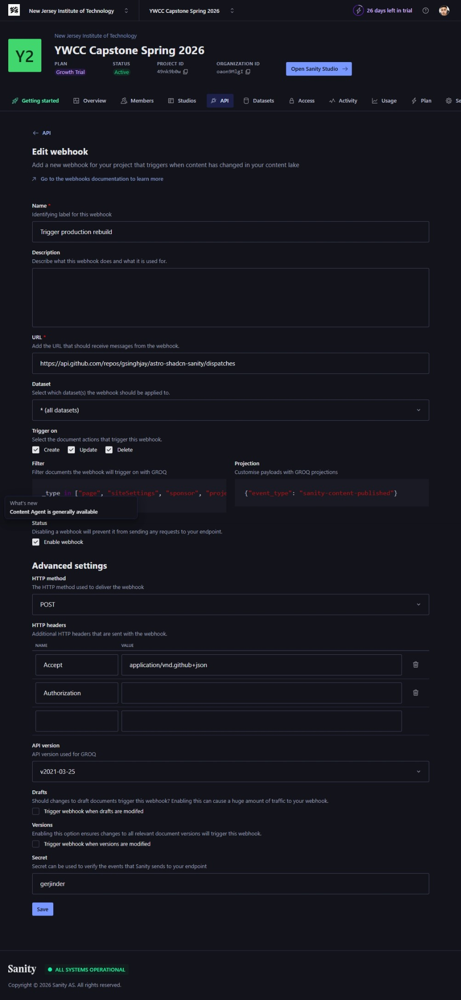
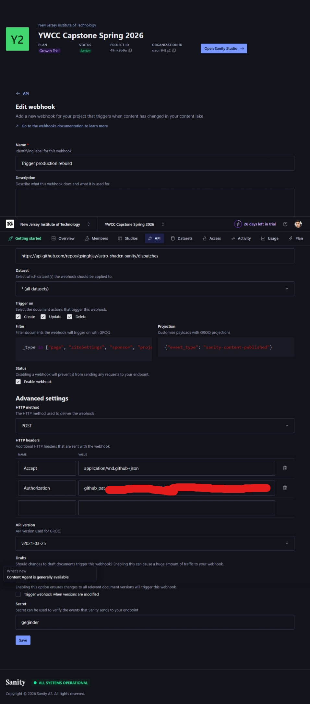

# Cloudflare Pages Setup & Testing Guide

Guide for deploying the Astro site to Cloudflare Pages with GA4 analytics, security headers, and GitHub Actions CI/CD.

---

## Prerequisites

- Cloudflare account ([sign up free](https://dash.cloudflare.com/sign-up))
- GitHub repository access with admin permissions (for secrets/variables)
- Node.js 22+ installed locally
- Optional: GA4 property for analytics tracking

---

## 1. Create Cloudflare Pages Project

1. Go to [dash.cloudflare.com](https://dash.cloudflare.com) → **Workers & Pages** → **Create**
2. Select **Pages** → **Connect to Git** (or skip git — we deploy via wrangler)
3. If using direct upload: **Create project** with name `ywcc-capstone`
4. If connecting GitHub: select the `astro-shadcn-sanity` repo, but **cancel the auto-build** — our GitHub Actions workflow handles this

> **Note:** You can skip this step entirely. The first `wrangler pages deploy` will auto-create the project.

---

## 2. Get Cloudflare Credentials

### Account ID

1. [dash.cloudflare.com](https://dash.cloudflare.com) → right sidebar → **Account ID**
2. Copy it — you'll need it for both local testing and GitHub

### API Token

1. Go to [dash.cloudflare.com/profile/api-tokens](https://dash.cloudflare.com/profile/api-tokens) → **Create Token**
2. You'll see a list of pre-built templates (Edit zone DNS, Edit Cloudflare Workers, etc.) — **ignore all of them**
3. At the top under **Custom token**, click the **"Get started"** button
4. Configure the token:
   - **Token name:** `ywcc-capstone-pages-deploy`
   - **Permissions** (three dropdowns in a row):
     - First dropdown: **Account**
     - Second dropdown: **Cloudflare Pages**
     - Third dropdown: **Edit**
   - **Account Resources:** Select **Include** → pick **your account** from the dropdown
   - Leave everything else as default (Zone Resources, Client IP filtering, TTL)
5. Click **Continue to summary** → review → **Create Token**
6. Copy the token value immediately — it is shown **only once**

> **Why not "Edit Cloudflare Workers"?** That template gives broader permissions than needed. A custom token scoped to just Cloudflare Pages Edit is the least-privilege approach.

---

## 3. Local Deploy Test (Before GitHub Actions)

Test the deployment from your local machine before setting up CI/CD.

```bash
# From repo root, set credentials
export CLOUDFLARE_API_TOKEN="your-token-here"
export CLOUDFLARE_ACCOUNT_ID="your-account-id-here"

# Build
npm run build --workspace=astro-app

# Deploy directly from local machine
cd astro-app
npx wrangler pages deploy dist/ --project-name=ywcc-capstone
cd ..
```

This deploys to `https://ywcc-capstone.pages.dev`. Verify:

- Site loads with HTTPS
- Pages render (homepage, about, sponsors, projects, contact)
- View page source → CSP meta tag is present
- Browser DevTools → Network → check response headers for `X-Content-Type-Options`, `X-Frame-Options`, `Referrer-Policy`, `Permissions-Policy`

---

## 4. Test with GA4 (Optional)

If you have a GA4 property:

1. Get your measurement ID from [analytics.google.com](https://analytics.google.com) → Admin → Data Streams → your stream → **Measurement ID** (format: `G-XXXXXXXXXX`)
2. Add to `astro-app/.env`:
   ```
   PUBLIC_GA_MEASUREMENT_ID="G-XXXXXXXXXX"
   ```
3. Rebuild and redeploy:
   ```bash
   npm run build --workspace=astro-app
   cd astro-app && npx wrangler pages deploy dist/ --project-name=ywcc-capstone && cd ..
   ```
4. Visit the deployed site → View Source → confirm `gtag.js` script with your ID
5. Check GA4 Real-Time reports for page views

> If you don't have a GA4 property yet, skip this — the script is conditionally omitted when the ID is empty.

---

## 5. Local Wrangler Preview (Alternative to Deploy)

Preview the build locally using Cloudflare's miniflare runtime:

```bash
cd astro-app
npx wrangler pages dev dist/
```

This runs locally (usually on `http://localhost:8788`). Verify pages render. Press `Ctrl+C` to stop.

> **Note:** The `_headers` security response headers won't be applied in local preview — that's Cloudflare Pages infrastructure only.

---

## 6. Configure GitHub for Automated Deploys

### Secrets

Go to your GitHub repo → **Settings** → **Secrets and variables** → **Actions** → **Secrets** tab → **New repository secret**

| Secret | Value |
|---|---|
| `CLOUDFLARE_API_TOKEN` | The API token from step 2 |
| `CLOUDFLARE_ACCOUNT_ID` | Your account ID from step 2 |
| `SANITY_API_READ_TOKEN` | Sanity read token (same as your local `astro-app/.env`) |

### Variables

Go to **Settings** → **Secrets and variables** → **Actions** → **Variables** tab → **New repository variable**

| Variable | Value |
|---|---|
| `PUBLIC_SANITY_STUDIO_PROJECT_ID` | `49nk9b0w` |
| `PUBLIC_SANITY_STUDIO_DATASET` | `production` |
| `PUBLIC_GA_MEASUREMENT_ID` | Your GA4 ID (e.g., `G-XXXXXXXXXX`) or leave empty |
| `PUBLIC_SITE_URL` | `https://ywcc-capstone.pages.dev` |

---

## 7. Test GitHub Actions Pipeline

Once secrets and variables are configured:

1. Go to the **Actions** tab in GitHub
2. Select **Deploy to Cloudflare Pages** workflow
3. Click **Run workflow** (manual dispatch) to test without pushing code
4. Watch the workflow run — target is under 3 minutes
5. Verify the deployment URL in the workflow logs

The workflow also triggers automatically on any push to the `main` branch.

---

## 8. Post-Deploy Verification Checklist

Run through this checklist on the deployed `https://ywcc-capstone.pages.dev`:

- [ ] Site loads with HTTPS
- [ ] All 5 pages render: `/`, `/about`, `/sponsors`, `/projects`, `/contact`
- [ ] View Source: CSP `<meta>` tag present in `<head>`
- [ ] DevTools → Network → select any request → Response Headers show:
  - `X-Content-Type-Options: nosniff`
  - `X-Frame-Options: DENY`
  - `Referrer-Policy: strict-origin-when-cross-origin`
  - `Permissions-Policy: camera=(), microphone=(), geolocation=()`
- [ ] If GA4 configured: `gtag.js` script in page source + GA4 real-time reports show visits
- [ ] Lighthouse scores 90+ across Performance, Accessibility, Best Practices, SEO

---

## 9. Lighthouse Audit

Run a Lighthouse audit on the deployed site:

1. Open the deployed site in Chrome
2. DevTools (`F12`) → **Lighthouse** tab
3. Check all categories (Performance, Accessibility, Best Practices, SEO)
4. Click **Analyze page load**

**Targets:**

| Category | Target |
|---|---|
| Performance | 90+ (target 95+) |
| Accessibility | 90+ |
| Best Practices | 90+ |
| SEO | 90+ |

> If SEO scores are below 90, it's likely due to missing canonical/OG tags — those are covered in Story 5.1 (SEO & Sitemap), not this deployment story.

---

## 10. Set Up Sanity Webhook (Auto-Rebuild on Publish)

When an editor publishes content in Sanity Studio, the production site should automatically rebuild. Cloudflare Pages only auto-builds on **code pushes** — it has no way to know when content changes in Sanity. Cloudflare deploy hooks (which would solve this) require a **Pro plan**, so this project uses a free-tier alternative: **Sanity webhook → GitHub `repository_dispatch` → GitHub Actions builds the site with fresh Sanity content → Wrangler deploys to Cloudflare Pages**.

### 10a. Create a GitHub Fine-Grained PAT

The Sanity webhook needs a token to call the GitHub API.

1. Go to [github.com/settings/tokens?type=beta](https://github.com/settings/tokens?type=beta) → **Generate new token**
2. Configure:
   - **Token name:** `Sanity Webhook`
   - **Expiration:** 90 days (or longer — set a calendar reminder to rotate)
   - **Repository access:** **Only select repositories** → pick `gsinghjay/astro-shadcn-sanity`
   - **Permissions → Repository permissions:** **Contents** → **Read and write** (required for `repository_dispatch`)
3. Click **Generate token** and copy it immediately



### 10b. Configure the Sanity Webhook

1. Go to [sanity.io/manage](https://sanity.io/manage) → your project → **API** → **Webhooks** → **Add webhook**
2. Fill in:

| Field | Value |
|---|---|
| **Name** | `Trigger production rebuild` |
| **URL** | `https://api.github.com/repos/gsinghjay/astro-shadcn-sanity/dispatches` |
| **Trigger on** | Create, Update, Delete |
| **Filter** | `_type in ["page", "siteSettings", "sponsor", "project", "team", "event"]` |
| **Drafts** | OFF (only fire on publish, not every keystroke) |
| **HTTP method** | POST |
| **HTTP Headers** | `Authorization` : `token YOUR_GITHUB_PAT` (see warning below) |
| **HTTP Headers** | `Accept` : `application/vnd.github+json` |
| **Projection** | `{"event_type": "sanity-content-published"}` |
| **Secret** | Add a secret string for audit trail |

3. Enable the webhook and save

> **Critical: The Authorization header value must be the word `token`, a space, then your PAT.**
> For example: `token github_pat_XXXXXXXXXXXX`. Do **not** paste the PAT alone — GitHub returns `401 Requires authentication` if the `token ` prefix is missing. Do **not** use `Bearer` — that is a different auth scheme and will also fail.

**Before** (empty Authorization value — returns 401):



**After** (PAT set correctly — returns 204):



### 10c. How It Works

The GitHub Actions workflow (`.github/workflows/sanity-deploy.yml`) listens for the `sanity-content-published` `repository_dispatch` event:

```
Editor publishes in Studio
  → Sanity Content Lake fires GROQ webhook
    → POST to GitHub API (repository_dispatch)
      → GitHub Actions: checkout → npm ci → build → wrangler pages deploy
        → Production site updated (~2-3 min)
```

### 10d. Verify

1. Publish a content change in Sanity Studio
2. Check **sanity.io/manage** → Webhooks → your webhook → **Attempts** tab → should show `204 No Content`
3. Check **GitHub** → **Actions** tab → **Sanity Content Deploy** workflow should be running
4. After the workflow completes, verify the production site shows the updated content

### 10e. Troubleshooting

- **Webhook shows 401/403:** Most commonly, the Authorization header value is missing the `token ` prefix (it must be `token github_pat_...`, not just `github_pat_...`). If the prefix is correct, the PAT may be expired or missing **Contents: Read and write** permission on the correct repo.
- **Webhook shows 404:** The URL is wrong. Verify the repo owner/name: `gsinghjay/astro-shadcn-sanity`.
- **Webhook shows 422:** The projection body is malformed. It must be valid JSON: `{"event_type": "sanity-content-published"}`.
- **GitHub Actions workflow doesn't appear:** The workflow file must exist on the `main` branch. Merge the branch containing `sanity-deploy.yml` first.
- **Build fails in the workflow:** Check that `CLOUDFLARE_API_TOKEN`, `CLOUDFLARE_ACCOUNT_ID`, and the `PUBLIC_SANITY_*` variables are all configured in GitHub (same as section 6).

---

## Quick Reference: One-Shot Local Test

```bash
# Set credentials
export CLOUDFLARE_API_TOKEN="..."
export CLOUDFLARE_ACCOUNT_ID="..."

# Build and deploy
npm run build --workspace=astro-app && cd astro-app && npx wrangler pages deploy dist/ --project-name=ywcc-capstone && cd ..

# Visit
echo "https://ywcc-capstone.pages.dev"
```

---

## Troubleshooting

### Build fails with "Invalid binding `SESSION`"

This is an informational warning from the Cloudflare adapter about KV sessions — it does not affect static builds. Safe to ignore.

### `_headers` not showing in response

- Verify `astro-app/public/_headers` exists (Astro copies it to `dist/` during build)
- Verify `dist/_headers` is present after build: `ls astro-app/dist/_headers`
- `_headers` only works on Cloudflare Pages, not in local dev or wrangler preview

### GA4 script not appearing in page source

- Confirm `PUBLIC_GA_MEASUREMENT_ID` is set in `.env` (not empty string)
- Rebuild after changing `.env` — env vars are baked in at build time

### GitHub Actions workflow fails

- Verify all 3 secrets are set: `CLOUDFLARE_API_TOKEN`, `CLOUDFLARE_ACCOUNT_ID`, `SANITY_API_READ_TOKEN`
- Verify all 4 variables are set: `PUBLIC_SANITY_STUDIO_PROJECT_ID`, `PUBLIC_SANITY_STUDIO_DATASET`, `PUBLIC_GA_MEASUREMENT_ID`, `PUBLIC_SITE_URL`
- Check the API token has `Cloudflare Pages: Edit` permission

### Wrangler local preview shows errors

- Make sure you built first: `npm run build --workspace=astro-app`
- Run from the `astro-app/` directory: `cd astro-app && npx wrangler pages dev dist/`
