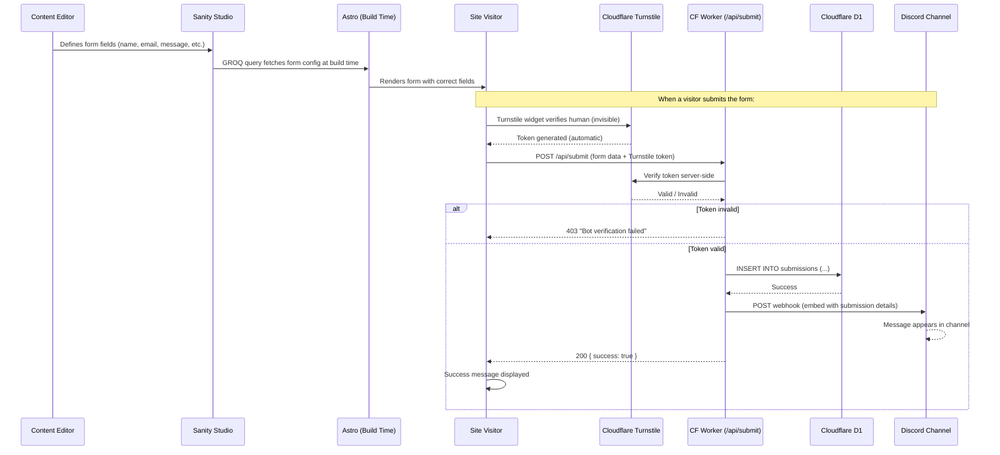

# How the Contact Form Submission Pipeline Works

> **Audience:** Beginners and new team members
> **Date:** 2026-02-13
> **Project:** astro-shadcn-sanity

---

## Table of Contents

- [The Problem](#the-problem)
- [Why Not Just Use a Form Service?](#why-not-just-use-a-form-service)
- [Our Solution: The Full Pipeline](#our-solution-the-full-pipeline)
- [How It Works (The Big Picture)](#how-it-works-the-big-picture)
- [The Five Components Explained](#the-five-components-explained)
  - [1. Sanity Form Toolkit (CMS-Managed Forms)](#1-sanity-form-toolkit-cms-managed-forms)
  - [2. Astro Form Component (Frontend)](#2-astro-form-component-frontend)
  - [3. Cloudflare Turnstile (Bot Protection)](#3-cloudflare-turnstile-bot-protection)
  - [4. Cloudflare D1 (Database)](#4-cloudflare-d1-database)
  - [5. Discord Webhook (Team Notification)](#5-discord-webhook-team-notification)
- [The Submission Flow Step by Step](#the-submission-flow-step-by-step)
- [Benefits of This Approach](#benefits-of-this-approach)
- [What Each Team Member Should Know](#what-each-team-member-should-know)
- [How to Test Locally](#how-to-test-locally)
- [Troubleshooting](#troubleshooting)
- [Key Concepts Glossary](#key-concepts-glossary)

---

## The Problem

Our site needs a contact form where prospective sponsors can express interest in the capstone program. This sounds simple, but a real-world form has several challenges:

1. **Spam bots** will flood the form with junk submissions within hours of going live
2. **Submissions need to be stored** somewhere reliable and queryable
3. **The team needs to be notified** when someone submits — not check a dashboard manually
4. **Content editors** should be able to change the form's fields, labels, and messages without touching code
5. **Cost must be $0** — we're on free tiers for everything

Most teams reach for a third-party form service (Formspree, Typeform, Google Forms). We built something better using tools we already have.

## Why Not Just Use a Form Service?

We considered several alternatives before landing on this approach:

| Approach | Why We Didn't Use It |
|----------|---------------------|
| **Google Forms** | Ugly embed, no design control, no bot protection, looks unprofessional |
| **Formspree / Typeform** | Free tiers have submission limits (50-100/month), no Discord integration, another vendor to manage |
| **Formsite** (NJIT license) | CORS issues with `fetch()` submissions, field IDs are opaque (`RESULT_TextField-1`), limited customization |
| **Sanity as submission store** | Consumes Sanity's 10K document quota for non-content data, adds cost at scale |
| **Email-based (mailto:)** | No bot protection, no storage, terrible UX, spam magnet |

Our approach uses **Cloudflare's free tier** (which we already use for hosting) to handle everything. Zero new vendors. Zero new costs.

## Our Solution: The Full Pipeline

We combine five free tools into a pipeline where each tool does what it's best at:

| Tool | Role | Why This Tool |
|------|------|---------------|
| **Sanity + @sanity/form-toolkit** | Define form fields in CMS | Editors can change fields without code deploys |
| **Astro + fulldev/ui** | Render the form on the website | Accessible, fast, matches our design system |
| **Cloudflare Turnstile** | Block bots | Free, invisible, privacy-preserving (no puzzles for users) |
| **Cloudflare D1** | Store submissions | Free SQLite database, 5GB storage, runs at the edge |
| **Discord Webhook** | Notify the team | Instant notification in a channel everyone already monitors |

## How It Works (The Big Picture)



The entire submission flow happens in milliseconds. The visitor sees the success message almost instantly. The team sees the Discord notification within seconds.

## The Five Components Explained

### 1. Sanity Form Toolkit (CMS-Managed Forms)

**What it does:** Lets content editors define form fields (name, email, message, etc.) in Sanity Studio instead of hardcoding them in code.

**How it works:**

The `@sanity/form-toolkit` package adds a `formSchema` plugin to Sanity Studio. This creates a new **"Form"** document type where editors can:

- Add fields (text, email, textarea, select, checkbox, radio)
- Set field labels, placeholders, and validation (required/optional)
- Reorder fields by dragging
- Create multiple forms for different purposes

The `contactForm` block in the page builder then **references** a form document. When the site builds, Astro fetches the form's field configuration via a GROQ query and renders the correct inputs.

**Why this matters for the team:**

- Content editors can add an "Organization" field, change "Message" to "How can we help?", or make a field optional — all without a code change or deployment
- If we need a second form (e.g., a volunteer signup), editors can create one in Studio and drop it on any page

### 2. Astro Form Component (Frontend)

**What it does:** Renders the HTML form on the website using the field configuration from Sanity.

**How it works:**

The `ContactForm.astro` component receives the form data as props (from Sanity) and dynamically renders the right input type for each field:

| Sanity Field Type | Rendered As |
|-------------------|-------------|
| `text` | `<Input type="text">` |
| `email` | `<Input type="email">` |
| `textarea` | `<Textarea>` |
| `select` | `<NativeSelect>` with options |

The component uses our existing fulldev/ui design system components (`Input`, `Textarea`, `NativeSelect`, `Button`) so the form automatically matches the site's look and feel.

**Client-side validation** happens before submission:
- Required fields must be filled
- Email fields must have a valid format
- Error messages use ARIA attributes for screen reader accessibility

### 3. Cloudflare Turnstile (Bot Protection)

**What it does:** Prevents bots from submitting fake form entries.

**How it works:**

Turnstile is Cloudflare's free alternative to reCAPTCHA. Unlike Google's CAPTCHA (which makes you click fire hydrants), Turnstile is **invisible** in most cases. It runs in the background and determines if the visitor is human based on browser signals.

The flow:
1. When the form page loads, a small Turnstile script runs in the background
2. Turnstile generates a **token** — a cryptographic proof that the visitor is human
3. When the form is submitted, this token is sent along with the form data
4. Our server endpoint verifies the token with Cloudflare's API before processing
5. If the token is invalid (bot), the submission is rejected with a 403 error

**Why Turnstile instead of reCAPTCHA?**

| Feature | Turnstile | reCAPTCHA |
|---------|-----------|-----------|
| Cost | Free | Free (with limits) |
| User experience | Invisible (no puzzles) | Often requires clicking images |
| Privacy | No tracking cookies | Google tracks users |
| Integration | Native Cloudflare ecosystem | Separate vendor |

### 4. Cloudflare D1 (Database)

**What it does:** Stores every validated form submission in a SQLite database at the edge.

**How it works:**

D1 is Cloudflare's serverless SQLite database. It runs at the edge (close to visitors) and requires no server management. Our submissions table looks like this:

| Column | Type | Description |
|--------|------|-------------|
| `id` | INTEGER | Auto-incrementing primary key |
| `name` | TEXT | Submitter's full name |
| `email` | TEXT | Submitter's email address |
| `organization` | TEXT | Submitter's organization (optional) |
| `message` | TEXT | The inquiry message |
| `created_at` | TEXT | Timestamp of submission |

**Why D1 instead of storing in Sanity?**

- Sanity's free tier has a **10,000 document limit**. Each form submission would consume one document. With 100 submissions, that's 100 fewer pages/sponsors/blocks you can create.
- D1's free tier gives you **5GB of storage** and **5 million reads/day**. Form submissions are tiny — you could store hundreds of thousands.
- D1 is designed for this kind of transactional data. Sanity is designed for content.

### 5. Discord Webhook (Team Notification)

**What it does:** Sends an instant message to a Discord channel whenever someone submits the form.

**How it works:**

A Discord webhook is a special URL that accepts HTTP POST requests and turns them into Discord messages. When our server endpoint successfully processes a submission, it sends a `fetch()` request to the Discord webhook URL with the submission details formatted as a rich embed.

The Discord message looks like this:

```
┌─────────────────────────────────────────┐
│  New Sponsor Inquiry                     │
│                                          │
│  Name:         Jane Smith                │
│  Email:        jane@acme.com             │
│  Organization: Acme Corp                 │
│  Message:      We're interested in       │
│                sponsoring a team for...   │
│                                          │
│  Today at 2:34 PM                        │
└─────────────────────────────────────────┘
```

**Why Discord instead of email?**

- The team already uses Discord for communication
- Instant delivery (email can be delayed or filtered)
- Everyone in the channel sees it — no "I didn't get the email" excuses
- Rich formatting with embeds (name, email, message preview)
- No email service to configure (SendGrid, SES, etc.)

**Important:** The Discord webhook URL is a **secret**. Anyone with the URL can post messages to the channel. It's stored as a Cloudflare secret, never in code or client bundles.

## The Submission Flow Step by Step

Here's exactly what happens when a visitor clicks "Submit Inquiry":

### Step 1: Client-Side Validation

JavaScript in the browser checks that all required fields are filled and the email format is valid. If anything is wrong, error messages appear inline and the form doesn't submit. This gives instant feedback without hitting the server.

### Step 2: Turnstile Token Attached

The Turnstile widget has already generated a token in the background. When the form submits, this token is automatically included in the form data as a hidden field called `cf-turnstile-response`.

### Step 3: Form Data Sent to Server

The browser sends a `POST` request to `/api/submit` with all form fields plus the Turnstile token. This endpoint runs as a **Cloudflare Worker** — server-side code that executes at the edge, close to the visitor.

### Step 4: Turnstile Verification

The server endpoint extracts the Turnstile token and sends it to Cloudflare's verification API (`https://challenges.cloudflare.com/turnstile/v0/siteverify`). Cloudflare responds with `success: true` or `success: false`.

If verification fails, the server returns a 403 error and the visitor sees "Verification failed — please try again." The submission is not stored or forwarded.

### Step 5: D1 Database Insert

If Turnstile verification passes, the server inserts the submission into the D1 database. This is a standard SQL INSERT statement. The submission is now permanently stored and queryable.

### Step 6: Discord Notification

Immediately after the D1 insert, the server sends a POST request to the Discord webhook URL. The payload is a JSON object with an embed containing the submission details. Discord delivers this as a message to the configured channel within seconds.

### Step 7: Success Response

The server returns `{ success: true }` to the browser. The client-side JavaScript receives this response and toggles the form to its success state — hiding the form fields and showing the confirmation message (e.g., "Thank you for your inquiry. We will get back to you shortly.").

## Benefits of This Approach

### For the Team

- **Instant notifications** — Discord message within seconds of submission, not hours
- **Full data ownership** — Submissions stored in our own D1 database, not a third-party service
- **Queryable data** — Can run SQL queries to filter, export, or analyze submissions
- **Zero recurring cost** — All services are within Cloudflare's free tier
- **No new accounts** — Uses Cloudflare (already have) and Discord (already have)

### For Content Editors

- **Change form fields without code** — Add, remove, or reorder fields in Sanity Studio
- **Update messages without code** — Change the heading, description, and success message
- **Multiple forms** — Can create different forms for different pages (contact, volunteer, feedback)
- **Preview before publish** — See form changes in Studio before they go live

### For Site Visitors

- **No CAPTCHA puzzles** — Turnstile is invisible; no clicking traffic lights
- **Fast submission** — Edge computing means the server endpoint runs close to the visitor
- **Accessible** — ARIA attributes, keyboard navigation, screen reader support
- **Clear feedback** — Validation errors show inline, success message confirms receipt

### For Developers

- **Type-safe** — TypeGen generates types from Sanity schema and GROQ queries
- **Consistent patterns** — Uses the same fulldev/ui primitives as every other component
- **No framework runtime** — Vanilla JS for form handling, no React/Vue bundle
- **Testable** — Server endpoint is a standard Astro API route, testable with standard tools
- **No secrets in client bundle** — Turnstile secret and Discord URL are server-side only

### Compared to Alternatives

| Benefit | Our Pipeline | Google Forms | Formspree | Formsite |
|---------|:------------:|:------------:|:---------:|:--------:|
| Custom design | Yes | No | Partial | No |
| CMS-managed fields | Yes | No | No | No |
| Free (no limits) | Yes | Yes | 50/month | Yes |
| Bot protection | Turnstile | reCAPTCHA | Basic | Basic |
| Instant team notification | Discord | Email | Email | Email |
| Data ownership | Full (D1) | Google | Formspree | Formsite |
| No new vendor accounts | Yes | Google | Formspree | Formsite |
| Accessible (WCAG AA) | Yes | Partial | Partial | No |
| Invisible CAPTCHA | Yes | Sometimes | No | No |

## What Each Team Member Should Know

### Content Editors

You manage forms in **Sanity Studio** under the "Forms" section in the sidebar.

**To edit the contact form:**
1. Open Sanity Studio
2. Navigate to **Forms** in the sidebar
3. Click the form document (e.g., "Sponsor Inquiry Form")
4. Add, remove, or reorder fields
5. Click **Publish** — the form updates on the next site build

**To change the heading or success message:**
1. Navigate to the **page** containing the contact form
2. Find the **Contact Form** block in the blocks list
3. Edit the heading, description, or success message fields
4. Click **Publish**

### Developers

**Key files:**

| File | Purpose |
|------|---------|
| `studio/sanity.config.ts` | `formSchema()` plugin registration |
| `studio/src/schemaTypes/blocks/contact-form.ts` | Contact form block schema (heading, form ref) |
| `astro-app/src/pages/api/submit.ts` | Server endpoint (Turnstile verify, D1 insert, Discord) |
| `astro-app/src/components/blocks/custom/ContactForm.astro` | Form rendering component |
| `astro-app/wrangler.jsonc` | D1 database binding |
| `astro-app/migrations/0001_create_submissions.sql` | D1 table schema |
| `astro-app/.dev.vars` | Local development secrets |

**Environment variables:**

| Variable | Where It Lives | What It Does |
|----------|---------------|--------------|
| `PUBLIC_TURNSTILE_SITE_KEY` | `.env` | Public key for the Turnstile widget (safe to expose) |
| `TURNSTILE_SECRET_KEY` | `.dev.vars` + Cloudflare Secrets | Server-side key for verifying Turnstile tokens |
| `DISCORD_WEBHOOK_URL` | `.dev.vars` + Cloudflare Secrets | URL for posting to the Discord channel |

### Project Manager / Stakeholders

- **Submissions are stored permanently** in a Cloudflare D1 database. They can be exported via SQL queries.
- **The team is notified instantly** via Discord when a new submission arrives.
- **There is no monthly cost.** Everything runs within Cloudflare's free tier (100K Worker requests/day, 5GB D1 storage).
- **Form changes don't require a developer.** Content editors can modify form fields in Sanity Studio.

## How to Test Locally

### 1. Set Up Local Secrets

Create `astro-app/.dev.vars` (this file is gitignored):

```
TURNSTILE_SECRET_KEY=1x0000000000000000000000000000000AA
DISCORD_WEBHOOK_URL=https://discord.com/api/webhooks/your-test-webhook-url
```

The Turnstile secret above is Cloudflare's **official test key** — it always passes verification. Use it for local development so you don't need a real Turnstile site.

### 2. Set Up Local D1

```bash
# Create local D1 database
npx wrangler d1 migrations apply ywcc-submissions --local
```

This creates a local SQLite file that mimics the production D1 database.

### 3. Run the Dev Server

```bash
npm run dev -w astro-app
```

### 4. Submit a Test Form

1. Navigate to the page with the contact form
2. Fill in the fields and submit
3. You should see the success message

### 5. Verify the Submission Was Stored

```bash
npx wrangler d1 execute ywcc-submissions --local --command "SELECT * FROM submissions"
```

You should see your test submission in the results.

### 6. Verify Discord Notification

Check the Discord channel linked to your test webhook URL. You should see a message with the submission details.

## Troubleshooting

| Symptom | Likely Cause | Fix |
|---------|-------------|-----|
| Form submit returns 403 | Turnstile token invalid or expired | Refresh the page and try again. In dev, ensure `.dev.vars` has the test secret key. |
| Form submit returns 500 | D1 database not set up or binding missing | Run `npx wrangler d1 migrations apply ywcc-submissions --local`. Check `wrangler.jsonc` has `d1_databases` section. |
| No Discord message after submit | Webhook URL wrong or missing | Check `.dev.vars` has `DISCORD_WEBHOOK_URL`. Test the URL with `curl -X POST -H "Content-Type: application/json" -d '{"content":"test"}' YOUR_URL`. |
| Turnstile widget doesn't appear | Site key missing or wrong | Check `.env` has `PUBLIC_TURNSTILE_SITE_KEY`. Use test key `1x00000000000000000000AA` for local dev. |
| Form fields don't match Studio | GROQ projection missing or stale build | Verify the `contactForm` projection in `sanity.ts` resolves the form reference. Rebuild with `npm run build -w astro-app`. |
| "form is not defined" type error | TypeGen not run after schema change | Run `npm run typegen` to regenerate types. |
| D1 query returns empty results | Migrations not applied | Run `npx wrangler d1 migrations apply ywcc-submissions --local` (or `--remote` for production). |
| Build fails with "prerender" error | Cloudflare adapter not configured | Ensure `@astrojs/cloudflare` is in `astro.config.mjs` and `wrangler.jsonc` exists. |

## Key Concepts Glossary

- **Cloudflare Worker** — Server-side JavaScript that runs at Cloudflare's edge network (close to visitors). Our `/api/submit` endpoint is a Worker. It processes form submissions without a traditional server.
- **Cloudflare D1** — A serverless SQLite database that runs alongside Workers. Free tier includes 5GB storage and 5 million reads/day. We use it to store form submissions.
- **Cloudflare Turnstile** — A free, privacy-preserving bot detection service. Unlike reCAPTCHA, it usually requires no user interaction (no clicking images). It generates a cryptographic token that the server verifies.
- **Discord Webhook** — A special URL that accepts HTTP requests and posts messages to a Discord channel. Anyone with the URL can post, so it's kept as a secret.
- **@sanity/form-toolkit** — An official Sanity plugin that adds a `form` document type to Sanity Studio. Editors can create forms with configurable fields. The plugin provides the schema; we handle rendering and submission ourselves.
- **formSchema** — The specific plugin from `@sanity/form-toolkit` that creates the `form` document type and `formField` objects in Sanity Studio.
- **Server Endpoint** — An Astro API route (a `.ts` file in `src/pages/api/`) that runs server-side code. By adding `export const prerender = false`, the route runs on-demand as a Cloudflare Worker instead of being pre-built as a static file.
- **D1 Binding** — A connection between a Cloudflare Worker and a D1 database, configured in `wrangler.jsonc`. The binding name (e.g., `DB`) becomes available as `env.DB` in the Worker code.
- **Edge Computing** — Running server code at data centers close to the end user (instead of a single central server). Cloudflare has data centers in 300+ cities. This means form submissions are processed at the nearest edge location for minimal latency.
- **ARIA Attributes** — HTML attributes that make web content accessible to screen readers and assistive technologies. `aria-invalid="true"` tells screen readers a form field has an error. `aria-describedby` points to the error message text.
- **Secrets vs. Environment Variables** — Environment variables can be public (like `PUBLIC_TURNSTILE_SITE_KEY`). Secrets are encrypted values that only the server can access (like `TURNSTILE_SECRET_KEY` and `DISCORD_WEBHOOK_URL`). Secrets are set via `wrangler secret put` and never appear in code.
- **.dev.vars** — A file in the project root that holds secrets for local development. It mimics Cloudflare's secret storage. This file is gitignored and never committed.
- **Migration** — A SQL file that defines or modifies database tables. Migrations are applied in order (0001, 0002, etc.) to set up the database schema. Think of it as version control for your database structure.
