# Git Workflow & Release Guide

This guide explains how code moves from your local machine to production. We use **Conventional Commits**, **branch protection**, and **semantic-release** to automate versioning and changelogs. If you follow this guide, you'll never need to manually bump a version number or write a changelog entry.

## Table of Contents

- [The Big Picture](#the-big-picture)
- [Branch Strategy](#branch-strategy)
- [Setting Up Your Local Environment](#setting-up-your-local-environment)
- [Conventional Commits](#conventional-commits)
- [Step-by-Step: Making Changes](#step-by-step-making-changes)
- [Pull Request Workflow](#pull-request-workflow)
- [What Happens When You Merge to Main](#what-happens-when-you-merge-to-main)
- [Semantic Versioning](#semantic-versioning)
- [The Changelog](#the-changelog)
- [Branch Protection Rules](#branch-protection-rules)
- [Discord Notifications](#discord-notifications)
- [Common Scenarios](#common-scenarios)
- [Troubleshooting](#troubleshooting)
- [Quick Reference](#quick-reference)

---

## The Big Picture

Every code change follows this path:

```
Your feature branch → preview (staging) → main (production)
```


**Key principle:** You never push directly to `main` or `preview`. Everything goes through pull requests.

---

## Branch Strategy

| Branch | Purpose | Who pushes here | Protected? |
|---|---|---|---|
| `main` | Production-ready code | Only merged from `preview` via PR | Yes — requires code owner approval |
| `preview` | Staging/integration branch | Only merged from feature branches via PR | Yes — CI must pass |
| `feature/*`, `fix/*`, `chore/*` | Your working branches | You! | No |

### Rules

- **Only `preview` can merge into `main`** — enforced by CI. PRs from any other branch are automatically blocked.
- **`main` cannot merge into `preview`** — enforced by CI. The sync happens automatically after releases.
- **Feature branches always target `preview`** — never open a PR directly to `main`.

---

## Setting Up Your Local Environment

### First-time setup

```bash
# Clone the repo
git clone git@github.com:gsinghjay/astro-shadcn-sanity.git
cd astro-shadcn-sanity

# Install dependencies
npm install

# Make sure you're on preview (the default working branch)
git checkout preview
git pull origin preview
```

### Before starting any new work

Always start from the latest `preview`:

```bash
git checkout preview
git pull origin preview
```

---

## Conventional Commits

We use [Conventional Commits](https://www.conventionalcommits.org/) — a standardized format for commit messages. This isn't just a style preference; our entire release system depends on it.

### Format

```
<type>: <description>

[optional body]

[optional footer]
```

### Commit Types

| Type | What it means | Triggers release? | Version bump |
|---|---|---|---|
| `feat:` | A new feature or capability | Yes | Minor (0.1.0 → 0.2.0) |
| `fix:` | A bug fix | Yes | Patch (0.1.0 → 0.1.1) |
| `docs:` | Documentation only | No | — |
| `chore:` | Maintenance, dependencies | No | — |
| `ci:` | CI/CD changes | No | — |
| `test:` | Adding or fixing tests | No | — |
| `refactor:` | Code change that neither fixes nor adds | No | — |
| `perf:` | Performance improvement | Yes | Patch |
| `feat!:` | Breaking change (note the `!`) | Yes | Major (0.1.0 → 1.0.0) |

### Examples

```bash
# Good — clear, specific, starts with type
git commit -m "feat: add dark mode toggle to header"
git commit -m "fix: resolve hero image not loading on mobile Safari"
git commit -m "docs: add API endpoint documentation"
git commit -m "chore: update dependencies to latest versions"
git commit -m "test: add unit tests for contact form validation"

# Bad — no type prefix, vague, or wrong type
git commit -m "updated stuff"           # No type, vague
git commit -m "fix: add new button"     # That's a feat, not a fix
git commit -m "feat: Fix typo in readme" # That's docs or chore, not feat
```

### Multi-line commits (for significant changes)

```bash
git commit -m "$(cat <<'EOF'
feat: add sponsor card filtering by tier

Sponsors can now be filtered by Gold, Silver, and Bronze tiers
on the sponsors page. Filter state persists in URL params.

Closes #42
EOF
)"
```

### Breaking changes

Use `!` after the type or add `BREAKING CHANGE:` in the footer:

```bash
# Option 1: exclamation mark
git commit -m "feat!: redesign sponsor API response format"

# Option 2: footer
git commit -m "$(cat <<'EOF'
feat: redesign sponsor API response format

BREAKING CHANGE: The sponsors endpoint now returns a flat array
instead of a nested object. All API consumers must update.
EOF
)"
```

**Warning:** Breaking changes bump the **major** version (e.g., 1.2.3 → 2.0.0). Only use them when you're genuinely breaking backwards compatibility.

---

## Step-by-Step: Making Changes

### 1. Create a branch

Branch names should be descriptive and use a prefix:

```bash
git checkout preview
git pull origin preview
git checkout -b feat/add-sponsor-filtering
```

Common prefixes:

| Prefix | When to use |
|---|---|
| `feat/` | New features |
| `fix/` | Bug fixes |
| `chore/` | Maintenance, cleanup |
| `docs/` | Documentation changes |
| `refactor/` | Code restructuring |
| `test/` | Test additions/fixes |

### 2. Make your changes

Write code, save files. Business as usual.

### 3. Stage and commit

```bash
# Stage specific files (preferred)
git add src/components/SponsorFilter.astro src/lib/types.ts

# Or stage all changes (be careful — check what you're staging first)
git status        # Review what changed
git add -A        # Stage everything
```

Then commit with a conventional message:

```bash
git commit -m "feat: add sponsor card filtering by tier"
```

### 4. Push your branch

```bash
git push -u origin feat/add-sponsor-filtering
```

The `-u` flag sets the upstream tracking branch. You only need it on the first push. After that, just `git push`.

### 5. Open a pull request

```bash
# Using GitHub CLI (recommended)
gh pr create --base preview --title "feat: add sponsor filtering" --body "Description here"

# Or go to GitHub and click "Compare & pull request"
```

**Important:** The PR must target `preview`, not `main`.

---

## Pull Request Workflow

### PR to preview (feature branch → preview)

When you open a PR targeting `preview`, CI automatically runs:

- **Unit tests** — Must pass
- **Lighthouse CI** — Performance audit (currently `continue-on-error`)

Wait for checks to pass, then merge. You can merge your own PRs to `preview`.

### PR to main (preview → main)

After your changes are on `preview` and you're ready for production:

1. Open a PR from `preview` → `main`
2. The **enforce-preview-branch** check runs (verifies source is `preview`)
3. **Code owner review required** — only @gsinghjay can approve
4. Once approved and merged, the release pipeline kicks off automatically

**You cannot:**
- Open a PR from a feature branch directly to `main` (blocked by CI)
- Open a PR from `main` to `preview` (blocked by CI)
- Merge to `main` without code owner approval

---

## What Happens When You Merge to Main

This is fully automated — you don't need to do anything after merging.

```mermaid
sequenceDiagram
    participant Dev as Developer
    participant GH as GitHub
    participant SR as semantic-release
    participant Sync as sync-preview
    participant DC as Discord

    Dev->>GH: Merge PR (preview → main)
    GH->>SR: Push event triggers Release workflow
    SR->>SR: Analyze all commits since last tag
    SR->>SR: Determine version bump (major/minor/patch)

    alt Has releasable commits (feat:/fix:)
        SR->>GH: Update CHANGELOG.md
        SR->>GH: Bump version in package.json
        SR->>GH: Create git tag (v1.2.0)
        SR->>GH: Create GitHub Release with notes
    else No releasable commits (chore:/docs:)
        SR->>SR: Skip — no release needed
    end

    SR-->>GH: Release workflow completes
    GH->>Sync: workflow_run trigger
    Sync->>GH: Merge main into preview
    Sync->>DC: "Preview branch synced ✓"
```



### What gets created automatically

1. **`CHANGELOG.md`** — Updated with grouped entries (Features, Bug Fixes, etc.)
2. **`package.json`** — Version field bumped
3. **Git tag** — e.g., `v1.2.0`
4. **GitHub Release** — With release notes on the [Releases page](https://github.com/gsinghjay/astro-shadcn-sanity/releases)
5. **Preview sync** — `main` merged back into `preview` so branches stay aligned
6. **Discord notification** — Tells the team it's safe to pull

---

## Semantic Versioning

We follow [Semantic Versioning](https://semver.org/) (semver): `MAJOR.MINOR.PATCH`

| Component | When it increments | Example |
|---|---|---|
| **MAJOR** | Breaking changes (`feat!:` or `BREAKING CHANGE`) | 1.2.3 → **2**.0.0 |
| **MINOR** | New features (`feat:`) | 1.2.3 → 1.**3**.0 |
| **PATCH** | Bug fixes (`fix:`, `perf:`) | 1.2.3 → 1.2.**4** |

### How it's determined

semantic-release reads **every commit** since the last release tag and picks the **highest** bump:

- If any commit is a breaking change → major
- Else if any commit is a `feat:` → minor
- Else if any commit is a `fix:` or `perf:` → patch
- If only `chore:`, `docs:`, `ci:`, `test:`, `refactor:` → no release

**This is why conventional commits matter.** A `feat:` that should have been a `chore:` will incorrectly trigger a version bump.

---

## The Changelog

The `CHANGELOG.md` file is auto-generated and follows the [Keep a Changelog](https://keepachangelog.com/) format. Entries are grouped by type:

```markdown
# [1.1.0](https://github.com/.../compare/v1.0.0...v1.1.0) (2026-02-10)

### Features

* add Discord notifications for preview branch sync status ([c207c5c](https://github.com/.../commit/c207c5c))
* add sponsor card filtering by tier ([a1b2c3d](https://github.com/.../commit/a1b2c3d))

### Bug Fixes

* resolve hero image not loading on mobile Safari ([e4f5g6h](https://github.com/.../commit/e4f5g6h))
```

**Never edit `CHANGELOG.md` manually.** It's overwritten on every release.

---

## Branch Protection Rules

These are enforced by GitHub and cannot be bypassed (except by the release bot):

### `main` branch

| Rule | Details |
|---|---|
| Require PR | No direct pushes |
| Required reviews | 1 approval from code owner (@gsinghjay) |
| Source branch | Must be `preview` (enforced by CI check) |
| Dismiss stale reviews | Re-approval needed after new commits |

### `preview` branch

| Rule | Details |
|---|---|
| Require PR | No direct pushes |
| CI checks | Unit tests + Lighthouse must pass |
| Source branch | Must NOT be `main` (enforced by CI check) |

### Who can bypass?

- **Release bot (PAT)** — Pushes version commits and tags to `main`, syncs `preview`
- **Repository admins** — Can bypass in emergencies (shows as "bypassed" in git log)

---

## Discord Notifications

After every release cycle, the team gets a Discord notification:

| Status | Message | What to do |
|---|---|---|
| **Success** (green) | "Preview branch synced at `abc1234`" | Safe to `git pull` on preview and create new branches |
| **Failure** (red) | "Preview sync failed" with link to Actions run | Do NOT branch from preview — alert the team lead |

**Wait for the green notification before starting new work.** If you branch from preview before the sync completes, you'll have merge conflicts later.

---

## Common Scenarios

### "I need to fix something urgent"

Same workflow, just move faster:

```bash
git checkout preview && git pull origin preview
git checkout -b fix/critical-homepage-crash
# make the fix
git add . && git commit -m "fix: resolve null pointer crash on homepage"
git push -u origin fix/critical-homepage-crash
gh pr create --base preview --title "fix: resolve homepage crash"
# merge to preview, then create PR from preview to main
```

### "I committed with the wrong message"

If you haven't pushed yet:

```bash
git commit --amend -m "feat: correct commit message here"
```

If you already pushed, it's better to just make a new commit. The release system looks at all commits, so one bad message won't break anything — it just might categorize that change incorrectly.

### "I accidentally committed to preview directly"

This shouldn't be possible (branch protection blocks it), but if it somehow happens:

```bash
# Don't panic — check what happened
git log --oneline -5
```

Alert the team lead. Direct pushes show as "Bypassed rule violations" in the git log.

### "I need to work on multiple things at once"

Use separate branches:

```bash
# Start feature A
git checkout preview && git pull
git checkout -b feat/sponsor-filtering
# work on it, commit, push, open PR

# Switch to feature B (without merging A)
git checkout preview && git pull
git checkout -b fix/mobile-nav-bug
# work on it, commit, push, open PR
```

### "My PR has merge conflicts"

```bash
# Update your branch with latest preview
git checkout feat/my-feature
git pull origin preview
# Resolve conflicts in your editor
git add .
git commit -m "chore: resolve merge conflicts with preview"
git push
```

### "I want to see what version we're on"

```bash
# Check package.json
node -p "require('./package.json').version"

# Or check GitHub Releases
gh release list --limit 5

# Or check git tags
git tag --sort=-version:refname | head -5
```

---

## Troubleshooting

### CI is failing on my PR

```bash
# Check which job failed
gh pr checks

# View the failed run logs
gh run view --log-failed
```

Common causes:
- **Unit test failure** — Run `npm run test:unit` locally to reproduce
- **Lighthouse failure** — Currently set to `continue-on-error`, so this shouldn't block merges

### "Permission denied" when pushing

You're probably trying to push to a protected branch:

```bash
# Wrong — can't push directly to preview or main
git push origin preview  # ❌

# Right — push to your feature branch
git push origin feat/my-feature  # ✓
```

### Release didn't trigger after merging to main

Check the Actions tab:

```bash
gh run list --workflow release.yml --limit 3
```

Common causes:
- All commits were `chore:`/`docs:` — no releasable content (this is correct behavior)
- PAT expired — check `RELEASE_TOKEN` secret in repo settings

### Preview and main are out of sync

This should auto-resolve via the sync workflow. If it doesn't:

```bash
# Check if sync workflow ran
gh run list --workflow sync-preview.yml --limit 3
```

If the sync failed, check Discord for the red notification and view the linked Actions run.

---

## Quick Reference

### Commit message cheat sheet

```bash
feat: add new feature              # → minor version bump
fix: fix a bug                     # → patch version bump
feat!: breaking change             # → major version bump
docs: update readme                # → no release
chore: update dependencies         # → no release
ci: update workflow                # → no release
test: add unit tests               # → no release
refactor: restructure code         # → no release
perf: improve load time            # → patch version bump
```

### Daily workflow cheat sheet

```bash
# 1. Start fresh
git checkout preview && git pull origin preview

# 2. Create branch
git checkout -b feat/my-feature

# 3. Work, stage, commit
git add src/components/MyComponent.astro
git commit -m "feat: add my new component"

# 4. Push and PR
git push -u origin feat/my-feature
gh pr create --base preview --title "feat: add my new component"

# 5. After merge to preview, PR to main
gh pr create --base main --head preview --title "feat: my new component"

# 6. Wait for approval, merge, wait for Discord notification
# 7. Done! 🎉
```

### Useful commands

```bash
gh pr list                          # See open PRs
gh pr checks                       # Check CI status on current PR
gh pr view 13                      # View PR details
gh run list --limit 5              # Recent workflow runs
gh run view --log-failed           # Debug a failed run
gh release list --limit 5          # Recent releases
git log --oneline -10              # Recent commits
git log --oneline main..preview    # What's on preview but not main
```

---

## Further Reading

- [Conventional Commits Specification](https://www.conventionalcommits.org/)
- [Semantic Versioning](https://semver.org/)
- [Keep a Changelog](https://keepachangelog.com/)
- [semantic-release Documentation](https://semantic-release.gitbook.io/)
- [GitHub CLI Manual](https://cli.github.com/manual/)
