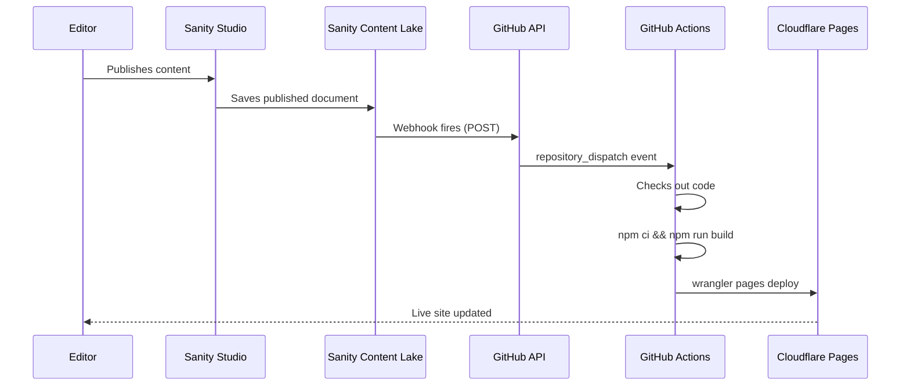

# How GROQ-Powered Webhooks Work in This Project

> **Audience:** Beginners and new team members
> **Date:** 2026-02-12
> **Project:** astro-shadcn-sanity

---

## Table of Contents

- [The Problem](#the-problem)
- [The Solution: Webhooks](#the-solution-webhooks)
- [How It Works (The Big Picture)](#how-it-works-the-big-picture)
- [What Is a GROQ-Powered Webhook?](#what-is-a-groq-powered-webhook)
- [Our Webhook Configuration](#our-webhook-configuration)
- [The Deployment Pipeline Step by Step](#the-deployment-pipeline-step-by-step)
- [Why Not Use Cloudflare Deploy Hooks?](#why-not-use-cloudflare-deploy-hooks)
- [How to Verify It Works](#how-to-verify-it-works)
- [Troubleshooting](#troubleshooting)
- [Key Concepts Glossary](#key-concepts-glossary)

---

## The Problem

This project has two separate systems:

1. **Sanity Studio** — where editors write and publish content (pages, sponsors, site settings)
2. **Cloudflare Pages** — where the production website lives

Cloudflare Pages automatically rebuilds the site when you push code to GitHub. But it has no idea when content changes in Sanity. If an editor publishes a new sponsor page in Sanity Studio, the live site stays stale until someone manually triggers a rebuild or pushes a code change.

That gap is the problem. Content changes need to flow automatically to the live site.

## The Solution: Webhooks

A **webhook** is an automatic HTTP request that one system sends to another when something happens. Think of it as a notification between servers.

In this project, Sanity sends a webhook to GitHub every time an editor publishes content. GitHub then rebuilds and redeploys the site with the fresh content.

## How It Works (The Big Picture)

The following diagram shows the complete flow from content publication to live deployment. When an editor publishes in Sanity Studio, a webhook automatically triggers GitHub Actions, which rebuilds the site and deploys it to Cloudflare Pages.



The entire pipeline runs automatically. The editor publishes content and the live site updates without any manual steps.

## What Is a GROQ-Powered Webhook?

Sanity webhooks are "GROQ-powered" because you use **GROQ** (Sanity's query language) to control two things:

1. **Filter** — which document changes trigger the webhook
2. **Projection** — what data to include in the webhook payload

This means the webhook only fires when relevant content changes, not on every single edit or draft save.

### Filter Example

```groq
_type in ["page", "siteSettings", "sponsor", "project", "team", "event"]
```

This filter says: "Only fire when one of these document types is published." If someone edits a document type that isn't in this list, the webhook stays silent.

### Projection Example

```json
{"event_type": "sanity-content-published"}
```

This is the payload sent to GitHub. It tells GitHub Actions which workflow to run. The projection keeps the payload minimal because GitHub only needs to know *that* content changed, not *what* changed.

### Drafts: OFF

The webhook is configured with **Drafts OFF**. This is critical. Without this setting, the webhook would fire on every keystroke as an editor types — flooding GitHub with rebuild requests. With Drafts OFF, the webhook only fires when an editor clicks **Publish**.

## Our Webhook Configuration

The webhook is configured in the [Sanity management dashboard](https://sanity.io/manage) (not in code). Here is the configuration:

| Setting | Value |
|---------|-------|
| **Name** | Trigger production rebuild |
| **URL** | `https://api.github.com/repos/gsinghjay/astro-shadcn-sanity/dispatches` |
| **Trigger on** | Create, Update, Delete |
| **Filter** | `_type in ["page", "siteSettings", "sponsor", "project", "team", "event"]` |
| **Drafts** | OFF |
| **HTTP method** | POST |
| **Authorization header** | `token <GITHUB_PAT>` |
| **Accept header** | `application/vnd.github+json` |
| **Projection** | `{"event_type": "sanity-content-published"}` |

The webhook calls the GitHub [repository_dispatch API](https://docs.github.com/en/rest/repos/repos#create-a-repository-dispatch-event), which triggers a GitHub Actions workflow.

## The Deployment Pipeline Step by Step

### Step 1: Editor Publishes Content

An editor makes changes in Sanity Studio and clicks **Publish**. The document moves from draft to published state in the Sanity Content Lake.

### Step 2: Sanity Fires the Webhook

The Content Lake checks the webhook filter. Because the document type matches (e.g., `page`), it sends an HTTP POST request to the GitHub API with the projection body.

### Step 3: GitHub Receives the Event

GitHub receives the `repository_dispatch` event with type `sanity-content-published`. This triggers the workflow defined in `.github/workflows/sanity-deploy.yml`.

### Step 4: GitHub Actions Builds the Site

The workflow runs these steps:

```yaml
steps:
  - uses: actions/checkout@v4          # Check out the code

  - uses: actions/setup-node@v4        # Set up Node.js 22
    with:
      node-version: 22
      cache: npm

  - run: npm ci                        # Install dependencies

  - name: Build Astro site             # Build with fresh Sanity content
    run: npm run build --workspace=astro-app

  - name: Deploy to Cloudflare Pages   # Deploy the built site
    run: npx wrangler pages deploy astro-app/dist --project-name=ywcc-capstone --branch=main
```

During the build step, Astro fetches the latest published content from Sanity via GROQ queries. The built HTML includes the fresh content.

### Step 5: Cloudflare Pages Serves the Updated Site

Wrangler uploads the built files to Cloudflare Pages. The production site now reflects the editor's changes.

## Why Not Use Cloudflare Deploy Hooks?

Cloudflare Pages has a built-in feature called **deploy hooks** — a secret URL that triggers a rebuild when called. This would be the simplest approach (Sanity webhook calls the deploy hook URL directly, no GitHub in the middle).

However, Cloudflare deploy hooks require a **Pro plan**. This project uses the free tier, so deploy hooks are not available.

The `repository_dispatch` approach through GitHub Actions achieves the same result on the free tier. The trade-off is a slightly longer pipeline (Sanity → GitHub → Cloudflare instead of Sanity → Cloudflare), but the end result is identical: content publishes trigger automatic rebuilds.

## How to Verify It Works

1. Publish a content change in Sanity Studio
2. Go to the [Sanity management dashboard](https://sanity.io/manage) → your project → **API** → **Webhooks** → your webhook → **Attempts** tab
3. Confirm the most recent attempt shows **204 No Content** (success)
4. Go to **GitHub** → **Actions** tab → confirm the **Sanity Content Deploy** workflow is running
5. After the workflow completes (green checkmark), visit the production site and verify your content change is live

## Troubleshooting

| Symptom | Likely Cause | Fix |
|---------|-------------|-----|
| Webhook shows **401** or **403** | The Authorization header is missing the `token ` prefix. It must be `token github_pat_...`, not just `github_pat_...`. | Update the header value in the Sanity webhook settings. |
| Webhook shows **404** | The repository URL is wrong. | Verify the URL matches: `https://api.github.com/repos/gsinghjay/astro-shadcn-sanity/dispatches` |
| Webhook shows **422** | The projection body is malformed JSON. | Ensure it is exactly: `{"event_type": "sanity-content-published"}` |
| Webhook shows **204** but no GitHub Action runs | The workflow file does not exist on the `main` branch. | Merge the branch containing `sanity-deploy.yml` into `main`. |
| GitHub Action runs but build fails | Missing environment variables in GitHub. | Check that `CLOUDFLARE_API_TOKEN`, `CLOUDFLARE_ACCOUNT_ID`, and the `PUBLIC_SANITY_*` variables are configured in GitHub repository settings. |
| Webhook fires on every keystroke | Drafts is set to ON. | Set Drafts to OFF in the Sanity webhook settings. |

## Key Concepts Glossary

- **Webhook** — An automatic HTTP request sent by one system to another when an event occurs. "Don't call us, we'll call you."
- **GROQ** — Graph-Relational Object Queries. Sanity's query language for filtering and projecting content data.
- **Filter** — A GROQ expression that determines which document changes trigger the webhook.
- **Projection** — A GROQ expression that shapes the data sent in the webhook payload.
- **repository_dispatch** — A GitHub API event that triggers GitHub Actions workflows from external systems.
- **GitHub Actions** — GitHub's CI/CD platform that runs automated workflows in response to events.
- **Wrangler** — Cloudflare's CLI tool for deploying to Cloudflare Pages and Workers.
- **Content Lake** — Sanity's hosted content database where all documents are stored.
- **Deploy hook** — A secret URL provided by hosting platforms that triggers a rebuild when called (Cloudflare Pro feature).
- **PAT (Personal Access Token)** — A GitHub authentication token with scoped permissions, used here for the webhook to call the GitHub API.
