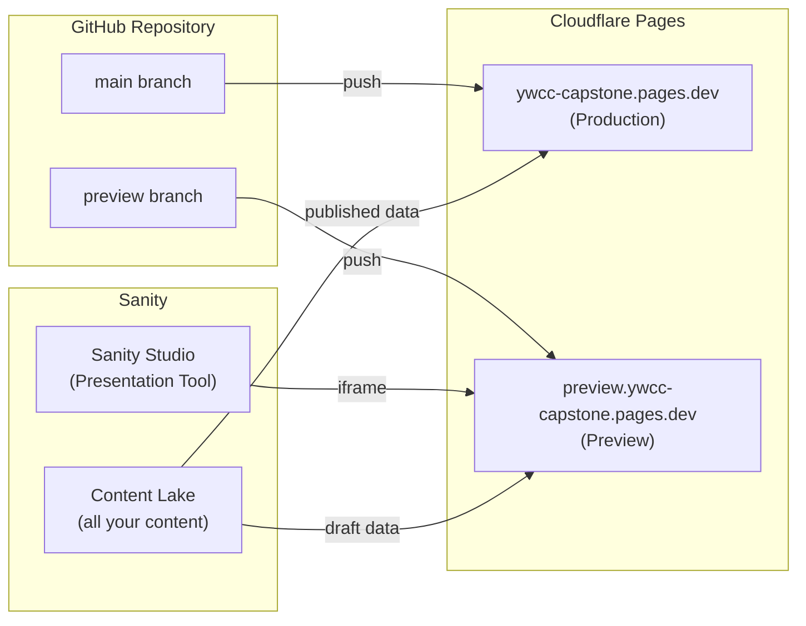
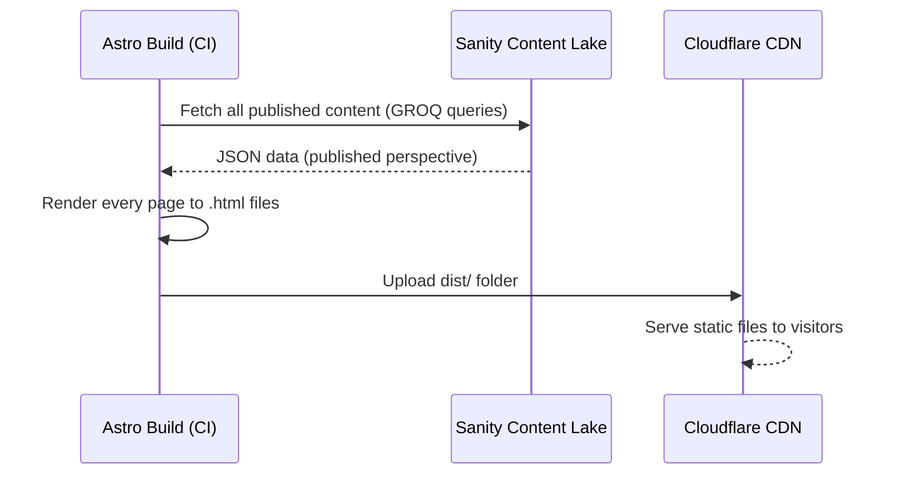
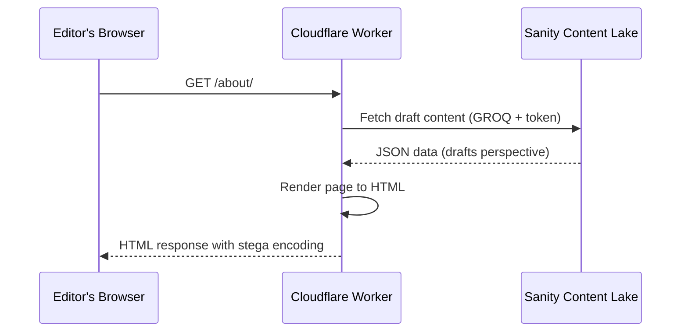
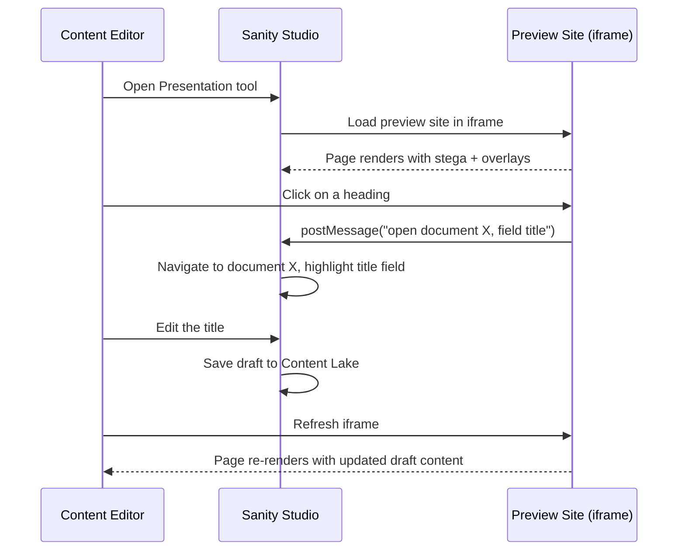
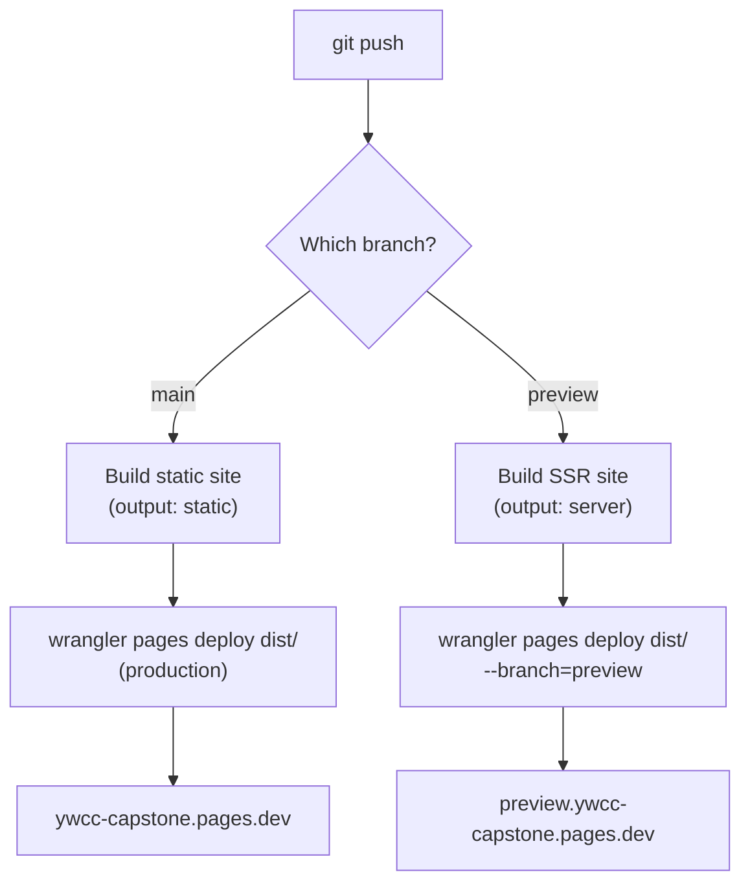
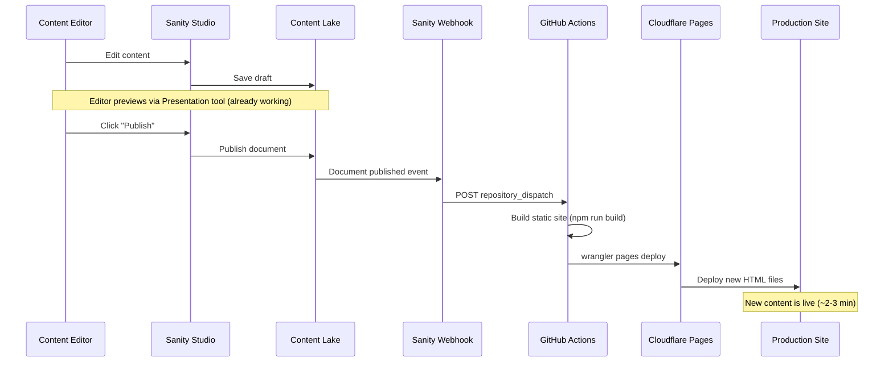

# How Preview & Publish Works

This guide explains how content gets from Sanity Studio to the live website. It covers the two deployment branches, how Visual Editing works, what problems were solved along the way, and what Story 5.4 adds to complete the publishing loop.

## Table of Contents

- [The Big Picture](#the-big-picture)
- [Two Branches, Two Deployments](#two-branches-two-deployments)
- [How a Page Gets Built](#how-a-page-gets-built)
- [How Visual Editing Works](#how-visual-editing-works)
- [The CI/CD Pipeline](#the-cicd-pipeline)
- [Security Headers and CSP](#security-headers-and-csp)
- [SSR Bugs That Were Fixed (PR #3)](#ssr-bugs-that-were-fixed-pr-3)
- [The Missing Piece: Story 5.4](#the-missing-piece-story-54)
- [Two Bugs Story 5.4 Fixes in Code](#two-bugs-story-54-fixes-in-code)
- [Glossary](#glossary)

## The Big Picture

The site has **two separate deployments** from the same codebase, each serving a different purpose:



- **Production** (`main` branch) serves the public website. Pages are pre-built as static HTML files. Fast, cacheable, and free of any editing overhead.
- **Preview** (`preview` branch) serves the editors. A Cloudflare Worker renders pages on-demand so they always show the latest draft content from Sanity.

## Two Branches, Two Deployments

The behavior of the entire site changes based on a single environment variable: `PUBLIC_SANITY_VISUAL_EDITING_ENABLED`.

| Aspect | Production (`main`) | Preview (`preview`) |
|---|---|---|
| URL | `ywcc-capstone.pages.dev` | `preview.ywcc-capstone.pages.dev` |
| Astro output mode | `static` (pre-rendered HTML) | `server` (rendered per request) |
| Content freshness | Frozen at build time | Live from Sanity on every request |
| Sanity perspective | `published` | `drafts` (includes unpublished changes) |
| Visual Editing overlays | Off | On (click-to-edit in Presentation tool) |
| Stega encoding | Off | On (invisible metadata in strings) |
| GA4 analytics | Active | Active |
| Who uses it | The public | Content editors via Sanity Studio |

### How the branch controls output mode

In `astro.config.mjs`, one line controls everything:

```javascript
output: isVisualEditing ? "server" : "static",
```

When `PUBLIC_SANITY_VISUAL_EDITING_ENABLED` is `"true"`, Astro builds the site as a **server** application (a Cloudflare Worker that renders HTML on every request). When it is not set, Astro builds the site as **static** HTML files (generated once at build time).

The CI/CD pipeline sets this variable automatically based on which branch is being built. You never set it manually in CI.

## How a Page Gets Built

### Static mode (production)



Each page is an `.html` file sitting on Cloudflare's CDN. When a visitor requests `/about/`, Cloudflare serves the pre-built `about/index.html` directly. No server-side code runs.

**Trade-off:** Fast and cheap, but content changes require a new build to appear.

### Server mode (preview)



When an editor (or Sanity Studio's Presentation tool) requests a page, a Cloudflare Worker runs Astro's rendering code on-the-fly. It fetches **draft** content from Sanity using an API token, so unpublished changes are visible immediately.

**Trade-off:** Always shows the latest content, but every request hits Sanity's API.

## How Visual Editing Works

Visual Editing is the feature that lets editors click on content in the preview site and jump directly to the corresponding field in Sanity Studio. It involves three pieces working together.

### 1. Stega encoding

When the preview site fetches content from Sanity, the Sanity client embeds invisible Unicode characters into every string value. These characters encode:

- The document ID (which document this text belongs to)
- The field path (which field within that document)
- The Studio URL (where to open the editor)

You cannot see these characters, but they are there. This is why string comparisons break in preview mode — the string `"center"` actually contains hidden characters like `"c​e​n​t​e​r"`.

### 2. The `stegaClean()` function

Because stega encoding breaks direct string comparisons, every place in the code that compares a Sanity string value uses `stegaClean()` to strip the hidden characters first:

```javascript
// Without stegaClean — BREAKS in preview mode:
if (block.alignment === "center") { ... }

// With stegaClean — works in both modes:
if (stegaClean(block.alignment) === "center") { ... }
```

`stegaClean()` is a no-op when stega encoding is disabled (production), so it is safe to use everywhere.

### 3. The `<VisualEditing />` component

`Layout.astro` renders a React component called `<VisualEditing>` on every page:

```astro
<VisualEditing enabled={visualEditingEnabled} />
```

When `enabled` is `true`, this component:

- Reads the stega-encoded strings in the rendered HTML
- Draws translucent blue overlay rectangles on each piece of editable content
- Listens for clicks on those overlays
- Sends a `postMessage` back to the parent window (Sanity Studio) saying "the user clicked on field X of document Y"
- Studio then navigates to that field in the editor panel

When `enabled` is `false` (production), the component renders nothing.

### The Presentation tool flow



## The CI/CD Pipeline

A single GitHub Actions workflow file (`.github/workflows/deploy.yml`) handles both branches. The workflow triggers on every push to `main` or `preview`.



### Key details

- **Node.js 22** is used for the build.
- **`npm ci`** installs dependencies from the lockfile (deterministic, fast).
- A `.env` file is **written dynamically** before the build step. This is critical because Vite reads environment variables from `.env` files, not from `process.env`. Without this step, variables like `SANITY_API_READ_TOKEN` are `undefined` in the built Worker bundle.
- The `--branch=preview` flag on `wrangler pages deploy` tells Cloudflare to associate this deployment with the preview branch URL. No extra Cloudflare dashboard configuration is needed.

### Secrets and variables

| Name | Type | Purpose |
|---|---|---|
| `CLOUDFLARE_API_TOKEN` | Secret | Authenticates `wrangler` with Cloudflare API |
| `CLOUDFLARE_ACCOUNT_ID` | Secret | Identifies the Cloudflare account |
| `SANITY_API_READ_TOKEN` | Secret | Allows the SSR Worker to read draft content |
| `PUBLIC_SANITY_STUDIO_PROJECT_ID` | Variable | Sanity project ID (`49nk9b0w`) |
| `PUBLIC_SANITY_STUDIO_DATASET` | Variable | Sanity dataset name (`production`) |
| `PUBLIC_GA_MEASUREMENT_ID` | Variable | Google Analytics 4 measurement ID |
| `PUBLIC_SITE_URL` | Variable | Production URL for canonical links |

## Security Headers and CSP

The site uses a **two-layer security approach**:

### Layer 1: CSP meta tag (in HTML)

A `<meta http-equiv="Content-Security-Policy">` tag in `Layout.astro` tells the browser which external resources the page is allowed to load:

| Directive | What it allows | Why |
|---|---|---|
| `script-src` | `'self'`, `googletagmanager.com`, `google-analytics.com` | GA4 loads scripts from both Google domains |
| `img-src` | `'self'`, `cdn.sanity.io`, `data:` | Sanity CDN serves CMS images; `data:` allows base64 placeholder images |
| `style-src` | `'self'`, `'unsafe-inline'` | Tailwind CSS and Astro's scoped styles use inline `<style>` tags |
| `connect-src` | `'self'`, `google-analytics.com`, `*.sanity.io`, `wss://*.sanity.io` | GA4 beacons, Sanity API calls, and WebSocket connections for live Visual Editing |
| `frame-src` | `'self'` | No third-party iframes allowed |

### Layer 2: `_headers` file (HTTP response headers)

A `public/_headers` file tells Cloudflare Pages to add response headers that browsers enforce:

| Header | Value | What it does |
|---|---|---|
| `X-Content-Type-Options` | `nosniff` | Prevents browsers from guessing file types (stops certain attacks) |
| `Referrer-Policy` | `strict-origin-when-cross-origin` | Controls how much URL information is shared with other sites |
| `Permissions-Policy` | `camera=(), microphone=(), geolocation=()` | Disables access to camera, mic, and GPS (the site does not need them) |
| `Content-Security-Policy: frame-ancestors` | `'self' https://*.sanity.studio https://*.sanity.io` | Allows only Sanity Studio to embed the site in an iframe (needed for Presentation tool) |

The two layers complement each other. The meta tag provides CSP even during local development (where `_headers` does not apply). The `_headers` file provides non-CSP headers that cannot be set via meta tags.

## SSR Bugs That Were Fixed ([PR #3][pr3])

When the SSR preview was first deployed, three distinct issues prevented it from working. Each had a different root cause.

[pr3]: https://github.com/gsinghjay/astro-shadcn-sanity/pull/3

### Bug 1: Icons crash the Worker (`95e38e6`)

**What happened:** Any SSR page that rendered an icon crashed with an error about `fs` (filesystem) not existing.

**Why:** The `astro-icon` package calls `fs.readFileSync()` at render time to read SVG data from icon packages on disk. Cloudflare Workers have no filesystem — they run in a sandboxed V8 isolate, not Node.js.

**Fix:** Replaced `astro-icon` with a custom wrapper using `@iconify/utils`. The new wrapper reads icon data from JSON imports (bundled into the Worker at build time) instead of reading files from disk at runtime.

### Bug 2: API token missing from Worker bundle (`1f8e2f3`)

**What happened:** All SSR pages returned HTTP 500: `"The SANITY_API_READ_TOKEN environment variable is required during Visual Editing."`

**Why:** Vite (Astro's build tool) only reads `import.meta.env.*` values from `.env` files. The CI workflow passed the token as a process environment variable (`env:` block in the YAML), but no `.env` file existed in CI. Vite never saw the token and left it as `undefined` in the built Worker.

**Fix:** Added a workflow step that writes a `.env` file before the build. Vite reads the file, finds the token, and inlines it into the Worker bundle.

### Bug 3: `[object Object]` instead of HTML (`3f6202f`)

**What happened:** SSR pages returned HTTP 200 with the literal text `[object Object]` as the body. Pre-rendered pages worked fine. Local testing with `wrangler dev` also worked fine.

**Why:** The `nodejs_compat` flag in `wrangler.jsonc` causes Cloudflare to polyfill the Node.js `process` global. Astro's runtime detection checks for `process` to decide if it is running in Node.js. When it thinks it is in Node.js, Astro returns the response body as an `AsyncIterable` instead of a `ReadableStream`. Cloudflare Workers cannot consume `AsyncIterable`, so JavaScript's default `.toString()` produces `[object Object]`.

**Fix:** Added `disable_nodejs_process_v2` to `compatibility_flags` in `wrangler.jsonc`. This prevents the `process` polyfill from being injected while keeping `nodejs_compat` available for other Node.js APIs the Sanity client needs.

```jsonc
// wrangler.jsonc — the two flags work together
{
  "compatibility_flags": ["nodejs_compat", "disable_nodejs_process_v2"]
}
```

## The Missing Piece: Story 5.4

After Story 5.2 and PR #3, the deployment architecture works end-to-end for **previewing** content. But there is a gap in the **publishing** loop:

```mermaid
flowchart TD
    subgraph Current["Preview Loop (working)"]
        Edit["Editor edits in Studio"] --> DraftSave["Draft saved to Content Lake"]
        DraftSave --> PreviewShows["Preview site shows draft"]
    end

    subgraph Broken["Publish Loop (before Story 5.4)"]
        Publish["Editor publishes content"] --> Nothing["Nothing happens"]
        Nothing --> Stale["Production shows stale content"]
        Stale --> AskDev["Editor asks developer to redeploy"]
    end

    subgraph Target["Publish Loop (after Story 5.4)"]
        Publish2["Editor publishes content"] --> Webhook["Sanity webhook fires"]
        Webhook --> GH["POST to GitHub API\n(repository_dispatch)"]
        GH --> Actions["GitHub Actions builds site"]
        Actions --> Deploy["Wrangler deploys to\nCloudflare Pages"]
        Deploy --> Live["New content is live"]
    end
```



### What Story 5.4 adds

**1. Sanity webhook** — A GROQ-powered webhook configured at `sanity.io/manage` that fires when a document is published (created, updated, or deleted). It sends an HTTP POST to the GitHub API to trigger a `repository_dispatch` event.

**2. GitHub Actions deploy workflow** (`.github/workflows/sanity-deploy.yml`) — A workflow triggered by `repository_dispatch` that builds the Astro site and deploys to Cloudflare Pages via Wrangler.

> **Why not Cloudflare deploy hooks?** Deploy hooks are a Cloudflare Pro feature. The GitHub `repository_dispatch` approach achieves the same result on the free tier by routing through GitHub Actions instead of calling Cloudflare directly.

The webhook has a **filter** that only fires for content types that affect the public site:

```groq
_type in ["page", "siteSettings", "sponsor", "project", "team", "event"]
```

Draft saves do **not** trigger the webhook. Only the explicit "Publish" action in Studio does. This prevents the build system from being overwhelmed by every keystroke.

**3. Two code fixes** (see next section).

**4. End-to-end verification** — Testing the complete loop: edit in Studio, preview the draft, publish, webhook fires, Cloudflare rebuilds, production site shows new content.

### The complete loop after Story 5.4



## Two Bugs Story 5.4 Fixes in Code

Both bugs are in `astro-app/src/lib/sanity.ts`. Each is a one-line change.

### Bug 1: Stale site settings in preview (line 69)

**The problem:** The `getSiteSettings()` function caches site settings in a module-level variable:

```javascript
let _siteSettingsCache = null;

export async function getSiteSettings() {
  if (_siteSettingsCache) return _siteSettingsCache; // returns stale data!
  // ... fetch from Sanity ...
}
```

In **static** mode, this is fine. The cache only lives for the duration of the build process. Every `npm run build` starts fresh.

In **server** mode (preview), this is a **bug**. The Cloudflare Worker loads the module once and keeps it in memory across requests. If an editor changes the site name or navigation in Sanity, the cache serves the old data until the Worker cold-starts again (which happens unpredictably).

**The fix:**

```javascript
if (!visualEditingEnabled && _siteSettingsCache) return _siteSettingsCache;
```

When Visual Editing is enabled (preview/SSR), skip the cache and always fetch fresh data. When Visual Editing is off (production/static build), keep the cache for build performance.

### Bug 2: Deprecated API perspective name (line 29)

**The problem:** The `loadQuery` function uses a perspective name that Sanity has deprecated:

```javascript
const perspective = visualEditingEnabled ? "previewDrafts" : "published";
```

Sanity's API returns a deprecation warning: *"The previewDrafts perspective has been renamed to drafts."*

**The fix:**

```javascript
const perspective = visualEditingEnabled ? "drafts" : "published";
```

A simple rename. The behavior is identical — `"drafts"` is the new name for the same thing.

## Glossary

| Term | Definition |
|---|---|
| **Astro** | The web framework used to build this site. Supports both static site generation and server-side rendering. |
| **Cloudflare Pages** | The hosting platform. Serves static files from a CDN and runs server-side code via Cloudflare Workers. |
| **Cloudflare Worker** | A serverless function that runs on Cloudflare's edge network. Executes the SSR rendering code for the preview site. |
| **Content Lake** | Sanity's hosted database where all content (documents, images, settings) is stored. |
| **CSP (Content Security Policy)** | A browser security feature that restricts which external resources a page can load (scripts, images, etc.). |
| **Deploy hook** | A secret URL that triggers a build when called via HTTP POST. Cloudflare deploy hooks require a Pro plan; this project uses GitHub `repository_dispatch` instead. |
| **Draft** | An unpublished version of a document in Sanity. Only visible through authenticated API calls with the `drafts` perspective. |
| **GROQ** | Sanity's query language (Graph-Relational Object Queries). Similar to SQL but designed for JSON documents. |
| **Perspective** | The "lens" through which you query Sanity content. `"published"` returns only published documents. `"drafts"` returns drafts, falling back to published versions. |
| **Prerender** | Generating a page's HTML at build time instead of at request time. Astro pages export `prerender = true` to opt in. |
| **Presentation tool** | A panel in Sanity Studio that shows the preview site in an iframe with click-to-edit overlays. |
| **SSR (Server-Side Rendering)** | Rendering HTML on the server for each request, rather than pre-building it. Allows dynamic, always-fresh content. |
| **Stega encoding** | Invisible Unicode characters embedded in strings by the Sanity client. They carry metadata (document ID, field path) that the Visual Editing overlay reads. |
| **`stegaClean()`** | A function that strips stega encoding from a string. Required before comparing Sanity string values in code. |
| **Visual Editing** | Sanity's feature that lets editors click on content in the preview site and jump to the corresponding field in Studio. |
| **Vite** | The build tool Astro uses internally. Handles bundling, environment variable inlining, and development server. |
| **Webhook** | An HTTP callback. Sanity sends a POST request to a URL you configure whenever content changes. |
| **Wrangler** | Cloudflare's CLI tool for building, testing, and deploying Workers and Pages projects. |
