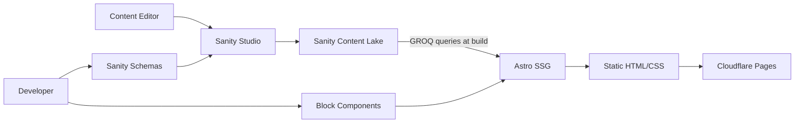
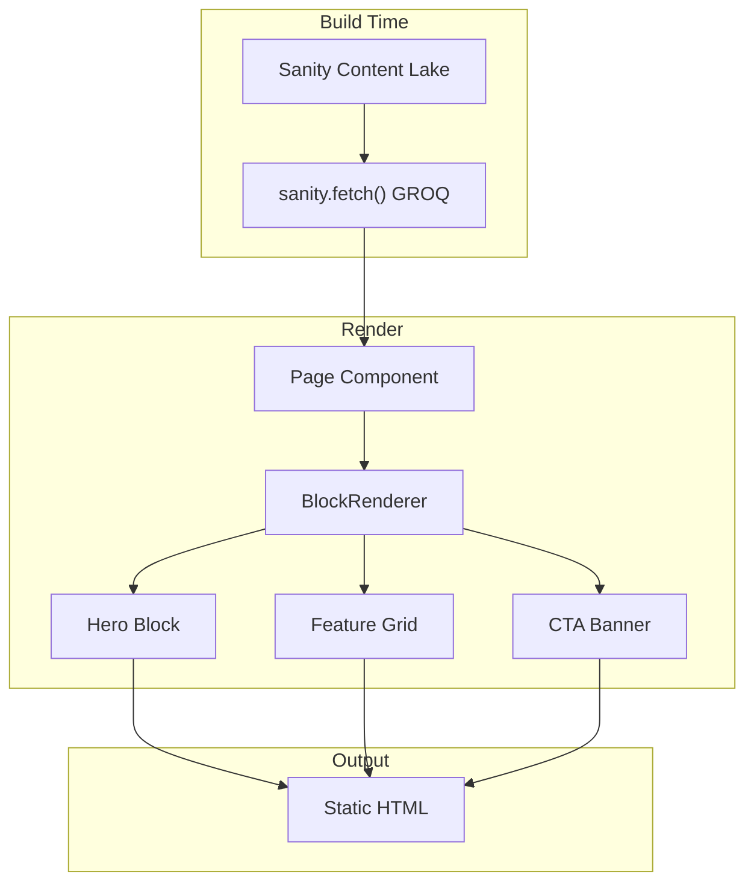
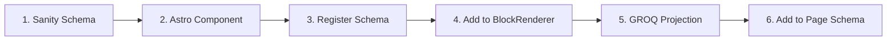

# Onboarding Guide

Welcome to the **YWCC Capstone Sponsors** project — a CMS-driven static website for NJIT's Ying Wu College of Computing Industry Capstone program. This guide walks you through everything you need to get up and running.

## Table of Contents

- [What This Project Does](#what-this-project-does)
- [Architecture at a Glance](#architecture-at-a-glance)
- [Tech Stack](#tech-stack)
- [Prerequisites](#prerequisites)
- [Repository Setup](#repository-setup)
- [Project Structure](#project-structure)
- [Development Workflow](#development-workflow)
- [Understanding the Block System](#understanding-the-block-system)
- [Working with Sanity Studio](#working-with-sanity-studio)
- [Working with Storybook](#working-with-storybook)
- [Running Tests](#running-tests)
- [Deployment](#deployment)
- [Key Documentation](#key-documentation)
- [Common Tasks](#common-tasks)
- [Troubleshooting](#troubleshooting)

---

## What This Project Does

Content editors compose pages by stacking reusable UI blocks in Sanity Studio — no code required. At build time, Astro fetches all content from Sanity and bakes it into static HTML. The result is a fast, accessible, zero-JavaScript-runtime website.

**Key goals:**

- Content editors build and update pages independently with no developer involvement
- Prospective sponsors discover the program and submit inquiries
- Students find team assignments, project details, and key dates in one hub
- $0/month operating cost using free-tier services
- Lighthouse 90+ across all categories on every page

## Architecture at a Glance



The project uses a **"toolkit-not-website"** approach. A block library maps editor-friendly names to UI component internals, making the design system invisible to non-technical users.



## Tech Stack

| Layer | Technology | Notes |
|-------|-----------|-------|
| Frontend | **Astro 5** | Static output (`output: 'static'`) |
| CMS | **Sanity 5** | Headless CMS with real-time editing + Visual Editing |
| UI Components | **fulldev/ui** | Vanilla `.astro` components via shadcn CLI |
| Styling | **Tailwind CSS v4** | CSS-first config (no `tailwind.config.mjs`) |
| Icons | **@iconify/utils** + Lucide | `@iconify-json/lucide` and `@iconify-json/simple-icons` (edge-compatible, no fs dependency) |
| Unit Testing | **Vitest** | Unit tests with jsdom environment |
| E2E Testing | **Playwright** | Integration tests, E2E tests, accessibility audits |
| Component Dev | **Storybook 10** | Via `storybook-astro` renderer |
| Build Tool | **Vite 7** | Bundled with Astro |
| Runtime | **Node.js 24+** | See `.nvmrc` |

**Important distinctions:**

- **No React/JSX for page UI**. React exists in `studio/` (Sanity Studio) and in `astro-app/` **only** for Sanity Visual Editing (Presentation tool). Never use React for page components.
- **fulldev/ui is NOT React shadcn/ui**. These are pure Astro components.
- **Tailwind v4** uses CSS-first configuration. There is no `tailwind.config.mjs` file. Theme tokens live in `astro-app/src/styles/global.css`.
- **Zero runtime API calls in production**. All data is fetched from Sanity and baked into HTML at build time. The `preview` branch uses SSR for live draft content during Visual Editing.

## Prerequisites

Install these before proceeding:

- **Node.js v24 or later** — check with `node -v`
- **npm v10 or later** — bundled with Node.js 24
- **Git** — for cloning and version control
- **A Sanity.io account** — sign up at <https://www.sanity.io/manage> (free tier)

Use [nvm](https://github.com/nvm-sh/nvm) to manage Node versions:

```bash
nvm install 24
nvm use 24
```

## Repository Setup

### 1. Clone and install

```bash
git clone <repository-url>   # Replace with your fork or team repo URL
cd astro-shadcn-sanity
npm install
```

The `npm install` command installs dependencies for both workspaces (`astro-app` and `studio`) automatically.

### 2. Get your Sanity credentials

1. Go to <https://www.sanity.io/manage>
2. Create a new project (or use an existing one)
3. Copy the **Project ID** from your project dashboard
4. Note your dataset name (typically `production`)

### 3. Configure environment variables

Create **`astro-app/.env`**:

```bash
PUBLIC_SANITY_PROJECT_ID="your_project_id_here"
PUBLIC_SANITY_DATASET="production"
```

Create **`studio/.env`**:

```bash
SANITY_STUDIO_PROJECT_ID="your_project_id_here"
SANITY_STUDIO_DATASET="production"
```

> **Note:** The variable name prefixes differ between workspaces. Astro requires `PUBLIC_` for client-accessible variables. Sanity Studio requires `SANITY_STUDIO_`.

### 4. Start the dev servers

```bash
npm run dev
```

This starts both servers concurrently:

- **Astro app:** <http://localhost:4321>
- **Sanity Studio:** <http://localhost:3333>

Open Sanity Studio in your browser and sign in with the same account you used to create the project.

### 5. Verify everything works

- Visit <http://localhost:4321> — you see the Astro site (may show placeholder content initially)
- Visit <http://localhost:3333> — you see Sanity Studio with document types in the sidebar

On first visit to Sanity Studio, you see an empty workspace. This is normal. Click a document type in the sidebar (e.g., **Page**) and create your first document to begin populating the site.

## Project Structure

This is an **npm workspaces monorepo** with two workspaces:

```
astro-shadcn-sanity/
├── astro-app/                    # Astro frontend
│   ├── .storybook/               # Storybook configuration
│   ├── src/
│   │   ├── components/
│   │   │   ├── ui/               # fulldev/ui primitives (accordion, button, badge...)
│   │   │   ├── blocks/           # fulldev/ui block templates (~100 variants)
│   │   │   │   └── custom/       # Project-specific block components (13)
│   │   │   └── BlockRenderer.astro  # Dispatches blocks by _type
│   │   ├── layouts/
│   │   │   ├── Layout.astro      # Base HTML layout
│   │   │   └── templates/        # Page template wrappers
│   │   ├── lib/
│   │   │   ├── sanity.ts         # Sanity client + GROQ queries
│   │   │   ├── image.ts          # urlFor() image helper
│   │   │   └── utils.ts          # cn() utility (clsx + twMerge)
│   │   ├── pages/                # Astro page routes
│   │   └── styles/
│   │       └── global.css        # Tailwind + theme + shadcn variables
│   ├── astro.config.mjs          # Astro configuration
│   └── components.json           # shadcn CLI config
│
├── studio/                       # Sanity Studio CMS
│   ├── src/schemaTypes/
│   │   ├── helpers/              # defineBlock helper
│   │   ├── objects/              # Reusable object schemas
│   │   ├── documents/            # Document type schemas
│   │   ├── blocks/               # Block schemas
│   │   └── index.ts              # Schema registry
│   └── sanity.config.ts          # Studio configuration
│
├── tests/                        # Playwright tests
│   └── integration/              # Schema/module integration tests
├── docs/                         # Project documentation
├── package.json                  # Root workspace config
├── playwright.config.ts          # E2E test config
├── playwright.integration.config.ts  # Integration test config
└── .nvmrc                        # Node version (24)
```

**Key principle:** There is no shared code between workspaces. React exists only in `studio/`. The frontend is 100% Astro with zero framework runtime.

## Development Workflow

### Available commands

Run these from the project root:

| Command | What it does |
|---------|-------------|
| `npm run dev` | Start Astro + Studio dev servers |
| `npm run dev:storybook` | Start Astro + Studio + Storybook (all three) |
| `npm run storybook` | Start Storybook alone (port 6006) |
| `npm run test` | Run E2E tests (builds astro-app first) |
| `npm run test:unit` | Run Vitest unit tests |
| `npm run test:unit:watch` | Run unit tests in watch mode |
| `npm run test:unit:coverage` | Run unit tests with coverage report |
| `npm run test:integration` | Run integration tests (fast, no browser) |
| `npm run test:ui` | Run Playwright tests in UI mode |

To run a command in a specific workspace:

```bash
npm run build --workspace=astro-app
npm run deploy --workspace=studio
```

### Installing new dependencies

```bash
# Root dev dependency (e.g., Playwright)
npm install -D some-package

# In a specific workspace
npm install some-package --workspace=astro-app
npm install some-package --workspace=studio
```

### Adding a new UI primitive

Use the shadcn CLI to install fulldev/ui components:

```bash
cd astro-app
npx shadcn@latest add @fulldev/button
```

Components install into `src/components/ui/`. They are vanilla Astro components.

## Understanding the Block System

Blocks are the core building pattern. Content editors stack them in Sanity Studio to compose pages. Each block follows a consistent lifecycle.



### The six-step block checklist

When you add a new block, touch these six files:

1. **Schema** — Create `studio/src/schemaTypes/blocks/{block-name}.ts` using the `defineBlock` helper
2. **Component** — Create `astro-app/src/components/blocks/custom/{BlockName}.astro` composing from `ui/` primitives
3. **Register schema** — Add the export to `studio/src/schemaTypes/index.ts`
4. **Register in renderer** — Add a case to `astro-app/src/components/BlockRenderer.astro`
5. **GROQ projection** — Add the type-specific projection in `astro-app/src/lib/sanity.ts`
6. **Page schema** — Add the type to the page schema's `blocks[]` array

### Existing blocks

The project has 12 block schemas. File names use kebab-case, while the Sanity `name` property uses camelCase:

| Schema file | Sanity type name |
|------------|-----------------|
| `hero-banner.ts` | `heroBanner` |
| `feature-grid.ts` | `featureGrid` |
| `sponsor-cards.ts` | `sponsorCards` |
| `rich-text.ts` | `richText` |
| `cta-banner.ts` | `ctaBanner` |
| `faq-section.ts` | `faqSection` |
| `contact-form.ts` | `contactForm` |
| `timeline.ts` | `timeline` |
| `logo-cloud.ts` | `logoCloud` |
| `stats-row.ts` | `statsRow` |
| `team-grid.ts` | `teamGrid` |
| `text-with-image.ts` | `textWithImage` |

The camelCase `name` is what you use in GROQ queries, `BlockRenderer.astro`, and everywhere in code. The kebab-case is only for file names.

The `blocks/` directory also contains ~100 fulldev/ui block templates (e.g., `hero-1.astro`, `cta-3.astro`). These serve as a design reference library. Your custom project blocks live in `blocks/custom/`.

### Content model

Three document types currently exist:

| Document Type | Purpose |
|--------------|---------|
| `page` | Pages composed of stacked blocks |
| `sponsor` | Sponsor organizations |
| `siteSettings` | Global site settings (singleton — only one instance allowed) |

Additional document types (`project`, `team`, `event`, `submission`) are planned for future sprints.

## Working with Sanity Studio

### Accessing the Studio

Run `npm run dev` and open <http://localhost:3333>.

### Creating content

1. Select a document type from the sidebar (e.g., **Page**)
2. Click **Create new** to start a new document
3. Fill in fields — for pages, add blocks from the blocks array
4. Click **Publish** to make the content live

### Drafts vs. published

Every document starts as a **draft**. Drafts are visible only inside the Studio. When you click **Publish**, the document becomes available to the Astro build. If you edit a published document, Studio creates a new draft version — the live content remains unchanged until you publish again.

### Schema development

Schemas live in `studio/src/schemaTypes/`. Use the `defineBlock` helper for block schemas — it automatically merges the common `blockBaseFields` (padding, background, anchor ID) before your block-specific fields.

```typescript
// studio/src/schemaTypes/blocks/my-block.ts
import { defineBlock } from '../helpers/defineBlock'

export const myBlock = defineBlock({
  name: 'myBlock',
  title: 'My Block',
  fields: [
    // Your block-specific fields here
  ],
})
```

Register every new schema in `studio/src/schemaTypes/index.ts`.

## Working with Storybook

Storybook lets you develop and preview UI components in isolation.

### Starting Storybook

```bash
npm run storybook
```

Open <http://localhost:6006>.

### Creating stories

Read `docs/storybook-constitution.md` before writing stories. Key rules:

- **Block components** work directly in stories — no wrapper needed
- **Slot-based UI components** (like Button, Card) need a `*Story.astro` wrapper because Storybook cannot pass slot content via story args
- `astro:assets` is stubbed in Storybook — use plain `` tags in wrapper components

### Known issues

- **Production build produces empty iframe** — `storybook build` succeeds but output lacks stories. Workaround: deploy the pre-built `storybook-static/` folder.
- **Vite version compatibility** — The project uses Vite 7, while storybook-astro v0.1.0 expects Vite 5 or 6. The lockfile resolves this automatically. Always use `npm ci` in CI to preserve the working resolution.

## Running Tests

The project uses a **three-layer test pyramid**: Vitest for unit tests, Playwright for integration and E2E tests.

### Unit tests (fastest)

```bash
npm run test:unit                 # Run once
npm run test:unit:watch           # Watch mode for development
npm run test:unit:coverage        # With coverage report
```

These test utility functions, GROQ queries, mock data, and DOM scripts. They run in a jsdom environment — no browser or server needed.

**Config:** `astro-app/vitest.config.ts`

### Integration tests (fast)

```bash
npm run test:integration
```

These test schema validation and TypeScript module imports. They run without a browser or web server.

**Config:** `playwright.integration.config.ts`

### E2E tests (full)

```bash
npm run test
```

These build the Astro app, start a local server, and run browser-based tests across multiple devices.

**Config:** `playwright.config.ts`

### Tips

- Use `npm run test:ui` for an interactive UI to debug tests
- Use `npm run test:headed` to see the browser during test runs
- Integration tests use **static imports** for schema files (not dynamic `await import()`) — Playwright transforms static imports but not dynamic ones
- Unit tests run in CI on every PR to `preview` (see [Git Workflow Guide](git-workflow-guide.md))

## Deployment

### Astro site (Cloudflare Pages)

The main site is deployed to **Cloudflare Pages** via git integration — not GitHub Actions. Cloudflare builds and deploys automatically:

- **Push to `main`** → Production deployment (static output, Visual Editing OFF)
- **Push to any branch / PR** → Preview deployment with unique URL (SSR, Visual Editing ON)

Environment variables are configured in the **Cloudflare Pages dashboard**, not in GitHub secrets. See [Cloudflare Setup Guide](cloudflare-setup-guide.md) for full details.

### Sanity Studio

```bash
npm run deploy --workspace=studio
```

This deploys the Studio to `<your-studio-name>.sanity.studio`.

### Storybook (GitHub Pages)

Storybook is the **only thing deployed to GitHub Pages**. The workflow at `.github/workflows/deploy-storybook.yml` triggers automatically on pushes to `main` that touch `astro-app/src/`, `astro-app/.storybook/`, or `astro-app/package.json`. It can also be triggered manually from the Actions tab.

## Key Documentation

Read these documents as you ramp up:

| Document | When to read it |
|----------|----------------|
| [git-workflow-guide.md](git-workflow-guide.md) | Before your first commit (branch strategy, conventional commits, releases) |
| [storybook-constitution.md](../storybook-constitution.md) | Before any Storybook work |
| [project-context.md](../project-context.md) | Before writing any code (95 critical rules) |
| [cloudflare-setup-guide.md](cloudflare-setup-guide.md) | When working with deployment or environment variables |

Planning artifacts live in `_bmad-output/`:

- `planning-artifacts/` — PRD, architecture, epics
- `implementation-artifacts/` — Story implementation specs
- `test-artifacts/` — ATDD checklists

## Common Tasks

### "I want to add a new page block"

Follow the [six-step block checklist](#the-six-step-block-checklist) above.

### "I want to add a new UI component"

```bash
cd astro-app
npx shadcn@latest add @fulldev/component-name
```

Then compose it into block components as needed.

### "I want to add a new document type"

1. Create `studio/src/schemaTypes/documents/{type-name}.ts` using `defineType` and `defineField`
2. Register it in `studio/src/schemaTypes/index.ts`
3. Add GROQ queries in `astro-app/src/lib/sanity.ts`
4. Create page components or block components to display the data

### "I want to modify the site theme"

Edit `astro-app/src/styles/global.css`. Tailwind v4 uses CSS-first config — theme tokens, colors, and shadcn variables are all defined there.

### "I want to run the project without Sanity credentials"

The Astro config includes fallback values, so the build succeeds without a `.env` file. Pages render with placeholder or empty content.

## Troubleshooting

### `npm install` fails with peer dependency errors

Use the legacy peer deps flag:

```bash
npm install --legacy-peer-deps
```

The existing lockfile already resolves the storybook-astro Vite peer conflict. If you regenerate the lockfile, you need this flag.

### Sanity Studio shows no document types

Verify your environment variables match a valid Sanity project. Check that `SANITY_STUDIO_PROJECT_ID` in `studio/.env` matches your project ID at <https://www.sanity.io/manage>.

### Astro site shows no content

1. Confirm your `.env` variables are correct in `astro-app/.env`
2. Verify content is **published** (not just draft) in Sanity Studio — drafts are not visible to the Astro build
3. Restart the Astro dev server after changing `.env` files
4. For production deployments, verify CORS origins are configured in your Sanity project settings at <https://www.sanity.io/manage>

### Integration tests hang

Make sure you run `npm run test:integration` (not `npm run test`). The E2E config starts a web server and waits for a build, which causes hangs if run for schema-only tests.

### Storybook build produces empty output

This is a known issue with storybook-astro v0.1.0. The dev server works correctly; only the production build is affected. Use the pre-built `storybook-static/` folder for deployments.

### Node version mismatch

The project requires Node 24+. Check your version:

```bash
node -v
```

Switch to the correct version:

```bash
nvm use
```

This reads the `.nvmrc` file and activates Node 24.
