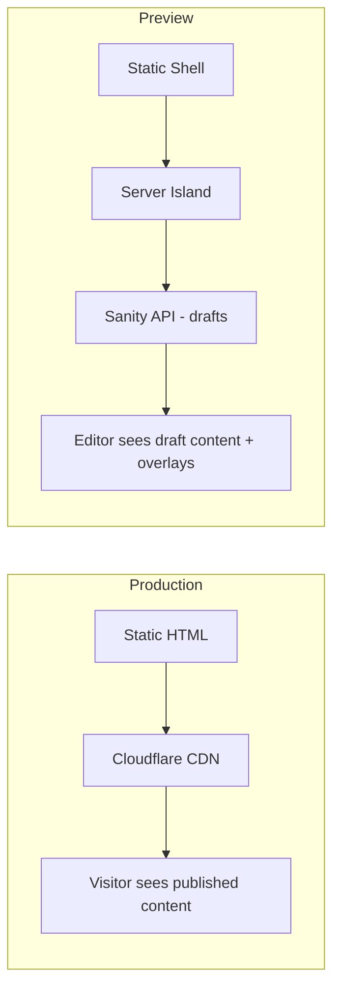
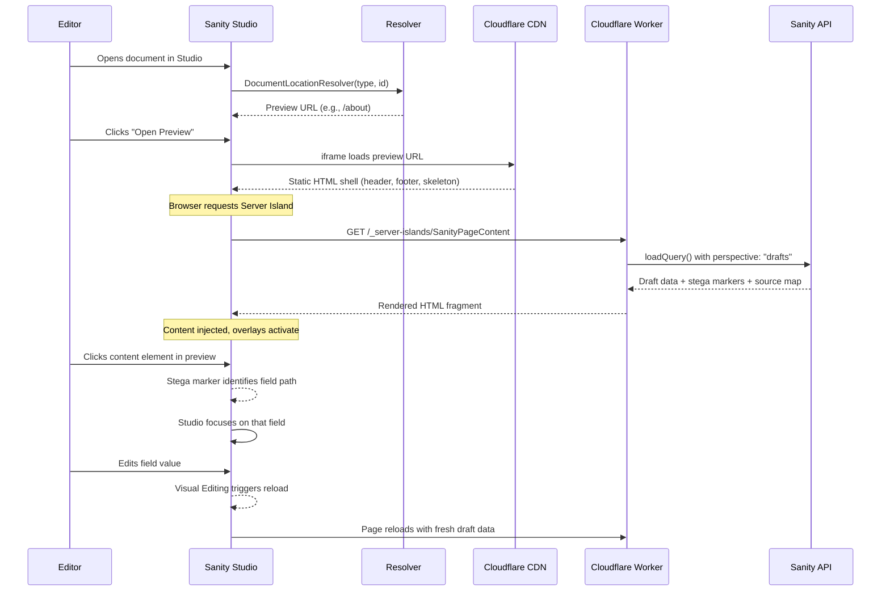

# Preview Environment Explained

How the live preview and visual editing system works in this Astro + Sanity project, from environment setup through the full editor workflow.

## Overview

The preview environment gives content editors a real-time, click-to-edit experience while keeping production fully static with zero runtime API calls. A single environment variable toggles all preview behavior — the same codebase serves both modes.



## Architecture at a Glance

| Aspect | Production | Preview |
| :--- | :--- | :--- |
| Output mode | Static (SSG) | Static shell + Server Islands |
| Content perspective | `published` | `drafts` |
| Stega encoding | Off | On |
| API calls per page view | 0 | 1 (page data via Server Island) |
| Visual editing overlays | Off | On |
| Caching | CDN-cached | `no-cache` on content fragments |

## How the Toggle Works

One environment variable controls everything:

```bash
# astro-app/.env
PUBLIC_SANITY_VISUAL_EDITING_ENABLED="true"   # Preview mode
SANITY_API_READ_TOKEN="sk_..."                # Required when preview is on
```

The `loadQuery()` wrapper in `astro-app/src/lib/sanity.ts` reads this variable and adjusts every query:

```typescript
const perspective = visualEditingEnabled ? "drafts" : "published";

const { result } = await sanityClient.fetch<T>(query, params ?? {}, {
  perspective,
  stega: visualEditingEnabled,
  resultSourceMap: visualEditingEnabled ? "withKeyArraySelector" : false,
  ...(visualEditingEnabled ? { token } : {}),
});
```

When the toggle is `true`, every query automatically:

- Switches to **draft perspective** (returns unpublished content)
- Enables **stega encoding** (invisible markers for click-to-edit)
- Requests a **result source map** (maps DOM elements back to Sanity fields)
- Authenticates with the **read token** (required for draft access)

## Key Components

### Server Islands — Fresh Draft Content on Demand

In preview mode, page routes skip their server-side fetch and delegate to a **Server Island** component that fetches draft data on every request.

**Page route** (`astro-app/src/pages/[...slug].astro`):

```astro
{visualEditingEnabled ? (
  <SanityPageContent server:defer slug={slug}>
    <div slot="fallback" class="animate-pulse ...">
      <!-- Skeleton loader shown while island loads -->
    </div>
  </SanityPageContent>
) : (
  <TemplateComponent>
    <BlockRenderer blocks={page.blocks ?? []} />
  </TemplateComponent>
)}
```

**Server Island** (`astro-app/src/components/SanityPageContent.astro`):

- Fetches page data independently via `getPage(slug)`
- Sets `Cache-Control: no-cache, no-store, must-revalidate` to guarantee fresh drafts
- Renders blocks with the correct template
- Astro auto-generates a `/_server-islands/SanityPageContent` endpoint for this component

**Why this pattern?** The page shell (header, footer, layout) renders instantly from the static build. Only the content area makes a runtime API call, keeping first paint fast.

### Visual Editing Overlay — Click-to-Edit in the Browser

The `VisualEditingMPA` React component (`astro-app/src/components/VisualEditingMPA.tsx`) powers the click-to-edit experience. It renders only when preview is enabled:

```astro
<!-- In Layout.astro -->
{visualEditingEnabled && <VisualEditingMPA client:only="react" />}
```

This component provides:

- **Click-to-edit overlays** — Scans the DOM for stega markers and creates clickable regions that jump the editor to the corresponding field in Studio
- **MPA history adapter** — Astro uses full-page navigation, so a custom adapter translates Studio navigation events into `window.location.href` changes
- **Live refresh** — When Studio sends an update via its channel, the component calls `window.location.reload()` to fetch fresh draft data

### Stega Encoding — How Click-to-Edit Finds Your Content

Stega encoding embeds invisible Unicode characters into string values returned by the Sanity API. These markers encode the document ID, field path, and content origin so the Visual Editing overlay knows which DOM element maps to which Sanity field.

Components that use stega-encoded values for logic (CSS classes, conditionals) must clean them first:

```typescript
import { stegaClean } from '@sanity/client/stega';

const bg = stegaClean(backgroundVariant) ?? 'white';
```

Components that clean stega values include `BlockWrapper`, `HeroBanner`, `CtaBanner`, `StatsRow`, `TextWithImage`, `SponsorCards`, and `Layout` (for SEO meta fields).

### Document Location Resolver — Mapping Documents to Preview URLs

The Studio needs to know which URL to load in the preview iframe for each document type. The resolver at `studio/src/presentation/resolve.ts` provides this mapping:

| Document Type | Preview URL |
| :--- | :--- |
| `page` | `/{slug}` (or `/` for home) |
| `siteSettings` | All pages (appears in header/footer everywhere) |
| `sponsor` | `/sponsors/{slug}` + `/sponsors` gallery |

## The Full Preview Flow

This diagram shows the complete sequence from an editor opening a document to seeing live draft content with click-to-edit overlays.



### Step-by-Step Walkthrough

1. **Editor opens a document** in Sanity Studio (e.g., a `page` document)
2. **Studio resolves the preview URL** using the document location resolver — maps the document's slug to a frontend route
3. **Editor opens the Presentation Tool** — Studio loads the preview URL in an iframe
4. **Cloudflare CDN serves the static shell** — Header, footer, navigation, and a skeleton loading placeholder render instantly
5. **Browser requests the Server Island** — An automatic fetch to `/_server-islands/SanityPageContent` triggers the Cloudflare Worker
6. **Worker fetches draft content** — `loadQuery()` calls the Sanity API with `perspective: "drafts"`, stega encoding, and the read token
7. **Content renders in the preview** — The Worker returns rendered HTML, which replaces the skeleton placeholder
8. **Visual editing overlay activates** — `VisualEditingMPA` scans for stega markers and creates click-to-edit regions
9. **Editor clicks content to edit** — The overlay identifies the Sanity field via stega markers and focuses Studio on that field
10. **Editor makes changes** — Studio saves the draft, triggers a page reload, and the cycle repeats with fresh content

## Environment Variables Reference

| Variable | Location | Purpose |
| :--- | :--- | :--- |
| `PUBLIC_SANITY_VISUAL_EDITING_ENABLED` | `astro-app/.env` | Master toggle for all preview behavior |
| `SANITY_API_READ_TOKEN` | `astro-app/.env` | Server-side token for fetching draft content |
| `PUBLIC_SANITY_STUDIO_URL` | `astro-app/.env` | Studio URL for edit link overlays |
| `SANITY_STUDIO_PREVIEW_ORIGIN` | `studio/.env` | Frontend URL the Presentation Tool loads |

## Key Files

| File | Role |
| :--- | :--- |
| `astro-app/src/lib/sanity.ts` | Query wrapper — toggles perspective, stega, and auth |
| `astro-app/src/components/SanityPageContent.astro` | Server Island — fetches fresh draft data per request |
| `astro-app/src/components/VisualEditingMPA.tsx` | Visual editing overlay with MPA history adapter |
| `astro-app/src/layouts/Layout.astro` | Conditionally renders the visual editing component |
| `astro-app/src/pages/[...slug].astro` | Page route — delegates to Server Island in preview mode |
| `studio/sanity.config.ts` | Studio config — registers Presentation Tool plugin |
| `studio/src/presentation/resolve.ts` | Maps document types to preview URLs |

## Production vs Preview Comparison

```mermaid
flowchart TD
    subgraph prod["Production (PUBLIC_SANITY_VISUAL_EDITING_ENABLED=false)"]
        P1[Astro Build] -->|getStaticPaths| P2[Fetch all slugs - published]
        P2 --> P3[Generate static HTML per page]
        P3 --> P4[Deploy to Cloudflare CDN]
        P4 --> P5[Visitor gets cached HTML - zero API calls]
    end

    subgraph prev["Preview (PUBLIC_SANITY_VISUAL_EDITING_ENABLED=true)"]
        V1[Astro Build] -->|getStaticPaths| V2[Fetch all slugs - published]
        V2 --> V3[Generate static shells - no content]
        V3 --> V4[Deploy to Cloudflare Pages]
        V4 --> V5[Request hits CDN - static shell served]
        V5 --> V6[Server Island fetches draft content]
        V6 --> V7[Visual editing overlay activates]
    end
```



The production path generates complete static pages with published content baked in. The preview path generates empty shells and fills them at request time with draft content from the Sanity API.
