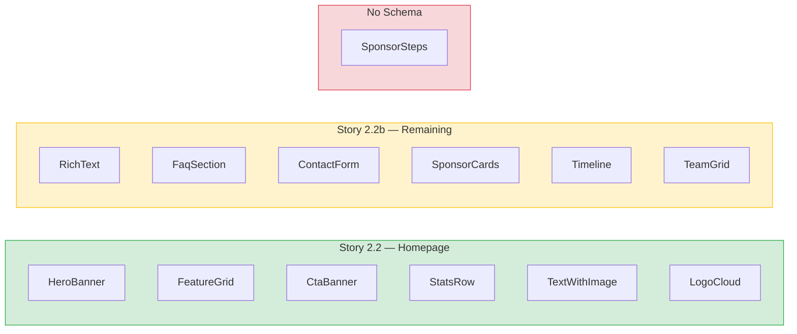
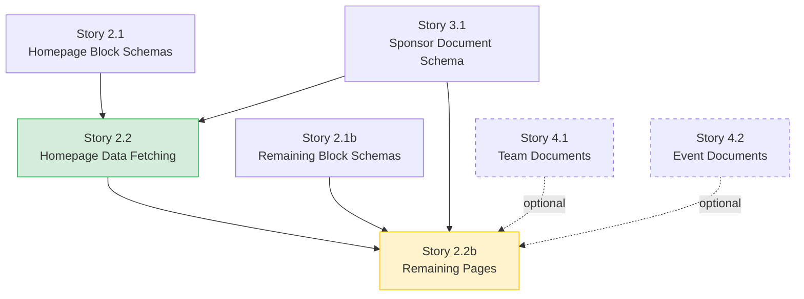

# Remaining Sanity Block Conversions After Story 2.2

## Purpose

Story 2.2 converts **6 homepage block components** to accept Sanity data. This document identifies the **7 remaining components** that still need conversion to work with Sanity-driven content, plus the `sponsorSteps` special case.

## Conversion Status Overview

## Components Needing Conversion

### 1. RichText

- **Component:** `astro-app/src/components/blocks/custom/RichText.astro`
- **Schema:** `studio/src/schemaTypes/blocks/rich-text.ts`
- **Used on:** Not currently in any placeholder page data
- **Conversion scope:** Accept `content` as portable text array from Sanity. Requires `@portabletext/astro` renderer.

| Field | Current Type | Sanity Type |
|-------|-------------|-------------|
| `content` | `PortableTextBlock[]` | `array` of `block` |

### 2. FaqSection

- **Component:** `astro-app/src/components/blocks/custom/FaqSection.astro`
- **Schema:** `studio/src/schemaTypes/blocks/faq-section.ts`
- **Used on:** About page

| Field | Placeholder Name | Sanity Name |
|-------|-----------------|-------------|
| label | `label` | `heading` (verify schema) |
| title | `headline` | `heading` |
| items | `items[]` | `items[]` |
| question | `items[].question` | `items[].question` |
| answer | `items[].answer` | `items[].answer` |

### 3. ContactForm

- **Component:** `astro-app/src/components/blocks/custom/ContactForm.astro`
- **Schema:** `studio/src/schemaTypes/blocks/contact-form.ts`
- **Used on:** Contact page

| Field | Placeholder Name | Sanity Name |
|-------|-----------------|-------------|
| title | `headline` | `heading` |
| subtitle | `subtitle` | `description` |
| endpoint | `formEndpoint` | `formEndpoint` or `successMessage` |
| fields | `fields[]` | `fields[]` |

### 4. SponsorCards

- **Component:** `astro-app/src/components/blocks/custom/SponsorCards.astro`
- **Schema:** `studio/src/schemaTypes/blocks/sponsor-cards.ts`
- **Used on:** Sponsors page (3 instances: platinum, gold, silver)
- **Conversion scope:** Currently uses inline sponsor data. Sanity schema uses **sponsor document references** that need GROQ dereferencing to expand `name`, `logo`, `website`, `tier`, `featured`.

| Field | Placeholder Name | Sanity Name |
|-------|-----------------|-------------|
| label | `label` | `heading` |
| title | `headline` | `heading` |
| sponsors | `sponsors[]` (inline objects) | `sponsors[]` (reference to `sponsor` docs) |
| display | — | `displayMode` |

**Key change:** Inline sponsor objects become references to `sponsor` documents (from Story 3.1). The GROQ query must dereference them: `sponsors[]->{ name, logo, website, tier, ... }`.

### 5. Timeline

- **Component:** `astro-app/src/components/blocks/custom/Timeline.astro`
- **Schema:** `studio/src/schemaTypes/blocks/timeline.ts`
- **Used on:** Not currently in any placeholder page data
- **Conversion scope:** May use event document references or inline event objects. Verify schema for `autoPopulate` flag.

| Field | Placeholder Name | Sanity Name |
|-------|-----------------|-------------|
| label | `label` | `heading` |
| title | `headline` | `heading` |
| events | `events[]` (inline) | `events[]` (refs or inline) |

**Dependency:** Event document schema may not exist yet. Timeline renders with empty reference pickers until event docs are created (forward-reference pattern).

### 6. TeamGrid

- **Component:** `astro-app/src/components/blocks/custom/TeamGrid.astro`
- **Schema:** `studio/src/schemaTypes/blocks/team-grid.ts`
- **Used on:** Projects page
- **Conversion scope:** Currently uses deeply nested inline data (teams with member arrays). Sanity schema may support both document refs and inline members via a `useDocumentRefs` toggle.

| Field | Placeholder Name | Sanity Name |
|-------|-----------------|-------------|
| label | `label` | `heading` |
| title | `headline` | `heading` |
| subtitle | `subtitle` | `subtitle` |
| teams | `teams[]` (inline) | `teams[]` (refs or inline) |
| members | `teams[].members[]` (inline) | `teams[].members[]` (refs or inline) |

**Key change:** The component currently receives fully flattened member data. With Sanity, GROQ must expand team and member references. This is the most complex projection of all remaining blocks.

**Dependency:** Team document schema may not exist yet (Epic 4). Same forward-reference pattern as Timeline.

### 7. SponsorSteps (Special Case)

- **Component:** `astro-app/src/components/blocks/custom/SponsorSteps.astro`
- **Schema:** NONE — no Sanity schema exists
- **Used on:** Homepage only
- **BlockRenderer:** Registered as `sponsorSteps` in switch-case dispatch
- **Decision needed:** Story 2.2 flagged three options:

| Option | Approach | Tradeoff |
|--------|----------|----------|
| 1 | **Hybrid** — keep rendering from placeholder data alongside Sanity blocks | Safest for MVP; mixes data sources |
| 2 | **Create schema** — add `sponsorSteps` block schema | Adds a 13th block type outside the original P0 scope |
| 3 | **Replace** — swap for an existing P0 block (e.g., `featureGrid` or `timeline`) | Removes custom functionality |

## Page-Level Block Usage Map

This table shows which blocks each page uses, so you can trace which conversions each page depends on.

| Page | Blocks Used | Story 2.2 | Story 2.2b | No Schema |
|------|-------------|:---------:|:----------:|:---------:|
| **Homepage** (`/`) | heroBanner, statsRow, featureGrid, textWithImage, logoCloud, sponsorSteps, ctaBanner | 6 | — | 1 |
| **About** (`/about`) | heroBanner, textWithImage, featureGrid, faqSection, ctaBanner | 3 | 1 | — |
| **Projects** (`/projects`) | heroBanner, teamGrid, ctaBanner | 1 | 1 | — |
| **Sponsors** (`/sponsors`) | heroBanner, sponsorCards (x3), statsRow, ctaBanner | 3 | 1 | — |
| **Contact** (`/contact`) | heroBanner, contactForm, featureGrid | 2 | 1 | — |

## Conversion Dependency Chain

**Solid arrows** = hard dependencies (must complete first).
**Dashed arrows** = soft dependencies (blocks work but reference pickers are empty).

## Summary

| Category | Count | Components |
|----------|:-----:|------------|
| Converted (Story 2.2) | 6 | HeroBanner, FeatureGrid, CtaBanner, StatsRow, TextWithImage, LogoCloud |
| Remaining (Story 2.2b) | 6 | RichText, FaqSection, ContactForm, SponsorCards, Timeline, TeamGrid |
| No schema (decision needed) | 1 | SponsorSteps |
| **Total custom blocks** | **13** | |
