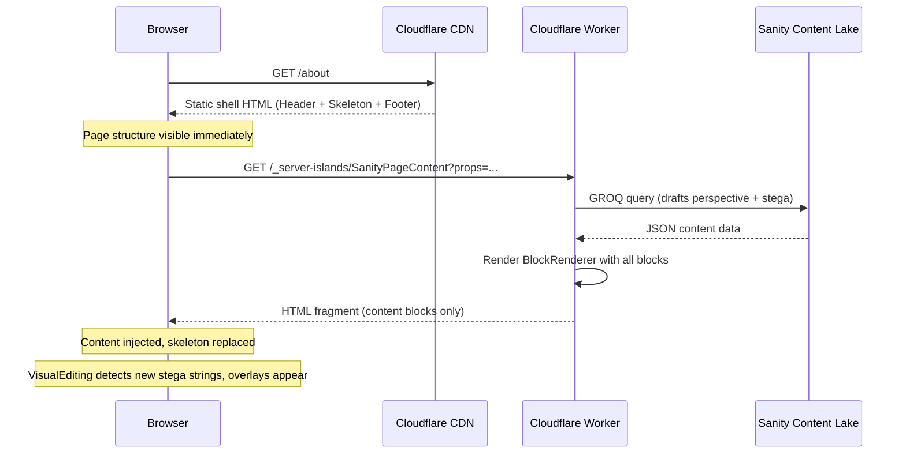
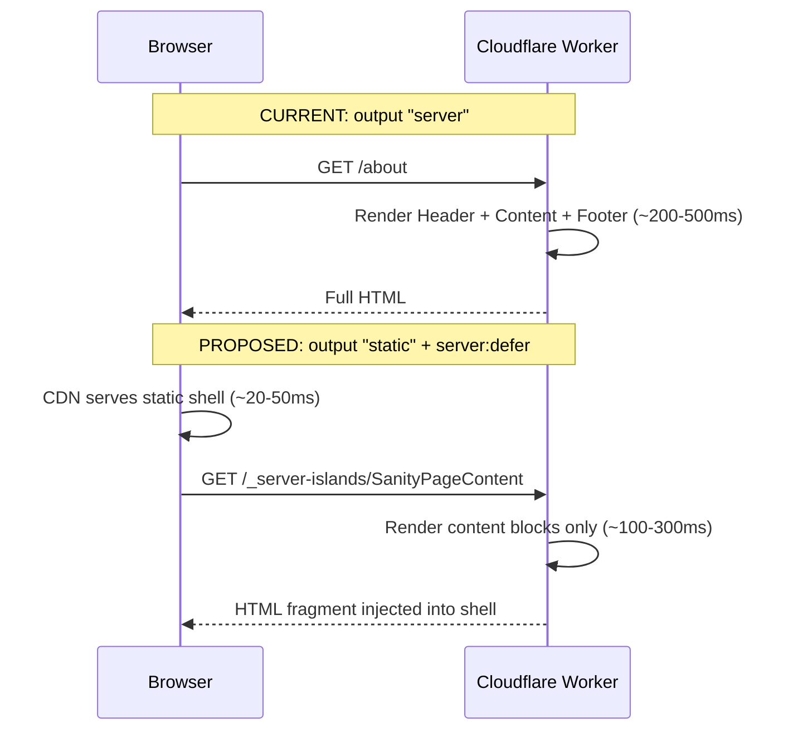
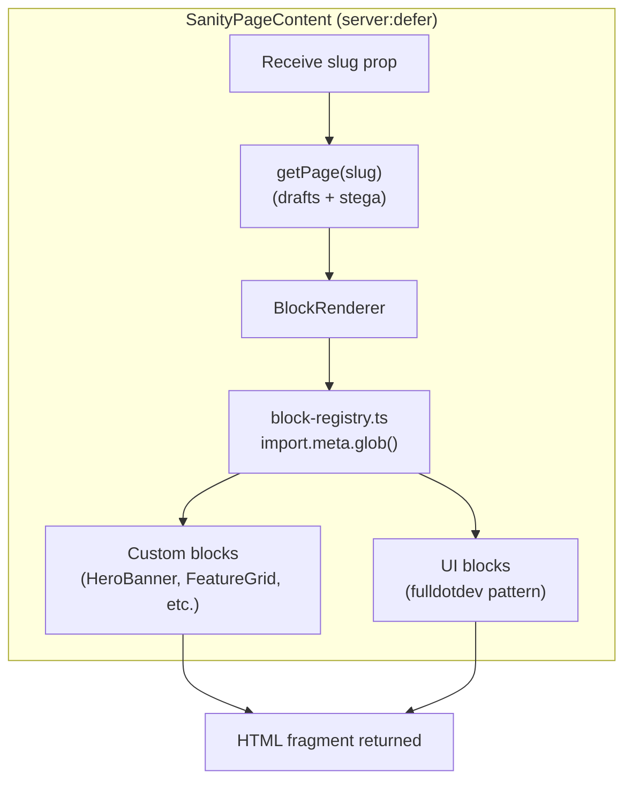

# Server Islands: How They Work & Project Benefits

This guide explains what Astro Server Islands are, how they work mechanically, and how they benefit this project's preview branch. It complements the [How Preview & Publish Works](how-preview-and-publish-works.md) guide and maps to [Story 7.4](../../_bmad-output/implementation-artifacts/7-4-server-islands-preview-optimization.md).

## Table of Contents

- [The Problem Server Islands Solve](#the-problem-server-islands-solve)
- [What Is a Server Island?](#what-is-a-server-island)
- [How It Works Step by Step](#how-it-works-step-by-step)
- [What Changes in the Architecture](#what-changes-in-the-architecture)
- [Benefits](#benefits)
- [How the Content Block Pipeline Stays the Same](#how-the-content-block-pipeline-stays-the-same)
- [The Visual Editing Timing Question](#the-visual-editing-timing-question)
- [The Props Constraint](#the-props-constraint)
- [What Stays the Same](#what-stays-the-same)
- [Glossary](#glossary)

## The Problem Server Islands Solve

Today the site has two output modes controlled by a single environment variable:

| Mode | Branch | Astro Output | What Renders Each Request |
|------|--------|--------------|---------------------------|
| Production | `main` | `static` | Nothing. Pre-built HTML served from CDN. |
| Preview | `preview` | `server` | **Everything.** Header, nav, content blocks, footer. |

The preview branch uses `output: "server"`, which means a Cloudflare Worker renders the entire page on every request. This works, but it has three costs:

1. **Slow initial paint.** The Worker must render the full page (layout, navigation, all content blocks, footer) before the browser sees anything.
2. **High Worker usage.** Every page view burns one Worker invocation on Cloudflare's free tier (100K requests/day), and the Worker does maximum work each time.
3. **Two different output modes.** The codebase branches on `output: "server"` vs `"static"`, which adds complexity to builds, testing, and debugging.

Server Islands solve all three by introducing a **middle ground**: a static page with one server-rendered hole in it.

## What Is a Server Island?

A Server Island is an Astro component marked with `server:defer`. At build time, Astro renders the rest of the page as static HTML but replaces the island with a fallback placeholder and a small script. At request time, the script fetches just that component from the server.

```
┌─────────────────────────────────┐
│  STATIC SHELL (CDN-cached)      │
│  ┌───────────────────────────┐  │
│  │ Header + Navigation       │  │
│  └───────────────────────────┘  │
│  ┌───────────────────────────┐  │
│  │ SERVER ISLAND             │  │
│  │  → Fetches draft content  │  │
│  │  → Renders all blocks     │  │
│  │  → Returns HTML fragment  │  │
│  └───────────────────────────┘  │
│  ┌───────────────────────────┐  │
│  │ Footer                    │  │
│  └───────────────────────────┘  │
│  <VisualEditing />              │
└─────────────────────────────────┘
```

The static shell (Header, Footer, layout) is built once and served from the CDN. Only the content area inside the island hits the Cloudflare Worker.

## How It Works Step by Step



**Step 1 — Build time.** Astro renders each page as static HTML. When it encounters `<SanityPageContent server:defer>`, it outputs a loading skeleton and a `<script>` tag instead of the content.

**Step 2 — CDN serves the shell.** When an editor opens a preview page, the CDN returns the pre-built HTML instantly. The browser paints the Header, navigation, fallback skeleton, and Footer within milliseconds.

**Step 3 — Island fetch.** The embedded script fires a GET request to `/_server-islands/SanityPageContent`. The page slug is passed as an encrypted prop in the URL.

**Step 4 — Worker renders content.** The Cloudflare Worker receives the request, calls `getPage(slug)` with the `drafts` perspective and stega encoding enabled, and runs `BlockRenderer` to produce an HTML fragment.

**Step 5 — Content injection.** The browser replaces the skeleton with the returned HTML. The `<VisualEditing />` component detects the new stega-encoded content in the DOM and draws click-to-edit overlays.

### Comparing the two approaches



The total time-to-complete is similar, but the time-to-first-paint is dramatically faster because the static shell arrives from the CDN edge immediately.

## What Changes in the Architecture

| Layer | Before (Preview) | After (Server Islands) |
|-------|-------------------|------------------------|
| `astro.config.mjs` output | `isVisualEditing ? "server" : "static"` | `"static"` (always) |
| Header and Footer | Rendered per-request by Worker | Pre-built at deploy, served from CDN |
| Site settings fetch | Per-request (bypasses cache) | Baked into static shell at build time |
| Sanity content blocks | Rendered inside full page SSR | Rendered inside `server:defer` island |
| `BlockRenderer` | Runs in full page render | Runs inside the island component |
| VisualEditing overlays | Activate on full page load | Activate after island injects content |
| Cloudflare adapter | Required (`output: "server"`) | Still required (handles `/_server-islands/*` route) |

### The config simplification

```javascript
// Before — conditional output mode
output: isVisualEditing ? "server" : "static",

// After — always static
output: "static",
```

Both `main` and `preview` branches now use `output: "static"`. The only difference is that `preview` has a `server:defer` component that triggers Worker execution for the content area.

## Benefits

### 1. Faster initial paint

The static shell (Header, navigation, footer, page skeleton) loads from the CDN edge cache in ~20-50ms. The editor sees the page structure almost instantly instead of waiting 200-500ms for the full Worker render.

### 2. Lower Worker usage

On Cloudflare's free tier (100K Worker requests/day):

| Scenario | Before | After |
|----------|--------|-------|
| Editor views 10 pages | 10 full-page Worker renders | 10 island-only Worker renders |
| Worker work per request | Render full HTML (layout + blocks + footer) | Render content blocks only |
| Static assets (CSS, JS, images) | Served by CDN (same) | Served by CDN (same) |

The Worker does less work per invocation because it only renders the Sanity content blocks, not the entire layout.

### 3. Unified output mode

Both branches use `output: "static"`. This eliminates the conditional branching in `astro.config.mjs` and simplifies the mental model: the only runtime difference is whether `server:defer` components exist on the page.

### 4. Better caching

The static shell can be aggressively cached at the CDN edge. The island endpoint (`/_server-islands/*`) always fetches fresh draft data from Sanity, so editors still see live content changes.

## How the Content Block Pipeline Stays the Same

The entire block rendering pipeline is unchanged. The server island is a thin wrapper — it accepts a slug, fetches content, and passes blocks to `BlockRenderer`, which is the same component used today.



Each block component still:

- Receives typed Sanity data via props
- Uses `stegaClean()` for string comparisons (alignment, layout choices)
- Renders stega-encoded strings directly for Visual Editing overlays
- Uses the same UI primitives (`Section`, `SectionContent`, `SectionActions`)

No block component needs to change.

## The Visual Editing Timing Question

This is the **main technical risk** of the migration.

### The issue

The `<VisualEditing />` component lives in `Layout.astro` at the bottom of the `<body>`. It scans the DOM for stega-encoded strings to create click-to-edit overlays. With server islands, the stega content does not exist when the page first loads — it arrives after the island fetch completes.

### Why it likely works anyway

The `@sanity/visual-editing` package uses a [MutationObserver](https://developer.mozilla.org/en-US/docs/Web/API/MutationObserver) internally to watch for DOM changes. When the server island injects its HTML fragment, the observer should detect the new stega-encoded strings and create overlays automatically.

### Fallback approach

If the MutationObserver approach does not work, the `<VisualEditing />` component can be moved inside the server island so it renders alongside the content it scans. This guarantees correct timing but couples layout concerns with content.

### Test strategy

| Test | Expected Result |
|------|-----------------|
| Load a preview page, wait for island content | Blue overlay rectangles appear on editable text |
| Click an overlay | Studio navigates to the correct document and field |
| Edit a field in Studio, refresh the preview | Updated content appears with working overlays |
| Open page in Presentation tool | Iframe loads with full click-to-edit functionality |

This is the first thing to validate. If overlays do not appear, check the browser console for `@sanity/visual-editing` initialization messages.

## The Props Constraint

Server island props must be **serializable** — strings, numbers, booleans, plain objects, and arrays. You cannot pass functions, class instances, or Astro component references.

The correct pattern is to pass a minimal identifier and let the island fetch its own data:

```astro
<!-- In the page template -->
<SanityPageContent slug="about" server:defer>
  <LoadingSkeleton slot="fallback" />
</SanityPageContent>
```

```astro
<!-- Inside SanityPageContent.astro -->
---
const { slug } = Astro.props;
const page = await getPage(slug);
---
<BlockRenderer blocks={page.blocks ?? []} />
```

The island receives the slug (a string), fetches fresh draft data from Sanity using the existing `getPage()` function, and renders the blocks. The page template knows nothing about the data fetching — it just passes the slug and provides a fallback.

### Important: `Astro.url` inside islands

Server islands have their own URL (`/_server-islands/ComponentName`), not the original page URL. If you need the original page URL inside the island, either:

- Pass it as a prop: `<SanityPageContent slug={slug} pageUrl={Astro.url.pathname} server:defer>`
- Read the `Referer` header: `Astro.request.headers.get('referer')`

For this project, the slug prop is sufficient since `getPage()` only needs the slug to query Sanity.

## What Stays the Same

| Aspect | Changes? | Notes |
|--------|----------|-------|
| Block components | No | Same props, same rendering, same stega handling |
| Block registry | No | `import.meta.glob()` works identically inside the island |
| GROQ queries | No | Same queries, same data shape |
| Type system (`sanity.types.ts`) | No | Same generated types |
| `stegaClean()` usage | No | Same pattern in all block components |
| Production builds (`main`) | No | No `server:defer` when visual editing disabled |
| Vitest component tests | No | Container API tests individual components, not the island wrapper |
| Playwright E2E tests | Minimal | May need to account for island loading delay in assertions |
| Sanity Studio | No | No configuration changes needed |
| Schema | No | No schema changes needed |

## Glossary

| Term | Definition |
|------|------------|
| **CDN edge cache** | Content stored on servers physically close to the user. Static HTML files are served from the nearest edge location for fastest response. |
| **Fallback** | A placeholder (loading skeleton) shown while the server island content loads. Defined using `slot="fallback"` in Astro. |
| **MutationObserver** | A browser API that watches for changes to the DOM. The Visual Editing component uses it to detect when new stega content appears. |
| **Serializable props** | Values that can be converted to a string and back (strings, numbers, plain objects). Required for server island props because they are passed via URL. |
| **Server Island** | An Astro component marked with `server:defer` that renders on the server per-request while the rest of the page is static. |
| **`server:defer`** | The Astro directive that marks a component as a server island. The component renders on the server when requested, not at build time. |
| **`/_server-islands/*`** | The internal URL pattern Astro uses for server island requests. The browser fetches this endpoint to get the island's HTML. |
| **Static shell** | The pre-built HTML that wraps the server island: Header, navigation, footer, and the fallback skeleton. Served from CDN. |
| **Time-to-first-paint** | How quickly the browser can show something on screen. A static shell paints faster than a full server render. |
