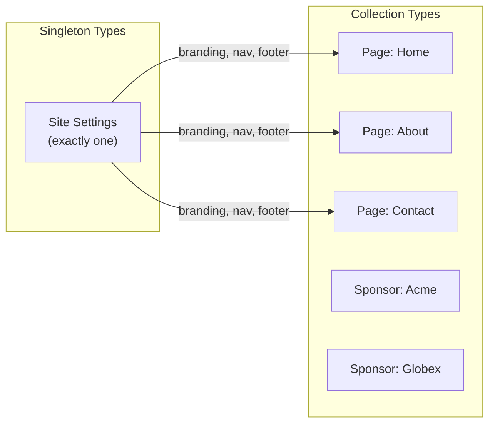
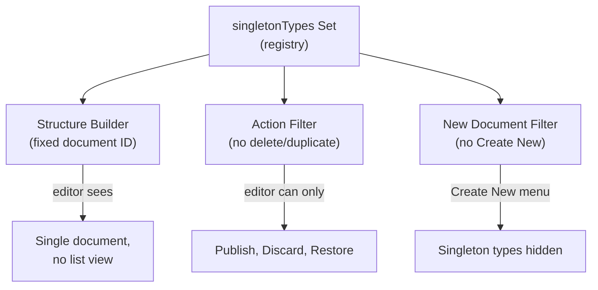
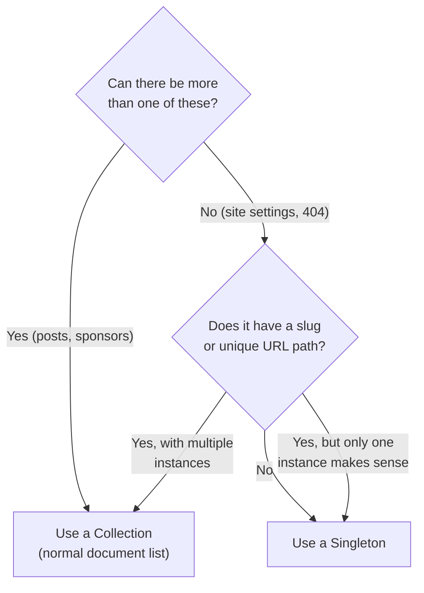

# Singleton Pattern in Sanity: How It Works

Some content types — like site settings or a homepage — should only ever have one instance. You don't want editors accidentally creating a second "Site Settings" document and wondering which one is real. The singleton pattern prevents that. This guide explains what it is, why Sanity doesn't have a built-in toggle for it, and how our project enforces it across four layers.

## Table of Contents

- [The Big Picture](#the-big-picture)
- [What Is a Singleton?](#what-is-a-singleton)
- [Why Sanity Does Not Have a Singleton Toggle](#why-sanity-does-not-have-a-singleton-toggle)
- [How Our Project Enforces Singletons](#how-our-project-enforces-singletons)
- [Layer 1: The Singleton Registry](#layer-1-the-singleton-registry)
- [Layer 2: Fixed Document ID in Studio Structure](#layer-2-fixed-document-id-in-studio-structure)
- [Layer 3: Action Restrictions](#layer-3-action-restrictions)
- [Layer 4: New Document Filtering](#layer-4-new-document-filtering)
- [How the Frontend Queries a Singleton](#how-the-frontend-queries-a-singleton)
- [Our Current Singletons](#our-current-singletons)
- [How to Add a New Singleton](#how-to-add-a-new-singleton)
- [When to Use the Singleton Pattern](#when-to-use-the-singleton-pattern)
- [Glossary](#glossary)

## The Big Picture

In most CMS systems, every document type gets a list view where editors can create as many documents as they want. That makes perfect sense for blog posts or sponsors — you want many of those. But "Site Settings" is different. There is exactly one site, so there should be exactly one settings document.



A **collection type** gets a list of documents. A **singleton type** gets a single document — no list, no "Create new" button, no delete option.

## What Is a Singleton?

A singleton is a document type that is limited to exactly one instance. Common examples include:

- **Site Settings** — logo, site name, navigation, footer
- **Homepage** — if it has a dedicated schema with unique fields
- **404 Page** — fixed error content
- **Global SEO Defaults** — fallback meta tags

The defining question is: *"Does it make sense for editors to create more than one of these?"* If the answer is no, it's a singleton.

## Why Sanity Does Not Have a Singleton Toggle

There is no `singleton: true` property on a Sanity schema type. Sanity is flexible by design — it gives you the building blocks and lets you compose the behavior you need. Singletons are enforced through the **Studio Structure builder**, not the schema definition.

This means the schema file for a singleton looks almost identical to any other document type. The difference is entirely in how Studio presents it.

## How Our Project Enforces Singletons

Our singleton enforcement has four layers, all defined in one file: `studio/sanity.config.ts`. Each layer closes a different loophole.



## Layer 1: The Singleton Registry

At the top of `studio/sanity.config.ts`, a Set lists every singleton type by name:

```typescript
// studio/sanity.config.ts, line 14
const singletonTypes = new Set(['siteSettings'])
```

This Set is referenced by the other three layers. When you add a new singleton, you add it here and the rest follows automatically.

## Layer 2: Fixed Document ID in Studio Structure

The structure builder controls what editors see in the Studio sidebar. Instead of a list of documents, a singleton gets a direct link to one specific document with a **fixed ID**:

```typescript
// studio/sanity.config.ts, lines 28-34
S.listItem()
  .title('Site Settings')
  .icon(CogIcon)
  .id('siteSettings')
  .child(
    S.document().schemaType('siteSettings').documentId('siteSettings'),
  ),
```

Two things happen here:

1. **`S.listItem()`** instead of `S.documentTypeListItem()` — the editor sees a single item, not a list.
2. **`.documentId('siteSettings')`** — every time an editor clicks "Site Settings", they open the same document. There is no way to create a second one through the sidebar.

The singleton type is also **filtered out** of the generic document list at the bottom of the sidebar so it doesn't appear twice:

```typescript
// studio/sanity.config.ts, lines 37-39
...S.documentTypeListItems().filter(
  (listItem) => !singletonTypes.has(listItem.getId()!),
),
```

## Layer 3: Action Restrictions

Even with the sidebar locked down, Sanity normally shows action buttons like "Delete" and "Duplicate" inside the document editor. For singletons, those are removed:

```typescript
// studio/sanity.config.ts, lines 57-63
actions: (input, context) =>
  singletonTypes.has(context.schemaType)
    ? input.filter(
        ({action}) =>
          action && ['publish', 'discardChanges', 'restore'].includes(action),
      )
    : input,
```

This means editors can only **Publish**, **Discard Changes**, or **Restore** a singleton. They cannot delete it, duplicate it, or unpublish it.

## Layer 4: New Document Filtering

Sanity Studio has a global "Create new document" button (the `+` icon). Without this filter, editors could create a second Site Settings document from that menu:

```typescript
// studio/sanity.config.ts, lines 65-66
newDocumentOptions: (prev) =>
  prev.filter((templateItem) => !singletonTypes.has(templateItem.templateId)),
```

This removes singleton types from the "Create new" menu entirely.

## How the Frontend Queries a Singleton

On the Astro side, the GROQ query for a singleton uses `[0]` to grab the single instance:

```groq
*[_type == "siteSettings"][0]{
  siteName,
  siteDescription,
  logo,
  navigationItems,
  ...
}
```

The `[0]` is important. Without it, the query returns an array. With it, you get a single object — which is what you want for a singleton.

Compare this to a collection query that returns multiple documents:

```groq
// Collection — returns an array of pages
*[_type == "page"]{ title, slug }

// Singleton — returns one object
*[_type == "siteSettings"][0]{ siteName }
```

## Our Current Singletons

| Type | Purpose | Document ID |
|------|---------|-------------|
| `siteSettings` | Site name, logo, navigation, footer, social links, contact info | `siteSettings` |

Our other document types are **collection types** and should stay that way:

| Type | Why It's a Collection |
|------|----------------------|
| `page` | Multiple pages with unique slugs (Home, About, Contact, etc.) |
| `sponsor` | Multiple sponsor entries with different names and tiers |

## How to Add a New Singleton

Follow these steps if you create a new document type that should be a singleton.

**Step 1:** Create the schema file in `studio/src/schemaTypes/documents/`. Add a comment at the top noting it's a singleton:

```typescript
// studio/src/schemaTypes/documents/error-page.ts

import {defineType, defineField} from 'sanity'
import {WarningOutlineIcon} from '@sanity/icons'

// Singleton document — use desk structure to limit to a single instance
export const errorPage = defineType({
  name: 'errorPage',
  title: '404 Page',
  type: 'document',
  icon: WarningOutlineIcon,
  fields: [
    defineField({
      name: 'heading',
      type: 'string',
      validation: (Rule) => Rule.required(),
    }),
    defineField({
      name: 'message',
      type: 'text',
    }),
  ],
})
```

**Step 2:** Register the type in `studio/src/schemaTypes/index.ts`:

```typescript
import {errorPage} from './documents/error-page'

export const schemaTypes = [
  // ... existing types
  errorPage,
]
```

**Step 3:** Add the type name to the `singletonTypes` Set in `studio/sanity.config.ts`:

```typescript
const singletonTypes = new Set(['siteSettings', 'errorPage'])
```

**Step 4:** Add a sidebar entry for the new singleton above the divider in the structure builder:

```typescript
S.listItem()
  .title('404 Page')
  .icon(WarningOutlineIcon)
  .id('errorPage')
  .child(
    S.document().schemaType('errorPage').documentId('errorPage'),
  ),
S.divider(),
```

That's it. Layers 3 and 4 (action restrictions and new-document filtering) use the `singletonTypes` Set, so they apply automatically.

**Step 5 (optional):** Run `npm run typegen` to regenerate TypeScript types, and deploy the schema with `npx sanity schema deploy` from the `studio/` directory.

## When to Use the Singleton Pattern

Use this decision tree when creating a new document type:



**Use a singleton when:**

- The type represents site-wide configuration (settings, defaults, themes)
- Only one instance should ever exist
- Editors should never delete or duplicate the document

**Use a collection when:**

- Editors create multiple instances (pages, blog posts, sponsors, team members)
- Each instance has a unique slug or identifier
- The content represents individual items, not global state

## Glossary

- **Collection type** — A document type where editors can create, list, and manage multiple instances. Most document types are collections.
- **Document ID** — A unique identifier for a document in Sanity's Content Lake. Singletons use a fixed ID (usually matching the type name) so the same document opens every time.
- **GROQ** — Graph-Relational Object Queries. Sanity's query language for fetching content.
- **Singleton** — A document type limited to exactly one instance. Enforced through Studio Structure, not the schema definition.
- **Structure builder** — The API (`S`) used to customize the Sanity Studio sidebar layout. Controls how document types appear and which views are available.
- **`singletonTypes` Set** — The registry in `sanity.config.ts` that lists all singleton type names. Referenced by the structure builder, action filter, and new-document filter.
