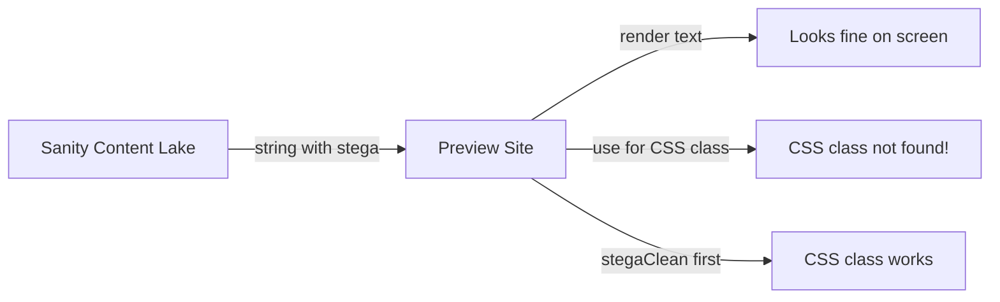

# stegaClean & Visual Editing: Why It Matters

This guide explains what stega encoding is, why Sanity adds invisible characters to your content, how those characters break your CSS when you're not careful, and what Story 7-6 does to fix it across the codebase. It also covers the Studio UX improvements bundled in the same story.

## Table of Contents

- [The Big Picture](#the-big-picture)
- [What Is Visual Editing?](#what-is-visual-editing)
- [What Is Stega Encoding?](#what-is-stega-encoding)
- [How Stega Characters Break Things](#how-stega-characters-break-things)
- [The Fix: stegaClean](#the-fix-stegaclean)
- [When to Clean and When Not To](#when-to-clean-and-when-not-to)
- [How Our Codebase Handles It](#how-our-codebase-handles-it)
- [What Story 7-6 Changes](#what-story-7-6-changes)
- [The BlockWrapper Pattern](#the-blockwrapper-pattern)
- [Studio UX Improvements in 7-6](#studio-ux-improvements-in-7-6)
- [How to Verify It Works](#how-to-verify-it-works)
- [Rules for Future Block Development](#rules-for-future-block-development)
- [Glossary](#glossary)

## The Big Picture

Our site uses **Sanity Visual Editing** so content editors can click on any piece of text in the preview and jump straight to the right field in Sanity Studio. This is powered by invisible characters that Sanity hides inside string values. Those characters are harmless when rendering text to the screen, but they **break everything** if you use a string value for logic — like picking a CSS class or making an `if` decision.



Story 7-6 ensures every place in our code that uses a Sanity string for logic runs it through `stegaClean()` first.

## What Is Visual Editing?

When a content editor opens Sanity Studio and clicks the **Presentation** tool, Studio loads our preview website inside an iframe. The editor can then click on any piece of content (a heading, a paragraph, a button label) and Studio highlights the matching field in the editing panel.

This "click to edit" behavior requires Studio to know **which document** and **which field** produced each piece of text on the screen. That's where stega comes in.

```
┌─────────────────────────────────────────────┐
│  Sanity Studio                              │
│  ┌────────────────┐  ┌───────────────────┐  │
│  │ Editing Panel  │  │ Preview (iframe)  │  │
│  │                │  │                   │  │
│  │ Title: ______  │←─│ "Welcome to YWCC" │  │
│  │                │  │  (click to edit)  │  │
│  │ Variant: _____ │  │                   │  │
│  └────────────────┘  └───────────────────┘  │
└─────────────────────────────────────────────┘
```

## What Is Stega Encoding?

**Stega** (short for steganography) is how Sanity tells the preview site which field each string came from. When Visual Editing is enabled, Sanity injects **invisible Unicode characters** into every string value it returns from the Content Lake.

These characters encode three things:
1. **Document ID** — which document the string belongs to
2. **Field path** — which field inside that document (e.g., `blocks[0].backgroundVariant`)
3. **Dataset info** — which dataset the content came from

You can't see these characters in the browser. They use zero-width Unicode code points (`\u200B`, `\u200C`, `\u200D`, etc.) that take up no visual space. But they are **absolutely there** in the JavaScript string value.

### What a stega string looks like under the hood

```
// What you see on screen:
"white"

// What JavaScript actually receives:
"white\u200B\u200C\u200D\u200B\u200C..."
//     ^^^^^^^^^^^^^^^^^^^^^^^^^^^^^^^^
//     invisible stega characters encoding
//     document ID + field path
```

The visible text is still `"white"`, but the string has extra bytes tacked on.

## How Stega Characters Break Things

When you display a stega string as text (`<h1>{title}</h1>`), everything works perfectly. The browser ignores the zero-width characters and renders "Welcome to YWCC" as expected. Studio's overlay library reads the hidden characters and makes the text clickable.

But when you use a string for **logic**, the invisible characters cause a mismatch:

### Example: CSS class lookup (broken)

```typescript
// Our CSS class map
const bgClasses = {
  white: '',
  light: 'bg-muted',
  dark: 'bg-foreground text-background',
  primary: 'bg-primary text-primary-foreground',
};

// What Sanity returns (with Visual Editing on):
const variant = block.backgroundVariant;
// variant = "white\u200B\u200C\u200D..."

// The lookup:
bgClasses[variant];
// bgClasses["white\u200B\u200C\u200D..."]
// → undefined! No key matches!
```

The lookup fails because `"white"` and `"white\u200B\u200C..."` are **different strings** in JavaScript. The result: the component gets no CSS class and the background disappears.

### Example: conditional logic (broken)

```typescript
const isDark = block.backgroundVariant === 'dark';
// "dark\u200B\u200C..." === "dark"
// → false! Even though it looks like "dark"
```

### What this looks like to the editor

The component renders with **no background color**, or the wrong background color, or a missing layout. The editor sees a broken preview and thinks the content is wrong. In reality, the content is fine — the code just can't read it properly because of the stega characters.

## The Fix: stegaClean

Sanity provides a function called `stegaClean` that strips the invisible characters from a string, returning the clean original value.

```typescript
import { stegaClean } from '@sanity/client/stega';

// Before cleaning:
block.backgroundVariant  // "white\u200B\u200C\u200D..."

// After cleaning:
stegaClean(block.backgroundVariant)  // "white"
```

Now the lookup works:

```typescript
const variant = stegaClean(block.backgroundVariant) ?? 'white';
bgClasses[variant];  // bgClasses["white"] → "" ✓
```

### Why not just disable stega?

You could disable stega encoding entirely, but then Visual Editing stops working — editors can no longer click on content to edit it. The whole point of stega is to power that click-to-edit experience. `stegaClean` lets you have both: Visual Editing for editors **and** correct logic for the code.

### Why not clean everything?

If you clean a string before rendering it as text, the stega characters are gone and Studio can't detect which field produced that text. The click-to-edit overlay breaks for that field. So you only clean strings that are used for **logic**, never for **display**.

## When to Clean and When Not To

| Use case | Clean? | Why |
|----------|--------|-----|
| CSS class lookup (`bgClasses[variant]`) | Yes | Stega breaks the key match |
| Conditional logic (`if (align === 'center')`) | Yes | Stega breaks the comparison |
| HTML attribute (`id={slug}`) | Yes | Stega produces invalid IDs |
| URL construction | Yes | Stega produces broken URLs |
| Rendering text on screen (`<h1>{title}</h1>`) | **No** | Kills click-to-edit overlay |
| Passing to `<PortableText />` | **No** | The library handles it internally |
| Passing to image URL helpers | **No** | The library handles it internally |

**Rule of thumb:** If the string goes into a person's eyeballs as visible text, don't clean it. If it goes into code logic, clean it.

## How Our Codebase Handles It

Our site uses a **page builder** pattern. Each page has an array of content blocks (hero banner, feature grid, CTA banner, etc.). Every block schema inherits three **base layout fields** from `block-base.ts`:

| Field | Purpose | Values |
|-------|---------|--------|
| `backgroundVariant` | Background color of the block | `white`, `light`, `dark`, `primary` |
| `spacing` | Vertical padding | `none`, `small`, `default`, `large` |
| `maxWidth` | Content width constraint | `narrow`, `default`, `full` |

These fields are string values that map to CSS classes — exactly the kind of field that stega encoding breaks.

### Which components already cleaned their fields (before 7-6)

| Component | What it cleans | What it missed |
|-----------|---------------|----------------|
| `HeroBanner.astro` | `alignment` | Not affected (hardcoded dark bg) |
| `CtaBanner.astro` | `backgroundVariant` | `spacing`, `maxWidth` unused |
| `StatsRow.astro` | `backgroundVariant` | `spacing`, `maxWidth` unused |
| `TextWithImage.astro` | `imagePosition` | Base fields unused |
| `SponsorCards.astro` | `tier` (per sponsor) | Base fields unused |
| `FeatureGrid.astro` | Nothing | Base fields unused |
| `FaqSection.astro` | Nothing | Base fields unused |
| `ContactForm.astro` | Nothing | Base fields unused |
| `LogoCloud.astro` | Nothing | Base fields unused |

The critical finding: **most components don't use the base layout fields at all**. The fields are defined in the schema, queried from Sanity, and passed to each component, but the components ignore them. This means adding `stegaClean` to each component individually would produce dead code — cleaning values that are never read.

## What Story 7-6 Changes

Story 7-6 takes a different approach: instead of sprinkling `stegaClean` calls across every component, it creates a **shared wrapper** that handles the base fields in one place.

### The five acceptance criteria

| AC | What | Priority | Why it matters |
|----|------|----------|---------------|
| **AC1** | Create `BlockWrapper.astro` that consumes base fields with stegaClean | High | One place to handle bg/spacing/maxWidth for ALL blocks |
| **AC2** | Group layout fields in a collapsible Studio fieldset | Medium | Declutters the editing panel for content editors |
| **AC3** | Add preview labels to site-settings arrays | Medium | Array items show names instead of "Untitled" in Studio |
| **AC4** | Wrap portable-text annotations in `defineArrayMember` | Low | Schema consistency per Sanity best practices |
| **AC5** | Fix typo + standardize env fallbacks | Low | Code hygiene |

## The BlockWrapper Pattern

Instead of every block component handling `backgroundVariant`, `spacing`, and `maxWidth` individually, a single `BlockWrapper.astro` component sits between the `BlockRenderer` and each block:

```
Before 7-6:
┌──────────────┐    ┌──────────────────┐
│ BlockRenderer │───>│ FeatureGrid.astro │  (base fields ignored)
│              │───>│ FaqSection.astro  │  (base fields ignored)
│              │───>│ CtaBanner.astro   │  (handles bg internally)
└──────────────┘    └──────────────────┘

After 7-6:
┌──────────────┐    ┌──────────────┐    ┌──────────────────┐
│ BlockRenderer │───>│ BlockWrapper  │───>│ FeatureGrid.astro │
│              │    │ (stegaClean)  │    │ FaqSection.astro  │
│              │    │ (CSS classes) │    │ CtaBanner.astro   │
└──────────────┘    └──────────────┘    └──────────────────┘
```

### What BlockWrapper does

1. Receives `backgroundVariant`, `spacing`, and `maxWidth` as props
2. Runs each through `stegaClean()` to strip invisible characters
3. Looks up the matching CSS class for each field
4. Wraps the child block component in a `<div>` with those classes

```astro
---
import { stegaClean } from '@sanity/client/stega'

const bg = stegaClean(backgroundVariant) ?? 'white'
const sp = stegaClean(spacing) ?? 'default'
const mw = stegaClean(maxWidth) ?? 'default'

const bgClasses = {
  white: '',
  light: 'bg-muted',
  dark: 'bg-foreground text-background',
  primary: 'bg-primary text-primary-foreground',
}
// ... similar maps for spacing and maxWidth
---

<div class:list={[bgClasses[bg], spacingClasses[sp], maxWidthClasses[mw]]}>
  <slot />  <!-- The actual block component renders here -->
</div>
```

### Why this pattern is better

| Approach | Pros | Cons |
|----------|------|------|
| Per-component stegaClean | Each component is self-contained | Duplicated logic in 11+ components; easy to forget in new blocks |
| **BlockWrapper (7-6)** | Single source of truth; new blocks get it for free | Slight nesting; components with non-standard bg need reconciliation |

The wrapper means that when you add a new block component in the future, it automatically gets correct background, spacing, and max-width handling with stega protection. You don't have to remember to add stegaClean — it's already done for you.

## Studio UX Improvements in 7-6

Story 7-6 also bundles several Studio improvements that make life easier for content editors.

### Collapsible layout fieldset (AC2)

Every block has three layout fields (`backgroundVariant`, `spacing`, `maxWidth`) that clutter the editing panel. AC2 groups them under a collapsible "Layout Options" fieldset that starts collapsed:

```
Before:                          After:
┌─────────────────────┐          ┌─────────────────────┐
│ Heading: __________ │          │ Heading: __________ │
│ Description: ______ │          │ Description: ______ │
│ Background: (radio) │          │ Items: [...]        │
│ Spacing: (radio)    │          │ ▶ Layout Options    │
│ Max Width: (radio)  │          │   (collapsed)       │
│ Items: [...]        │          └─────────────────────┘
└─────────────────────┘
```

Editors see the content fields first. They only expand "Layout Options" when they need to change spacing or background.

### Array item previews (AC3)

In the site settings document, arrays like navigation items and footer links show up as "Untitled" when collapsed:

```
Before:                          After:
├── Untitled                     ├── Home
├── Untitled                     ├── About
├── Untitled                     ├── Programs
```

AC3 adds `preview` configs so each item shows its `label` (or `platform` for social links).

### Annotation consistency (AC4)

Portable text annotations (the `link` and `internalLink` marks) are wrapped in `defineArrayMember()` to match the Sanity schema best practice rule that all array items use the helper function.

### Typo and fallback cleanup (AC5)

- Fixes a "leanr" typo in `sanity.cli.ts` (should be "learn")
- Standardizes the placeholder project ID across both config files

## How to Verify It Works

After Story 7-6 is implemented, you can verify each change:

### stegaClean / BlockWrapper
1. Start the preview site (`npm run dev -w astro-app`)
2. Open Sanity Studio and use the Presentation tool
3. Navigate to any page with blocks
4. Change a block's `backgroundVariant` to `dark` or `primary`
5. The preview should immediately show the correct background color
6. If stegaClean were missing, the background would not change or would disappear

### Collapsible fieldset
1. Open any page in Sanity Studio
2. Click on any block (hero, feature grid, etc.)
3. You should see a collapsed "Layout Options" group
4. Click to expand it — `backgroundVariant`, `spacing`, and `maxWidth` appear inside

### Array previews
1. Open **Site Settings** in Sanity Studio
2. Look at the Navigation Items array
3. Each item should show its label text instead of "Untitled"

## Rules for Future Block Development

When you create a new block component, follow these rules to avoid stega bugs:

### 1. Never use a Sanity string for CSS logic without cleaning it

```typescript
// BAD - will break with Visual Editing
const variant = block.someField;
const classes = classMap[variant]; // undefined when stega active

// GOOD
import { stegaClean } from '@sanity/client/stega';
const variant = stegaClean(block.someField) ?? 'default';
const classes = classMap[variant]; // works correctly
```

### 2. Base layout fields are handled by BlockWrapper

You don't need to read `backgroundVariant`, `spacing`, or `maxWidth` in your component. `BlockWrapper` applies them automatically. If your block needs non-standard background handling (like CtaBanner's per-variant button colors), document why in a code comment.

### 3. Clean any block-specific string used for logic

If your block has its own string fields used for conditions or class mapping (like `alignment`, `imagePosition`, `tier`), clean them with `stegaClean` in your component's frontmatter.

### 4. Never clean strings used for display

```typescript
// BAD - kills click-to-edit for this field
<h1>{stegaClean(block.heading)}</h1>

// GOOD - stega characters are invisible, overlay works
<h1>{block.heading}</h1>
```

### 5. Use `_key` for array iteration keys, not index

```astro
{/* BAD - breaks Visual Editing drag-and-drop */}
{items.map((item, i) => <Card key={i} />)}

{/* GOOD - Sanity's _key enables overlay tracking */}
{items.map((item) => <Card key={item._key} />)}
```

## Glossary

| Term | Definition |
|------|-----------|
| **Stega / Steganography** | The technique of hiding data inside other data. Sanity hides field metadata inside string values using invisible Unicode characters. |
| **stegaClean** | A function from `@sanity/client/stega` that strips invisible stega characters from a string, returning the clean original value. |
| **Visual Editing** | Sanity's feature that lets editors click on content in a preview to jump to the matching field in Studio. Powered by stega encoding. |
| **Presentation Tool** | The Studio plugin that renders your website inside an iframe and enables Visual Editing. |
| **Content Source Maps** | The metadata Sanity encodes into strings (document ID, field path, dataset) that powers click-to-edit. |
| **BlockWrapper** | A shared Astro component that wraps every content block, applying background, spacing, and max-width CSS classes with stegaClean. |
| **block-base.ts** | The schema file that defines the three layout fields (`backgroundVariant`, `spacing`, `maxWidth`) inherited by every block. |
| **defineBlock** | A helper function that creates a block schema type, automatically including the base layout fields. |
| **BlockRenderer** | The Astro component that iterates over a page's blocks array and renders the correct component for each block type. |
| **Fieldset** | A Sanity Studio UI grouping that visually clusters related fields together. Can be collapsible. UI-only — doesn't affect data. |
| **defineArrayMember** | A Sanity helper function that should wrap every item definition inside an array field, for type safety and autocompletion. |
| **Zero-width characters** | Unicode characters (`\u200B` zero-width space, `\u200C` zero-width non-joiner, etc.) that occupy no visual space but exist in the string data. |
