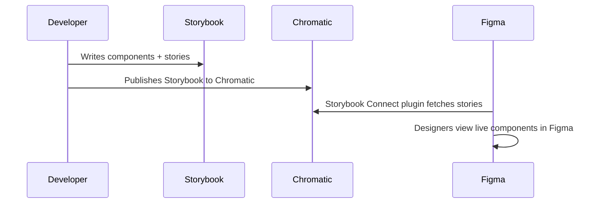
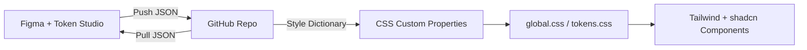
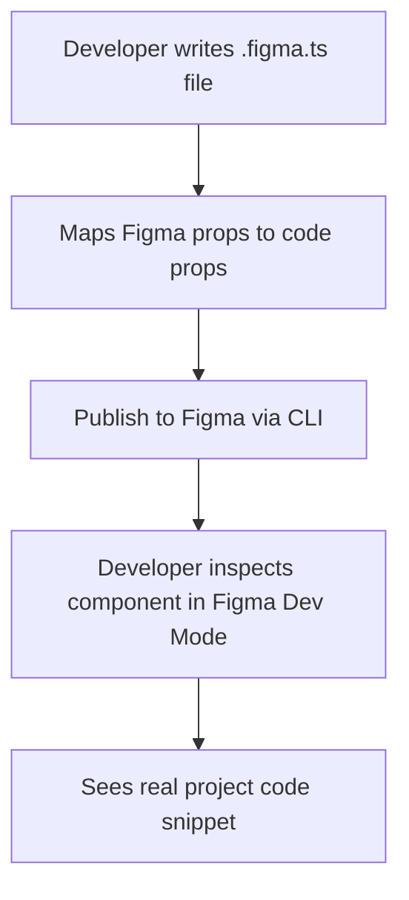
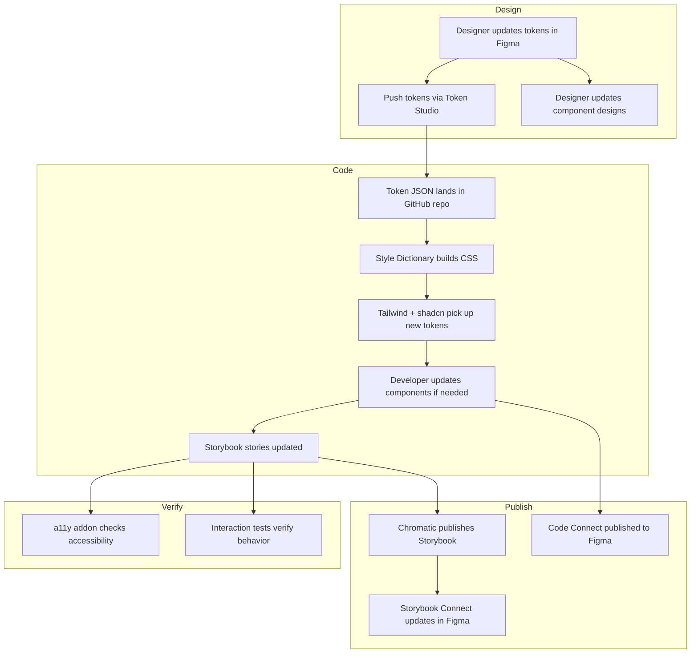

# Storybook + Figma Integration Guide

This guide walks you through connecting your Storybook component library to Figma so that designers and developers stay in sync. It covers everything from embedding live components in Figma to automating design token handoffs.

## Table of Contents

- [Before You Start](#before-you-start)
- [1. Storybook Connect — Embed Stories in Figma](#1-storybook-connect--embed-stories-in-figma)
- [2. Design Tokens Sync — Token Studio](#2-design-tokens-sync--token-studio)
- [3. Accessibility Addon — Catch Issues Early](#3-accessibility-addon--catch-issues-early)
- [4. Interaction Testing — Test User Behavior in Stories](#4-interaction-testing--test-user-behavior-in-stories)
- [5. Figma Dev Mode + Code Connect](#5-figma-dev-mode--code-connect)
- [6. Keeping Design and Code in Sync](#6-keeping-design-and-code-in-sync)
- [Troubleshooting](#troubleshooting)
- [Glossary](#glossary)

---

## Before You Start

This guide assumes Storybook is already running in this project. Verify by running:

```bash
npm run storybook
```

This launches Storybook at `http://localhost:6006`. If that works, you're ready.

### What You Need

- A [Figma](https://www.figma.com/) account (free tier works for most features)
- A [Chromatic](https://www.chromatic.com/) account (free tier includes Storybook publishing)
- Node.js and npm (already set up if you can run the project)

### How This Project Is Set Up

Here's a quick map so you know where things live:

```text
astro-shadcn-sanity/
├── astro-app/
│   ├── .storybook/          # Storybook config
│   │   ├── main.ts          # Addons, framework, Vite plugins
│   │   └── preview.ts       # Global story parameters
│   ├── src/
│   │   ├── components/       # Your components + *.stories.ts files
│   │   └── styles/
│   │       └── global.css    # Tailwind v4 theme + shadcn tokens
│   └── package.json
└── studio/                   # Sanity Studio (not relevant here)
```

Key details:
- **Framework:** Storybook v10 with `storybook-astro` adapter
- **Styling:** Tailwind CSS v4 with CSS-first configuration (no `tailwind.config.js`)
- **UI Library:** shadcn/ui components using CSS custom properties for theming
- **Design tokens:** Defined as CSS custom properties in `global.css`

---

## 1. Storybook Connect — Embed Stories in Figma

**What it does:** Storybook Connect is a Figma plugin that embeds your live, interactive Storybook stories directly inside Figma. Designers can view the real rendered component right next to their designs — no screenshots, no guessing.

### How It Works



### Step 1: Publish Your Storybook to Chromatic

Chromatic hosts your Storybook so Figma can access it. Install the Chromatic CLI:

```bash
cd astro-app && npm install --save-dev chromatic
```

Sign up at [chromatic.com](https://www.chromatic.com/) and create a project. You get a **project token**. Then publish:

```bash
cd astro-app
npx chromatic --project-token=<your-project-token>
```

After the first publish, you get a unique URL like `https://<hash>--<project-name>.chromatic.com`. This is your published Storybook.

**Tip:** Add Chromatic to your CI pipeline so it publishes automatically on every push. Add this to your root `package.json` scripts:

```json
{
  "scripts": {
    "chromatic": "cd astro-app && npx chromatic --project-token=$CHROMATIC_PROJECT_TOKEN"
  }
}
```

### Step 2: Install the Figma Plugin

1. Open Figma
2. Go to **Plugins > Browse plugins** in the toolbar
3. Search for **Storybook Connect**
4. Click **Install**

Alternatively, open the command palette (`Cmd + /` on Mac, `Ctrl + /` on Windows) and type `Storybook Connect`.

### Step 3: Link Stories to Figma Components

1. In your published Storybook on Chromatic, navigate to the story you want to link
2. Copy the story URL from the browser address bar
3. In Figma, select the component you want to link
4. Open the Storybook Connect plugin
5. Paste the story URL
6. The story is now linked

The plugin automatically updates your linked stories whenever you publish a new Storybook version to Chromatic.

### Step 4: View Stories in Figma

Once linked, you can view stories in two ways:

- Click the link in the Figma **sidebar** for the selected component
- Open the Storybook Connect plugin via the command palette

Designers see a live, interactive preview — they can interact with controls, resize the viewport, and verify that the coded component matches their design.

---

## 2. Design Tokens Sync — Token Studio

**What it does:** Tokens Studio (formerly Figma Tokens) is a Figma plugin that lets designers define and manage design tokens (colors, spacing, typography, etc.) in Figma, then sync them to your code repository. This creates a single source of truth for design decisions.

### Why This Matters for This Project

Your project already uses CSS custom properties as design tokens in `astro-app/src/styles/global.css`. The project has **two layers of tokens**:

**Layer 1 — Tailwind v4 `@theme` tokens** (brand colors, fonts):

```css
@theme {
  --color-swiss-red: #E30613;
  --font-sans: 'Helvetica Neue', Helvetica, Arial, sans-serif;
  /* ... more brand tokens */
}
```

**Layer 2 — shadcn CSS variables** (semantic tokens used by components):

```css
:root {
  --primary: #e30613;
  --background: #ffffff;
  --foreground: #0a0a0a;
  /* ... more semantic tokens */
}
```

When syncing from Token Studio, map your tokens to the **shadcn variables** in the `:root` block. These are what the UI components actually consume. The Tailwind `@theme` tokens define the raw brand palette.

Token Studio bridges the gap: designers update tokens in Figma, those changes sync to your repo as JSON, and a build step transforms them into the CSS custom properties your code already consumes.

### How It Works



### Step 1: Install Token Studio in Figma

1. In Figma, go to **Plugins > Browse plugins**
2. Search for **Tokens Studio for Figma**
3. Click **Install**
4. Open the plugin from the plugins menu

### Step 2: Set Up Your Token Structure

When you open Token Studio for the first time, it asks you to define token sets. Organize tokens to match your existing CSS structure:

| Token Set | Maps To | Examples |
|-----------|---------|----------|
| `global` | Base values | `swiss-red: #E30613`, `font-sans: Helvetica Neue` |
| `light` | Light theme | `background: #ffffff`, `foreground: #0a0a0a` |
| `dark` | Dark theme | `background: #0a0a0a`, `foreground: #f7f7f7` |
| `spacing` | Layout | `base: 8px`, `lg: 16px` |

### Step 3: Connect to GitHub

Token Studio supports two-way sync with GitHub (and GitLab, Bitbucket, Azure DevOps). To set up GitHub sync:

1. In the Token Studio plugin, click the **Settings** gear icon
2. Select **GitHub** as your sync provider
3. Fill in the configuration:
   - **Repository:** `your-username/astro-shadcn-sanity`
   - **Branch:** `main` (or a dedicated `design-tokens` branch)
   - **Token storage path:** `astro-app/tokens/` (creates a folder for token JSON files)
   - **Personal Access Token:** Generate one at GitHub > Settings > Developer Settings > Personal access tokens (needs `repo` scope)
4. Click **Save**

### Step 4: Push and Pull Tokens

- **Push (Designer to Code):** After updating tokens in Figma, click the **Push** button in Token Studio. This commits the token JSON files to your GitHub repo.
- **Pull (Code to Designer):** If a developer updates token JSON files in the repo, the plugin shows a **Pull** indicator. Click it to sync changes back into Figma.

### Step 5: Transform Tokens into CSS

Install Style Dictionary and the Token Studio transforms:

```bash
cd astro-app
npm install --save-dev style-dictionary @tokens-studio/sd-transforms
```

Create a configuration file at `astro-app/style-dictionary.config.js`:

```javascript
import StyleDictionary from 'style-dictionary';
import { registerTransforms } from '@tokens-studio/sd-transforms';

registerTransforms(StyleDictionary, {
  expand: {
    composition: true,
    typography: true,
    border: true,
    shadow: true,
  },
  excludeParentKeys: true,
});

export default {
  source: ['tokens/**/*.json'],
  preprocessors: ['tokens-studio'],
  platforms: {
    css: {
      transformGroup: 'tokens-studio',
      buildPath: 'src/styles/',
      files: [
        {
          destination: 'tokens.css',
          format: 'css/variables',
        },
      ],
    },
  },
};
```

Build the tokens:

```bash
npx style-dictionary build --config style-dictionary.config.js
```

This generates `astro-app/src/styles/tokens.css` with CSS custom properties. Import it in your `global.css`:

```css
@import "./tokens.css";
@import "tailwindcss";
/* ... rest of your styles */
```

**Tip:** Add a build script to your `package.json`:

```json
{
  "scripts": {
    "tokens:build": "style-dictionary build --config style-dictionary.config.js"
  }
}
```

---

## 3. Accessibility Addon — Catch Issues Early

**What it does:** The `@storybook/addon-a11y` addon runs [axe-core](https://github.com/dequelabs/axe-core) accessibility audits on every story. It checks for WCAG violations like missing alt text, poor color contrast, missing form labels, and more — right inside Storybook.

### Why You Should Care

Accessibility isn't optional. Screen readers, keyboard navigation, and color contrast affect real users. Catching issues while you build components is far easier than fixing them after launch.

### Step 1: Install the Addon

```bash
cd astro-app
npx storybook add @storybook/addon-a11y
```

This installs the package and adds `@storybook/addon-a11y` to the `addons` array in `.storybook/main.ts`.

After running the command, verify that `.storybook/main.ts` now includes it in the addons array:

```typescript
addons: ['@storybook/addon-docs', '@storybook/addon-a11y'],
```

### Step 2: View the Accessibility Panel

1. Run Storybook: `npm run storybook`
2. Navigate to any story
3. Look for the **Accessibility** tab in the addons panel (below the story preview)

You see three categories:

- **Violations** — Issues that fail WCAG rules (fix these)
- **Passes** — Checks that passed
- **Incomplete** — Items that need manual review

Each violation includes:
- What the rule checks
- Which HTML element failed
- A link to learn more about the fix

### Step 3: Configure Globally (Optional)

Add the `a11y` parameter to your existing preview configuration in `.storybook/preview.ts`:

```typescript
import '../src/styles/global.css'

const preview = {
  parameters: {
    layout: 'padded',
    backgrounds: {
      options: {
        light: { name: 'Light', value: '#ffffff' },
        dark: { name: 'Dark', value: '#1a1a2e' },
      },
    },
    a11y: {
      // Fail tests on violations (instead of just warning)
      test: 'error',
      config: {
        rules: [
          // Disable a specific rule if needed (use sparingly!)
          // { id: 'color-contrast', enabled: false },
        ],
      },
    },
  },
}
export default preview
```

### Step 4: Override Per-Story (When Needed)

Sometimes a specific story has a known accessibility exception. Override the config for just that story:

```typescript
export const Decorative: Story = {
  parameters: {
    a11y: {
      // This story intentionally has no alt text (decorative image)
      test: 'todo',
    },
  },
}
```

Use `'todo'` sparingly — it means "I know about this, and I'll fix it later." It still runs the checks but shows warnings instead of failures.

---

## 4. Interaction Testing — Test User Behavior in Stories

**What it does:** Storybook's interaction testing lets you simulate user actions (clicking, typing, hovering) and make assertions *inside your stories*. Think of it as unit tests that run in the browser, visible in Storybook's UI.

### Step 1: Install the Addon

```bash
cd astro-app
npx storybook add @storybook/addon-interactions
```

This installs `@storybook/addon-interactions` and adds it to your `.storybook/main.ts`.

You also need the testing utilities:

```bash
cd astro-app
npm install --save-dev @storybook/test
```

### Step 2: Write a Play Function

A **play function** is a function attached to a story that runs after the component renders. It simulates user interactions and checks the result.

Here's an example for a contact form component:

**Note:** The examples below use typed imports (`Meta`, `StoryObj`) for clarity. Existing stories in this project use a simpler pattern without explicit type annotations — both approaches work.

```typescript
import type { Meta, StoryObj } from 'storybook-astro'
import { userEvent, within, expect, fn, waitFor } from '@storybook/test'

const meta: Meta = {
  component: 'contact-form',
  args: {
    onSubmit: fn(),
  },
}
export default meta
type Story = StoryObj

export const Default: Story = {}

export const FilledAndSubmitted: Story = {
  play: async ({ canvasElement }) => {
    const canvas = within(canvasElement)

    // Type into form fields
    await userEvent.type(canvas.getByLabelText('Name'), 'Jay')
    await userEvent.type(canvas.getByLabelText('Email'), 'jay@example.com')
    await userEvent.type(canvas.getByLabelText('Message'), 'Hello there!')

    // Click submit
    await userEvent.click(canvas.getByRole('button', { name: /send/i }))

    // Assert the success message appears
    await expect(canvas.getByText('Message sent')).toBeInTheDocument()
  },
}
```

### Step 3: Use Steps for Clarity

Break complex interactions into named steps:

```typescript
export const MultiStepForm: Story = {
  play: async ({ canvasElement, step }) => {
    const canvas = within(canvasElement)

    await step('Fill in personal info', async () => {
      await userEvent.type(canvas.getByLabelText('Name'), 'Jay')
      await userEvent.type(canvas.getByLabelText('Email'), 'jay@example.com')
    })

    await step('Write message and submit', async () => {
      await userEvent.type(canvas.getByLabelText('Message'), 'Hello!')
      await userEvent.click(canvas.getByRole('button', { name: /send/i }))
    })

    await step('Verify success', async () => {
      await expect(canvas.getByText('Message sent')).toBeInTheDocument()
    })
  },
}
```

Steps appear as collapsible groups in the **Interactions** panel in Storybook, making it easy to see what each phase does.

### Step 4: View and Debug Interactions

1. Run Storybook and navigate to a story with a play function
2. The **Interactions** tab in the addons panel shows each step
3. You can **replay** interactions step-by-step
4. Failed assertions highlight in red with a clear error message

### Key Testing Utilities

| Utility | What It Does |
|---------|-------------|
| `within(element)` | Scopes queries to a specific DOM element |
| `userEvent.type()` | Simulates keyboard typing |
| `userEvent.click()` | Simulates a mouse click |
| `userEvent.hover()` | Simulates mouse hover |
| `expect()` | Makes assertions (same API as Vitest/Jest) |
| `fn()` | Creates a spy function to verify it was called |
| `waitFor()` | Waits for an async condition to be true |

---

## 5. Figma Dev Mode + Code Connect

**What it does:** Figma Dev Mode is a view in Figma built for developers. It shows CSS properties, spacing, and assets for any selected element. **Code Connect** takes this further — it links your actual code components to Figma components, so when a developer inspects a Figma element, they see the real code snippet (not generic CSS).

### How Code Connect Works



### Step 1: Install Code Connect

```bash
cd astro-app
npm install --save-dev @figma/code-connect
```

### Step 2: Get a Figma Access Token

1. In Figma, click your profile icon (top-left)
2. Go to **Settings**
3. Scroll to **Personal access tokens**
4. Create a new token with **Read and Write** access to files
5. Copy the token

Store it as an environment variable:

```bash
export FIGMA_ACCESS_TOKEN=figd_your_token_here
```

**Tip:** Add `FIGMA_ACCESS_TOKEN` to your `.env` file (and make sure `.env` is in `.gitignore`).

### Step 3: Create a Configuration File

Create `astro-app/figma.config.json`:

```json
{
  "codeConnect": {
    "parser": "html",
    "include": [
      "src/components/**/*.figma.ts"
    ],
    "exclude": [
      "**/*.test.*",
      "**/*.stories.*"
    ],
    "label": "Astro"
  }
}
```

Astro does not have a dedicated Code Connect parser. The `html` parser is the closest match since Astro components produce HTML output. It works well for mapping props and generating code snippets, though some Astro-specific syntax (like `Astro.props`) won't be fully represented.

### Step 4: Run the Interactive Setup Wizard

Code Connect has a wizard that scans your components and matches them to Figma designs using AI:

```bash
cd astro-app
npx figma connect
```

The wizard:
1. Asks for your Figma access token
2. Scans your component files
3. Asks you to select your Figma file
4. Uses AI to match code components to Figma components
5. Generates `.figma.ts` files for each match
6. Offers to publish immediately

### Step 5: Write a Code Connect File Manually

If you prefer manual control, or the wizard misses a component, create a `.figma.ts` file alongside your component.

For example, if you have a Button component:

```typescript
// src/components/ui/Button.figma.ts
import figma, { html } from '@figma/code-connect/html'

figma.connect('https://www.figma.com/file/YOUR_FILE_ID?node-id=123:456', {
  props: {
    variant: figma.enum('Variant', {
      'Primary': 'default',
      'Secondary': 'secondary',
      'Outline': 'outline',
      'Ghost': 'ghost',
    }),
    size: figma.enum('Size', {
      'Small': 'sm',
      'Medium': 'md',
      'Large': 'lg',
    }),
    label: figma.string('Label'),
    disabled: figma.boolean('Disabled'),
  },
  example: (props) => html`
    <Button
      variant="${props.variant}"
      size="${props.size}"
      ?disabled=${props.disabled}
    >
      ${props.label}
    </Button>
  `,
  imports: ['import Button from "@/components/ui/Button.astro"'],
})
```

**Where to get the Figma URL:** In Figma, right-click the component and select **Copy link**. That URL contains the `file` and `node-id` you need.

### Step 6: Publish to Figma

```bash
cd astro-app
npx figma connect publish --token $FIGMA_ACCESS_TOKEN
```

You see output like:

```text
✓ Parsing Code Connect files...
✓ Found 5 Code Connect files
✓ Validating...
✓ Publishing to Figma...
✓ Successfully published 5 components
```

### Step 7: View in Figma Dev Mode

1. In Figma, switch to **Dev Mode** (toggle in the top-right toolbar)
2. Select a component that you connected
3. In the right panel, look for the **Code** section
4. You see the actual code snippet from your project — not generic CSS

This means developers can copy-paste real component usage directly from Figma.

---

## 6. Keeping Design and Code in Sync

All these tools work best as part of a consistent workflow. Here's how to put them together.

### The Sync Workflow

The workflow follows four phases: designers update tokens and designs in Figma, those changes flow to the codebase where they are built and applied, Storybook and Code Connect publish the results back to Figma, and accessibility and interaction tests verify quality throughout.



### Checklist: What to Do When

**When a designer changes a color/token:**
- [ ] Designer pushes tokens from Token Studio
- [ ] Developer pulls the token JSON and runs `npm run tokens:build`
- [ ] Verify components still look correct in Storybook
- [ ] Check the a11y panel for new contrast issues
- [ ] Publish Storybook to Chromatic

**When a developer builds a new component:**
- [ ] Write the component
- [ ] Write Storybook stories with interaction tests
- [ ] Create a `.figma.ts` Code Connect file
- [ ] Run `npx figma connect publish` to publish to Figma
- [ ] Publish Storybook to Chromatic so Storybook Connect stays current

**When a designer adds a new component in Figma:**
- [ ] Developer inspects the design in Figma Dev Mode
- [ ] Build the component in code
- [ ] Create stories and Code Connect files
- [ ] Publish both Storybook (Chromatic) and Code Connect (Figma)

### Automating with CI/CD

Add these steps to your CI pipeline (e.g., GitHub Actions) so publishing happens automatically:

```yaml
# .github/workflows/storybook.yml
name: Storybook CI

on:
  push:
    branches: [main]
  pull_request:
    branches: [main]

jobs:
  publish:
    runs-on: ubuntu-latest
    steps:
      - uses: actions/checkout@v4
        with:
          fetch-depth: 0

      - uses: actions/setup-node@v4
        with:
          node-version: 20

      - run: npm ci

      # Build design tokens
      - name: Build tokens
        run: cd astro-app && npm run tokens:build

      # Publish Storybook to Chromatic
      - name: Publish Storybook
        run: cd astro-app && npx chromatic --project-token=${{ secrets.CHROMATIC_PROJECT_TOKEN }}

      # Publish Code Connect to Figma
      - name: Publish Code Connect
        run: cd astro-app && npx figma connect publish --token ${{ secrets.FIGMA_ACCESS_TOKEN }}
```

Store `CHROMATIC_PROJECT_TOKEN` and `FIGMA_ACCESS_TOKEN` in your GitHub repository's **Settings > Secrets and variables > Actions**.

---

## Troubleshooting

### Storybook Connect shows "No stories found"

- Make sure your Storybook is published to Chromatic (not just running locally)
- Verify you pasted the correct story URL from the published Storybook
- Check that you're authenticated in the Figma plugin

### Token Studio push/pull fails

- Verify your GitHub Personal Access Token has `repo` scope
- Check that the repository name and branch are correct in plugin settings
- Ensure the token storage path exists (the plugin creates it on first push)

### a11y addon panel doesn't appear

- Confirm `@storybook/addon-a11y` is in the `addons` array in `.storybook/main.ts`
- Restart Storybook after adding the addon (`Ctrl+C` then `npm run storybook`)

### Interaction tests fail silently

- Make sure `@storybook/addon-interactions` is in the `addons` array
- Verify `@storybook/test` is installed as a dev dependency
- Check the **Interactions** tab (not the Console) for error details

### Code Connect publish fails

- Verify your `FIGMA_ACCESS_TOKEN` is valid and has write access
- Check that `.figma.ts` files match the `include` pattern in `figma.config.json`
- Run with `--dry-run` first to validate without publishing:
  ```bash
  npx figma connect publish --token $FIGMA_ACCESS_TOKEN --dry-run
  ```

### Style Dictionary build fails

- Verify token JSON files exist in the `tokens/` directory
- Check that `@tokens-studio/sd-transforms` is installed
- Run with verbose output to see detailed errors:
  ```bash
  npx style-dictionary build --config style-dictionary.config.js --verbose
  ```

---

## Glossary

| Term | Definition |
|------|-----------|
| **Addon** | A Storybook plugin that adds functionality (accessibility checks, interaction testing, etc.) |
| **axe-core** | An open-source accessibility testing engine that checks HTML against WCAG rules |
| **Chromatic** | A cloud service by the Storybook team that hosts published Storybooks and provides visual regression testing |
| **Code Connect** | A Figma tool that links real code components to Figma designs, showing actual code in Dev Mode |
| **CSS Custom Properties** | CSS variables (e.g., `--primary: #e30613`) that store reusable values |
| **Design Tokens** | Named values (colors, spacing, fonts) that represent design decisions. The single source of truth for your design system |
| **Dev Mode** | A Figma view designed for developers, showing CSS, spacing, and code snippets for selected elements |
| **Play Function** | A function in a Storybook story that simulates user interactions and runs assertions |
| **Story** | A single rendered state of a component in Storybook (e.g., Button in its primary, disabled, and loading states) |
| **Storybook Connect** | A Figma plugin that embeds live Storybook stories inside Figma |
| **Style Dictionary** | A build tool that transforms design token JSON files into platform-specific formats (CSS, JS, iOS, Android) |
| **Token Studio** | A Figma plugin (formerly Figma Tokens) for managing design tokens with two-way Git sync |
| **WCAG** | Web Content Accessibility Guidelines — the international standard for web accessibility |
