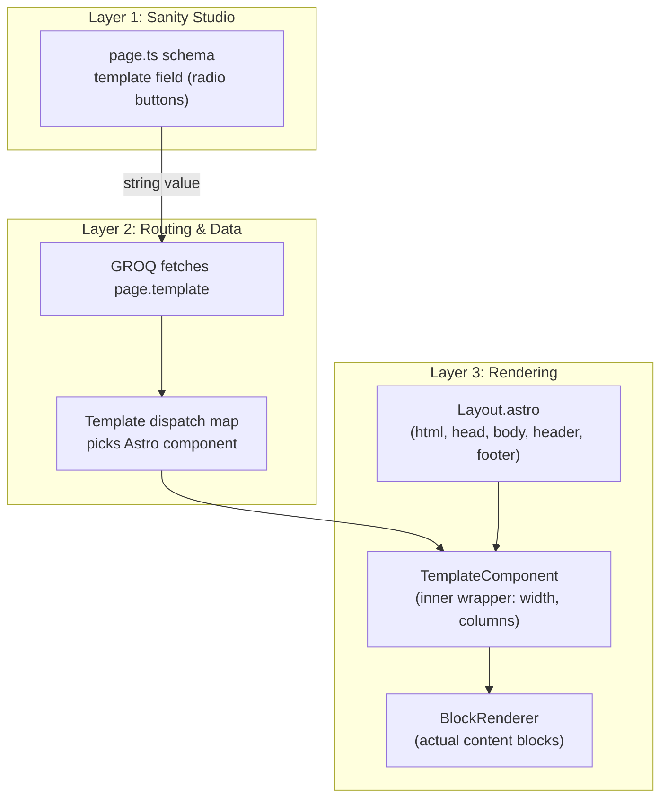
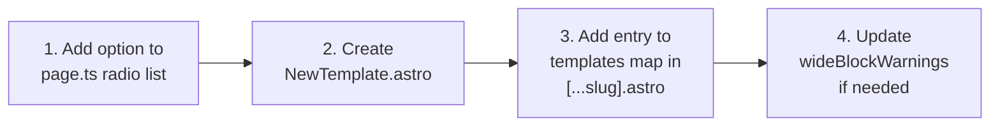

# Template Layout System

## Overview

The template system controls page structure through a single string field in Sanity Studio. An editor picks a template name, and that choice cascades through GROQ, into Astro routing, and ultimately determines which HTML wrapper renders around the page's content blocks.f

The system has three layers that nest like Russian dolls:



## Layer 1 — Sanity Schema

**File:** `studio/src/schemaTypes/documents/page.ts`

The `template` field is a radio selector on the `page` document. It stores a plain string — no CSS, no layout logic, purely a semantic name.

| Value | Description | Use case |
|---|---|---|
| `default` | Centered max-width container | General pages, about, contact |
| `fullWidth` | Edge-to-edge, no width constraint | Image-heavy showcases, portfolios |
| `landing` | Full-width + hides header/footer | Marketing campaigns, event pages |
| `sidebar` | 2/3 main content + 1/3 aside | Blog-style, documentation, listings |
| `twoColumn` | Equal two-column grid | Comparison pages, dual-content |

The schema also includes **advisory validation**. If you drop a wide block (like `heroBanner`) into a constrained template (like `sidebar`), you see a warning — not an error. The `wideBlockWarnings` map and `validateBlockTemplateCompatibility` function handle this logic.

## Layer 2 — Routing Glue

**File:** `astro-app/src/pages/[...slug].astro`

The catch-all route performs three jobs:

1. **Fetches data** via `pageBySlugQuery` from `astro-app/src/lib/sanity.ts`, which includes `template` in the GROQ projection
2. **Maps the string to a component** using a plain object lookup:

```typescript
const templates = {
  default: DefaultTemplate,
  fullWidth: FullWidthTemplate,
  landing: LandingTemplate,
  sidebar: SidebarTemplate,
  twoColumn: TwoColumnTemplate,
};
const TemplateComponent = templates[page.template] ?? DefaultTemplate;
```

3. **Nests three layers** in the rendered output:

```astro
<Layout title={page.title} hideNav={page.template === 'landing'}>
  <TemplateComponent>
    <BlockRenderer blocks={page.blocks ?? []} />
  </TemplateComponent>
</Layout>
```

If a page has no `template` value (e.g., older pages created before this feature), the `?? DefaultTemplate` fallback ensures it still renders correctly.

## Layer 3 — Template Components

**Directory:** `astro-app/src/layouts/templates/`

Each template is intentionally minimal — a `<div>` wrapper with Tailwind classes around a `<slot />`.

| Template | Key CSS | Effect |
|---|---|---|
| **DefaultTemplate** | `mx-auto max-w-7xl px-4 sm:px-6 lg:px-8` | Centered, capped at ~1280px, padded sides |
| **FullWidthTemplate** | `w-full` | Edge-to-edge, blocks control their own width |
| **LandingTemplate** | `w-full` + `data-template="landing"` | Same as FullWidth visually; header/footer hidden by Layout |
| **SidebarTemplate** | `grid grid-cols-3 gap-8` | Blocks in 2/3 main column; empty `<aside>` for future widgets |
| **TwoColumnTemplate** | `grid grid-cols-2 gap-8` | Blocks become grid items, alternating into two equal columns |

## How Layout.astro Fits In

**File:** `astro-app/src/layouts/Layout.astro`

`Layout.astro` is the **outermost shell** — it owns `<html>`, `<head>`, `<body>`, and conditionally renders the site-wide Header and Footer:

```astro
<body>
  {!hideNav && <Header />}
  <main>
    <slot />              <!-- TemplateComponent goes here -->
  </main>
  {!hideNav && <Footer />}
</body>
```

The `hideNav` prop is the **only coupling** between templates and Layout. The `landing` template passes `hideNav={true}` from `[...slug].astro` to suppress navigation for conversion-focused pages. Everything else about layout choice is handled by the template component inside `<main>`.

## How to Modify

### Change an existing template's styling

Edit the file in `astro-app/src/layouts/templates/`. For example, to make the Default template narrower, change `max-w-7xl` to `max-w-5xl` in `DefaultTemplate.astro`.

### Add a new template



Four steps, four files:

1. **`studio/src/schemaTypes/documents/page.ts`** — Add a new entry to the `options.list` array on the `template` field:

```typescript
{ title: 'Hero', value: 'hero' },
```

2. **`astro-app/src/layouts/templates/HeroTemplate.astro`** — Create the file with your desired HTML/Tailwind structure wrapping a `<slot />`:

```astro
---
/**
 * Hero template — sticky hero section with scrolling content below.
 */
---

<div class="relative">
  <slot />
</div>
```

3. **`astro-app/src/pages/[...slug].astro`** — Import the component and add it to the `templates` map:

```typescript
import HeroTemplate from '@/layouts/templates/HeroTemplate.astro';

const templates = {
  // ...existing entries
  hero: HeroTemplate,
};
```

4. **`studio/src/schemaTypes/documents/page.ts`** (optional) — Add entries to `wideBlockWarnings` if certain blocks render poorly in your new template.

No routing changes, no GROQ changes, and no Layout.astro changes are needed — unless your new template needs to hide navigation like Landing does.

### Populate the Sidebar template's aside

The `SidebarTemplate` already has a named `<slot name="sidebar" />`. Currently nothing fills it. Pass sidebar content from `[...slug].astro`:

```astro
<SidebarTemplate>
  <BlockRenderer blocks={page.blocks ?? []} />
  <SidebarWidgets slot="sidebar" />
</SidebarTemplate>
```

## File Map

```
studio/src/schemaTypes/documents/
  page.ts                         -- template field, validation, insert menu groups

astro-app/src/
  layouts/
    Layout.astro                  -- outer shell: html/head/body, hideNav prop
    templates/
      DefaultTemplate.astro       -- centered max-width container
      FullWidthTemplate.astro     -- edge-to-edge
      LandingTemplate.astro       -- full-width, no nav
      SidebarTemplate.astro       -- 2/3 + 1/3 grid
      TwoColumnTemplate.astro     -- equal two-column grid
  pages/
    [...slug].astro               -- catch-all route, template dispatch
  lib/
    sanity.ts                     -- GROQ queries (pageBySlugQuery includes template)
```
