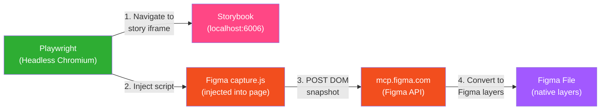
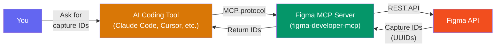
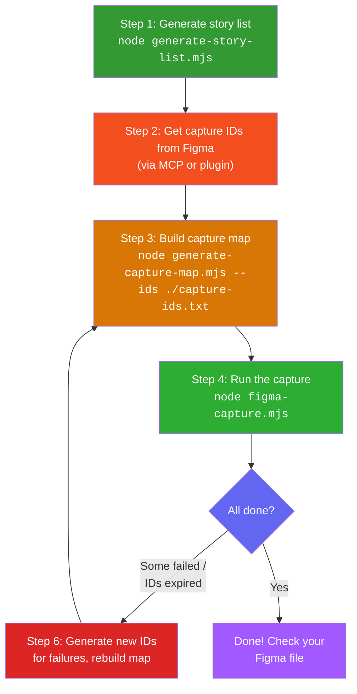
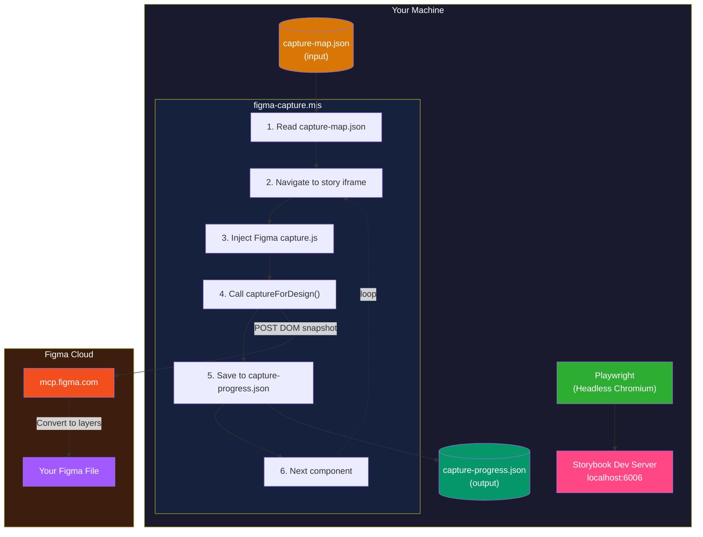

# Figma Storybook Capture


**Sync your entire Storybook component library to Figma for free.**

## The problem

Design systems live in two places: **code** (Storybook) and **design** (Figma). Keeping them in sync is painful. The commercial tools that bridge this gap — Anima, Storybook Connect, UXPin Merge — charge **$100-150+/month** for team plans, and most still require manual setup per component.

If you have 150 components, you're looking at hours of tedious manual screenshotting, or paying for software that does roughly the same thing behind a paywall.

## The solution

This toolkit captures every component from a running Storybook instance and pushes it into a Figma file as native design layers — automatically, in batch, for **$0/month**.

It uses two things you already have:
- **Playwright** (free, open-source) to render each component in a headless browser
- **Figma's own HTML-to-Design API** (free, built into Figma) to convert the rendered DOM into Figma layers

No third-party SaaS. No browser extensions. No manual work per component. One script captures your entire library.

### What you get

- Every Storybook component as a **native Figma page** with real layers (not screenshots)
- Text remains editable, colors stay as fills, layout structure is preserved
- A **resumable** process — if it crashes at component 47, re-run and it picks up at 48
- Works with **any Storybook project** regardless of framework (React, Vue, Astro, Angular, etc.)

### What it costs

| | This toolkit | Anima | Storybook Connect | UXPin Merge |
|---|---|---|---|---|
| **Price** | Free | $39-150/mo | $49+/mo | $99+/mo |
| **Batch capture** | All at once | Per-component | Per-component | Per-component |
| **Requires** | Playwright + Figma | Plugin + account | Plugin + account | Platform migration |
| **Framework lock-in** | None | React-focused | React-focused | React only |

## How it works



1. A headless Chromium browser (Playwright) navigates to each story's iframe URL.
2. Figma's HTML-to-Design capture script is injected into the page.
3. The capture script reads the rendered DOM and POSTs it to Figma's servers.
4. Figma converts the DOM snapshot into a new page in your target file.

Each component becomes its own page in Figma with native layers — not a flat image.

## Files in this directory

| File | Purpose |
|------|---------|
| `figma-capture.mjs` | Main script — captures Storybook components to Figma |
| `generate-story-list.mjs` | Extracts all story IDs from a running Storybook |
| `generate-capture-map.mjs` | Pairs stories with Figma capture IDs into a map file |
| `component-stories.json` | Reference: all 153 components in this project's Storybook |
| `capture-map.example.json` | Example showing the capture map format |
| `README.md` | This file |

These files are generated at runtime (not checked in):

| File | Purpose |
|------|---------|
| `capture-map.json` | Components paired with Figma capture IDs (input for the capture script) |
| `capture-progress.json` | Tracks which components have been captured (enables resume) |
| `capture-ids.txt` | Text file of Figma capture IDs you've collected |

## Prerequisites

Before you start, you need four things:

### 1. Node.js and Playwright

The capture script runs in a headless Chromium browser via [Playwright](https://playwright.dev/).

```bash
# From the project root — Playwright is already a dev dependency
npm install

# If Playwright browsers aren't installed yet:
npx playwright install chromium
```

### 2. Storybook running locally

The script needs Storybook serving components on a local URL (default: `http://localhost:6006`).

```bash
# Option A: Docker (recommended — matches CI)
docker compose --profile storybook up storybook -d

# Option B: Direct
npm run storybook
```

Verify it's running:
```bash
curl -s -o /dev/null -w "%{http_code}" http://localhost:6006
# Should print: 200
```

### 3. Figma MCP server

The Figma MCP (Model Context Protocol) server is how AI coding tools generate capture IDs from Figma. You need this connected to your AI coding tool before you can generate capture IDs in batch.

**What is MCP?** It's a standard protocol that lets AI coding assistants (Claude Code, Cursor, Windsurf, etc.) talk to external services. The Figma MCP server gives your AI tool the ability to create Figma files, generate capture IDs, and read design data.



**Setup with Claude Code:**

1. Install the Figma MCP server in your Claude Code configuration. Add this to your `.mcp.json` (project root or `~/.claude/.mcp.json`):

```json
{
  "mcpServers": {
    "figma": {
      "command": "npx",
      "args": ["-y", "figma-developer-mcp", "--stdio"]
    }
  }
}
```

2. Authenticate with Figma. The first time the MCP server runs, it will prompt you to log in to your Figma account via the browser. This grants the MCP server permission to create and modify files in your Figma workspace.

3. Verify the connection. In Claude Code, ask: *"Can you connect to Figma?"* — it should be able to call `mcp__figma__whoami` and return your Figma user info.

**Setup with Cursor / Windsurf / other MCP-compatible editors:**

The process is similar — add the Figma MCP server to your editor's MCP configuration. Consult your editor's docs for the exact config file location. The `npx figma-developer-mcp --stdio` command is the same across all editors.

**Alternative: HTML-to-Design Figma plugin**

If you don't use an AI coding tool, you can get capture IDs manually through Figma's [HTML-to-Design plugin](https://www.figma.com/community/plugin/1159123024924461424). Open it in Figma, and it will generate a capture ID you can copy. This works but is impractical for batch work (one ID at a time, manual copy-paste).

### 4. A Figma file to capture into

Create a new Figma file (or use an existing one) where the captured components will land. Each captured component becomes a new **page** in this file.

**Get the file key** from the URL:
```
https://www.figma.com/design/5SmFEQZkbuFRDmqcRPcHRt/My-Component-Library
                               ^^^^^^^^^^^^^^^^^^^^^^^^
                               This is your file key
```

You'll need this file key when generating capture IDs.

## Step-by-step guide

Here's the full workflow at a glance:



### Step 1: Generate the story list

With Storybook running, extract all components:

```bash
cd scripts/figma-capture
node generate-story-list.mjs
```

This creates `component-stories.json` — an array like:
```json
[
  { "title": "UI/Button", "storyId": "ui-button--default" },
  { "title": "UI/Badge", "storyId": "ui-badge--default" }
]
```

Options:
```bash
# Custom Storybook URL
node generate-story-list.mjs --storybook http://localhost:9009

# Include ALL stories (not just one per component)
node generate-story-list.mjs --all

# Custom output path
node generate-story-list.mjs --output ./my-stories.json
```

### Step 2: Get capture IDs from Figma

Each component needs a single-use **capture ID** from Figma (see Prerequisite 3 for MCP setup). The Figma MCP tool generates one ID per call:

```
mcp__figma__generate_figma_design(outputMode: "existingFile", fileKey: "<your-file-key>")
```

Each call returns a UUID like `373af67f-7c0a-45a6-bbb3-bc6026474157`.

**How to collect them:**

Using Claude Code (or another MCP-connected tool), ask it to generate multiple capture IDs. It can run up to 5-7 in parallel. Collect them into a text file:

```bash
# capture-ids.txt — one ID per line
373af67f-7c0a-45a6-bbb3-bc6026474157
44872fb6-5343-4f42-8c18-c9bed456b5ef
9fe0c2fa-ed70-4160-a955-d306c080f0aa
```

**Important limitations:**
- Each ID is **single-use** — once used (or expired), it can't be reused.
- IDs **expire after ~1 hour** — don't generate them too far ahead of time.
- Figma MCP has **rate limits** — you may hit limits after ~50-60 IDs in a session.

**How many do you need?** One per uncaptured component. Check `component-stories.json` for the count. If you've already captured some (there's a `capture-progress.json`), you only need IDs for the remaining ones.

### Step 3: Build the capture map

The capture map pairs each component with its capture ID:

```bash
node generate-capture-map.mjs --ids ./capture-ids.txt
```

This reads `component-stories.json` and your IDs file, skips any already-captured components (from `capture-progress.json`), and writes `capture-map.json`.

Options:
```bash
# Custom file paths
node generate-capture-map.mjs \
  --ids ./my-ids.txt \
  --stories ./my-stories.json \
  --progress ./my-progress.json \
  --output ./my-map.json
```

### Step 4: Run the capture

```bash
node figma-capture.mjs
```

This will:
1. Launch a headless Chromium browser.
2. Navigate to each story's Storybook iframe.
3. Inject Figma's capture script and submit the DOM.
4. Save progress after each component.

**Expected timing:** ~60 seconds per component (due to the timeout workaround — see Known Issues). A 50-component batch takes ~50 minutes.

Options:
```bash
# Custom paths and settings
node figma-capture.mjs \
  --map ./my-map.json \
  --progress ./my-progress.json \
  --storybook http://localhost:9009 \
  --timeout 90000
```

### Step 5: Monitor progress

While the script runs, you can check progress:

```bash
# Watch live output
# (if you ran with: node figma-capture.mjs 2>&1 | tee capture.log)
tail -f capture.log

# Count completed vs remaining
python3 -c "
import json
d = json.load(open('capture-progress.json'))
done = sum(1 for v in d.values() if v == 'done')
err = sum(1 for v in d.values() if v != 'done')
print(f'Done: {done}, Errors: {err}')
"
```

### Step 6: Handle failures and resume

The script is **fully resumable**. If it crashes, gets stopped, or some captures fail:

1. **Check what failed** — look at `capture-progress.json` for entries that aren't `"done"`.
2. **Generate fresh capture IDs** for the failures (old IDs are burned).
3. **Rebuild the capture map** — the map builder automatically skips completed components.
4. **Re-run the script** — it skips completed entries automatically.

```bash
# Generate new IDs for failures, save to new-ids.txt, then:
node generate-capture-map.mjs --ids ./new-ids.txt
node figma-capture.mjs
```

## Doing it all in one session with Claude Code

If you have Claude Code with the Figma MCP server connected, you can do the entire flow in one conversation:

```
1. "Start Storybook on port 6006"
2. "Run generate-story-list.mjs to get all components"
3. "Generate N capture IDs for Figma file key XXXXX"
   (Claude calls mcp__figma__generate_figma_design N times)
4. "Save those IDs to capture-ids.txt and build the capture map"
5. "Run the capture script"
```

Claude can generate capture IDs in parallel (5-7 at a time), build the map, and launch the script — all in one go. We captured all 153 components in this project across a few sessions this way.

## Batch strategy for large libraries

Capture IDs expire after ~1 hour and the Figma MCP generates ~50-60 per session before rate limiting. Plan your batches around these constraints:

| Library size | Batches needed | Estimated time |
|---|---|---|
| 1-45 components | 1 batch | ~45 min |
| 46-100 components | 2-3 batches | ~1.5-2 hrs |
| 100-150 components | 3-4 batches | ~2.5-3 hrs |
| 150+ components | 4+ batches | Scale accordingly |

The progress file makes this painless — each batch picks up where the last one left off.

## Known issues

### captureForDesign() promise never resolves

The Figma capture script's `captureForDesign()` function successfully POSTs the DOM to Figma (the component appears in the Figma file), but the JavaScript Promise **never resolves** on the client side. The browser hangs forever waiting for a response.

**Workaround:** The script uses `Promise.race()` with a configurable timeout (default 60s). After the timeout, it assumes the capture succeeded and moves on. This means every capture takes exactly 60 seconds, even though the actual POST completes much faster (~5-10s).

**Impact:** A full 153-component capture takes ~2.5 hours total. In practice, we split it into batches of 20-50 (limited by capture ID expiry).

### Capture IDs expire after ~1 hour

IDs generated upfront expire before the script reaches them. If you have 60 components at 60s each, the last IDs may expire before they're used.

**Workaround:** Generate IDs in batches matching what you can capture in ~45 minutes (~45 components). Or generate them right before use.

### CSP header stripping is required

Storybook sets Content-Security-Policy headers that block the capture script from POSTing to `mcp.figma.com`. The script uses Playwright's `page.route()` to intercept all responses and strip CSP headers. Without this, captures silently fail.

### Figma MCP rate limits

The Figma MCP server limits how many capture IDs you can generate per session (~50-60). If you hit the limit, wait for the rate limit to reset or start a new session.

## Architecture



## Glossary

| Term | Meaning |
|------|---------|
| **Story** | A single rendering of a component in Storybook, identified by a `storyId` like `ui-button--default` |
| **Story ID** | Storybook's URL-safe identifier for a story (e.g., `blocks-hero-hero1--default`) |
| **Capture ID** | A single-use UUID from Figma that identifies where a captured design should go |
| **Capture map** | A JSON file pairing stories with capture IDs — the input for the capture script |
| **Capture script** | Figma's `capture.js` — JavaScript that reads the DOM and POSTs it to Figma's servers |
| **File key** | The unique identifier in a Figma file URL (e.g., `5SmFEQZkbuFRDmqcRPcHRt`) |
| **HTML-to-Design** | Figma's feature/API for converting rendered HTML into native Figma design layers |
| **MCP** | Model Context Protocol — how AI coding tools (Claude Code, Cursor, etc.) talk to external services like Figma |
| **CSP** | Content Security Policy — browser headers that restrict where scripts can make network requests |
| **Progress file** | JSON tracking which stories have been captured, enabling crash-safe resume |
